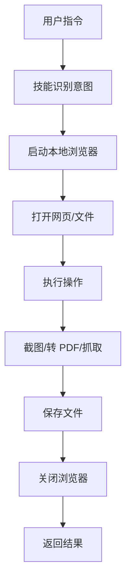

# playwright-local 技能详解

**生成时间：** 2026-03-09 09:10

---

## 🎯 技能概述

**技能名：** playwright-local

**来源：** jezweb/claude-skills

**安装数：** 507 次（成熟稳定）

**核心功能：** 本地浏览器自动化（网页截图、转 PDF、数据抓取）

---

## 🏗️ 工作原理

### 核心架构



---

## 📋 核心动作（7 大类）

### 1️⃣ 启动浏览器

**动作：** 启动本地 Chromium/Firefox/WebKit 浏览器

**代码示例：**
```javascript
const { chromium } = require('playwright');

const browser = await chromium.launch({
  headless: true,  // 无头模式（后台运行）
  args: [
    '--disable-blink-features=AutomationControlled',  // 隐藏自动化特征
    '--no-sandbox',  // 沙盒模式
  ]
});
```

**关键点：**
- ✅ 下载浏览器二进制（~400MB）
- ✅ 存储在 `~/.cache/ms-playwright/`
- ✅ 支持 Chromium/Firefox/WebKit 三种浏览器

---

### 2️⃣ 打开网页/文件

**动作：** 打开 URL 或本地 HTML 文件

**代码示例：**
```javascript
const page = await browser.newPage();

// 打开在线网页
await page.goto('https://example.com', {
  waitUntil: 'networkidle',  // 等待网络空闲
  timeout: 60000  // 超时 60 秒
});

// 打开本地 HTML 文件
await page.goto('file:///C:/Users/Xiabi/workspace/expert-review.html');
```

**关键点：**
- ✅ `waitUntil: 'networkidle'` - 等待动态内容加载
- ✅ 支持本地文件（file://协议）
- ✅ 默认超时 30 秒，可调整

---

### 3️⃣ 网页截图（PNG）

**动作：** 截取网页/元素截图

**代码示例：**
```javascript
// 全屏截图
await page.screenshot({
  path: 'screenshot.png',
  fullPage: true  // 长截图（包含滚动区域）
});

// 截取特定元素
await page.locator('.article-content').screenshot({
  path: 'element.png'
});
```

**参数：**
- `path` - 保存路径
- `fullPage` - 是否长截图
- `type` - png/jpeg

---

### 4️⃣ 转 PDF（核心功能！）

**动作：** 将网页/HTML 转成 PDF

**代码示例：**
```javascript
// 标准 A4 PDF（多页）
await page.pdf({
  path: 'output.pdf',
  format: 'A4',
  printBackground: true,  // 打印背景色
  margin: {
    top: '10mm',
    bottom: '10mm',
    left: '10mm',
    right: '10mm'
  }
});

// 单页长 PDF（无分页）
await page.pdf({
  path: 'output.pdf',
  width: '210mm',  // A4 宽度
  height: '1000mm',  // 超长高度
  printBackground: true
});
```

**参数：**
- `format` - A4/Letter/Legal 等
- `width/height` - 自定义尺寸
- `printBackground` - 是否打印背景色/渐变
- `margin` - 页边距

---

### 5️⃣ 数据抓取

**动作：** 提取网页文本/HTML/属性

**代码示例：**
```javascript
// 提取全文
const content = await page.textContent('body');

// 提取特定元素
const title = await page.textContent('h1');
const links = await page.$$eval('a', links => links.map(l => l.href));

// 提取 HTML
const html = await page.innerHTML('.article');
```

---

### 6️⃣ 浏览器伪装（反检测）

**动作：** 隐藏自动化特征，伪装成真实用户

**代码示例：**
```javascript
const context = await browser.newContext({
  userAgent: 'Mozilla/5.0 (Windows NT 10.0; Win64; x64) AppleWebKit/537.36',
  viewport: { width: 1920, height: 1080 },
  locale: 'en-US',
  timezoneId: 'America/New_York'
});

// 使用 stealth 插件
const { chromium } = require('playwright-extra');
const stealth = require('puppeteer-extra-plugin-stealth');
chromium.use(stealth());
```

**伪装内容：**
- ✅ User-Agent（浏览器标识）
- ✅ 视口大小（1920x1080）
- ✅ 时区/语言
- ✅ 隐藏 `navigator.webdriver` 标志

---

### 7️⃣ 关闭浏览器

**动作：** 清理资源，避免僵尸进程

**代码示例：**
```javascript
await browser.close();  // ⚠️ 必须调用！
```

**关键点：**
- ⚠️ **必须调用** `browser.close()` - 避免僵尸进程
- ✅ 自动清理临时文件
- ✅ 释放内存

---

## 🔄 完整工作流程

### HTML 转 PDF 示例

```javascript
// 1. 启动浏览器
const { chromium } = require('playwright');
const browser = await chromium.launch({ headless: true });

// 2. 创建页面
const page = await browser.newPage();

// 3. 打开本地 HTML 文件
await page.goto('file:///C:/Users/Xiabi/workspace/expert-review.html', {
  waitUntil: 'networkidle'
});

// 4. 转 PDF
await page.pdf({
  path: 'output.pdf',
  format: 'A4',
  printBackground: true
});

// 5. 关闭浏览器
await browser.close();

// 6. 返回结果
console.log('✅ PDF 已生成：output.pdf');
```

---

## 📊 技能能力矩阵

| 能力 | 支持 | 说明 |
|------|------|------|
| **HTML 转 PDF** | ✅ | 本地文件/在线网页 |
| **网页截图** | ✅ | PNG/JPEG，支持长截图 |
| **数据抓取** | ✅ | 文本/HTML/属性 |
| **多浏览器** | ✅ | Chromium/Firefox/WebKit |
| **反检测** | ✅ | stealth 插件 |
| **本地处理** | ✅ | 无需外部 API |
| **批量处理** | ✅ | 循环处理多个文件 |

---

## 🛠️ 安装配置

### 步骤 1：安装技能

```bash
npx skills add jezweb/claude-skills@playwright-local -g -y
```

### 步骤 2：安装浏览器

```bash
npx playwright install chromium
```

**下载大小：** ~400MB

**存储位置：** `~/.cache/ms-playwright/`

### 步骤 3：测试

```javascript
// 创建 test.js
const { chromium } = require('playwright');

(async () => {
  const browser = await chromium.launch();
  const page = await browser.newPage();
  await page.goto('https://example.com');
  await page.screenshot({ path: 'test.png' });
  await browser.close();
  console.log('✅ 测试成功！');
})();
```

```bash
node test.js
```

---

## 💡 典型使用场景

### 场景 1：HTML 报告转 PDF

```bash
# 专家点评 HTML → PDF（手机查看）
python html_to_pdf.py expert-review.html output.pdf
```

### 场景 2：网页截图

```bash
# 截取网页全屏截图
python screenshot.py https://example.com screenshot.png
```

### 场景 3：批量转换

```bash
# 批量转换多个 HTML 文件
for file in *.html; do
  python html_to_pdf.py $file ${file%.html}.pdf
done
```

---

## ⚖️ 优势 vs 劣势

### 优势

- ✅ **本地处理** - 无需外部 API，隐私安全
- ✅ **完全免费** - 无额外费用
- ✅ **功能强大** - 不止转 PDF，还能做自动化
- ✅ **成熟稳定** - 507 次安装，经过验证
- ✅ **官方支持** - Playwright 团队维护
- ✅ **跨平台** - Windows/Mac/Linux

### 劣势

- ⚠️ **需要 Node.js/Python** - 有环境依赖
- ⚠️ **浏览器二进制较大** - ~400MB
- ⚠️ **需要编写脚本** - 或让技能自动处理

---

## 📝 总结

**playwright-local 是一个本地浏览器自动化技能，核心能力：**

1. **启动本地浏览器** - Chromium/Firefox/WebKit
2. **打开网页/文件** - 在线 URL 或本地 HTML
3. **网页截图** - PNG/JPEG，支持长截图
4. **转 PDF** - 标准 A4 或单页长图
5. **数据抓取** - 文本/HTML/属性
6. **浏览器伪装** - 反检测
7. **关闭浏览器** - 清理资源

**适用场景：**
- ✅ HTML 报告转 PDF（手机查看）
- ✅ 网页截图存档
- ✅ 数据抓取
- ✅ 批量处理

**安装时间：** 8 分钟（安装技能 2 分钟 + 浏览器 5 分钟 + 测试 1 分钟）

**费用：** 免费（本地处理）

---

_报告生成时间：2026-03-09 09:10_
