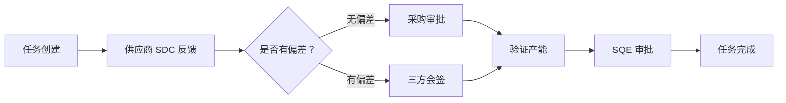

# 提能任务项目知识库

> 产能提升任务管理系统 - 数据模型与查询指南

---

## 📋 项目概述

提能任务项目是一个用于管理和跟踪产能提升任务的系统。该系统跟踪从任务创建、供应商 SDC 反馈、产能验证到 BPM 审批的完整流程。

### 核心业务流程



---

## 🗂️ 知识库结构

| 文档 | 说明 |
|------|------|
| [表结构设计.md](./表结构设计.md) | 4 个核心数据表的详细结构定义 |
| [SQL 查询示例.md](./SQL 查询示例.md) | 5 个常用 SQL 查询示例 |
| [大宽表设计.md](./大宽表设计.md) | Spark SQL 大宽表设计方案 |

---

## 📊 数据模型概览

### 4 个核心表

| 表名 | 说明 | 关联关系 |
|------|------|----------|
| `m_capacity_enhance_task` | 提能任务主表 | Header 表 |
| `m_capacity_enhance_sdc_feedback` | 供应商 SDC 反馈表 | 1:N 关联 task |
| `m_capacity_enhance_verify_feedback` | 验证产能反馈表 | 1:N 关联 sdc_feedback |
| `m_capacity_enhance_bpm_record` | BPM 审批流水表 | 1:N 关联 task |

### 表关联关系

```
task (header)
├── sdc_feedback (1:N, task_id = enhance_task_id)
│   └── verify_feedback (1:N, sdc_feedback_id)
└── bpm_record (1:N, task_id = enhance_task_id, 取最新)
```

---

## 🔢 核心枚举值

### 任务状态（task_status）

| 值 | 状态 | 说明 |
|----|------|------|
| 0 | 待发布 | 任务已创建，等待发布 |
| 1 | 调研中 | 正在进行产能调研 |
| 2 | 任务取消 | 任务已取消 |
| 3 | 待审批 SDC | 等待 SDC 审批 |
| 4 | SDC 驳回 | SDC 审批被驳回 |
| 5 | 待反馈验证产能 | 等待验证产能反馈 |
| 6 | 待审批验证产能 | 等待验证产能审批 |
| 7 | 验证产能驳回 | 验证产能审批被驳回 |
| 8 | 验证产能有偏差 | 验证产能与承诺有偏差 |
| 9 | 无效提能 | 提能任务无效 |
| 10 | 偏差关闭 | 偏差已处理关闭 |
| 11 | 提能完成 | 任务已完成 |

### 审批类型（approval_type）

| 值 | 类型 | 说明 |
|----|------|------|
| 1 | SDC 无偏差采购审批 | 承诺产能无偏差，采购部门审批 |
| 2 | SDC 有偏差三方会签 | 承诺产能有偏差，三方会签审批 |
| 3 | 验证产能 SQE 审批 | 验证产能结果，SQE 审批 |

### 审批结果（approval_result）

| 值 | 结果 | 说明 |
|----|------|------|
| 0 | 处理中 | 审批流程进行中 |
| 1 | 通过 | 审批通过 |
| 2 | 驳回 | 审批被驳回 |
| 3 | 终止/撤回 | 审批终止或撤回 |

---

## 📝 使用指南

### 快速查询

- **查询任务详情** → 参考 [SQL 查询示例.md](./SQL 查询示例.md) 示例 1
- **查询偏差任务** → 参考 [SQL 查询示例.md](./SQL 查询示例.md) 示例 2
- **查看审批进度** → 参考 [SQL 查询示例.md](./SQL 查询示例.md) 示例 3
- **统计任务状态** → 参考 [SQL 查询示例.md](./SQL 查询示例.md) 示例 4
- **分析驳回原因** → 参考 [SQL 查询示例.md](./SQL 查询示例.md) 示例 5

### 数据分析

- **大宽表查询** → 参考 [大宽表设计.md](./大宽表设计.md)
- **字段命名规范** → 表前缀_原字段名（t_, s_, v_, b_）

---

## 🔄 版本信息

- **创建日期**：2026-03-11
- **最后更新**：2026-03-11
- **版本**：v1.0

---

_本文档由用户与豆包对话整理固化_
