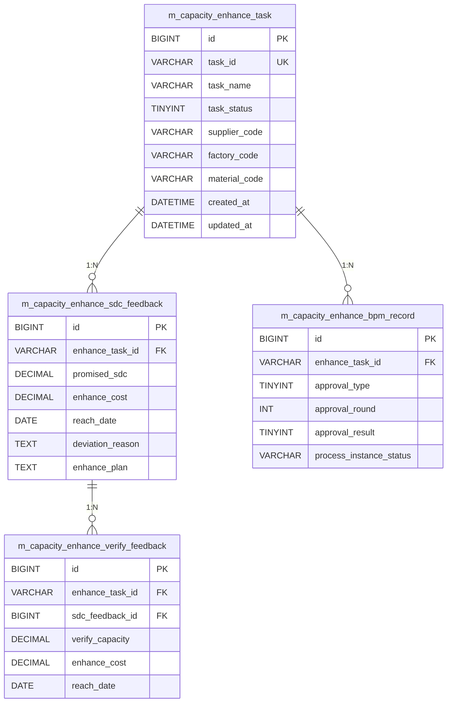

# 表结构设计

> 提能任务项目 - 4 个核心数据表详细结构

---

## 📑 表清单

| 序号 | 表名 | 说明 | 类型 |
|------|------|------|------|
| 1 | `m_capacity_enhance_task` | 提能任务主表 | Header |
| 2 | `m_capacity_enhance_sdc_feedback` | 供应商 SDC 反馈表 | Detail |
| 3 | `m_capacity_enhance_verify_feedback` | 验证产能反馈表 | Detail |
| 4 | `m_capacity_enhance_bpm_record` | BPM 审批流水表 | Flow |

---

## 1️⃣ m_capacity_enhance_task（提能任务主表）

**说明**：提能任务的核心主表，记录任务的基本信息和状态

### 字段结构

| 字段名 | 类型 | 必填 | 说明 |
|--------|------|------|------|
| `id` | BIGINT | ✅ | **主键**，自增 ID |
| `task_id` | VARCHAR | ✅ | **业务键**，任务唯一标识 |
| `task_name` | VARCHAR | ✅ | 任务名称 |
| `task_status` | TINYINT | ✅ | 任务状态（0-11，见枚举） |
| `supplier_code` | VARCHAR | ✅ | 供应商代码 |
| `factory_code` | VARCHAR | ✅ | 工厂代码 |
| `material_code` | VARCHAR | ✅ | 物料代码 |
| `supplier_responsible` | VARCHAR | ❌ | 供应商负责人 |
| `operation_responsible` | VARCHAR | ❌ | 运营负责人 |
| `quality_responsible` | VARCHAR | ❌ | 质量负责人 |
| `purchase_responsible` | VARCHAR | ❌ | 采购负责人 |
| `sdc_deadline_date` | DATE | ❌ | SDC 截止日期 |
| `verify_deadline_date` | DATE | ❌ | 验证截止日期 |
| `created_at` | DATETIME | ✅ | 创建时间 |
| `updated_at` | DATETIME | ✅ | 更新时间 |

### 索引建议

```sql
-- 主键索引
PRIMARY KEY (id)

-- 业务键唯一索引
UNIQUE INDEX idx_task_id (task_id)

-- 常用查询索引
INDEX idx_status (task_status)
INDEX idx_supplier (supplier_code)
INDEX idx_factory (factory_code)
INDEX idx_material (material_code)
INDEX idx_created (created_at)
```

---

## 2️⃣ m_capacity_enhance_sdc_feedback（供应商 SDC 反馈表）

**说明**：记录供应商对 SDC（承诺产能）的反馈信息

### 字段结构

| 字段名 | 类型 | 必填 | 说明 |
|--------|------|------|------|
| `id` | BIGINT | ✅ | **主键**，自增 ID |
| `enhance_task_id` | VARCHAR | ✅ | **外键** → task.task_id |
| `promised_sdc` | DECIMAL | ❌ | 承诺产能（SDC） |
| `enhance_cost` | DECIMAL | ❌ | 提能代价/成本 |
| `reach_date` | DATE | ❌ | 达产日期 |
| `deviation_reason` | TEXT | ❌ | 偏差原因说明 |
| `enhance_plan` | TEXT | ❌ | 提能方案详情 |
| `created_at` | DATETIME | ✅ | 创建时间 |
| `updated_at` | DATETIME | ✅ | 更新时间 |

### 索引建议

```sql
-- 主键索引
PRIMARY KEY (id)

-- 外键索引
INDEX idx_enhance_task_id (enhance_task_id)

-- 组合索引
INDEX idx_task_created (enhance_task_id, created_at)
```

### 关联关系

- **1:N** 关联 `m_capacity_enhance_task`
- 关联条件：`sdc_feedback.enhance_task_id = task.task_id`

---

## 3️⃣ m_capacity_enhance_verify_feedback（验证产能反馈表）

**说明**：记录实际验证产能的反馈信息

### 字段结构

| 字段名 | 类型 | 必填 | 说明 |
|--------|------|------|------|
| `id` | BIGINT | ✅ | **主键**，自增 ID |
| `enhance_task_id` | VARCHAR | ✅ | **外键** → task.task_id |
| `sdc_feedback_id` | BIGINT | ✅ | **外键** → sdc_feedback.id |
| `verify_capacity` | DECIMAL | ❌ | 验证产能（实际值） |
| `enhance_cost` | DECIMAL | ❌ | 实际提能成本 |
| `reach_date` | DATE | ❌ | 实际达产日期 |
| `created_at` | DATETIME | ✅ | 创建时间 |
| `updated_at` | DATETIME | ✅ | 更新时间 |

### 索引建议

```sql
-- 主键索引
PRIMARY KEY (id)

-- 外键索引
INDEX idx_enhance_task_id (enhance_task_id)
INDEX idx_sdc_feedback_id (sdc_feedback_id)

-- 组合索引
INDEX idx_task_sdc (enhance_task_id, sdc_feedback_id)
```

### 关联关系

- **1:N** 关联 `m_capacity_enhance_sdc_feedback`
- 关联条件：`verify_feedback.sdc_feedback_id = sdc_feedback.id`
- **N:1** 关联 `m_capacity_enhance_task`
- 关联条件：`verify_feedback.enhance_task_id = task.task_id`

---

## 4️⃣ m_capacity_enhance_bpm_record（BPM 审批流水表）

**说明**：记录 BPM 审批流程的流水信息

### 字段结构

| 字段名 | 类型 | 必填 | 说明 |
|--------|------|------|------|
| `id` | BIGINT | ✅ | **主键**，自增 ID |
| `enhance_task_id` | VARCHAR | ✅ | **外键** → task.task_id |
| `approval_type` | TINYINT | ✅ | 审批类型（1/2/3，见枚举） |
| `approval_round` | INT | ❌ | 审批轮次 |
| `approval_result` | TINYINT | ✅ | 审批结果（0/1/2/3，见枚举） |
| `model_type` | VARCHAR | ❌ | 模型类型 |
| `model_code` | VARCHAR | ❌ | 模型代码 |
| `process_instance_status` | VARCHAR | ❌ | 流程实例状态 |
| `bpm_business_key` | VARCHAR | ❌ | BPM 业务键 |
| `created_at` | DATETIME | ✅ | 创建时间 |
| `updated_at` | DATETIME | ✅ | 更新时间 |

### 索引建议

```sql
-- 主键索引
PRIMARY KEY (id)

-- 外键索引
INDEX idx_enhance_task_id (enhance_task_id)

-- 查询索引
INDEX idx_approval_type (approval_type)
INDEX idx_approval_result (approval_result)
INDEX idx_process_status (process_instance_status)

-- 组合索引（获取最新审批）
INDEX idx_task_created (enhance_task_id, created_at DESC)
```

### 关联关系

- **1:N** 关联 `m_capacity_enhance_task`
- 关联条件：`bpm_record.enhance_task_id = task.task_id`
- **注意**：查询时通常取最新的审批记录（按 created_at DESC LIMIT 1）

---

## 🔗 表关联关系图



---

## 📝 使用注意事项

1. **任务查询**：以 `m_capacity_enhance_task` 为入口，LEFT JOIN 其他表
2. **审批查询**：BPM 表有多条记录时，按 `created_at DESC` 取最新
3. **偏差计算**：通过 `verify_capacity` 与 `promised_sdc` 对比计算偏差率
4. **数据一致性**：外键字段需保证与主表数据一致

---

_最后更新：2026-03-11_
