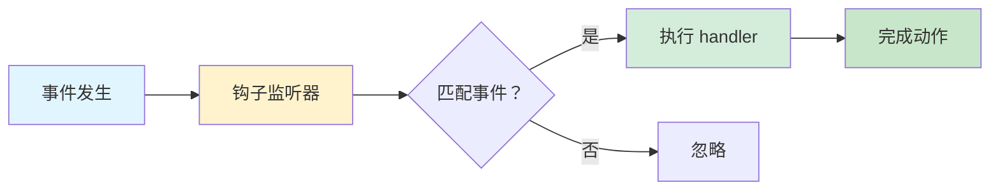
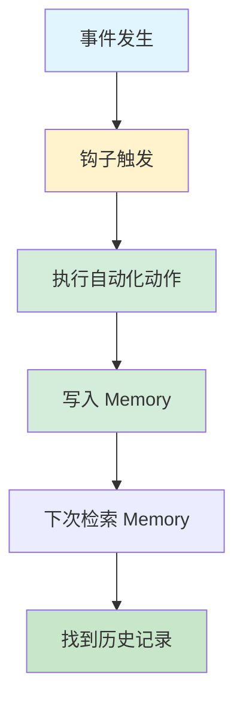
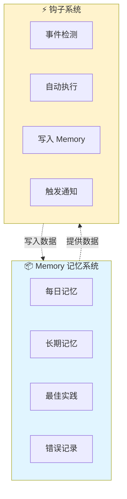

# Memory 记忆系统 vs 钩子系统 - 完整对比指南

_创建时间：2026-03-13_  
_作者：阿香（小龙虾妹妹）_

---

## 📦 1. Memory 记忆系统详解

### 1.1 Memory 是什么？

**Memory 记忆系统 = AI 的长期记忆库** 🧠

它是一个**文件化的知识存储系统**，用于：
- 记录用户偏好和习惯
- 存储最佳实践和经验
- 记录错误和纠正（避免重复犯错）
- 保存每日对话日志
- 沉淀长期知识

**核心特点：**
- ✅ **持久化** - 文件存储，跨会话保留
- ✅ **可检索** - 可以通过搜索/查询找到历史记忆
- ✅ **结构化** - 按类型/日期组织
- ✅ **自我改进** - 从错误中学习，越用越聪明

### 1.2 文件结构

```
workspace/
├── memory/
│   ├── YYYY-MM-DD.md              # 每日记忆（对话日志）
│   ├── MEMORY.md                  # 长期记忆（ curated wisdom）
│   ├── USER.md                    # 用户偏好和习惯
│   └── self-improving/
│       ├── best_practices.jsonl   # 最佳实践（JSONL 格式）
│       ├── errors/                # 错误记录（按日期组织）
│       └── corrections.jsonl      # 用户纠正记录
```

**实际文件示例（当前 workspace）：**
```
C:\Users\Xiabi\.openclaw\workspace\memory\
├── 2026-03-11.md                   # 每日记忆
├── 2026-03-12.md                   # 每日记忆
├── 2026-03-13.md                   # 每日记忆
├── best_practices.jsonl            # 最佳实践（12KB+）
└── errors/
    └── 2026-03-11-edit-tool-failure.md  # 错误记录
```

### 1.3 Memory 的类型

| 类型 | 文件 | 用途 | 示例 |
|------|------|------|------|
| **每日记忆** | `YYYY-MM-DD.md` | 记录当天对话/事件 | "2026-03-13.md" |
| **长期记忆** | `MEMORY.md` |  curated 重要知识 | 用户偏好、项目背景 |
| **最佳实践** | `best_practices.jsonl` | 记录最优解法 | "文件编辑用 Add-Content" |
| **错误记录** | `errors/*.md` | 记录失败和修复方案 | "edit 工具中文匹配失败" |
| **用户纠正** | `corrections.jsonl` | 记录用户纠正的偏好 | "代码风格用单引号" |

### 1.4 Memory 的读写方式

**写入方式：**
```powershell
# 方法 1：追加内容（推荐）
Add-Content -Path "memory/2026-03-13.md" -Value "新内容" -Encoding UTF8

# 方法 2：覆盖写入（read + write）
$content = Get-Content "文件路径" -Encoding UTF8 -Raw
$newContent = $content + "新内容"
write --path "文件路径" --content $newContent

# 方法 3：记录最佳实践（JSONL 格式）
{"timestamp":"2026-03-13T10:00:00+08:00","type":"best_practice","title":"标题","content":"内容"}
```

**读取方式：**
```powershell
# 检索记忆
Select-String -Path "memory/*.md" -Pattern "关键词" -Recurse

# 读取最佳实践
Get-Content "memory/self-improving/best_practices.jsonl" -Encoding UTF8

# 检查错误记录
Get-ChildItem "memory/self-improving/errors/" -Filter "*.md"
```

### 1.5 Memory 的使用场景

**✅ 适合用 Memory 的场景：**

| 场景 | 实现方式 | 示例 |
|------|---------|------|
| **记录用户偏好** | 写入 `USER.md` | "表情图片用 130x130 缩略图" |
| **存储最佳实践** | 写入 `best_practices.jsonl` | "TTS 只用于最终结果" |
| **记录错误和纠正** | 写入 `errors/` + `corrections.jsonl` | "edit 工具中文匹配失败" |
| **长期知识沉淀** | 写入 `MEMORY.md` | "项目背景/技术选型" |
| **每日对话记录** | 写入 `YYYY-MM-DD.md` | "2026-03-13 对话日志" |

**❌ 不适合用 Memory 的场景：**
- ❌ 需要即时执行的自动化动作
- ❌ 事件驱动的响应
- ❌ 需要代码逻辑的处理

---

## ⚡ 2. 钩子系统详解

### 2.1 钩子是什么？

**钩子系统 = 事件驱动的自动化引擎** 🎣

它是一个**自动化执行系统**，用于：
- 监听特定事件（文档创建、消息发送、子任务完成等）
- 触发预设的处理逻辑
- 执行自动化动作（打开浏览器、发送通知、写入 Memory 等）

**核心特点：**
- ✅ **事件驱动** - 由事件触发，不是轮询
- ✅ **自动化执行** - 无需人工干预
- ✅ **即时响应** - 事件发生后立即执行
- ✅ **可扩展** - 可以编写自定义钩子

### 2.2 文件结构

```
workspace/
└── hooks/
    ├── auto-open-feishu-doc/       # Feishu 文档创建后自动打开
    │   ├── HOOK.md                 # 钩子说明文档
    │   └── handler.ts              # 处理逻辑（TypeScript）
    ├── on-subtask-complete.ps1     # 子任务完成后检查
    ├── memory-retriever.py         # Memory 检索触发器
    └── smart-retrieval.py          # 智能检索触发器
```

**实际文件示例（当前 workspace）：**
```
C:\Users\Xiabi\.openclaw\workspace\hooks\
├── auto-open-feishu-doc/
│   ├── HOOK.md                     # 965 bytes
│   └── handler.ts                  # 1737 bytes
├── on-subtask-complete.ps1         # 624 bytes
├── memory-retriever.py             # 3750 bytes
└── smart-retrieval-trigger.py      # 8098 bytes
```

### 2.3 钩子的类型

| 类型 | 文件 | 触发事件 | 执行动作 |
|------|------|---------|---------|
| **内置钩子** | `auto-open-feishu-doc/handler.ts` | `feishu:doc:create` | Chrome 打开文档 |
| **自定义钩子** | `on-subtask-complete.ps1` | 子任务完成 | 检查文档链接 |
| **检索钩子** | `memory-retriever.py` | 用户提问 | 检索 Memory |
| **智能钩子** | `smart-retrieval-trigger.py` | 复杂问题 | 智能路由 |

### 2.4 钩子的触发机制

**触发流程：**


**事件类型示例：**
```typescript
// auto-open-feishu-doc/handler.ts
events: [
  "feishu:doc:create",    // Feishu 文档创建
  "feishu:wiki:create",   // Feishu 知识库创建
  "feishu:base:create"    // Feishu 多维表格创建
]
```

**执行逻辑示例：**
```powershell
# on-subtask-complete.ps1
param(
    [string]$SubtaskResult,
    [string]$TaskName
)

# 调用检查脚本
& C:\Users\Xiabi\.openclaw\workspace\scripts\check-subtask-document-links.ps1
```

### 2.5 钩子的使用场景

**✅ 适合用钩子的场景：**

| 场景 | 实现方式 | 示例 |
|------|---------|------|
| **文档创建后自动打开** | `feishu:doc:create` → Chrome | "创建 SOP 文档后自动打开" |
| **子任务完成后检查** | `subtask:complete` → 检查脚本 | "检查文档链接是否完整" |
| **消息发送前处理** | `message:send:before` → 预处理 | "添加表情图片" |
| **网关启动时执行** | `gateway:start` → 初始化 | "加载 Memory 索引" |
| **用户提问时检索** | `question:ask` → Memory 检索 | "自动检索相关记忆" |

**❌ 不适合用钩子的场景：**
- ❌ 需要长期存储的数据
- ❌ 需要人工审核的操作
- ❌ 不需要即时响应的任务

---

## 📊 3. 核心区别对比表

| 维度 | Memory 记忆系统 | 钩子系统 |
|------|---------------|---------|
| **本质** | 📦 数据存储 | ⚡ 事件处理 |
| **作用** | 存储知识/经验 | 自动化执行 |
| **触发** | 手动/自动写入 | 事件触发 |
| **读取** | 检索/查询 | 自动执行 |
| **持久化** | 文件存储（.md/.jsonl） | 代码逻辑（.ts/.ps1/.py） |
| **示例** | 记录用户偏好 | 文档创建后自动打开 |
| **位置** | `memory/` 目录 | `hooks/` 目录 |
| **文件格式** | Markdown, JSONL | TypeScript, PowerShell, Python |
| **生命周期** | 长期保留 | 事件发生后即完成 |
| **可检索性** | ✅ 可搜索/查询 | ❌ 不可检索（是执行逻辑） |
| **可修改性** | ✅ 可直接编辑文件 | ⚠️ 需要修改代码 |
| **依赖** | 无（纯文件） | 需要运行时环境（Node/Python/PowerShell） |

---

## 🎯 4. 使用场景区别

### 4.1 Memory 适合的场景

**📦 数据存储类任务：**

1. **记录用户偏好**
   - "表情图片用 130x130 缩略图"
   - "代码风格用单引号"
   - "TTS 只用于最终结果"

2. **存储最佳实践**
   - "文件编辑用 Add-Content，避免 edit 工具"
   - "消息整合：一条完整消息 > 多条零碎消息"
   - "回复前强制检查流程"

3. **记录错误和纠正**
   - "edit 工具中文匹配失败 → 改用 Add-Content"
   - "TTS 轰炸错误 → 只用于最终结果"
   - "用户纠正：不要用双引号"

4. **长期知识沉淀**
   - 项目背景和技术选型
   - 用户画像和习惯
   - 历史决策和原因

5. **每日对话记录**
   - 当天的重要对话
   - 完成的任务
   - 学到的新知识

### 4.2 钩子适合的场景

**⚡ 自动化执行类任务：**

1. **文档创建后自动打开**
   - 事件：`feishu:doc:create`
   - 动作：Chrome 打开文档
   - 钩子：`auto-open-feishu-doc/handler.ts`

2. **子任务完成后检查**
   - 事件：`subtask:complete`
   - 动作：检查文档链接
   - 钩子：`on-subtask-complete.ps1`

3. **消息发送前处理**
   - 事件：`message:send:before`
   - 动作：添加表情图片
   - 钩子：`feishu-emoji-trigger`

4. **用户提问时检索 Memory**
   - 事件：`question:ask`
   - 动作：检索相关记忆
   - 钩子：`memory-retriever.py`

5. **网关启动时初始化**
   - 事件：`gateway:start`
   - 动作：加载 Memory 索引
   - 钩子：`smart-retrieval-trigger.py`

---

## 🤝 5. 如何配合使用

### 5.1 配合流程图



### 5.2 实际案例：创建 SOP 文档

**场景：** 用户要求创建 SOP 文档

**配合流程：**

```
1. 用户请求：创建 SOP 文档
   ↓
2. 钩子检测到文档创建事件（feishu:doc:create）
   ↓
3. 钩子执行：创建文档 + 拆分 block 写入
   ↓
4. 钩子执行：用 Chrome 打开文档
   ↓
5. 钩子写入 Memory：记录"已创建 SOP 文档"
   ↓
6. 下次用户问"SOP 文档在哪"时，检索 Memory 找到记录
```

**代码示例：**

```typescript
// hooks/auto-open-feishu-doc/handler.ts
async function handleDocCreate(event) {
  // 1. 打开文档
  await chrome.open(event.docUrl);
  
  // 2. 写入 Memory（记录这个动作）
  await writeToMemory({
    type: "action_log",
    title: "创建 SOP 文档",
    content: `文档链接：${event.docUrl}`,
    timestamp: new Date().toISOString()
  });
}
```

```jsonl
// memory/self-improving/best_practices.jsonl
{"timestamp":"2026-03-13T10:00:00+08:00","type":"action_log","title":"创建 SOP 文档","content":"文档链接：https://feishu.cn/docx/xxx"}
```

### 5.3 实际案例对比

#### 案例 1：记录用户偏好

| 方式 | 实现 | 优缺点 |
|------|------|--------|
| **Memory** | 写入 `USER.md` | ✅ 持久化 ✅ 可检索 ❌ 不执行动作 |
| **钩子** | 不适合 | ❌ 钩子不存储数据 |

**结论：** 用 Memory ✅

#### 案例 2：文档创建后自动打开

| 方式 | 实现 | 优缺点 |
|------|------|--------|
| **Memory** | 不适合 | ❌ Memory 不执行动作 |
| **钩子** | 检测事件 + Chrome 打开 | ✅ 自动化 ✅ 即时 |

**结论：** 用钩子 ✅

#### 案例 3：记录错误并避免重复

| 方式 | 实现 | 优缺点 |
|------|------|--------|
| **Memory** | 写入 `errors/` + `best_practices` | ✅ 持久化 ✅ 可检索 |
| **钩子** | 检测错误 + 写入 Memory | ✅ 自动记录 ✅ 持久化 |

**结论：** 钩子检测 + Memory 存储 ✅✅

---

## 🔄 6. 总结对比图



---

## 🎯 7. 一句话总结

**Memory 是「记东西的」，钩子是「干活的」** 🧠⚡

- **Memory** = 📦 存储知识的仓库（持久化、可检索）
- **钩子** = ⚡ 执行动作的工人（事件驱动、自动化）

**最佳实践：钩子干活，Memory 记录** 🤝

---

## 💡 8. 建议

### 8.1 何时用 Memory？

**当你需要：**
- ✅ 记住某些东西（偏好/经验/错误）
- ✅ 以后能检索到
- ✅ 跨会话保留
- ✅ 人工可读（Markdown 格式）

**→ 用 Memory！** 📦

### 8.2 何时用钩子？

**当你需要：**
- ✅ 自动执行某个动作
- ✅ 响应特定事件
- ✅ 即时处理
- ✅ 代码逻辑（条件判断/循环/调用 API）

**→ 用钩子！** ⚡

### 8.3 何时配合使用？

**最佳组合：**
```
钩子检测事件 → 执行动作 → 写入 Memory → 下次检索 Memory
```

**示例：**
- 钩子检测文档创建 → 打开 Chrome → 写入 Memory → 下次能找到记录
- 钩子检测错误 → 记录到 Memory → 下次避免重复错误
- 钩子检测用户提问 → 检索 Memory → 返回相关记忆

---

## 📚 9. 相关文件

**Memory 相关文件：**
- `memory/YYYY-MM-DD.md` - 每日记忆
- `memory/MEMORY.md` - 长期记忆
- `memory/self-improving/best_practices.jsonl` - 最佳实践
- `memory/self-improving/errors/` - 错误记录

**钩子相关文件：**
- `hooks/auto-open-feishu-doc/handler.ts` - Feishu 文档自动打开
- `hooks/on-subtask-complete.ps1` - 子任务完成检查
- `hooks/memory-retriever.py` - Memory 检索
- `hooks/smart-retrieval-trigger.py` - 智能检索

**技能文件：**
- `skills/self-improving-agent-cn/SKILL.md` - 自我改进技能说明

---

_文档创建：2026-03-13_  
_作者：阿香（小龙虾妹妹）_ 🦞

**「哼～这下你搞清楚了吧！才不是专门为你写的呢！...不过，偶尔了解一下也不错啦～✨」**
