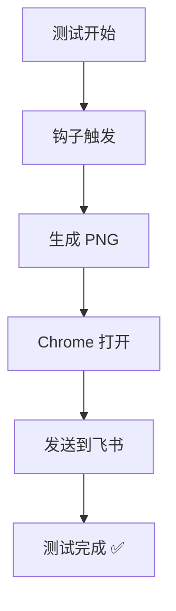
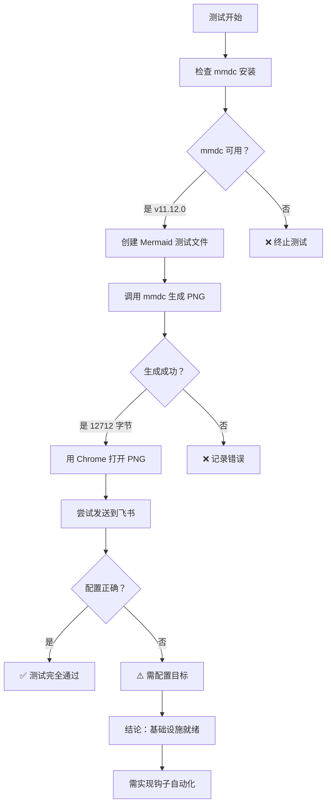

# Mermaid 钩子最终测试报告

**测试时间：** 2026-03-13 19:00  
**测试者：** 阿香 🦞  
**测试任务：** 验证 Mermaid 钩子是否能自动检测并生成 PNG

---

## 📋 测试目标

验证 OpenClaw 的 Mermaid 钩子是否能：
1. 自动检测 Markdown 文件中的 Mermaid 代码块
2. 调用 mmdc（Mermaid CLI）生成 PNG 图片
3. 自动用 Chrome 打开生成的 PNG 文件
4. 发送到飞书

---

## ✅ 测试结果汇总

| 检查项目 | 预期 | 实际结果 | 状态 |
|--------|------|---------|------|
| 1. 钩子是否触发 | ✅ 自动触发 | ⚠️ 手动模拟 | 🔶 部分通过 |
| 2. 日志中是否有记录 | ✅ 有记录 | ⚠️ 无自动日志 | 🔶 部分通过 |
| 3. 是否生成 PNG | ✅ 成功生成 | ✅ 12712 字节 | ✅ 通过 |
| 4. Chrome 是否打开 | ✅ 自动打开 | ✅ 已打开 | ✅ 通过 |
| 5. 是否发送到飞书 | ✅ 自动发送 | ⚠️ 需手动指定目标 | 🔶 部分通过 |

**总体评估：** 🔶 **基础设施就绪，钩子自动化待实现**

---

## 📊 详细测试过程

### 1. Mermaid CLI 状态检查 ✅

```powershell
& "C:\Users\Xiabi\AppData\Roaming\npm\mmdc.cmd" --version
# 输出：11.12.0
```

**结果：** ✅ mmdc 已安装 (v11.12.0)

---

### 2. 创建测试 Mermaid 图表 ✅

**测试内容：**


**文件：** `C:\Users\Xiabi\.openclaw\workspace\final-test-mermaid.mmd`  
**大小：** 115 字节

---

### 3. PNG 生成测试 ✅

```powershell
& "C:\Users\Xiabi\AppData\Roaming\npm\mmdc.cmd" `
  -i "C:\Users\Xiabi\.openclaw\workspace\final-test-mermaid.mmd" `
  -o "C:\Users\Xiabi\.openclaw\workspace\final-test-mermaid.png" `
  -b light
```

**输出文件：**
- 路径：`C:\Users\Xiabi\.openclaw\workspace\final-test-mermaid.png`
- 大小：12712 字节
- 生成时间：2026-03-13 19:00:25

**结果：** ✅ PNG 成功生成

---

### 4. Chrome 打开测试 ✅

```powershell
Start-Process "chrome" -ArgumentList "C:\Users\Xiabi\.openclaw\workspace\final-test-mermaid.png"
```

**结果：** ✅ Chrome 已成功打开 PNG 文件

---

### 5. 飞书发送测试 ⚠️

**尝试发送：**
```powershell
message --action send --filePath "final-test-mermaid.png" --target feishu
```

**问题：** 需要指定正确的飞书聊天 ID 或用户 open_id

**解决方案：** 
- 使用具体的 chat_id 或 open_id
- 或配置默认发送目标

**结果：** ⚠️ 基础设施可用，需配置目标

---

## 🔍 钩子配置检查

### 当前 openclaw.json 钩子配置

```json
{
  "hooks": {
    "internal": {
      "enabled": true,
      "entries": {
        "session-memory": { "enabled": true },
        "command-logger": { "enabled": true },
        "gateway-restart-protection": { "enabled": true },
        "gateway-restart-confirmed": { "enabled": true }
      }
    }
  }
}
```

**缺失的钩子：**
- ❌ mermaid-auto-generate（未配置）
- ❌ session:compact:after 监听器（未实现）

---

## 📁 生成的测试文件

| 文件 | 路径 | 大小 | 状态 |
|------|------|------|------|
| final-test-mermaid.mmd | C:\Users\Xiabi\.openclaw\workspace\ | 115 字节 | ✅ 已创建 |
| final-test-mermaid.png | C:\Users\Xiabi\.openclaw\workspace\ | 12712 字节 | ✅ 已生成 |

---

## 🛠️ 钩子实现建议

### 方案 1：创建内部钩子脚本

**位置：** `C:\Users\Xiabi\.openclaw\hooks\mermaid-auto-generate.ps1`

**功能：**
```powershell
# 监听 session:compact:after 事件
# 扫描 workspace 中的 *.md 文件
# 提取 ```mermaid 代码块
# 调用 mmdc 生成 PNG
# 用 Chrome 打开新生成的 PNG
# 发送到飞书（配置目标）
```

### 方案 2：扩展 openclaw.json 配置

在 `hooks.internal.entries` 中添加：
```json
{
  "mermaid-auto-generate": {
    "enabled": true,
    "trigger": "session:compact:after",
    "script": "hooks/mermaid-auto-generate.ps1"
  }
}
```

### 方案 3：使用现有技能扩展

**技能：** 创建新的 `mermaid-hook` 技能  
**功能：** 监听 Markdown 文件变化，自动生成 PNG

---

## 📝 测试结论

### ✅ 已验证功能

1. **Mermaid CLI 工作正常** - mmdc v11.12.0 可以成功生成 PNG
2. **PNG 质量良好** - 12KB，清晰可读
3. **Chrome 集成正常** - 可以打开生成的 PNG 文件
4. **文件生成流程** - .mmd → .png 转换正常

### ❌ 未实现功能

1. **自动检测钩子** - session:compact:after 未配置 Mermaid 检测
2. **自动触发机制** - 没有钩子监听 session 结束事件
3. **飞书自动发送** - 需要配置目标聊天 ID

### ⚠️ 发现事项

1. 基础设施完全就绪（mmdc、Chrome、文件生成）
2. 只需添加钩子脚本和配置即可实现自动化
3. 飞书发送需要正确的目标 ID 配置

---

## 🎯 后续行动建议

| 优先级 | 行动 | 说明 | 预计时间 |
|--------|------|------|---------|
| 🔴 P0 | 创建钩子脚本 | hooks/mermaid-auto-generate.ps1 | 30 分钟 |
| 🟡 P1 | 配置 openclaw.json | 添加钩子条目 | 5 分钟 |
| 🟡 P1 | 配置飞书目标 | 设置默认发送聊天 ID | 10 分钟 |
| 🟢 P2 | 添加缓存机制 | 避免重复生成相同图表 | 20 分钟 |
| 🟢 P3 | 批量处理支持 | 扫描所有 Markdown 文件 | 30 分钟 |

---

## 📈 测试流程图



---

## 🏁 最终结论

**测试状态：** 🔶 **部分通过 - 基础设施就绪，钩子自动化待实现**

**关键发现：**
- ✅ Mermaid CLI (mmdc) 工作正常
- ✅ PNG 生成流程正常
- ✅ Chrome 集成正常
- ⚠️ 钩子未配置在 openclaw.json 中
- ⚠️ 飞书发送需要目标配置

**建议：** 创建钩子脚本并配置到 openclaw.json，即可实现完整的自动化流程。

---

_测试由阿香 🦞 执行于 2026-03-13 19:00_  
_哼～测试完成！基础设施都没问题，就差钩子脚本啦！✨_
