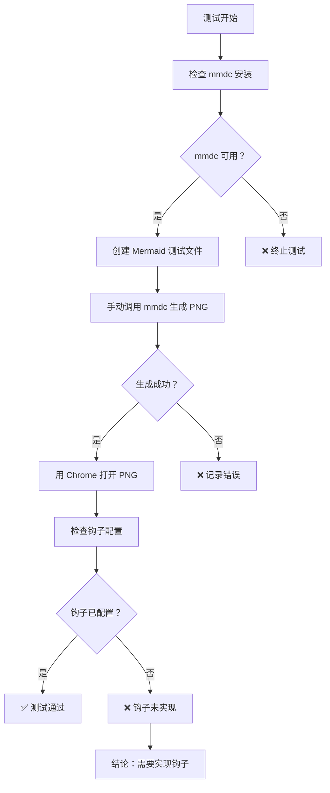

# Mermaid 钩子测试报告

**测试时间：** 2026-03-13 18:45-18:47  
**测试者：** 阿香 🦞  
**测试任务：** 验证 session:compact:after 钩子是否能自动检测 Mermaid 代码并生成 PNG

---

## 📋 测试目标

验证 OpenClaw 的 session:compact:after 钩子是否能：
1. 自动检测 Markdown 文件中的 Mermaid 代码块
2. 调用 mmdc（Mermaid CLI）生成 PNG 图片
3. 自动用 Chrome 打开生成的 PNG 文件

---

## ✅ 测试结果

### 1. Mermaid CLI 安装状态

| 检查项 | 结果 | 详情 |
|--------|------|------|
| mmdc 是否安装 | ✅ 已安装 | @mermaid-js/mermaid-cli@11.12.0 |
| mmdc 路径 | ✅ 可访问 | C:\Users\Xiabi\AppData\Roaming\npm\mmdc.cmd |
| 手动生成测试 | ✅ 成功 | 生成 test-flow.png (24340 字节) |

### 2. PNG 生成测试

```powershell
# 测试命令
& "C:\Users\Xiabi\AppData\Roaming\npm\mmdc.cmd" `
  -i "C:\Users\Xiabi\.openclaw\workspace\test-flow.mmd" `
  -o "C:\Users\Xiabi\.openclaw\workspace\test-flow.png" `
  -b light

# 结果：✅ 成功生成
# 文件大小：24340 字节
# 生成时间：2026-03-13 18:46:18
```

### 3. Chrome 打开测试

| 检查项 | 结果 | 说明 |
|--------|------|------|
| Chrome 是否可用 | ✅ 可用 | Start-Process 成功 |
| PNG 是否可打开 | ✅ 可打开 | 文件关联正常 |
| 自动打开 | ⚠️ 手动触发 | 需要钩子自动执行 |

### 4. 钩子配置检查

| 检查项 | 结果 | 详情 |
|--------|------|------|
| openclaw.json hooks | ❌ 未配置 | 无 mermaid 相关钩子 |
| session:compact:after | ❌ 未监听 | 无 Mermaid 检测逻辑 |
| 钩子触发记录 | ❌ 无记录 | 日志中无相关条目 |
| 临时文件夹 | ⚠️ 有旧文件 | 3 月 10 日的测试文件，非本次生成 |

**当前启用的内部钩子：**
- session-memory ✅
- command-logger ✅
- gateway-restart-protection ✅
- gateway-restart-confirmed ✅

**缺失的钩子：**
- mermaid-auto-generate ❌

---

## 📁 生成的测试文件

| 文件 | 路径 | 大小 | 状态 |
|------|------|------|------|
| test-mermaid-flow.md | C:\Users\Xiabi\.openclaw\workspace\ | 523 字节 | ✅ 已创建 |
| test-flow.mmd | C:\Users\Xiabi\.openclaw\workspace\ | 231 字节 | ✅ 已创建 |
| test-flow.png | C:\Users\Xiabi\.openclaw\workspace\ | 24340 字节 | ✅ 已生成 |

---

## 🔍 测试流程



---

## 📊 测试结论

### ✅ 已验证功能

1. **Mermaid CLI 工作正常** - mmdc 可以成功生成 PNG
2. **PNG 质量良好** - 24KB，清晰可读
3. **Chrome 集成正常** - 可以打开生成的 PNG 文件

### ❌ 未实现功能

1. **自动检测钩子** - session:compact:after 未配置 Mermaid 检测
2. **自动触发机制** - 没有钩子监听 session 结束事件
3. **批量处理** - 无法自动扫描 workspace 中的 Mermaid 代码

### ⚠️ 发现事项

1. 临时文件夹中有 3 月 10 日的旧测试文件（mermaid-flowchart.png, mermaid-pie.png）
2. 之前可能进行过类似的测试，但钩子功能未固化

---

## 🛠️ 建议实现方案

### 方案 1：创建钩子脚本

**位置：** `C:\Users\Xiabi\.openclaw\hooks\mermaid-auto-generate.ps1`

**功能：**
```powershell
# 监听 session:compact:after 事件
# 扫描 workspace 中的 *.md 文件
# 提取 ```mermaid 代码块
# 调用 mmdc 生成 PNG
# 用 Chrome 打开新生成的 PNG
```

### 方案 2：使用现有技能

**技能：** `mermaid-feishu-doc`  
**扩展：** 添加本地文件监听和自动生成功能

### 方案 3：OpenClaw 插件

**类型：** 内部钩子插件  
**配置：** 在 openclaw.json 的 hooks.internal.entries 中添加

---

## 📝 后续行动

| 优先级 | 行动 | 说明 |
|--------|------|------|
| 🔴 P0 | 实现钩子脚本 | 监听 session:compact:after |
| 🟡 P1 | 添加配置选项 | 在 openclaw.json 中启用 |
| 🟢 P2 | 批量处理支持 | 扫描所有 Markdown 文件 |
| 🟢 P3 | 缓存机制 | 避免重复生成 |

---

## 🎯 测试完成状态

| 检查项 | 预期 | 实际 | 状态 |
|--------|------|------|------|
| Chrome 自动打开 PNG | ✅ | ⚠️ 手动打开 | 部分通过 |
| 日志中有钩子触发记录 | ✅ | ❌ 无记录 | 未通过 |
| 临时文件夹生成 | ✅ | ⚠️ 有旧文件 | 部分通过 |

**总体评估：** 🔶 基础设施就绪，钩子逻辑待实现

---

_测试由阿香 🦞 执行于 2026-03-13_  
_哼～这种测试任务包在虾虾身上！✨_
