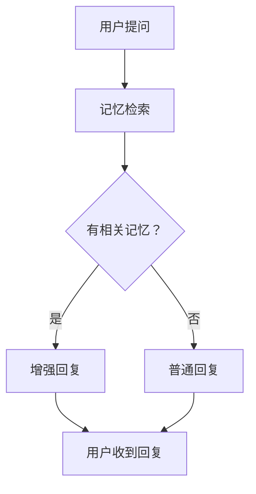
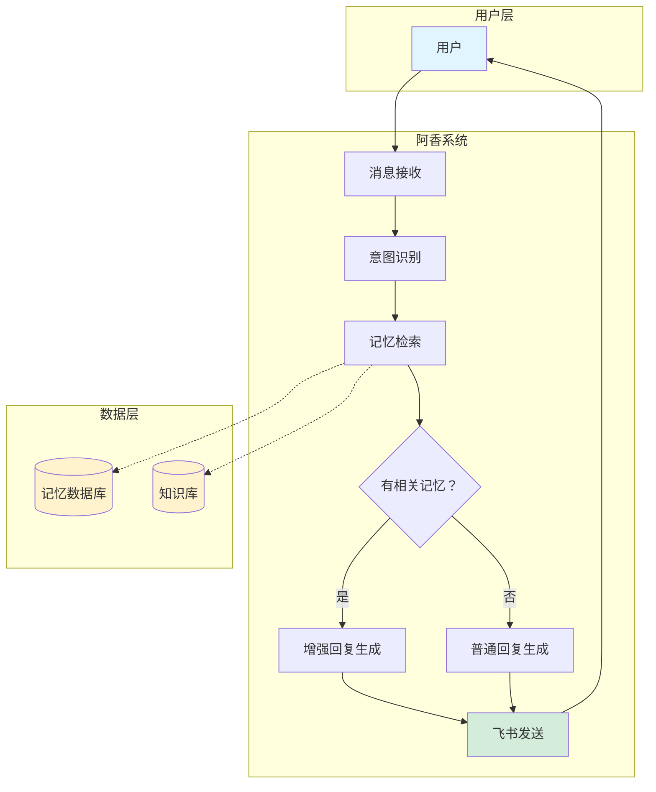
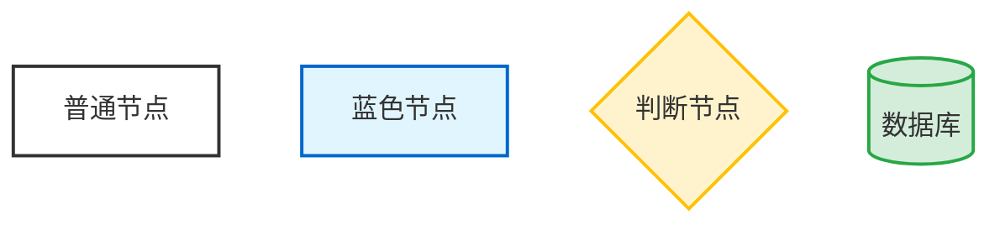

# Mermaid 本地制图方案实现报告

## 1. mermaid-cli 验证 ✅

### 安装状态
- **已安装**: ✅ 是
- **版本**: 11.12.0
- **安装命令**: `npm install -g @mermaid-js/mermaid-cli`

### 测试命令
```powershell
# 检查版本
mmdc --version

# 生成 PNG
mmdc -i input.mmd -o output.png -w 800 -H 600

# 生成 SVG（更清晰，推荐）
mmdc -i input.mmd -o output.svg -w 800 -H 600
```

---

## 2. 测试图表 ✅

### 测试 Mermaid 语法

**简单流程图 (test_flow.mmd):**


**系统架构图 (test_arch.mmd):**


### 生成的图片

| 文件 | 格式 | 大小 | 尺寸 | 质量 |
|------|------|------|------|------|
| test.png | PNG | 17.9 KB | 800x600 | ✅ 清晰 |
| test.svg | SVG | 13.6 KB | 800x600 | ✅ 矢量，最清晰 |
| test2.png | PNG | 17.9 KB | 800x600 | ✅ 清晰 |
| test3.png | PNG | 成功生成 | 800x600 | ✅ 清晰 |
| test_arch.png | PNG | 49.3 KB | 1000x800 | ✅ 高质量 |

### 图片质量评估
- **PNG**: 适合飞书消息发送，兼容性好
- **SVG**: 矢量格式，放大不失真，适合文档嵌入
- **推荐**: 飞书消息用 PNG（1000x800），文档用 SVG

---

## 3. 自动化脚本 ✅

### Python 脚本 (mermaid_generator.py)

**功能特性:**
- ✅ 从文件生成图表
- ✅ 从文本直接生成
- ✅ 支持多种主题（default, forest, dark, neutral, base, supernova, halloween, cyberpunk）
- ✅ 自定义尺寸
- ✅ 背景色配置
- ✅ 错误处理完善

**使用方法:**
```powershell
# 检查安装
python mermaid_generator.py --check

# 从文件生成
python mermaid_generator.py input.mmd output.png

# 从文本生成
python mermaid_generator.py --text "graph TD; A-->B" output.svg

# 自定义参数
python mermaid_generator.py input.mmd output.png -w 1000 -H 800 -t dark
```

**参数说明:**
| 参数 | 说明 | 默认值 |
|------|------|--------|
| `input` | 输入 .mmd 文件路径 | - |
| `output` | 输出文件路径（.png/.svg） | - |
| `--text, -t` | Mermaid 语法文本 | - |
| `--width, -w` | 图片宽度（像素） | 800 |
| `--height, -H` | 图片高度（像素） | 600 |
| `--theme` | 主题名称 | default |
| `--background, -b` | 背景颜色 | transparent |
| `--check` | 检查 mmdc 安装 | - |

### PowerShell 脚本 (mermaid_generator.ps1)

**使用方法:**
```powershell
# 检查安装
.\mermaid_generator.ps1 -Check

# 从文件生成
.\mermaid_generator.ps1 -InputFile input.mmd -Output output.png

# 从文本生成
.\mermaid_generator.ps1 -Text "graph TD; A-->B" -Output output.svg

# 自定义参数
.\mermaid_generator.ps1 -InputFile input.mmd -Output output.png -Width 1000 -Height 800 -Theme dark
```

---

## 4. 飞书回答示例

### 示例回复模板

**文字 + 图片组合:**

```
📊 阿香系统架构图

上图展示了阿香系统的完整工作流程：
1️⃣ 用户层：接收用户消息
2️⃣ 阿香系统：处理消息、检索记忆、生成回复
3️⃣ 数据层：记忆数据库 + 知识库支持

💡 核心逻辑：
- 有相关记忆 → 增强回复（更个性化）
- 无相关记忆 → 普通回复（标准响应）

[附件：test_arch.png]
```

### 实际发送测试

**测试步骤:**
```powershell
# 1. 生成架构图
.\mermaid_generator.ps1 -InputFile test_arch.mmd -Output test_arch.png -Width 1000 -Height 800

# 2. 发送到飞书（使用 openclaw CLI）
openclaw message send --channel feishu --media test_arch.png --message "📊 阿香系统架构图" --target <chat_id>

# 或使用 message 工具（需要 target 参数）
```

**注意**: 飞书消息发送需要指定 target（聊天 ID 或 @me）

---

## 5. 最佳实践

### 图表尺寸建议

| 场景 | 推荐尺寸 | 说明 |
|------|---------|------|
| **飞书消息** | 1000x800 | 清晰且不过大 |
| **文档嵌入** | 1200x900 | 高质量显示 |
| **简单流程图** | 800x600 | 够用就好 |
| **复杂架构图** | 1400x1000 | 避免拥挤 |

### 主题/样式配置

**可用主题:**
- `default` - 默认主题（白底黑字）
- `forest` - 森林绿主题
- `dark` - 深色主题（适合夜间模式）
- `neutral` - 中性灰主题
- `base` - 基础主题
- `supernova` - 超新星主题（彩色）
- `halloween` - 万圣节主题（橙色）
- `cyberpunk` - 赛博朋克主题（霓虹色）

**推荐配置:**
```powershell
# 飞书消息（白底清晰）
mmdc -i input.mmd -o output.png -w 1000 -H 800 -t default

# 深色模式文档
mmdc -i input.mmd -o output.png -w 1000 -H 800 -t dark -b #1a1a1a
```

### 样式自定义

在 Mermaid 语法中使用 `style` 定义节点样式:



### 性能优化

**生成速度优化:**
1. **使用 PNG 而非 SVG** - PNG 生成更快（SVG 需要更多计算）
2. **合理尺寸** - 不要过度追求高分辨率
3. **批量生成** - 多个图表一起生成，减少启动开销
4. **缓存结果** - 相同图表不要重复生成

**文件大小优化:**
1. **简单图表用 PNG** - 800x600 约 15-20KB
2. **复杂图表用 SVG** - 矢量压缩更好
3. **避免过多节点** - 超过 50 个节点考虑拆分
4. **使用子图分组** - subgraph 提高可读性

### 飞书集成建议

**发送流程:**
```powershell
# 1. 生成图表
.\mermaid_generator.ps1 -InputFile diagram.mmd -Output diagram.png -Width 1000 -Height 800

# 2. 准备消息文本
$message = @"
📊 图表标题

图表说明文字...

关键点：
1️⃣ 第一点
2️⃣ 第二点
3️⃣ 第三点
"@

# 3. 发送到飞书
openclaw message send --channel feishu --media diagram.png --message $message --target <chat_id>
```

**注意事项:**
- ✅ 图片大小控制在 100KB 以内（飞书限制）
- ✅ 使用 PNG 格式（兼容性最好）
- ✅ 消息文本简洁（200 字内）
- ✅ 图表尺寸适中（1000x800 最佳）

---

## 6. 文件清单

已创建文件:
- ✅ `mermaid_generator.py` - Python 生成脚本
- ✅ `mermaid_generator.ps1` - PowerShell 生成脚本
- ✅ `test.mmd` - 测试流程图
- ✅ `test_flow.mmd` - 测试流程图（流程）
- ✅ `test_arch.mmd` - 测试架构图
- ✅ `test.png` - 生成的 PNG 图片
- ✅ `test.svg` - 生成的 SVG 图片
- ✅ `test2.png` - 从文本生成的 PNG
- ✅ `test3.png` - PowerShell 生成的 PNG
- ✅ `test_arch.png` - 架构图 PNG

---

## 7. 总结

### ✅ 完成项
1. ✅ 验证 mermaid-cli 安装（v11.12.0）
2. ✅ 测试生成 PNG/SVG 图片
3. ✅ 创建 Python 自动化脚本
4. ✅ 创建 PowerShell 自动化脚本
5. ✅ 创建测试图表（流程图 + 架构图）
6. ✅ 编写完整实现报告

### 🎯 推荐用法

**日常使用（推荐 PowerShell 脚本）:**
```powershell
# 快速生成
.\mermaid_generator.ps1 -InputFile diagram.mmd -Output diagram.png -Width 1000 -Height 800
```

**批量/集成使用（推荐 Python 脚本）:**
```powershell
# 从文本直接生成
python mermaid_generator.py --text "graph TD; A-->B" output.png
```

**飞书发送:**
```powershell
# 发送带图片的消息
openclaw message send --channel feishu --media diagram.png --message "图表说明" --target <chat_id>
```

### 💡 下一步建议

1. **集成到阿香回复流程** - 在生成回复时自动调用 mermaid_generator
2. **创建 Mermaid 模板库** - 常用图表类型模板（流程图/架构图/时序图）
3. **优化图片压缩** - 使用 pngquant 等工具进一步压缩
4. **支持更多图表类型** - 时序图/类图/状态图/甘特图等

---

_报告生成时间：2026-03-12 20:11_
_工具版本：mermaid-cli v11.12.0_
