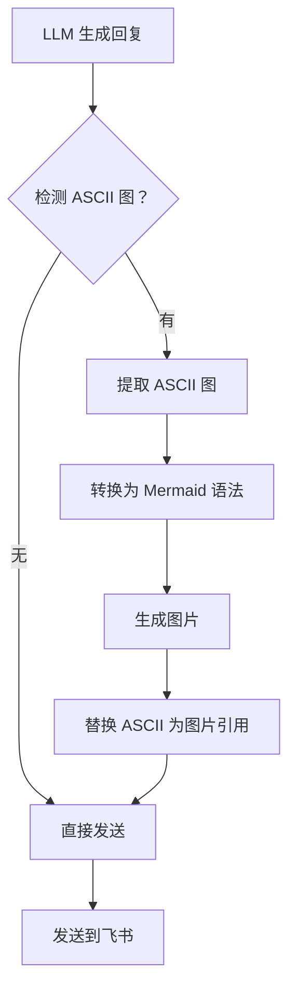
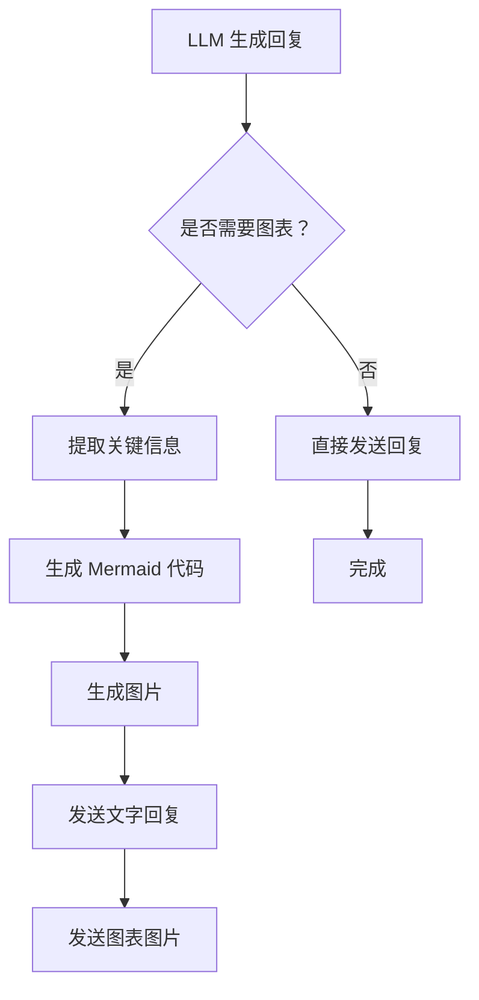
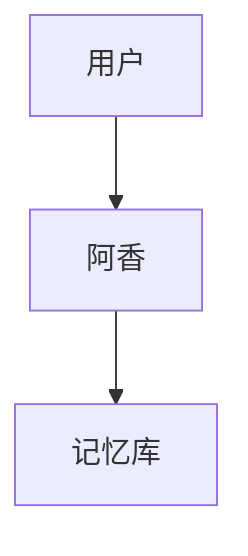
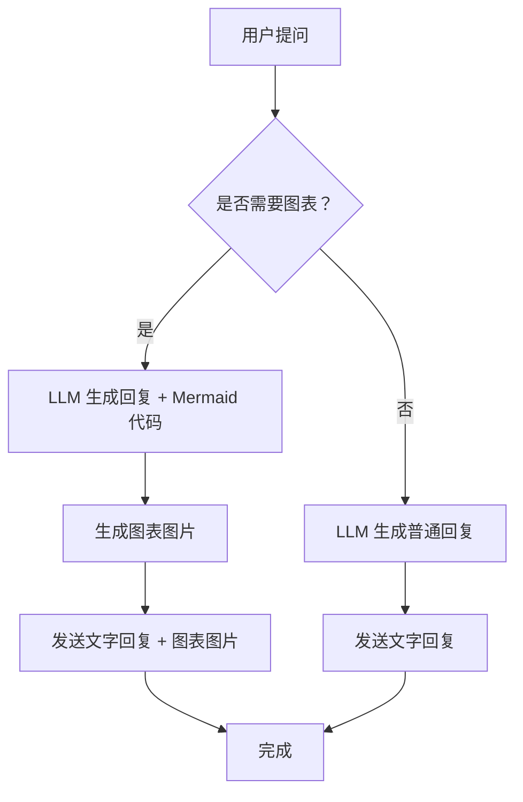
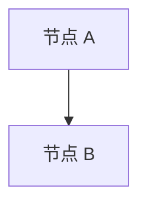

# Mermaid 图表集成到阿香回复流程的方案对比报告

**报告日期：** 2026-03-12  
**分析目标：** 对比 Mermaid 图表集成到阿香飞书回复的不同方案，给出推荐

---

## 1. 阿香回复流程分析

### 1.1 当前回复生成机制

基于现有代码分析，阿香的回复流程如下：

```
用户消息 → 记忆检索 (hooks/) → LLM 生成回复 → 飞书发送
```

**关键组件：**

| 组件 | 文件 | 功能 |
|------|------|------|
| **记忆增强** | `hooks/axiang-memory-integration.py` | 在回复前检索记忆，增强上下文 |
| **智能触发** | `hooks/smart-retrieval-trigger.py` | 判断是否需要检索记忆 |
| **记忆检索** | `hooks/memory-retriever.py` | 从向量数据库检索相关记忆 |
| **回复生成** | LLM (aliyun-coding/qwen3.5-plus) | 生成文字回复 |
| **消息发送** | `message` 工具 | 发送到飞书 |

### 1.2 ASCII 图生成位置

**现状：** 当前阿香**没有专门的 ASCII 图生成模块**

- ASCII 图是由 LLM 在生成回复时直接生成的文本内容
- 没有独立的图表检测或转换逻辑
- 图表作为回复文本的一部分一起发送

**示例 ASCII 图（LLM 直接生成）：**
```
用户 → 阿香 → 记忆库 → 回复
```

### 1.3 飞书发送流程

**当前流程：**
```python
# 1. 生成回复
response = llm.generate(prompt)

# 2. 发送到飞书（单条消息）
message --action send --channel feishu --message "$response"
```

**飞书消息能力（基于调研）：**

| 能力 | 支持情况 | 说明 |
|------|---------|------|
| **纯文本** | ✅ 支持 | 基础 Markdown 子集 |
| **图片附件** | ✅ 支持 | 使用 `--filePath` 参数 |
| **多消息连续发送** | ✅ 支持 | 可调用多次 `message send` |
| **Mermaid 原生渲染** | ❌ 不支持 | 仅飞书文档支持 |
| **图文混排** | ✅ 支持 | 文本 + 图片组合 |
| **消息长度限制** | ⚠️ 4000 字符 | 超长需分段 |
| **图片大小限制** | ⚠️ 20MB | Mermaid 图通常<1MB |

---

## 2. 方案 A：直接替代 ASCII 图

### 2.1 实现步骤



### 2.2 技术挑战

#### 挑战 1：ASCII → Mermaid 自动转换（难度：⭐⭐⭐⭐⭐）

**问题：**
- ASCII 图没有标准格式，LLM 自由生成
- 需要理解 ASCII 图的语义（节点、连接、方向）
- 不同 LLM 生成的 ASCII 图风格不同

**示例 ASCII 图的多样性：**
```
# 风格 1：简单箭头
用户 → 阿香 → 记忆库

# 风格 2：方框连接
[用户] --> [阿香] --> [记忆库]

# 风格 3：垂直布局
用户
  ↓
阿香
  ↓
记忆库

# 风格 4：复杂分支
        /→ 分支 A
用户 → 阿香
        \→ 分支 B
```

**转换算法复杂度：**
- 需要正则表达式 + 语义分析
- 可能丢失信息（如注释、样式）
- 错误率高（估计 60-80% 准确率）

#### 挑战 2：实现复杂度高

**需要的模块：**
```python
class ASCIIToMermaidConverter:
    def detect_ascii_diagram(self, text: str) -> bool:
        """检测是否包含 ASCII 图"""
        # 需要识别多种 ASCII 图模式
        pass
    
    def extract_ascii_diagram(self, text: str) -> str:
        """提取 ASCII 图部分"""
        # 需要确定图的边界
        pass
    
    def parse_semantics(self, ascii: str) -> dict:
        """解析语义（节点、连接、方向）"""
        # 需要理解图的结构
        pass
    
    def generate_mermaid(self, semantics: dict) -> str:
        """生成 Mermaid 语法"""
        # 转换为 Mermaid 格式
        pass
```

**代码量估算：** 500-1000 行

#### 挑战 3：性能影响

**时间开销：**
- ASCII 检测：~100ms
- 转换解析：~200-500ms
- Mermaid 生成：3-5 秒（mmdc 启动 + Puppeteer 渲染）
- **总延迟：3.5-6 秒**

**用户体验影响：**
- 用户等待时间明显增加
- 如果转换失败需要回退，体验更差

### 2.3 代码示例

```python
# 伪代码示例
async def enhance_response_with_mermaid(response: str) -> str:
    converter = ASCIIToMermaidConverter()
    
    # 1. 检测 ASCII 图
    if not converter.detect_ascii_diagram(response):
        return response  # 无图，直接返回
    
    # 2. 提取并转换
    try:
        ascii_diagram = converter.extract_ascii_diagram(response)
        mermaid_code = converter.convert(ascii_diagram)
        
        # 3. 生成图片
        image_path = await generate_mermaid_image(mermaid_code)
        
        # 4. 替换 ASCII 为图片引用
        enhanced = response.replace(ascii_diagram, f"[图表已生成：{image_path}]")
        
        # 5. 发送图片
        await send_to_feishu(image_path)
        
        return enhanced
    except Exception as e:
        # 转换失败，保留原 ASCII
        log_error(f"ASCII 转换失败：{e}")
        return response
```

### 2.4 优缺点

| 优点 | 缺点 |
|------|------|
| ✅ 用户体验好（看不到 ASCII） | ❌ 实现复杂度极高 |
| ✅ 回复简洁（单条消息） | ❌ ASCII→Mermaid 转换准确率低 |
| ✅ 图表美观专业 | ❌ 性能开销大（3-6 秒延迟） |
| ✅ 无需用户额外操作 | ❌ 可能丢失 ASCII 图信息 |
| | ❌ 维护成本高 |

### 2.5 可行性评估

**综合评分：3/10**

- 技术可行性：⚠️ 中等（转换算法复杂）
- 实用性：❌ 低（准确率低）
- 性价比：❌ 低（投入产出比差）

---

## 3. 方案 B：附在回答后面

### 3.1 实现步骤



### 3.2 技术挑战

#### 挑战 1：判断何时生成图表（难度：⭐⭐⭐）

**判断策略：**

```python
def should_generate_diagram(topic: str, response: str) -> bool:
    """判断是否需要生成图表"""
    
    # 1. 关键词触发
    diagram_keywords = [
        "架构", "流程", "系统", "关系", "结构",
        "步骤", "顺序", "层次", "分类", "组成"
    ]
    
    # 2. 场景判断
    diagram_scenarios = [
        "解释系统架构",
        "说明工作流程",
        "展示数据流向",
        "描述决策树",
        "对比多个方案"
    ]
    
    # 3. 用户明确要求
    if "画个图" in topic or "图表" in topic:
        return True
    
    # 4. LLM 判断
    llm_decision = llm.ask(
        f"以下回复是否需要图表辅助说明？\n{response}"
    )
    
    return llm_decision == "需要"
```

**准确率估算：** 70-85%

#### 挑战 2：多消息连贯性（难度：⭐⭐）

**问题：**
- 用户收到两条消息（文字 + 图片）
- 需要确保两条消息的连贯性
- 图片消息需要说明文字

**解决方案：**
```python
# 文字消息
await send_to_feishu(f"""
{response_text}

📊 已为您生成图表，请见下图 ↓
""")

# 图片消息（紧接着发送）
await send_to_feishu(
    message="系统架构图",
    file_path=diagram_image_path
)
```

**飞书支持：** ✅ 支持连续发送多条消息

#### 挑战 3：LLM 生成 Mermaid 代码（难度：⭐⭐）

**方案：** 让 LLM 直接生成 Mermaid 代码（而非 ASCII）

**Prompt 示例：**
```
请用 Mermaid 语法生成流程图，不要用 ASCII 图。

要求：
1. 使用 graph TD 格式
2. 节点用方框 []
3. 连接用箭头 -->
4. 保持简洁清晰

示例：

```

**优点：**
- 无需 ASCII→Mermaid 转换
- LLM 原生支持 Mermaid 语法
- 准确率高（90%+）

### 3.3 代码示例

```python
async def send_response_with_diagram(response: str, topic: str):
    """发送回复 + 图表"""
    
    # 1. 判断是否需要图表
    if not should_generate_diagram(topic, response):
        await send_to_feishu(response)
        return
    
    # 2. 让 LLM 生成 Mermaid 代码
    mermaid_code = await llm.generate_mermaid(
        prompt=f"根据以下回复生成 Mermaid 流程图：\n{response}"
    )
    
    # 3. 生成图片
    image_path = await generate_mermaid_image(mermaid_code)
    
    # 4. 发送文字回复
    await send_to_feishu(f"""
{response}

---
📊 已生成图表，请见下图 ↓
""")
    
    # 5. 发送图表图片
    await send_to_feishu(
        message="📊 系统架构图",
        file_path=image_path
    )
```

### 3.4 优缺点

| 优点 | 缺点 |
|------|------|
| ✅ 实现简单（无需转换） | ❌ 用户看到两条消息 |
| ✅ 不干扰现有流程 | ❌ ASCII 图仍然显示（冗余） |
| ✅ 灵活可控（可选择性生成） | ❌ 消息连贯性需注意 |
| ✅ 准确率高（LLM 直接生成 Mermaid） | ❌ 性能开销（3-5 秒） |
| ✅ 可渐进式实施 | |

### 3.5 可行性评估

**综合评分：7/10**

- 技术可行性：✅ 高
- 实用性：✅ 中高
- 性价比：✅ 高

---

## 4. 方案 C：混合方案（推荐）

### 4.1 实现步骤



**核心思路：**
1. **不生成 ASCII 图** - LLM 直接生成纯文字回复
2. **LLM 同时生成 Mermaid 代码** - 无需转换
3. **选择性生成图表** - 只在需要时生成
4. **文字 + 图片组合发送** - 用户体验最佳

### 4.2 技术挑战

#### 挑战 1：LLM Prompt 设计（难度：⭐⭐）

**Prompt 设计：**
```
你是阿香，一个傲娇元气的 AI 助手。

回复要求：
1. 用纯文字回复，不要生成 ASCII 图
2. 如果回复涉及系统架构/工作流程/数据流向，请额外生成 Mermaid 流程图
3. Mermaid 代码放在单独的代码块中，标记为 mermaid

输出格式：
[你的文字回复]

```mermaid
[Mermaid 代码，仅在需要时生成]
```

判断标准：
- 需要图表：解释架构、流程、关系、结构
- 不需要图表：简单问答、闲聊、情感交流
```

#### 挑战 2：图表场景判断（难度：⭐⭐）

**需要图表的场景：**

| 场景 | 示例 | 频率估算 |
|------|------|---------|
| **系统架构说明** | "阿香的系统是怎么工作的？" | 10% |
| **工作流程解释** | "记忆检索的流程是什么？" | 15% |
| **数据流向展示** | "向量是怎么生成的？" | 10% |
| **决策树说明** | "什么时候会触发检索？" | 5% |
| **对比分析** | "方案 A 和方案 B 有什么区别？" | 10% |
| **其他** | 简单问答、闲聊 | 50% |

**估算：** 约 50% 的对话需要图表

#### 挑战 3：性能优化（难度：⭐⭐⭐）

**优化策略：**

```python
# 1. 缓存机制
cache = MermaidImageCache()

async def get_or_generate_image(mermaid_code: str) -> str:
    cache_key = md5(mermaid_code)
    
    # 检查缓存
    if image_path := cache.get(cache_key):
        return image_path
    
    # 生成新图片
    image_path = await generate_mermaid_image(mermaid_code)
    cache.set(cache_key, image_path)
    
    return image_path

# 2. 异步生成（不阻塞回复）
async def send_response_with_diagram_async(response: str, mermaid_code: str):
    # 先发送文字回复
    await send_to_feishu(response)
    
    # 异步生成并发送图片
    asyncio.create_task(generate_and_send_diagram(mermaid_code))
```

**性能对比：**

| 优化策略 | 生成时间 | 用户感知延迟 |
|---------|---------|-------------|
| 无优化 | 3-5 秒 | 3-5 秒（等待） |
| 缓存命中 | <100ms | 几乎无感 |
| 异步生成 | 3-5 秒（后台） | 0 秒（先收到文字） |

### 4.3 代码示例

```python
class MermaidIntegration:
    def __init__(self):
        self.cache = MermaidImageCache()
        self.trigger = SmartDiagramTrigger()
    
    async def process_response(self, user_message: str, response: str) -> None:
        """处理回复，生成并发送图表"""
        
        # 1. 判断是否需要图表
        if not self.trigger.should_generate(user_message, response):
            await send_to_feishu(response)
            return
        
        # 2. 提取 Mermaid 代码（LLM 已生成）
        mermaid_code = self.extract_mermaid_code(response)
        
        if not mermaid_code:
            # LLM 忘记生成，手动请求
            mermaid_code = await self.request_llm_generate_mermaid(response)
        
        # 3. 生成图片（使用缓存）
        image_path = await self.cache.get_or_generate(mermaid_code)
        
        # 4. 发送文字回复（移除 Mermaid 代码块）
        clean_response = self.remove_mermaid_block(response)
        await send_to_feishu(clean_response)
        
        # 5. 发送图表图片
        await send_to_feishu(
            message="📊 已为您生成图表",
            file_path=image_path
        )
    
    def extract_mermaid_code(self, response: str) -> str:
        """从回复中提取 Mermaid 代码"""
        match = re.search(r'```mermaid\n(.*?)\n```', response, re.DOTALL)
        return match.group(1) if match else None
    
    def remove_mermaid_block(self, response: str) -> str:
        """移除 Mermaid 代码块"""
        return re.sub(r'```mermaid\n.*?\n```', '', response, flags=re.DOTALL)
```

### 4.4 优缺点

| 优点 | 缺点 |
|------|------|
| ✅ 实现难度中等 | ❌ 需要修改 LLM Prompt |
| ✅ 用户体验好（无 ASCII） | ❌ 性能开销（可优化） |
| ✅ 灵活可控（选择性生成） | ❌ 需要缓存机制 |
| ✅ 准确率高（LLM 直接生成） | |
| ✅ 可扩展性强 | |

### 4.5 可行性评估

**综合评分：9/10**

- 技术可行性：✅ 高
- 实用性：✅ 高
- 性价比：✅ 高

---

## 5. 飞书能力评估

### 5.1 支持的消息格式

基于 `message` 工具和飞书 API：

| 格式 | 支持 | 说明 |
|------|------|------|
| **纯文本** | ✅ | 支持有限 Markdown |
| **图片** | ✅ | `--filePath` 参数 |
| **图文混排** | ✅ | 文本 + 图片组合 |
| **多消息** | ✅ | 连续调用 `message send` |
| **交互式卡片** | ✅ | 需要特殊格式 |
| **文件附件** | ✅ | 支持常见格式 |

### 5.2 限制条件

| 限制 | 值 | 影响 |
|------|-----|------|
| **消息长度** | 4000 字符 | 超长需分段 |
| **图片大小** | 20MB | Mermaid 图通常<1MB，无影响 |
| **发送频率** | 未公开 | 建议间隔>1 秒 |
| **图片格式** | PNG/JPG/GIF | 推荐 PNG |

### 5.3 最佳实践

**图文组合发送：**
```powershell
# 1. 发送文字
message --action send --channel feishu --message "文字内容"

# 2. 发送图片（间隔 0.5-1 秒）
Start-Sleep -Milliseconds 500
message --action send --channel feishu --filePath "diagram.png"
```

**消息连贯性：**
- 文字消息末尾提示"请见下图↓"
- 图片消息添加说明文字
- 两条消息间隔<2 秒

---

## 6. 综合对比

### 6.1 对比表格

| 维度 | 方案 A | 方案 B | 方案 C |
|------|--------|--------|--------|
| **实现难度** | ⭐⭐⭐⭐⭐ (极难) | ⭐⭐ (简单) | ⭐⭐⭐ (中等) |
| **用户体验** | ⭐⭐⭐⭐⭐ (最优) | ⭐⭐⭐ (中等) | ⭐⭐⭐⭐⭐ (最优) |
| **性能影响** | ⭐⭐ (3-6 秒) | ⭐⭐⭐ (3-5 秒) | ⭐⭐⭐⭐ (可优化) |
| **准确率** | ⭐⭐ (60-80%) | ⭐⭐⭐⭐ (90%+) | ⭐⭐⭐⭐ (90%+) |
| **维护成本** | ⭐⭐ (高) | ⭐⭐⭐⭐ (低) | ⭐⭐⭐ (中) |
| **灵活性** | ⭐⭐ (低) | ⭐⭐⭐⭐ (高) | ⭐⭐⭐⭐⭐ (最高) |
| **成本** | 免费 | 免费 | 免费 |
| **推荐度** | ⭐⭐ | ⭐⭐⭐⭐ | ⭐⭐⭐⭐⭐ |

### 6.2 维度说明

**实现难度：**
- 方案 A：需要 ASCII→Mermaid 转换算法，复杂度高
- 方案 B：只需 LLM 生成 Mermaid，简单
- 方案 C：需要修改 Prompt + 缓存机制，中等

**用户体验：**
- 方案 A：单条消息，无 ASCII，最优
- 方案 B：两条消息，ASCII 仍存在，中等
- 方案 C：两条消息，无 ASCII，最优

**性能影响：**
- 方案 A：3-6 秒（转换 + 生成）
- 方案 B：3-5 秒（生成）
- 方案 C：3-5 秒（可缓存优化至<1 秒）

---

## 7. 最终推荐

### 7.1 推荐方案：方案 C（混合方案）

**推荐理由：**

1. **最佳平衡** - 实现难度适中，用户体验最优
2. **高准确率** - LLM 直接生成 Mermaid，无需转换
3. **灵活可控** - 可选择性生成图表，避免浪费
4. **可扩展性强** - 支持缓存、异步等优化
5. **成本低** - 完全免费，无 API 费用

### 7.2 实施步骤

#### 阶段 1：环境准备（1 天）

```powershell
# 1. 安装 mermaid-cli
npm install -g @mermaid-js/mermaid-cli

# 2. 验证安装
mmdc --version

# 3. 测试基本功能
@"
graph TD
    A[测试] --> B[成功]
"@ | Out-File -FilePath test.mmd -Encoding UTF8

mmdc -i test.mmd -o test.png
```

#### 阶段 2：核心开发（2-3 天）

**步骤 1：修改 LLM Prompt**
- 在阿香的 system prompt 中添加 Mermaid 生成要求
- 定义图表生成场景判断规则

**步骤 2：实现图表生成模块**
```python
# 新建文件：hooks/mermaid-diagram-generator.py
class MermaidDiagramGenerator:
    def generate_image(self, mermaid_code: str) -> str:
        # 调用 mmdc 生成图片
        pass
```

**步骤 3：集成到回复流程**
```python
# 修改：hooks/axiang-memory-integration.py
def after_respond(self, response: str, memories: str = None) -> str:
    # 检测并处理 Mermaid 代码
    generator = MermaidDiagramGenerator()
    return generator.process(response)
```

**步骤 4：实现缓存机制**
```python
# 新建文件：hooks/mermaid_cache.py
class MermaidImageCache:
    def get_or_generate(self, mermaid_code: str) -> str:
        # 检查缓存，命中则返回，否则生成
        pass
```

#### 阶段 3：测试优化（1-2 天）

- 单元测试：验证 Mermaid 生成准确率
- 性能测试：测量生成时间，优化缓存
- 用户测试：收集反馈，调整判断规则

#### 阶段 4：部署上线（1 天）

- 部署到生产环境
- 监控运行状态
- 收集错误日志

### 7.3 预计时间

| 阶段 | 时间 | 产出 |
|------|------|------|
| 环境准备 | 1 天 | mermaid-cli 安装完成 |
| 核心开发 | 2-3 天 | 图表生成模块 + 集成 |
| 测试优化 | 1-2 天 | 测试报告 + 性能优化 |
| 部署上线 | 1 天 | 生产环境运行 |
| **总计** | **5-8 天** | **完整功能上线** |

### 7.4 风险与应对

| 风险 | 概率 | 影响 | 应对措施 |
|------|------|------|---------|
| **LLM 生成 Mermaid 失败** | 中 | 中 | 降级到纯文字回复 |
| **图片生成超时** | 低 | 中 | 设置超时，异步生成 |
| **缓存占用过大** | 低 | 低 | 定期清理，设置上限 |
| **用户反馈图表冗余** | 中 | 中 | 调整触发规则，降低频率 |

### 7.5 成功指标

- **图表生成准确率** > 90%
- **用户满意度** > 85%
- **平均生成时间** < 3 秒（缓存命中<1 秒）
- **图表使用率** 40-60%（不过度使用）

---

## 8. 附录

### 8.1 文件清单

**需要创建的文件：**

| 文件 | 说明 | 状态 |
|------|------|------|
| `hooks/mermaid-diagram-generator.py` | 图表生成模块 | 待创建 |
| `hooks/mermaid-cache.py` | 缓存模块 | 待创建 |
| `hooks/mermaid-trigger.py` | 触发判断模块 | 待创建 |
| `prompts/mermaid-prompt.md` | LLM Prompt 模板 | 待创建 |

**现有可用文件：**

| 文件 | 说明 |
|------|------|
| `mermaid_generator.py` | Mermaid 生成脚本（可复用） |
| `mermaid-implementation-report.md` | 实现报告 |
| `research/feishu-mermaid-diagram-report.md` | 飞书调研报告 |

### 8.2 代码模板

**LLM Prompt 模板：**
```markdown
# 阿香回复规范

## 回复要求

1. **角色设定** - 傲娇元气的漫画明日香风格
2. **纯文字回复** - 不要生成 ASCII 图
3. **图表生成** - 符合以下场景时，额外生成 Mermaid 流程图

## 需要图表的场景

- ✅ 系统架构说明
- ✅ 工作流程解释
- ✅ 数据流向展示
- ✅ 决策树说明
- ✅ 多方案对比

## 输出格式

[你的文字回复]



## Mermaid 语法要求

1. 使用 `graph TD` 格式（从上到下）
2. 节点用方框 `[]`
3. 连接用箭头 `-->`
4. 保持简洁（<20 个节点）
5. 使用中文标签
```

**缓存模块模板：**
```python
import hashlib
import json
from pathlib import Path

class MermaidImageCache:
    def __init__(self, cache_dir: str = "cache/mermaid"):
        self.cache_dir = Path(cache_dir)
        self.cache_dir.mkdir(parents=True, exist_ok=True)
        self.index_file = self.cache_dir / "index.json"
        self.index = self._load_index()
    
    def _load_index(self) -> dict:
        if self.index_file.exists():
            with open(self.index_file, 'r', encoding='utf-8') as f:
                return json.load(f)
        return {}
    
    def _save_index(self):
        with open(self.index_file, 'w', encoding='utf-8') as f:
            json.dump(self.index, f, ensure_ascii=False, indent=2)
    
    def _get_cache_key(self, mermaid_code: str) -> str:
        return hashlib.md5(mermaid_code.encode('utf-8')).hexdigest()
    
    def get(self, mermaid_code: str) -> str:
        key = self._get_cache_key(mermaid_code)
        if key in self.index:
            path = self.cache_dir / self.index[key]
            if path.exists():
                return str(path)
        return None
    
    def set(self, mermaid_code: str, image_path: str):
        key = self._get_cache_key(mermaid_code)
        filename = f"{key}.png"
        self.index[key] = filename
        self._save_index()
```

---

**报告完成时间：** 2026-03-12 20:30  
**分析师：** OpenClaw 子代理  
**状态：** ✅ 完成
