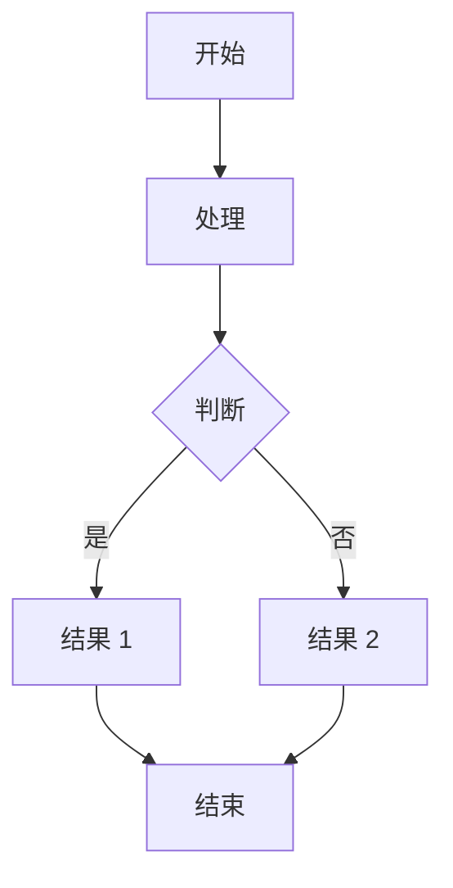
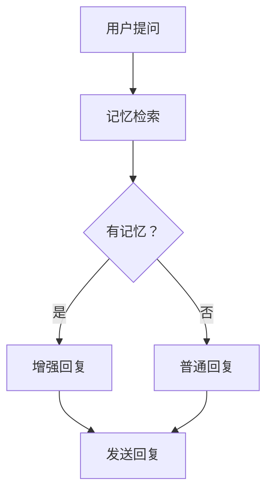
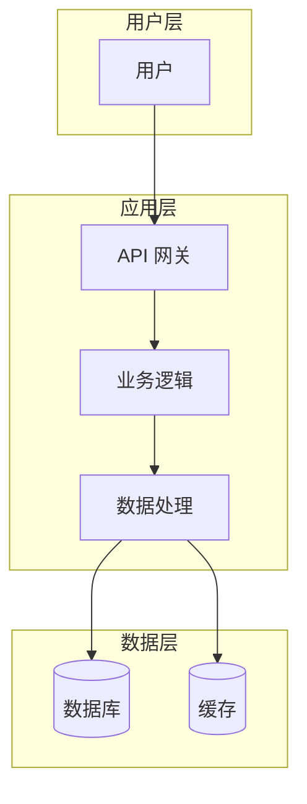
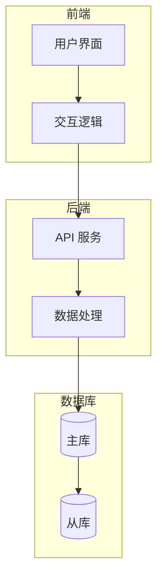

# Mermaid 图表生成器 - 快速使用指南

## 🚀 快速开始

### 1. 检查安装

```powershell
# PowerShell 脚本
.\mermaid_generator.ps1 -Check

# Python 脚本
python mermaid_generator.py --check
```

### 2. 创建 Mermaid 文件

创建 `diagram.mmd`:


### 3. 生成图片

```powershell
# 方法 1: PowerShell 脚本（推荐）
.\mermaid_generator.ps1 -InputFile diagram.mmd -Output diagram.png -Width 1000 -Height 800

# 方法 2: Python 脚本
python mermaid_generator.py diagram.mmd diagram.png -w 1000 -H 800

# 方法 3: 直接使用 mmdc
mmdc -i diagram.mmd -o diagram.png -w 1000 -H 800
```

### 4. 发送到飞书

```powershell
openclaw message send --channel feishu --media diagram.png --message "📊 图表说明" --target <chat_id>
```

---

## 📋 常用图表模板

### 流程图



### 系统架构图



### 时序图

```mermaid
sequenceDiagram
    participant 用户
    participant 阿香
    participant 记忆库
    participant 飞书
    
    用户->>阿香：发送消息
    阿香->>记忆库：检索记忆
    记忆库-->>阿香：返回记忆
    阿香->>阿香：生成回复
    阿香->>飞书：发送回复
    飞书-->>用户：显示消息
```

### 类图

```mermaid
classDiagram
    class 用户 {
        +String 姓名
        +String 邮箱
        +发送消息 ()
    }
    
    class 阿香 {
        +String 版本
        +检索记忆 ()
        +生成回复 ()
        +发送消息 ()
    }
    
    class 记忆库 {
        +Map 记忆数据
        +查询 ()
        +存储 ()
    }
    
    用户 --> 阿香：发送
    阿香 --> 记忆库：查询
```

---

## 🎨 主题配置

### 可用主题

| 主题 | 说明 | 适用场景 |
|------|------|---------|
| `default` | 默认白底 | 通用 |
| `forest` | 森林绿 | 自然/环保主题 |
| `dark` | 深色模式 | 夜间/技术文档 |
| `neutral` | 中性灰 | 正式文档 |
| `base` | 基础款 | 简洁风格 |
| `supernova` | 彩色 | 演示/展示 |
| `halloween` | 橙色 | 节日主题 |
| `cyberpunk` | 霓虹色 | 科技感 |

### 使用示例

```powershell
# 深色主题
.\mermaid_generator.ps1 -InputFile diagram.mmd -Output diagram.png -Theme dark

# 赛博朋克主题
.\mermaid_generator.ps1 -InputFile diagram.mmd -Output diagram.png -Theme cyberpunk
```

---

## 📏 尺寸建议

| 场景 | 宽度 | 高度 | 说明 |
|------|------|------|------|
| 飞书消息 | 1000 | 800 | 最佳显示效果 |
| 简单流程 | 800 | 600 | 够用就好 |
| 复杂架构 | 1200 | 900 | 避免拥挤 |
| 文档嵌入 | 1400 | 1000 | 高质量 |

---

## 💡 高级技巧

### 节点样式自定义


### 子图分组



### 连接样式

```mermaid
graph TD
    A --> B    %% 实线箭头
    A --- B    %% 无箭头
    A ==> B    %% 粗箭头
    A -.-> B   %% 虚线箭头
    A ~~~ B    %% 波浪线
```

---

## 🔧 故障排除

### 问题 1: mmdc 命令未找到

**解决:**
```powershell
npm install -g @mermaid-js/mermaid-cli
```

### 问题 2: 生成的图片模糊

**解决:**
- 增加尺寸：`-Width 1200 -Height 900`
- 使用 SVG 格式：输出文件改为 `.svg`

### 问题 3: 中文乱码

**解决:**
- 确保 .mmd 文件使用 UTF-8 编码
- PowerShell 使用：`Set-Content -Encoding UTF8`

### 问题 4: 图片太大无法发送

**解决:**
- 减小尺寸：`-Width 800 -Height 600`
- 使用 PNG 压缩工具
- 简化图表内容

---

## 📚 参考资源

- [Mermaid 官方文档](https://mermaid.js.org/)
- [Mermaid Live Editor](https://mermaid.live/) - 在线编辑预览
- [mermaid-cli GitHub](https://github.com/mermaid-js/mermaid-cli)

---

_最后更新：2026-03-12_
