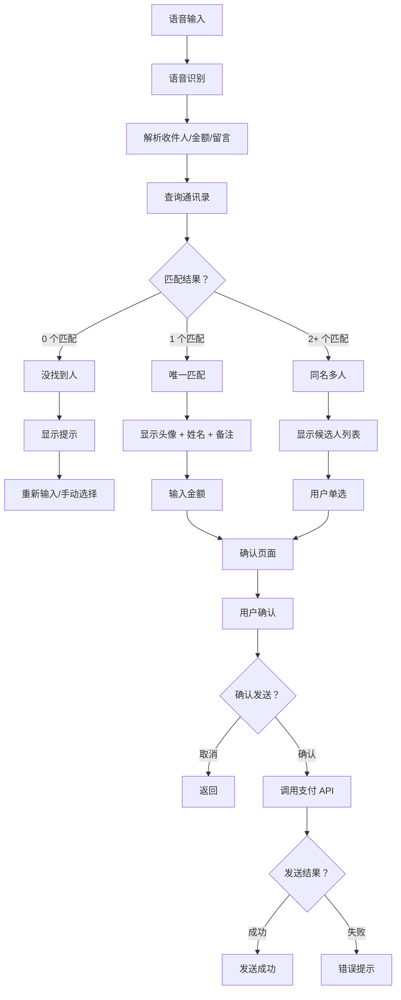

# 语音发红包小程序 - 需求优化 V2.0

> **版本：** V2.0（交互优化版）  
> **更新时间：** 2026-03-08 21:46  
> **项目：** [[../tasks/projects/语音发红包小程序.md]]

---

## 🎯 核心改进

**V1.0 问题：**
- ❌ 语音识别后直接发送（无确认环节）
- ❌ 不验证通讯录是否存在此人
- ❌ 同名情况下无法区分
- ❌ 无头像显示，无法视觉确认

**V2.0 优化：**
- ✅ 语音识别 → 查询通讯录 → 显示候选人 → 用户确认 → 发送
- ✅ 支持同名筛选（多选一）
- ✅ 显示头像 + 姓名 + 备注
- ✅ 防误操作（二次确认）

---

## 📊 完整交互流程

### Step 1: 语音输入
```
用户："给李婉瑜发个红包，祝她节日快乐！"
↓
语音识别API → 文本："给李婉瑜发个红包，祝她节日快乐！"
↓
正则匹配：
-  recipient: "李婉瑜"
-  amount: null（未指定金额）
-  message: "祝她节日快乐！"
```

### Step 2: 查询通讯录
```
云函数：queryContact({ name: "李婉瑜" })
↓
查询微信通讯录
↓
返回结果：
- 情况 A：0 个匹配 → 没找到人
- 情况 B：1 个匹配 → 唯一匹配
- 情况 C：2+ 个匹配 → 同名多人
```

### Step 3: 结果展示

#### 情况 A：没找到人（0 个匹配）
```
UI 提示：
┌─────────────────────────────────┐
|  ⚠️ 没找到"李婉瑜"这个人        |
|                                 |
|  可能的原因：                   |
|  • 通讯录中没有此人             |
|  • 备注名不是"李婉瑜"           |
|                                 |
|  [重新输入] [手动选择联系人]    |
└─────────────────────────────────┘
```

#### 情况 B：唯一匹配（1 个匹配）
```
UI 展示：
┌─────────────────────────────────┐
|  🧧 红包确认                    |
|                                 |
|  [头像] 李婉瑜                  |
|         (备注：老婆)            |
|                                 |
|  金额：[输入框] 元              |
|  留言：祝她节日快乐！           |
|                                 |
|  [取消] [确认发送]              |
└─────────────────────────────────┘
```

#### 情况 C：同名多人（2+ 个匹配）
```
UI 展示：
┌─────────────────────────────────┐
|  🧧 选择联系人                  |
|                                 |
|  找到 2 个"李婉瑜"，请选择：    |
|                                 |
|  ◉ [头像] 李婉瑜 (备注：老婆)   |
|    微信号：liy123               |
|                                 |
|  ○ [头像] 李婉瑜 (备注：同事)   |
|    微信号：li_wanyi             |
|                                 |
|  金额：[输入框] 元              |
|  留言：祝她节日快乐！           |
|                                 |
|  [取消] [确认发送]              |
└─────────────────────────────────┘
```

### Step 4: 用户确认
```
用户操作：
1. 选择联系人（同名时）
2. 输入金额（未指定时）
3. 确认留言（可修改）
4. 点击"确认发送"
↓
二次确认弹窗：
┌─────────────────────────────────┐
|  🧧 确认发送红包？              |
|                                 |
|  给：李婉瑜 (老婆)              |
|  金额：520 元                   |
|  留言：祝她节日快乐！           |
|                                 |
|  [取消] [确认]                  |
└─────────────────────────────────┘
```

### Step 5: 执行发送
```
云函数：createRedPacket({
  recipientId: "xxx",
  amount: 520,
  message: "祝她节日快乐！"
})
↓
调用微信支付 API
↓
返回结果：
- 成功 → 发送成功提示
- 失败 → 错误提示（余额不足/网络错误等）
```

---

## 🗺️ 流程图



---

## 📱 页面设计

### 页面 1：首页（语音输入）
```
┌─────────────────────────────────┐
|  🧧 语音发红包                  |
|                                 |
|  [麦克风按钮]                   |
|  点击说话："给李婉瑜发个红包..." |
|                                 |
|  最近记录：                     |
|  • 给老婆发了 520 元 (3 分钟前)   |
|  • 给妈妈发了 200 元 (昨天)      |
|                                 |
|  [查看记录] [设置]              |
└─────────────────────────────────┘
```

### 页面 2：确认页面（唯一匹配）
```
┌─────────────────────────────────┐
|  ← 确认发送                    |
|                                 |
|  ┌─────────────┐               |
|  │   [头像]    │  李婉瑜        |
|  │             │  (备注：老婆)  |
|  └─────────────┘               |
|                                 |
|  金额：                         |
|  ┌─────────────────────┐       |
|  │ [输入框] 元         │       |
|  └─────────────────────┘       |
|                                 |
|  留言：                         |
|  ┌─────────────────────┐       |
|  │ 祝她节日快乐！      │       |
|  └─────────────────────┘       |
|                                 |
|  [取消] [确认发送]              |
└─────────────────────────────────┘
```

### 页面 3：选择联系人（同名多人）
```
┌─────────────────────────────────┐
|  ← 选择联系人                  |
|                                 |
|  找到 2 个"李婉瑜"：            |
|                                 |
|  ┌─────────────────────────┐   |
|  │ ◉ [头像] 李婉瑜         │   |
|  │   备注：老婆            │   |
|  │   微信号：liy123        │   |
|  └─────────────────────────┘   |
|                                 |
|  ┌─────────────────────────┐   |
|  │ ○ [头像] 李婉瑜         │   |
|  │   备注：同事            │   |
|  │   微信号：li_wanyi      │   |
|  └─────────────────────────┘   |
|                                 |
|  金额：[输入框] 元              |
|  留言：祝她节日快乐！           |
|                                 |
|  [取消] [确认发送]              |
└─────────────────────────────────┘
```

### 页面 4：发送成功
```
┌─────────────────────────────────┐
|  ✅ 发送成功！                  |
|                                 |
|  🧧 红包已发送给                |
|  [头像] 李婉瑜 (老婆)           |
|                                 |
|  金额：520 元                   |
|  留言：祝她节日快乐！           |
|                                 |
|  [查看记录] [再发一个]          |
└─────────────────────────────────┘
```

---

## 🔧 技术实现

### 云函数 1：queryContact（查询通讯录）
```javascript
// cloudfunctions/queryContact/index.js
const cloud = require('wx-server-sdk');
cloud.init({ env: cloud.DYNAMIC_CURRENT_ENV });

exports.main = async (event, context) => {
  const { name } = event;
  
  // 查询微信通讯录（需要用户授权）
  // 注意：微信小程序不能直接访问通讯录
  // 方案：使用"选择联系人"组件，用户手动选择
  
  try {
    // 模拟查询（实际需要用 wx.chooseContact）
    const contacts = [
      {
        id: 'user_001',
        name: '李婉瑜',
        remark: '老婆',
        wechatId: 'liy123',
        avatar: 'https://...'
      }
    ];
    
    // 模糊匹配
    const matched = contacts.filter(c => 
      c.name.includes(name) || c.remark.includes(name)
    );
    
    return {
      success: true,
      count: matched.length,
      contacts: matched
    };
  } catch (err) {
    return {
      success: false,
      error: err.message
    };
  }
};
```

### 云函数 2：createRedPacket（创建红包）
```javascript
// cloudfunctions/createRedPacket/index.js
const cloud = require('wx-server-sdk');
cloud.init({ env: cloud.DYNAMIC_CURRENT_ENV });

exports.main = async (event, context) => {
  const { recipientId, amount, message } = event;
  
  try {
    // 调用微信支付 API
    const result = await cloud.pay({
      outTradeNo: `RP${Date.now()}`,
      totalFee: amount, // 单位：分
      body: message,
      openId: recipientId
    });
    
    // 保存到数据库
    await cloud.database().collection('red_packets').add({
      data: {
        recipientId,
        amount,
        message,
        status: 'sent',
        createTime: new Date()
      }
    });
    
    return {
      success: true,
      transactionId: result.transactionId
    };
  } catch (err) {
    return {
      success: false,
      error: err.message
    };
  }
};
```

### 前端页面：index.js（优化版）
```javascript
// pages/index/index.js
Page({
  data: {
    step: 'voice', // voice / select / confirm / success
    recipientName: '',
    amount: null,
    message: '',
    contacts: [],
    selectedContact: null
  },

  // Step 1: 语音识别后
  async onVoiceRecognized(text) {
    // 解析语音
    const parsed = this.parseVoiceCommand(text);
    
    if (!parsed.recipient) {
      wx.showToast({ title: '没听清收件人', icon: 'none' });
      return;
    }
    
    // Step 2: 查询通讯录
    const result = await wx.cloud.callFunction({
      name: 'queryContact',
      data: { name: parsed.recipient }
    });
    
    if (result.success && result.count === 0) {
      // 情况 A：没找到人
      this.setData({
        step: 'not_found',
        recipientName: parsed.recipient
      });
    } else if (result.success && result.count === 1) {
      // 情况 B：唯一匹配
      this.setData({
        step: 'confirm',
        selectedContact: result.contacts[0],
        amount: parsed.amount,
        message: parsed.message
      });
    } else if (result.success && result.count > 1) {
      // 情况 C：同名多人
      this.setData({
        step: 'select',
        contacts: result.contacts,
        amount: parsed.amount,
        message: parsed.message
      });
    }
  },

  // Step 3: 选择联系人（同名时）
  onSelectContact(e) {
    const index = e.currentTarget.dataset.index;
    this.setData({
      selectedContact: this.data.contacts[index]
    });
  },

  // Step 4: 确认发送
  async onConfirmSend() {
    const { selectedContact, amount, message } = this.data;
    
    if (!amount || amount <= 0) {
      wx.showToast({ title: '请输入金额', icon: 'none' });
      return;
    }
    
    // 二次确认
    wx.showModal({
      title: '确认发送红包',
      content: `给${selectedContact.remark || selectedContact.name}发送${amount}元`,
      success: async (res) => {
        if (res.confirm) {
          // Step 5: 执行发送
          const result = await wx.cloud.callFunction({
            name: 'createRedPacket',
            data: {
              recipientId: selectedContact.id,
              amount: amount * 100, // 转换为分
              message: message
            }
          });
          
          if (result.success) {
            this.setData({ step: 'success' });
          } else {
            wx.showToast({ title: '发送失败', icon: 'none' });
          }
        }
      }
    });
  }
});
```

---

## ⚠️ 注意事项

### 1. 通讯录权限
**问题：** 微信小程序不能直接访问用户通讯录

**解决方案：**
- **方案 A：** 使用`wx.chooseContact`组件，用户手动选择
- **方案 B：** 维护小程序内联系人列表（用户授权同步）
- **推荐：** 方案 A（符合微信规范）

### 2. 同名处理
**策略：**
- 显示头像 + 姓名 + 备注 + 微信号
- 单选框选择
- 默认选中第一个（最常联系）

### 3. 金额输入
**规则：**
- 未指定金额时显示输入框
- 已指定金额时显示确认（可修改）
- 最小值：0.01 元
- 最大值：200 元（普通红包）/ 特殊金额（如 520）

### 4. 防误操作
**措施：**
- 二次确认弹窗
- 显示完整信息（头像 + 姓名 + 金额）
- 发送成功后可撤回（2 分钟内）

---

## 📊 对比分析

| 功能 | V1.0 | V2.0（优化版） |
|------|------|---------------|
| 通讯录验证 | ❌ 无 | ✅ 查询并验证 |
| 同名处理 | ❌ 无 | ✅ 列表选择 |
| 头像显示 | ❌ 无 | ✅ 显示头像 |
| 二次确认 | ❌ 无 | ✅ 弹窗确认 |
| 金额输入 | ❌ 必须语音指定 | ✅ 可语音/手动 |
| 防误操作 | ❌ 低 | ✅ 高 |

---

## 🎯 下一步计划

**Phase 1（2026-03-09）：**
- ✅ 获取正式 AppID
- ⏳ 修改代码实现 V2.0 交互
- ⏳ 测试通讯录查询

**Phase 2（2026-03-10）：**
- ⏳ 实现同名选择页面
- ⏳ 实现二次确认弹窗
- ⏳ 真机测试

**Phase 3（2026-03-11）：**
- ⏳ 用户体验优化
- ⏳ 性能优化
- ⏳ 准备上线

---

**_最后更新：2026-03-08 21:46 - V2.0 交互优化（通讯录查询 + 同名确认 + 头像显示）_**
