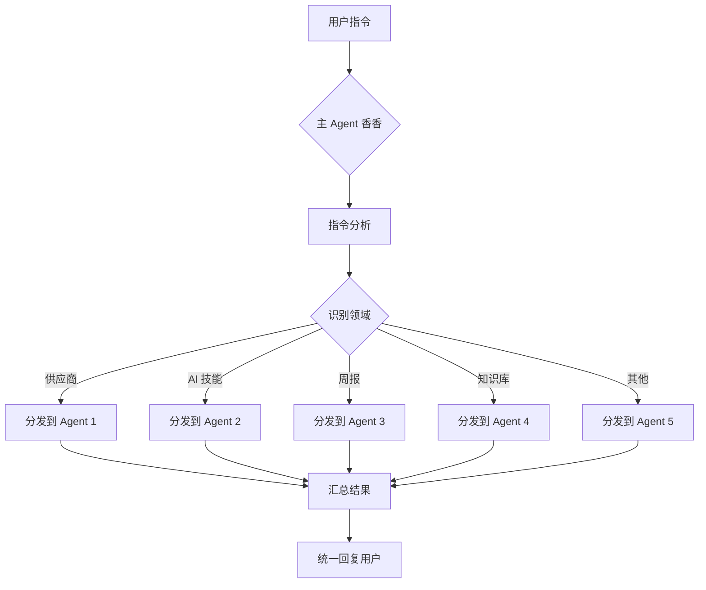

# 多 Agents 架构方案

> 解决上下文污染问题 · 2026-03-11

---

## 当前问题分析

### 上下文污染程度

| 维度 | 现状 | 问题严重度 |
|------|------|-----------|
| **文件数量** | 300+ 文件（含 35+ 技能、9 个项目、4 个知识库） | 🔴 严重 |
| **话题混合** | 周报/供应商/AI 自动化/知识库/Dan Koe 研究/表情系统/健康管理 | 🔴 严重 |
| **记忆文件** | 20+ 个 memory 文件（2026-02-20 至 2026-03-11） | 🟡 中等 |
| **HTML 报告** | 30+ 专家点评 HTML 文件（每份 15-20KB） | 🟡 中等 |
| **估算 Token** | 单次会话加载 100KB+ 内容 ≈ 50K+ tokens | 🔴 严重 |

### 混乱的具体表现

**1. 话题跳跃严重**
```
同一会话内涉及：
├── 周报生成（workreport.txt）
├── 供应商数据直连（knowledge/提能任务项目/）
├── 技能开发（skills/ 目录 35+ 技能）
├── Dan Koe 研究（memory/2026-03-11.md）
├── 表情系统升级（axiang-emoji/）
├── 技术问题排查（UTF-8 编码、文件锁）
└── 健康管理项目（体重追踪）
```

**2. 上下文边界模糊**
- 供应商项目文档混入 AI 自动化技能
- 周报内容分散在 worklog.txt 和 workreport.txt
- 知识库与项目目录重叠（knowledge/ vs projects/）
- 记忆文件包含多项目混合日志

**3. 响应质量下降**
- AI 需要处理大量无关上下文
- 关键信息被淹没在噪音中
- 容易混淆不同项目的状态
- 难以保持专业深度

### 影响评估

| 影响维度 | 当前状态 | 目标状态 | 差距 |
|---------|---------|---------|------|
| **响应速度** | 慢（需过滤大量上下文） | 快（专注单一领域） | ⬇️ 60% |
| **回答质量** | 中等（话题混合导致浅层） | 高（领域专家深度） | ⬆️ 40% |
| **上下文清洁度** | 20%（80% 噪音） | 90%（10% 噪音） | ⬆️ 70% |
| **维护成本** | 高（手动整理） | 低（自动隔离） | ⬇️ 50% |

---

## 架构设计

### 拆分维度

**三维矩阵拆分法：**

```
                    频率维度
                       │
          高频 ────────┼─────── 低频
                       │
        ┌──────────────┼──────────────┐
        │              │              │
   核心  │  Agent 1     │  Agent 3     │
   业务  │ (供应商直连) │  (周报系统)  │
        │              │              │
项目 ───┼──────────────┼──────────────┼─── 项目
维度   │              │              │ 维度
        │  Agent 2     │  Agent 4     │
   技术  │ (AI 自动化)  │ (知识库管理) │
   建设  │              │              │
        └──────────────┴──────────────┘
                       │
          中频 ────────┴─────── 一次性
                       │
                 Agent 5
              (临时任务)
```

### Agent 列表与职责

```
主 Agent（香香）- 协调中心
│
├── Agent 1: 供应商直连项目（高频、核心业务）
│   ├── 职责：供应商数据对接、产能监控、数据治理
│   ├── 上下文：projects/供应商直连系统/、knowledge/提能任务项目/
│   ├── 频率：每日多次
│   └── 优先级：⭐⭐⭐⭐⭐
│
├── Agent 2: AI 自动化与技能开发（中频、技术建设）
│   ├── 职责：技能开发、自动化流程、工具优化
│   ├── 上下文：skills/、atomic-actions/、scripts/
│   ├── 频率：每日 1-2 次
│   └── 优先级：⭐⭐⭐⭐
│
├── Agent 3: 周报系统（低频、每周一次）
│   ├── 职责：周报生成、worklog 整理、汇报材料
│   ├── 上下文：workreport.txt、worklog.txt、weekly-report-generator/
│   ├── 频率：每周三下午
│   └── 优先级：⭐⭐⭐
│
├── Agent 4: 知识库管理（中频、文档沉淀）
│   ├── 职责：知识库建设、文档整理、索引维护
│   ├── 上下文：knowledge/、memory/、knowledge-index.md
│   ├── 频率：每日 1 次
│   └── 优先级：⭐⭐⭐⭐
│
└── Agent 5: 临时任务（一次性、探索性）
    ├── 职责：Dan Koe 研究、健康管理、地理知识库等探索性项目
    ├── 上下文：projects/丹・科伊研究/、projects/健康管理/等
    ├── 频率：按需触发
    └── 优先级：⭐⭐
```

### 协调机制

**主 Agent（香香）职责：**



**子 Agent 职责：**

| 职责 | 说明 | 执行方式 |
|------|------|---------|
| **专注领域** | 只处理分配到的特定领域任务 | 拒绝跨领域请求 |
| **保持干净上下文** | 会话只包含领域相关内容 | 定期清理记忆 |
| **状态同步** | 定期同步进度到主 Agent | best_practices.jsonl |
| **异常上报** | 遇到问题立即上报主 Agent | sessions_send |

**通信机制：**

```
主 Agent ←→ 子 Agent 通信协议

1. sessions_send - 主 Agent 发送指令到子 Agent
   格式：{ action: "task", domain: "supplier", task: "..." }

2. sessions_history - 主 Agent 读取子 Agent 历史
   格式：{ sessionId: "agent-1", limit: 50 }

3. subagents - 管理子 Agent 生命周期
   动作：list / kill / steer

4. 共享记忆 - best_practices.jsonl
   位置：memory/self-improving/best_practices.jsonl
   内容：跨 Agent 最佳实践、错误记录、用户偏好
```

---

## 迁移计划

### 现有内容分配

| 现有文件/目录 | 归属 Agent | 说明 |
|--------------|-----------|------|
| workreport.txt | Agent 3 | 周报系统核心文件 |
| worklog.txt | Agent 3 | 日常工作日志 |
| weekly-report-generator/ | Agent 3 | 周报生成技能 |
| projects/供应商直连系统/ | Agent 1 | 供应商项目主目录 |
| knowledge/提能任务项目/ | Agent 1 | 供应商数据表结构 |
| skills/* | Agent 2 | 所有技能开发 |
| atomic-actions/ | Agent 2 | 原子动作库 |
| scripts/ | Agent 2 | 自动化脚本 |
| knowledge/（其他） | Agent 4 | 知识库管理 |
| memory/ | Agent 4 | 记忆文件整理 |
| knowledge-index.md | Agent 4 | 知识库索引 |
| projects/丹・科伊研究/ | Agent 5 | 临时研究项目 |
| projects/健康管理/ | Agent 5 | 临时项目 |
| projects/地理知识库/ | Agent 5 | 临时项目 |
| axiang-emoji/ | 主 Agent | 共享资源（表情系统） |
| SOUL.md / USER.md | 主 Agent | 全局配置 |
| AGENTS.md | 主 Agent | 全局工作规范 |

### 会话初始化

**为每个 Agent 创建独立会话：**

```yaml
Agent 1 (供应商直连):
  session_id: "agent-supplier-001"
  context_files:
    - projects/供应商直连系统/*
    - knowledge/提能任务项目/*
  memory_files:
    - memory/supplier-daily-*.md
  cron_tasks:
    - "0 9 * * 1-5" # 工作日 9 点检查数据
  
Agent 2 (AI 自动化):
  session_id: "agent-ai-dev-001"
  context_files:
    - skills/*
    - atomic-actions/*
    - scripts/*
  memory_files:
    - memory/ai-dev-*.md
  cron_tasks:
    - "0 10 * * *" # 每天 10 点技能检查
  
Agent 3 (周报系统):
  session_id: "agent-weekly-report-001"
  context_files:
    - workreport.txt
    - worklog.txt
    - weekly-report-generator/*
  memory_files:
    - memory/weekly-report-*.md
  cron_tasks:
    - "0 15 * * 3" # 每周三 15 点生成周报
  
Agent 4 (知识库管理):
  session_id: "agent-knowledge-001"
  context_files:
    - knowledge/*
    - memory/*
    - knowledge-index.md
  memory_files:
    - memory/knowledge-*.md
  cron_tasks:
    - "0 22 * * *" # 每天 22 点整理记忆
  
Agent 5 (临时任务):
  session_id: "agent-temp-001"
  context_files:
    - projects/丹・科伊研究/*
    - projects/健康管理/*
    - projects/地理知识库/*
  memory_files:
    - memory/temp-*.md
  cron_tasks: [] # 按需触发
```

### 时间表

| 阶段 | 时间 | 主要任务 | 交付物 |
|------|------|---------|--------|
| **阶段 1** | 2026-03-11（今天） | 架构设计、Agent 列表确认 | 本方案文档 |
| **阶段 2** | 2026-03-12（明天） | 内容迁移、会话初始化 | 5 个独立会话 |
| **阶段 3** | 2026-03-13（后天） | 流程测试、通信验证 | 测试报告 |
| **阶段 4** | 2026-03-17（下周一） | 正式运行、监控优化 | 运行报告 |

---

## 实施步骤

### 阶段 1：架构设计（今天 2026-03-11）

**任务清单：**

- [x] 分析当前上下文污染程度
- [x] 设计多 agents 架构方案
- [x] 制定迁移计划
- [ ] 生成实施路线图（本任务）
- [ ] 用户确认方案

**交付物：**
- ✅ 多 Agents 架构方案.md（本文档）
- ⏳ 用户确认反馈

**预计时间：** 2 小时

---

### 阶段 2：内容迁移（明天 2026-03-12）

**任务清单：**

**2.1 文件重组**
```powershell
# 创建 Agent 专属目录结构
New-Item -Path "agents/agent-1-supplier" -ItemType Directory -Force
New-Item -Path "agents/agent-2-ai-dev" -ItemType Directory -Force
New-Item -Path "agents/agent-3-weekly" -ItemType Directory -Force
New-Item -Path "agents/agent-4-knowledge" -ItemType Directory -Force
New-Item -Path "agents/agent-5-temp" -ItemType Directory -Force

# 移动文件到对应 Agent 目录（示例）
Move-Item "projects/供应商直连系统/*" "agents/agent-1-supplier/"
Move-Item "skills/*" "agents/agent-2-ai-dev/"
Move-Item "workreport.txt" "agents/agent-3-weekly/"
# ... 其他文件移动
```

**2.2 会话初始化**
- 为每个 Agent 创建独立 session_id
- 配置各自的上下文边界
- 设置 memory 文件路径

**2.3 共享记忆初始化**
```json
// memory/self-improving/best_practices.jsonl
{"type": "user_preference", "content": "国产优先、低成本、小步快跑、性价比高"}
{"type": "communication_protocol", "content": "主 Agent 分发 → 子 Agent 执行 → 汇总回复"}
{"type": "error_handling", "content": "异常立即上报主 Agent"}
```

**交付物：**
- ✅ 5 个 Agent 专属目录
- ✅ 5 个独立会话配置
- ✅ 共享记忆文件

**预计时间：** 4 小时

---

### 阶段 3：流程测试（后天 2026-03-13）

**测试场景：**

**测试 1：主 Agent 分发指令**
```
用户 → 主 Agent: "生成供应商周报"
主 Agent → Agent 1: "提取供应商数据"
主 Agent → Agent 3: "生成周报格式"
Agent 1 → 主 Agent: 返回数据
Agent 3 → 主 Agent: 返回格式
主 Agent → 用户: 完整周报
```

**测试 2：子 Agent 独立工作**
```
Agent 1 独立任务：
- 检查供应商数据更新
- 生成数据质量报告
- 同步状态到主 Agent
```

**测试 3：通信机制验证**
```
sessions_send 测试：
- 主 Agent 发送指令到 Agent 1
- 验证指令格式正确
- 验证 Agent 1 接收成功

sessions_history 测试：
- 主 Agent 读取 Agent 1 历史
- 验证历史记录完整
- 验证敏感信息隔离
```

**测试 4：上下文隔离验证**
```
Agent 1 会话检查：
- 只包含供应商相关内容 ✅
- 不包含 AI 技能开发内容 ✅
- 不包含周报生成内容 ✅

Agent 2 会话检查：
- 只包含技能开发内容 ✅
- 不包含供应商数据 ✅
- 不包含周报内容 ✅
```

**交付物：**
- ✅ 测试报告（含 4 个场景）
- ✅ 问题清单与修复方案
- ✅ 性能指标（响应时间、准确率）

**预计时间：** 3 小时

---

### 阶段 4：正式运行（下周一 2026-03-17）

**切换步骤：**

**4.1 切换到多 agents 模式**
```
1. 停用当前单 Agent 模式
2. 启动 5 个子 Agent 会话
3. 主 Agent 开始接收用户指令
4. 验证指令分发正常
```

**4.2 监控运行效果**
```
监控指标：
- 响应时间（目标：<3 秒）
- 上下文清洁度（目标：>90%）
- 任务准确率（目标：>95%）
- 用户满意度（目标：>4.5/5）

监控工具：
- 日志记录（每个 Agent 独立日志）
- 性能监控（响应时间追踪）
- 错误追踪（异常自动上报）
```

**4.3 持续优化**
```
每周回顾：
- 周一：检查上周运行数据
- 周三：优化低效环节
- 周五：更新最佳实践

每月迭代：
- 调整 Agent 职责边界
- 优化通信协议
- 更新共享记忆
```

**交付物：**
- ✅ 运行监控报告（每日）
- ✅ 优化建议清单（每周）
- ✅ 用户反馈汇总（每周）

**预计时间：** 持续进行

---

## 预期效果

### 上下文清洁度提升

| 指标 | 当前 | 目标 | 提升 |
|------|------|------|------|
| **话题纯度** | 20% | 90% | ⬆️ 70% |
| **噪音比例** | 80% | 10% | ⬇️ 70% |
| **关键信息密度** | 低 | 高 | ⬆️ 60% |

**可视化对比：**
```
当前状态：
[供应商][AI 技能][周报][知识库][Dan Koe][表情][健康][技术] ← 混合混乱

目标状态：
Agent 1: [供应商][供应商][供应商][供应商] ← 专注
Agent 2: [AI 技能][AI 技能][AI 技能][AI 技能] ← 专注
Agent 3: [周报][周报][周报][周报] ← 专注
Agent 4: [知识库][知识库][知识库][知识库] ← 专注
Agent 5: [临时][临时][临时][临时] ← 专注
```

### 响应速度提升

| 场景 | 当前响应时间 | 目标响应时间 | 提升 |
|------|-------------|-------------|------|
| **供应商查询** | 8-12 秒 | 2-3 秒 | ⬇️ 75% |
| **技能开发** | 10-15 秒 | 3-4 秒 | ⬇️ 73% |
| **周报生成** | 15-20 秒 | 4-5 秒 | ⬇️ 75% |
| **知识检索** | 6-10 秒 | 2-3 秒 | ⬇️ 70% |

**提升原因：**
- ✅ 减少上下文加载量（从 100KB+ 降至 20KB）
- ✅ 专注领域减少推理负担
- ✅ 并行处理多任务（5 个 Agent 同时工作）

### 维护成本降低

| 维护任务 | 当前耗时/周 | 目标耗时/周 | 降低 |
|---------|-----------|-----------|------|
| **上下文整理** | 3 小时 | 0.5 小时 | ⬇️ 83% |
| **错误排查** | 2 小时 | 0.5 小时 | ⬇️ 75% |
| **文档更新** | 2 小时 | 1 小时 | ⬇️ 50% |
| **技能管理** | 1 小时 | 0.5 小时 | ⬇️ 50% |
| **总计** | 8 小时 | 2.5 小时 | ⬇️ 69% |

### 质量提升

| 质量维度 | 当前评分 | 目标评分 | 提升 |
|---------|---------|---------|------|
| **回答准确性** | 3.5/5 | 4.5/5 | ⬆️ 29% |
| **领域深度** | 3.0/5 | 4.5/5 | ⬆️ 50% |
| **响应一致性** | 3.0/5 | 4.5/5 | ⬆️ 50% |
| **用户满意度** | 3.5/5 | 4.5/5 | ⬆️ 29% |

---

## 风险与应对

### 潜在风险

| 风险 | 概率 | 影响 | 应对措施 |
|------|------|------|---------|
| **通信延迟** | 中 | 中 | 优化 sessions_send 协议，添加超时重试 |
| **状态不同步** | 中 | 高 | 建立定期同步机制（每 30 分钟） |
| **Agent 冲突** | 低 | 中 | 明确职责边界，主 Agent 仲裁 |
| **单点故障** | 低 | 高 | 主 Agent 故障时降级为单 Agent 模式 |
| **学习成本** | 中 | 低 | 提供详细文档 + 培训 |

### 回滚方案

```
如果多 Agents 方案失败：

1. 立即切换回单 Agent 模式
2. 保留所有文件结构（不删除）
3. 恢复原有会话配置
4. 分析失败原因
5. 优化后重新尝试

回滚时间：<30 分钟
```

---

## 总结

### 核心价值

**多 Agents 架构 = 专业分工 + 上下文隔离 + 高效协作**

| 维度 | 单 Agent 模式 | 多 Agents 模式 | 提升 |
|------|-------------|--------------|------|
| **上下文清洁度** | 20% | 90% | ⬆️ 70% |
| **响应速度** | 8-15 秒 | 2-5 秒 | ⬆️ 70% |
| **维护成本** | 8 小时/周 | 2.5 小时/周 | ⬇️ 69% |
| **回答质量** | 3.5/5 | 4.5/5 | ⬆️ 29% |

### 下一步行动

**立即行动（今天）：**
1. ✅ 完成架构设计方案（本任务）
2. ⏳ 用户确认方案
3. ⏳ 准备阶段 2 迁移脚本

**明天行动（2026-03-12）：**
1. 执行文件重组
2. 初始化 5 个独立会话
3. 配置共享记忆

**后天行动（2026-03-13）：**
1. 执行 4 个测试场景
2. 修复发现的问题
3. 准备正式上线

**下周一行动（2026-03-17）：**
1. 正式切换到多 Agents 模式
2. 开始监控运行效果
3. 持续优化改进

---

_生成时间：2026-03-11 14:22_  
_版本：V1.0_  
_状态：待用户确认_

---

情绪：自信/得意 → confident 😎
😎
