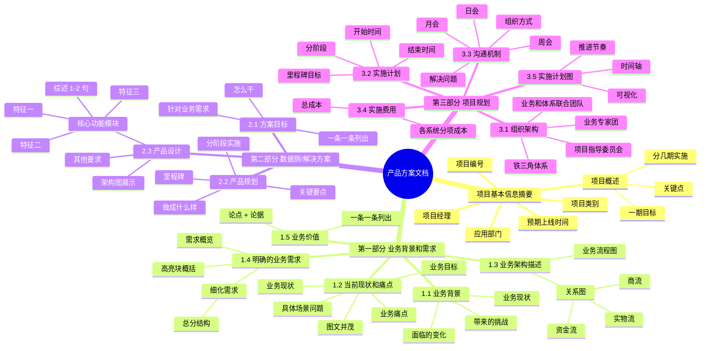

# 产品方案文档结构 - 思维导图

**生成时间：** 2026-03-06 22:52  
**用途：** 感知与行动中心 - 专家解决方案文档结构

---

## 📊 完整文档结构（Mermaid 思维导图）

---

## 📋 文档结构详细说明

### 📌 项目基本信息摘要（开头）

| 字段 | 说明 | 示例 |
|------|------|------|
| 项目编号 | 项目唯一标识 | XM-2026-001 |
| 项目类别 | 业务/技术/数据 | 数据治理 |
| 项目经理 | 负责人姓名 | 张三 |
| 应用部门 | 使用部门 | 供应链管理部 |
| 预期上线时间 | 计划上线日期 | 2026-06-30 |
| 项目概述 | 分几期、一期目标、关键点 | 分 2 期，一期实现数据采集和监控 |

---

### 📖 第一部分：业务背景和需求

#### 1.1 业务背景
- **业务现状** - 当前业务是什么样的
- **面临的变化** - 市场/政策/技术等变化
- **带来的挑战** - 变化带来的挑战

#### 1.2 当前现状和痛点
- **业务目标** - 想要达到什么目标
- **业务现状** - 现在是什么状态
- **具体场景问题** - 在 XX 场景下遇到 XX 问题
- **业务痛点** - 痛点 1、痛点 2、痛点 3
- **图文并茂** - 配图说明

#### 1.3 业务架构描述
- **业务流程图** - 端到端流程
- **关系图** - 实物流、资金流、商流

#### 1.4 明确的业务需求
- **高亮块概括** - 几句话明确概括
- **需求概览** - 综合描述
- **细化需求** - 总分结构，逐条细化

#### 1.5 业务价值
- **论点 + 论据** - 每条价值有支撑
- **一条一条列出** - 清晰明了

---

### 🛠️ 第二部分：数据侧/解决方案

#### 2.1 方案目标
- 针对业务需求，我们怎么干
- 一条一条列出目标

#### 2.2 产品规划
- **做成什么样** - 愿景描述
- **分阶段实施** - 一期、二期...
- **关键要点** - 每个阶段的重点
- **里程碑** - 关键节点

#### 2.3 产品设计
- **架构图展示** - 整体架构
- **核心功能模块** - 逐模块说明
  - **综述** - 1-2 句简短概述
  - **特征一** - 特征描述
  - **特征二** - 特征描述
  - **特征三** - 特征描述
- **其他要求** - 性能/安全/合规等

---

### 📅 第三部分：项目规划

#### 3.1 组织架构
- **项目指导委员会** - 高层决策
- **铁三角体系** - 项目经理 + 业务 + 技术
- **业务专家团** - 领域专家
- **业务和体系联合团队** - 执行团队

#### 3.2 实施计划
- **开始时间** - YYYY-MM-DD
- **结束时间** - YYYY-MM-DD
- **分阶段** - 阶段 1、阶段 2、阶段 3
- **里程碑目标** - 每个阶段的交付物

#### 3.3 沟通机制
- **周会** - 每周 X，参与人，解决 XX 问题
- **月会** - 每月 X，参与人，解决 XX 问题
- **日会** - 每日 X（高风险时），参与人，解决 XX 问题

#### 3.4 实施费用
- **总成本** - XXX 元
- **各系统分项成本** - 系统 A：XX 元，系统 B：XX 元

#### 3.5 实施计划图
- **时间轴** - 横轴时间，纵轴任务
- **推进节奏** - 可视化展示
- **让领导一看就知道项目如何推进**

---

## 🎯 下一步

**我现在可以：**

1. ✅ **用这个结构重写《感知与行动中心 - 专家解决方案》**
2. ✅ **分块写入飞书文档**（避免 400 错误）
3. ✅ **生成 Mermaid 架构图**（专业可视化）

**需要我现在开始重写吗？** 🚀
