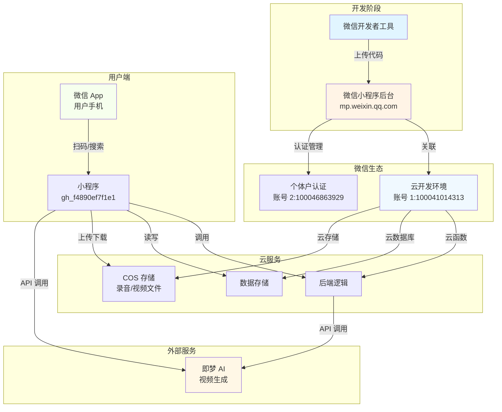
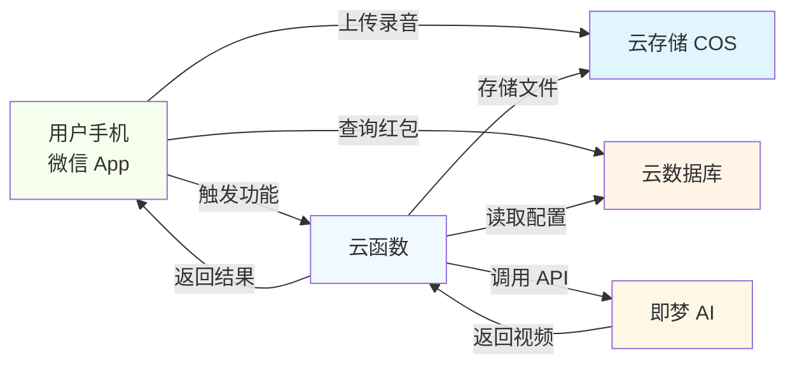

# 🧧 微信小程序开发全景架构图

> **报告时间：** 2026-03-09 19:00  
> **适用项目：** 给老婆发红包小程序  
> **目标：** 理清所有概念和协作机制

---

## 📊 一张图看懂全景架构



---

## 🔍 核心概念详解

### 1. 微信开发者工具

**是什么：** 电脑上的开发软件（类似 VSCode）

**作用：**
- ✅ 编写代码（HTML/CSS/JS）
- ✅ 预览效果（模拟器）
- ✅ 调试代码（断点/日志）
- ✅ 上传代码到微信后台

**位置：** 你的电脑上

**使用频率：** 每天都要用

**类比：** 就像 Word 用来写文档

---

### 2. 微信小程序后台（公众平台）

**是什么：** 网页版管理后台

**网址：** `https://mp.weixin.qq.com/`

**作用：**
- ✅ 小程序认证（个体户执照）
- ✅ 版本管理（审核/发布）
- ✅ 成员管理（添加开发者）
- ✅ 关联云开发环境
- ✅ 查看数据（用户数/访问量）

**位置：** 网页（浏览器访问）

**使用频率：** 每周几次

**类比：** 就像 App Store 的开发者后台

---

### 3. 腾讯云控制台

**是什么：** 腾讯云的网页管理后台

**网址：** `https://console.cloud.tencent.com/`

**作用：**
- ✅ 管理云资源（服务器/数据库）
- ✅ 查看用量和费用
- ✅ 购买云服务

**位置：** 网页（浏览器访问）

**使用频率：** 偶尔（购买/查看用量时）

**类比：** 就像阿里云控制台

---

### 4. 云开发（CloudBase）

**是什么：** 微信提供的后端服务（免运维）

**作用：**
- ✅ 云函数（后端代码，无需服务器）
- ✅ 云数据库（存储数据）
- ✅ 云存储（存储文件）
- ✅ 免运维（微信托管）

**位置：** 微信云开发环境

**使用频率：** 开发时配置，运行时自动调用

**类比：** 就像"后端即服务"（BaaS）

---

### 5. 云托管

**是什么：** 云开发的高级功能（容器化部署）

**作用：**
- ✅ 部署自定义后端服务
- ✅ 支持 Docker 容器
- ✅ 更灵活的控制

**与云开发的区别：**
| 云开发 | 云托管 |
|--------|--------|
| 免运维 | 需要运维 |
| 按调用计费 | 按资源计费 |
| 适合小程序后端 | 适合复杂服务 |

**你的项目：** 暂时用不到云托管

---

### 6. LIC（云开发环境 ID）

**是什么：** 云开发环境的唯一标识

**你的环境 ID：** `card-native-2gvohkdhd8a64b2d`

**作用：**
- ✅ 标识你的云开发环境
- ✅ 小程序关联时用到
- ✅ 跨账号关联时用到

**类比：** 就像银行账号

---

## 📋 你的项目配置清单

### 账号体系

| 账号 | 用途 | 账号 ID | 状态 |
|------|------|--------|------|
| **账号 1** | 云开发环境 | 100041014313 | ✅ 已购买 1.9 元套餐 |
| **账号 2** | 小程序主体 | 100046863929 | ✅ 个体户认证通过 |

**关系：** 账号 2（小程序）关联 账号 1（云开发）

---

### 小程序信息

| 项目 | 值 |
|------|-----|
| **小程序名称** | 给老婆发红包（待填写） |
| **AppID** | gh_f4890ef7f1e1 |
| **认证状态** | ✅ 个体户认证通过 |
| **云开发环境** | card-native-2gvohkdhd8a64b2d |

---

### 云开发环境

| 项目 | 值 |
|------|-----|
| **环境 ID** | card-native-2gvohkdhd8a64b2d |
| **套餐** | 50G 云开发 |
| **价格** | 1.9 元/年 |
| **到期时间** | 2026-09-08 23:59:59 |
| **状态** | ✅ 正常 |

---

## 🔄 协作机制详解

### 开发流程

```mermaid
sequenceDiagram
    participant 开发者 as 你（开发者）
    participant 工具 as 微信开发者工具
    participant 后台 as 微信后台
    participant 云开发 as 云开发环境
    participant 用户 as 最终用户（老婆）
    
    开发者->>工具：1. 编写代码
    开发者->>工具：2. 本地预览
    开发者->>工具：3. 调试代码
    开发者->>工具：4. 上传代码
    工具->>后台：5. 提交审核
    后台->>后台：6. 微信审核
    后台->>云开发：7. 关联环境
    后台->>开发者：8. 审核通过
    用户->>工具：9. 扫码体验
    用户->>云开发：10. 调用云函数
    云开发->>用户：11. 返回结果
```

---

### 数据流向



---

## 🎯 你的项目架构

### 给老婆发红包小程序

**功能模块：**

```
给老婆发红包小程序
├── 用户登录模块
│   └── 微信云开发认证（免开发）
├── 录音模块
│   ├── 录音功能（前端）
│   └── 上传到云存储（COS）
├── 红包模块
│   ├── 红包记录（云数据库）
│   ├── 红包转发（云函数）
│   └── 红包记录查询（云数据库）
├── AI 视频模块
│   ├── 调用即梦 API（云函数）
│   ├── 获取视频 URL
│   └── 播放视频（前端）
└── 设置模块
    └── 云开发配置
```

---

### 技术栈

| 层级 | 技术 | 说明 |
|------|------|------|
| **前端** | 微信小程序 | WXML/WXSS/JS |
| **后端** | 云函数 | Node.js/Python |
| **数据库** | 云数据库 | JSON 文档型 |
| **存储** | 云存储（COS） | 文件存储 |
| **AI 服务** | 即梦 API | 视频生成 |

---

## 📝 下一步操作清单

### 已完成 ✅

- [x] 个体户营业执照准备
- [x] 微信小程序注册
- [x] 微信认证审核通过
- [x] 云开发环境购买（1.9 元/年）
- [x] COS 存储购买（1 元/年）
- [x] 腾讯云资源配置决策

### 待完成 ⚪

- [ ] **云开发环境关联**（小程序后台 → 云服务 → 关联环境 ID）
- [ ] **微信开发者工具安装**（下载安装）
- [ ] **创建小程序项目**（工具中创建"给老婆发红包"）
- [ ] **选择云开发环境**（card-native-2gvohkdhd8a64b2d）
- [ ] **编写代码**（录音/红包/AI 视频）
- [ ] **提交审核**（微信后台）
- [ ] **发布上线**

---

## 💡 常见问题解答

### Q1: 云开发和云托管有什么区别？

**A:**
| 云开发 | 云托管 |
|--------|--------|
| 免运维 | 需要运维 |
| 按调用计费 | 按资源计费 |
| 适合小程序后端 | 适合复杂服务 |
| 你的项目用这个 ✅ | 暂时用不到 |

---

### Q2: 为什么要两个账号？

**A:**
- **账号 1（个人）：** 买云开发环境（1.9 元/年，个人特惠）
- **账号 2（个体户）：** 小程序主体（认证需要执照）
- **跨账号关联：** 小程序（账号 2）关联云开发（账号 1）

---

### Q3: 云开发够用吗？

**A:** 对于"给老婆发红包"小程序：
- ✅ 50G 存储：足够存几千个录音
- ✅ 云函数：足够处理业务逻辑
- ✅ 云数据库：足够存红包记录
- ✅ 完全够用！

---

### Q4: 即梦 AI 视频怎么集成？

**A:**
```
小程序 → 云函数 → 即梦 API → 返回视频 URL → 小程序播放
```

**云函数代码示例：**
```javascript
// 云函数：调用即梦 AI
exports.main = async (event) => {
  const response = await fetch('https://api.jimeng.com/generate', {
    method: 'POST',
    body: JSON.stringify(event)
  })
  return await response.json()
}
```

---

## 📊 成本分析

### 一次性成本

| 项目 | 价格 |
|------|------|
| 微信认证费 | 300 元 |
| **总计** | **300 元** |

---

### 年度成本

| 项目 | 价格 | 必要性 |
|------|------|--------|
| 云开发环境 50G | 1.9 元/年 | ✅ 必需 |
| COS 存储 50G | 1 元/年 | ✅ 必需 |
| 轻量服务器 | 99 元/年 | ❌ 不需要 |
| 数据万象 | 7.5 元/年 | ❌ 按量计费 |
| **总计** | **2.9 元/年** | |

---

### 使用成本（按量计费）

| 项目 | 单价 | 预估用量 | 月成本 |
|------|------|---------|--------|
| 云函数调用 | 0.01 元/万次 | 1 万次 | 0.01 元 |
| 云数据库读写 | 0.02 元/万条 | 1 万条 | 0.02 元 |
| 云存储流量 | 0.12 元/GB | 10GB | 1.2 元 |
| **月总计** | | | **~1.23 元** |

---

## 🎯 总结

### 核心要点

1. **微信开发者工具** = 写代码的软件（电脑上）
2. **微信后台** = 管理小程序的网页（mp.weixin.qq.com）
3. **云开发** = 微信提供的后端服务（免运维）
4. **云环境 ID** = 云开发的标识（card-native-xxx）
5. **两个账号** = 个人账号（云开发）+ 个体户账号（小程序）

---

### 协作机制

```
开发者工具（写代码）
  ↓ 上传
微信后台（审核/发布）
  ↓ 关联
云开发环境（后端服务）
  ↓ 服务
用户手机（使用小程序）
```

---

### 下一步

**立即操作：**
1. 微信后台 → 云服务 → 关联环境 ID
2. 安装微信开发者工具
3. 创建"给老婆发红包"项目
4. 开始开发！

---

_全景架构报告 | 2026-03-09 | 给老婆发红包项目_
