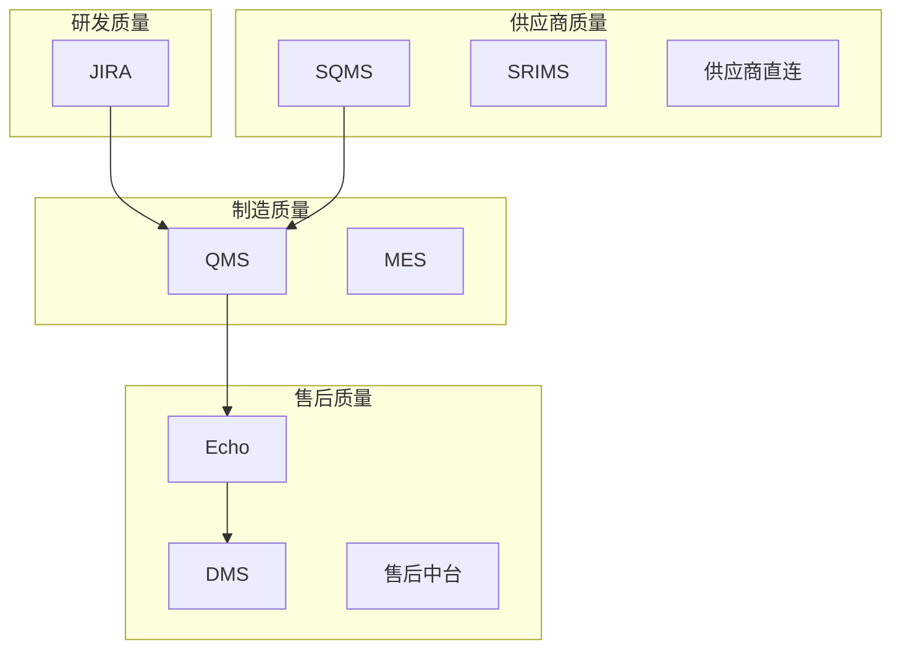

# 📊 质量端到端打通项目汇报

> **汇报对象：** 简总  
> **汇报时间：** 2026-03-16（下周）  
> **汇报人：** 冬梅/迪哥/千淅  
> **时长：** 30 分钟

---

## 幻灯片 1：封面

**标题：** 质量端到端打通项目汇报

**副标题：** 系统现状盘点 + 最小闭环 Demo 方案

**时间：** 2026-03-16

**参与人：** 冬梅、迪哥、千淅、逸文、阿福

---

## 幻灯片 2：目录

**议程：**

1. 项目背景与目标（5 分钟）
2. 系统现状盘点（10 分钟）
3. SQMS 调研发现（5 分钟）
4. 最小闭环 Demo 方案（5 分钟）
5. 下一步计划（5 分钟）

---

## 幻灯片 3：项目背景

### 老板关切（余总/简总）

**3 个核心问题：**
- 🔴 工厂质量侧是否有保证？
- 🔴 质量风险能否及时/提前被识别？
- 🔴 造车质量是否可靠？

### 业务痛点

**4 大结构性问题：**
1. 数据分散 - 7+ 个系统各自为政
2. 链路不通 - 售后→制造追溯断点
3. 标签不统一 - 无法联动分析
4. 主数据不规范 - 供应商/零件/模块定义不一

**5. SQMS 系统问题（新增）**
- 🔴 系统性能瓶颈 - 月均 1 万单，列表加载 2-5 分钟
- 🟡 新业务适配不足 - 一品多点/多工厂不支持
- 🟡 端到端流程割裂 - 与 SRM/SAP 断点
- 🟡 产品运营缺失 - 需求无人跟进

---

## 幻灯片 4：项目目标

### 业务目标

1. **质量数据统一** - 建立统一质量指标体系和标签规范
2. **端到端可视化** - 市场反馈→根因追溯全流程可视
3. **问题快速追溯** - 质量问题分钟级定位到根因
4. **质量持续改进** - 基于数据的质量优化闭环

### 技术指标

| 指标 | 目标值 | 当前值 | 状态 |
|------|--------|--------|------|
| 数据源集成数 | ≥5 个 | 0 个 | ⚪ |
| 链路打通数 | ≥2 条 | 0 条 | ⚪ |
| 标签统一率 | 100% | <50% | ⚪ |
| 查询响应时间 | < 3 秒 | >30 秒 | ⚪ |

### 成功标准

**业务指标：**
- ✅ 质量数据覆盖率 ≥80%
- ✅ 质量问题定位时间 < 10 分钟
- ✅ 质量报告生成时间 < 5 分钟

---

## 幻灯片 5：系统全景图

### 7+ 核心系统



### 系统成熟度评估

| 系统 | 领域 | 成熟度 | 关键问题 |
|------|------|--------|---------|
| JIRA | 研发质量 | 🟡 50% | 与制造/售后未闭环 |
| SQMS | 供应商质量 | 🟡 60% | 性能瓶颈/流程割裂 |
| SRIMS | 供应商关系 | 🟢 70% | 数据较完整 |
| QMS | 制造质量 | 🟡 40% | 数据分散 |
| MES | 制造执行 | 🟡 50% | 与售后未打通 |
| Echo | 售后反馈 | 🟢 80% | 标签主数据（推荐） |
| DMS | 售后中台 | 🟢 70% | 索赔单数据完整 |

---

## 幻灯片 6：SQMS 调研发现

### 调研概况

**时间：** 2026-01-28 至 2026-02-02

**方法：** 用户访谈（7 人）+ 问卷 + 系统走查

**核心发现：** 4 大结构性问题

### 问题 1：系统性能瓶颈（🔴 P0）

**影响：** 业务延误约 15 天/月

**表现：**
- 二次索赔月均 1 万单
- 列表加载 2-5 分钟
- 批量操作频繁卡顿崩溃

**用户原话：**
> "界面打开需 2-5 分钟，已严重影响业务处理时效" —— 朱雪静（质量部）

**根因：**
- 数据库索引缺失
- 前端分页逻辑不合理
- 未做缓存优化

**建议：**
1. 添加数据库索引
2. 前端分页优化
3. 热点数据缓存

---

## 幻灯片 7：SQMS 调研发现（续）

### 问题 2：新业务适配不足（🟡 P1）

**表现：**
- 一品多点不支持 - 多供应商场景异常单据积压
- 多工厂不支持 - PPAP 任务重复数据
- 数据同步时机错误 - 框架协议后才同步

**用户原话：**
> "系统未能有效支持'一品多点'的供应商模式，导致异常单据持续积压" —— 朱雪静

### 问题 3：端到端流程割裂（🟡 P1）

**表现：**
- 与 SRM/SAP/SQIR 断点
- 扣款结果无法追踪
- 逆向流程依赖线下审批

**用户原话：**
> "无法与后续的 SRM、SAP 状态联动，用户无法追踪扣款等关键后续进展" —— 王晓瑜（内外饰 SQE）

### 问题 4：产品运营缺失（🟡 P2）

**表现：**
- 无专职产品负责人
- 历史需求长期搁置（去年 3 月需求至今未落地）
- 迭代资源不足

---

## 幻灯片 8：追溯链路分析

### 链路 1：金锥件索赔追溯（优先打通 ✅）

**成熟度：** 80%（数据基本有，需整合）

**流程：**
```
市场反馈 (VIN 码)
  ↓
Echo 反馈收集
  ↓
索赔单 (DMS)
  ↓
归因分析 (供应商责任)
  ↓
金锥件追溯码
  ↓
供应商设备/工序 (直连系统)
  ↓
根因定位 + 整改措施
```

**关键优势：**
- ✅ 供应商直连数据完整
- ✅ 可追溯到设备/工序
- ✅ 链路最短

---

## 幻灯片 9：追溯链路分析（续）

### 链路 2：制造过程问题追溯（待打通 ⚪）

**成熟度：** 30%（制造过程数据分散）

**流程：**
```
市场反馈 (VIN 码)
  ↓
Echo 反馈收集
  ↓
归因分析 (制造责任)
  ↓
??? 断点 ???
  ↓
车间/工序信息 (MES)
  ↓
根因定位 + 整改措施
```

**关键断点：**
- ❌ 制造责任判定后，无法追溯到车间/工序
- ❌ MES 与 Echo 未打通
- ❌ 自制件问题无线上闭环

**建议：** 先打通金锥件链路，再攻关制造链路

---

## 幻灯片 10：最小闭环 Demo 方案

### 方案选择

**优先：金锥件索赔追溯**

**理由：**
1. ✅ 数据相对完整（80% 成熟度）
2. ✅ 链路最短（6 个节点）
3. ✅ 业务价值高（供应商质量问题占比 70%）
4. ✅ 可快速验证（1-2 周）

### Demo 范围

**覆盖系统：** Echo → DMS → 供应商直连

**覆盖场景：** 售后索赔→供应商责任→设备/工序追溯

**交付物：**
- 质量 dashboard（1 个）
- 追溯链路可视化（1 条）
- 质量报告模板（1 个）

---

## 幻灯片 11：Demo 实施计划

### 阶段 1：数据盘点（2026-03-10 至 2026-03-16）

**任务：**
- [ ] Echo 数据字段梳理
- [ ] DMS 索赔单字段梳理
- [ ] 供应商直连数据字段梳理
- [ ] 字段映射关系表

**交付物：** 数据字典 v1.0

### 阶段 2：数据集成（2026-03-17 至 2026-03-23）

**任务：**
- [ ] Echo 数据接入
- [ ] DMS 数据接入
- [ ] 供应商直连数据接入
- [ ] VIN 码关联体系

**交付物：** 数据集成管道

### 阶段 3：可视化开发（2026-03-24 至 2026-03-30）

**任务：**
- [ ] 质量 dashboard
- [ ] 追溯链路可视化
- [ ] 质量报告模板

**交付物：** Demo 系统 v1.0

### 阶段 4：试点验证（2026-03-31 至 2026-04-06）

**任务：**
- [ ] 试点产品线选择（1 条）
- [ ] 用户培训
- [ ] 试点反馈收集
- [ ] 优化改进

**交付物：** 试点验收报告

---

## 幻灯片 12：资源需求

### 人力资源

| 角色 | 人员 | 投入度 | 职责 |
|------|------|--------|------|
| 产品负责人 | 冬梅 | 50% | 需求定义与验收 |
| 技术负责人 | 迪哥 | 50% | 技术架构与开发 |
| 数据负责人 | 千淅 | 50% | 数据集成与治理 |
| 业务专家 | 逸文 | 30% | 业务流程梳理 |
| SQMS 代表 | 待定 | 20% | SQMS 系统对接 |

### 系统资源

| 系统 | 权限需求 | 负责人 | 状态 |
|------|---------|--------|------|
| Echo | 数据读取 | 冬梅 | ⚪ 待申请 |
| DMS | 数据读取 | 冬梅 | ⚪ 待申请 |
| 供应商直连 | 数据读取 | 千淅 | ⚪ 待申请 |
| MES | 数据读取 | 迪哥 | ⚪ 待申请 |

---

## 幻灯片 13：风险与缓解

### 已知风险

| 风险 | 影响 | 概率 | 缓解措施 |
|------|------|------|---------|
| 数据源系统权限 | 高 | 中 | 简总推动 + 协调管理员 |
| 标签规范不统一 | 高 | 高 | Echo 作为主数据统一 |
| SQMS 配合度 | 中 | 中 | 设立专职对接人 |
| 制造链路数据缺失 | 中 | 高 | 先打通金锥件链路 |

### 关键依赖

1. **SQMS 系统配合** - 需要专职对接人
2. **数据权限申请** - 需要简总推动
3. **业务部门时间** - 试点验证需要配合

---

## 幻灯片 14：下一步计划

### 本周（2026-03-10 至 2026-03-16）

**核心任务：**
1. ✅ 系统全景图整理（迪哥）
2. ✅ 金锥件链路打样（千淅）
3. ✅ 主数据规范初稿（冬梅）
4. ✅ 业务调研小范围（逸文）

**里程碑：** 下周汇报（2026-03-16）

### 下周（2026-03-17 至 2026-03-23）

**核心任务：**
1. 数据集成开发
2. 标签规范定义
3. SQMS 性能优化方案
4. 试点产品线选择

**里程碑：** Demo 系统 v1.0

---

## 幻灯片 15：决策请求

### 需要简总决策的事项

**1. 项目优先级确认**
- 🔴 P0 优先级（与供应商数据直连并列）
- 资源投入保障

**2. 数据权限协调**
- Echo/DMS/供应商直连/MES 数据读取权限
- 需要简总推动各系统管理员

**3. SQMS 专职对接人**
- 建议设立专职产品负责人
- 负责 SQMS 优化与质量 E2E 项目协同

**4. 试点产品线选择**
- 建议选 1 条成熟产品线
- 便于快速验证

---

## 幻灯片 16：总结

### 核心结论

1. **质量数据端到端打通势在必行**
   - 老板关切明确
   - 业务痛点突出
   - SQMS 调研支撑

2. **金锥件索赔链路可快速打通**
   - 80% 成熟度
   - 1-2 周出 Demo
   - 业务价值高

3. **制造链路需长期攻关**
   - 30% 成熟度
   - 数据分散
   - 建议分阶段推进

### 行动呼吁

**请简总支持：**
1. ✅ 确认 P0 优先级
2. ✅ 协调数据权限
3. ✅ 设立 SQMS 专职对接人
4. ✅ 确认试点产品线

---

## 幻灯片 17：Q&A

**谢谢！**

**联系方式：**
- 冬梅（产品负责人）
- 迪哥（技术负责人）
- 千淅（数据负责人）

---

_汇报材料 | 2026-03-16 | 质量端到端打通项目_
