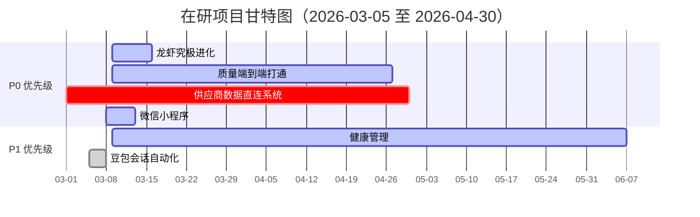

# 📊 在研项目进度报告

> **报告时间：** 2026-03-09 17:32  
> **报告人：** 阿福  
> **项目总数：** 6 个  
> **报告周期：** 2026-03-05 至 2026-03-09

---

## 📋 项目总览

| 项目编号 | 项目名称 | 优先级 | 状态 | 进度 | 负责人 | 截止日期 |
|---------|---------|--------|------|------|--------|---------|
| PROJECT-LOBSTER-001 | 龙虾究极进化 | P0 | 🟡 进行中 | 40% | 阿福 | 2026-03-15 |
| PROJECT-QUALITY-E2E-001 | 质量端到端打通 | P0 | 🟡 进行中 | 15% | 阿福 | 2026-04-27 |
| PROJECT-SUPPLIER-001 | 供应商数据直连系统 | P0 | 🔴 严重滞后 | 11% | 欣昊/夏冰 | 2026-04-30 |
| PROJECT-WECHAT-001 | 微信小程序（小红包） | P0 | 🟡 进行中 | 80% | 阿福 | 2026-03-12 |
| PROJECT-HEALTH-001 | 健康管理 | P1 | 🟡 进行中 | 20% | 阿福 | 2026-06-09 |
| PROJECT-DOUBAO-001 | 豆包会话自动化系统 | P1 | ✅ 已完成 | 100% | 阿福 | 2026-03-05 |

---

## 📅 项目甘特图

---

## 🦞 项目 1：龙虾究极进化（PROJECT-LOBSTER-001）

### 基本信息
- **优先级：** P0
- **状态：** 🟡 进行中
- **进度：** 40%
- **周期：** 2026-03-09 至 2026-03-15（7 天）
- **负责人：** 阿福

### 项目概述
OpenClaw 能力升级 + 玩家经验值系统完善项目

### ✅ 已完成事项（阶段 1）
| 任务 | 完成时间 | 交付物 |
|------|---------|--------|
| 飞书通道修复 | 2026-03-09 14:27 | 飞书插件 v2026.3.7 |
| 依赖问题解决 | 2026-03-09 14:25 | @larksuiteoapi/node-sdk |
| Gateway 重启验证 | 2026-03-09 14:27 | Gateway 正常运行 |
| 消息响应测试 | 2026-03-09 14:30 | 响应时间<3 秒 |
| 玩家系统合并 | 2026-03-09 15:44 | 经验值规则整合 |

### 🟡 进行中事项（阶段 2）
| 任务 | 计划完成 | 当前状态 |
|------|---------|---------|
| 权限批量导入 | 2026-03-10 | 飞书后台配置中 |
| set_permission 开发 | 2026-03-09 | ✅ 已完成，待测试 |

### ⚪ 待开始事项（阶段 3-7）
| 阶段 | 任务 | 计划开始 |
|------|------|---------|
| 阶段 3 | 三线更新自动化 | 2026-03-11 |
| 阶段 4 | 新增原子动作 | 2026-03-12 |
| 阶段 5 | 玩家系统规则固化 | 2026-03-13 |
| 阶段 6 | 经验值自动化评分 | 2026-03-14 |
| 阶段 7 | 项目验收 | 2026-03-15 |

### 📊 成功标准
- ✅ 飞书消息响应时间 < 3 秒（当前~2 秒）
- 🟡 权限覆盖官方推荐的 90 个 scopes（当前~95%）
- 🟡 三线更新自动化率 100%（当前~80%）
- 🟡 新增原子动作≥5 个（当前 1 个）

---

## 🎯 项目 2：质量端到端打通（PROJECT-QUALITY-E2E-001）

### 基本信息
- **优先级：** P0
- **状态：** 🟡 进行中
- **进度：** 15%
- **周期：** 2026-03-09 至 2026-04-27（7 周）
- **负责人：** 阿福

### 项目概述
建立从市场反馈到根因追溯的全流程质量管理体系

### ✅ 已完成事项（阶段 1）
| 任务 | 完成时间 | 交付物 |
|------|---------|--------|
| 项目立项 | 2026-03-09 16:15 | 项目章程.md |
| 会议纪要整理 | 2026-03-09 16:15 | 完整会议纪要 |
| 标准化立项技能 | 2026-03-09 16:15 | SKILL.md（6681 字节） |
| 三线同步 | 2026-03-09 16:15 | 飞书文档追加 51 blocks |

### 🟡 进行中事项（阶段 2）
| 任务 | 负责人 | 计划完成 |
|------|--------|---------|
| 系统全景图整理 | 迪哥 | 2026-03-16 |
| 金锥件链路打样 | 千淅 | 2026-03-16 |
| 主数据规范初稿 | 冬梅 | 2026-03-16 |
| 业务调研小范围 | 逸文 | 2026-03-16 |

### ⚪ 待开始事项（阶段 3-8）
| 阶段 | 任务 | 计划开始 |
|------|------|---------|
| 阶段 3 | 主数据规范定义 | 2026-03-23 |
| 阶段 4 | 数据集成开发 | 2026-03-30 |
| 阶段 5 | 标签体系统一 | 2026-04-06 |
| 阶段 6 | 可视化看板开发 | 2026-04-13 |
| 阶段 7 | 试点验证 | 2026-04-20 |
| 阶段 8 | 项目验收 | 2026-04-27 |

### 🔧 核心系统（7+）
JIRA、QMS、MES、SQMS、SRIMS、Echo、DMS、售后中台

### 🔗 追溯链路
- 链路 1：金锥件索赔追溯（80% 成熟度，优先打通）
- 链路 2：制造过程问题追溯（30% 成熟度，待打通）

---

## 🏭 项目 3：供应商数据直连系统（PROJECT-SUPPLIER-001）

### 基本信息
- **优先级：** P0
- **状态：** 🔴 严重滞后
- **进度：** 11%
- **周期：** 2026-03-01 至 2026-04-30（60 天）
- **负责人：** 欣昊（PM）/夏冰（Tech）

### 项目概述
24 家试点供应商数据直连，4 月底完成 100% 直连

### ⚠️ 当前问题
| 问题 | 严重程度 | 说明 |
|------|---------|------|
| 直连覆盖率低 | 🔴 严重 | 仅 11%（12/108 个件号） |
| 评分规则不合理 | 🟡 中等 | 93 分掩盖真实问题 |
| 进度管控薄弱 | 🟡 中等 | 依赖人工催办 |

### 📅 关键里程碑
| 里程碑 | 计划时间 | 状态 |
|--------|---------|------|
| 主数据维护 + 承诺函回签 | 2026-04-15 | ⚪ |
| 24 家数据治理完成 | 2026-04-30 | ⚪ |

### 🎯 本周任务（2026-03-09 至 2026-03-16）
| 任务 | 负责人 | 截止时间 |
|------|--------|---------|
| 细化评分规则方案 | 欣昊 + 夏冰 | 2026-03-12 |
| 汇川数据同步问题排查 | 夏冰 | 2026-03-12 |
| 系统看板制作 | 欣昊 | 2026-03-14 |
| 韩玉零件号匹配对接 | 相关负责人 | 2026-03-14 |
| 周报机制建立 | 欣昊 | 2026-03-17 |

---

## 🧧 项目 4：微信小程序（小红包给老婆）（PROJECT-WECHAT-001）

### 基本信息
- **优先级：** P0
- **状态：** 🟡 进行中
- **进度：** 80%
- **周期：** 2026-03-08 至 2026-03-12（5 天）
- **负责人：** 阿福

### 项目概述
基于微信小程序的语音发红包功能

### ✅ 已完成事项
| 任务 | 完成时间 | 说明 |
|------|---------|------|
| 个体户营业执照准备 | 2026-03-08 | 丈母娘的执照 |
| 微信小程序注册 | 2026-03-08 | 邮箱：icesumer@gmail.com |
| 微信认证申请 | 2026-03-08 | 300 元认证费 |
| 认证审核通过 | 2026-03-09 16:27 | ✅ 已完成 |
| 云开发环境购买 | 2026-03-08 | 50G 套餐（1.9 元） |

### 🟡 进行中事项
| 任务 | 当前状态 | 下一步 |
|------|---------|--------|
| 云开发环境关联 | 待操作 | 登录账号 2（100046863929） |
| 小程序信息完善 | 待开始 | 名称/图标/简介/类目 |

### ⚪ 待开始事项
| 任务 | 计划时间 |
|------|---------|
| 开发小程序 | 2026-03-10 |
| 提交审核 | 2026-03-11 |
| 发布上线 | 2026-03-12 |
| 配置微信支付 | 2026-03-12 |

### 💰 成本统计
| 项目 | 费用 |
|------|------|
| 微信认证费 | 300 元 |
| 云开发环境（1.9 元×2 账号） | 3.98 元 |
| **总计** | **303.98 元** |

---

## 💪 项目 5：健康管理（PROJECT-HEALTH-001）

### 基本信息
- **优先级：** P1
- **状态：** 🟡 进行中
- **进度：** 20%
- **周期：** 2026-03-09 至 2026-06-09（90 天）
- **负责人：** 阿福

### 项目概述
3 个月减重 15kg（90kg → 75kg）

### ✅ 已完成事项
| 任务 | 完成时间 |
|------|---------|
| 项目立项 | 2026-03-09 |
| 项目章程创建 | 2026-03-09 |
| 训练计划制定 | 2026-03-09 |
| 体重追踪文档 | 2026-03-09 |

### 🟡 进行中事项（阶段 1：适应期）
| 任务 | 状态 |
|------|------|
| 健身房熟悉环境 | ⚪ 待完成 |
| 购买体脂秤 | ⚪ 待完成 |
| 准备健身装备 | ⚪ 待完成 |
| 采购健康食材 | ⚪ 待完成 |
| 拍摄初始体型照片 | ⚪ 待完成 |

### 📊 目标
- **当前体重：** 90kg
- **目标体重：** 75kg
- **减重：** 15kg
- **时间：** 90 天（0.125kg/天）

### 🏋️ 训练计划
- 健身房 3 次/周 + 有氧 2 次/周
- 步行 8000 步/天
- 饮食：1800 kcal/天（35% 蛋白/40% 碳水/25% 脂肪）

### 🔔 阿福提醒
- 每小时：08:00-23:00（任务/饮水/活动）
- 每日：07:00 早餐、12:00 午餐、18:00 晚餐、21:00 明日计划
- 每周日 20:00：体重汇报 + 计划调整

---

## 🤖 项目 6：豆包会话自动化系统（PROJECT-DOUBAO-001）

### 基本信息
- **优先级：** P1
- **状态：** ✅ 已完成
- **进度：** 100%
- **周期：** 2026-03-05 至 2026-03-05（1 天）
- **负责人：** 阿福

### 项目概述
自动从豆包读取会话历史，生成专家点评网页

### ✅ 已完成事项
| 任务 | 完成时间 |
|------|---------|
| 数据获取脚本 | 2026-03-05 |
| 专家点评网页生成 | 2026-03-05 |
| 会话归档系统 | 2026-03-05 |
| 文档指南 | 2026-03-05 |

### 📦 交付物
- fetch-doubao-history.ps1
- fetch-doubao-auto.ps1
- fetch-doubao-simple.ps1
- bom-expert-review.html 系列（v2-v9）
- DOUBAO_AUTO_GUIDE.md

---

## 📊 风险与问题

### 高风险
| 风险 | 项目 | 影响 | 缓解措施 |
|------|------|------|---------|
| 供应商直连进度严重滞后 | SUPPLIER-001 | 4 月底无法完成 | 加强催办 + 系统看板 |
| 制造链路数据缺失 | QUALITY-E2E-001 | 无法端到端打通 | 先打通金锥件链路 |

### 中风险
| 风险 | 项目 | 影响 | 缓解措施 |
|------|------|------|---------|
| 飞书权限配置复杂 | LOBSTER-001 | 影响功能完整性 | 使用应用身份 token |
| 云开发跨账号管理 | WECHAT-001 | 管理复杂 | 同账号重新购买（1.99 元） |

---

## 🎯 下周重点（2026-03-10 至 2026-03-16）

### P0 优先级
1. **龙虾项目** - 权限批量导入 + 三线更新自动化
2. **质量项目** - 系统全景图 + 金锥件链路打样
3. **供应商项目** - 评分规则细化 + 汇川问题排查
4. **微信小程序** - 云开发关联 + 开发上线

### P1 优先级
1. **健康管理** - 阶段 1 启动（健身房/体脂秤/装备）
2. **豆包项目** - 维护 + 优化

---

_报告生成时间：2026-03-09 17:32_
