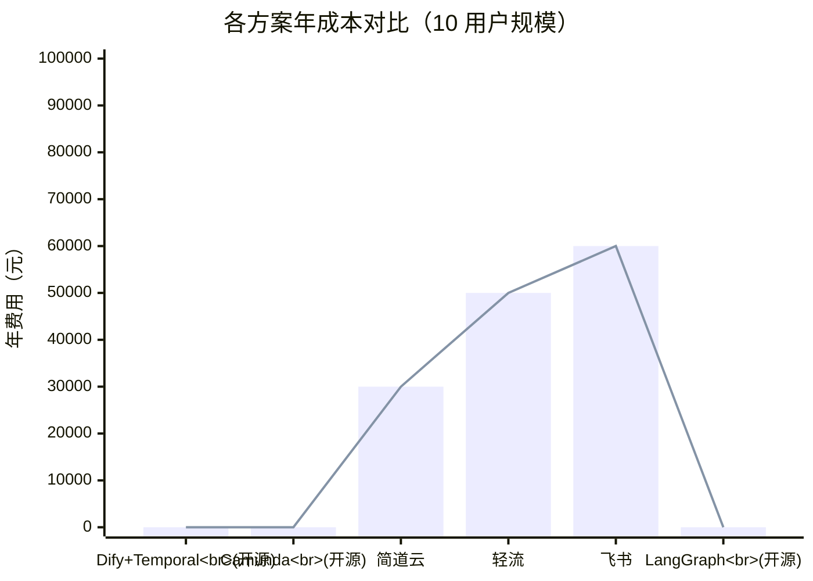
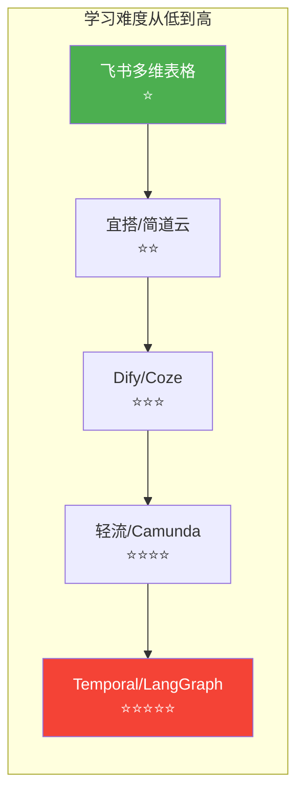
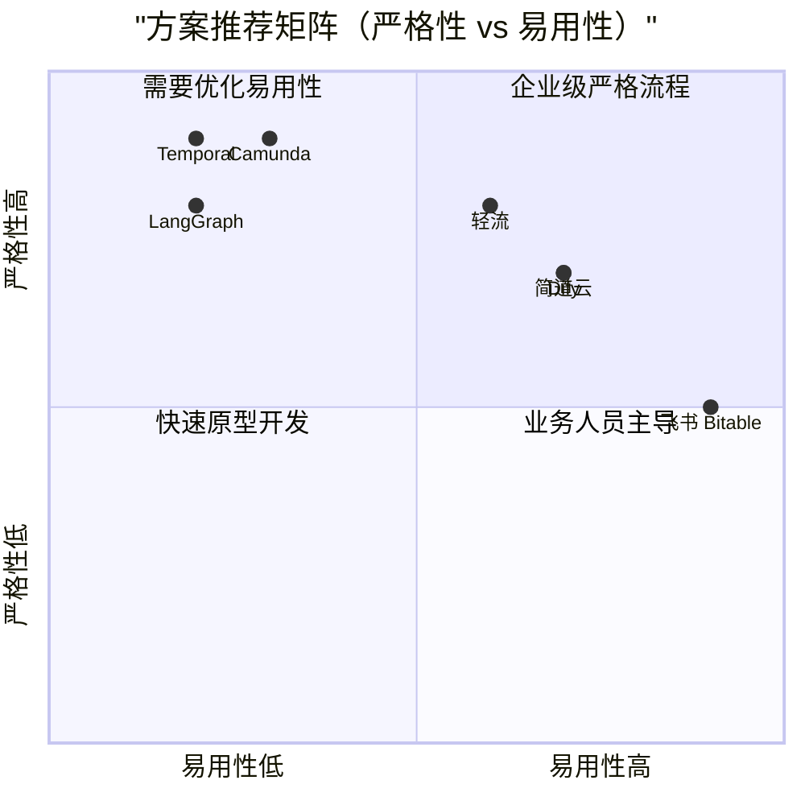
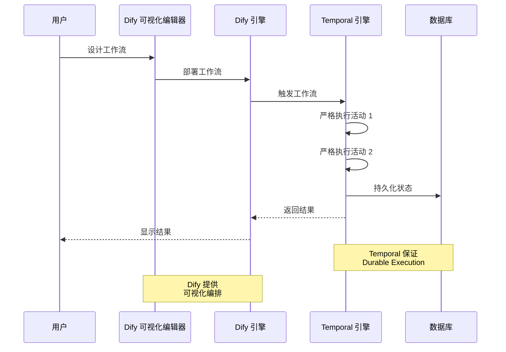
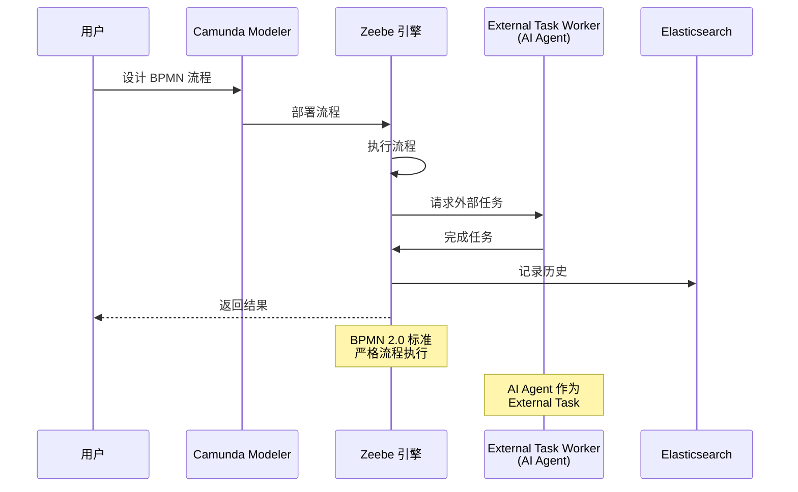
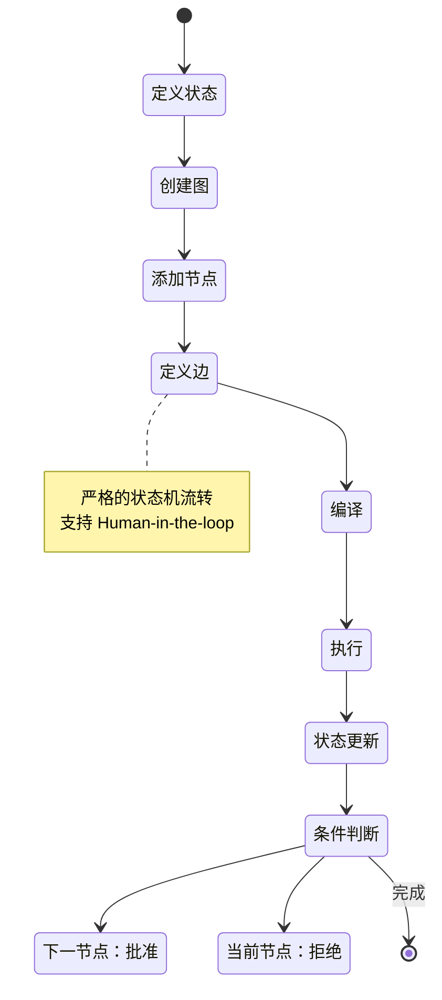

# 企业级工作流解决方案对比雷达图

## 综合对比雷达图

```mermaid
radarChart
    title 主流方案综合对比（7 维度）
    axis 严格性["严格性<br/>25%"], 可视化["可视化<br/>15%"], 集成能力["集成能力<br/>20%"], 多 Agent["多 Agent<br/>20%"], 学习成本["学习成本<br/>10%"], 成本["成本<br/>10%"], 国产化["国产化<br/>10%"]
    
    "Dify + Temporal": 5, 5, 5, 4, 4, 5, 4
    "Camunda": 5, 5, 5, 3, 3, 4, 2
    "LangGraph": 5, 2, 4, 5, 3, 5, 2
    "轻流": 5, 4, 4, 2, 4, 3, 5
    "简道云": 4, 4, 3, 2, 4, 4, 5
    "飞书 Bitable": 3, 4, 4, 2, 5, 4, 5
```

## 严格性对比

```mermaid
radarChart
    title 流程严格性对比
    axis BPMN 标准，执行保证，权限控制，审计追溯，版本管理
    "Camunda": 5, 5, 5, 5, 5
    "Temporal": 4, 5, 4, 5, 5
    "轻流": 3, 5, 5, 4, 4
    "LangGraph": 4, 5, 3, 3, 4
    "Dify": 3, 4, 4, 4, 3
    "飞书 Bitable": 2, 3, 3, 3, 2
```

## 多 Agent 支持对比

```mermaid
radarChart
    title 多 Agent 协作能力对比
    axis Agent 编排，状态管理，对话协作，任务分配，可观测性
    "LangGraph": 5, 5, 5, 5, 5
    "AutoGen": 5, 3, 5, 4, 3
    "CrewAI": 4, 4, 5, 5, 3
    "Dify": 3, 4, 3, 4, 4
    "Temporal": 4, 5, 3, 4, 4
    "Camunda": 3, 4, 2, 3, 4
```

## 成本对比（年费用估算）



## 学习曲线对比



## 国产化程度对比


## 推荐场景矩阵



## 架构对比

### 方案 A：Dify + Temporal（推荐）



### 方案 B：Camunda



### 方案 C：LangGraph



---

**图表生成时间：** 2026-03-12  
**数据来源：** 企业级工作流解决方案调研报告
