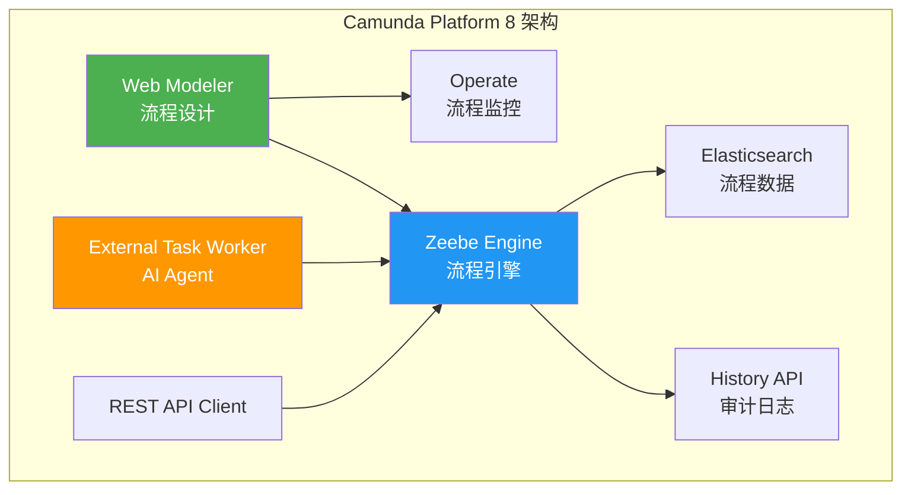
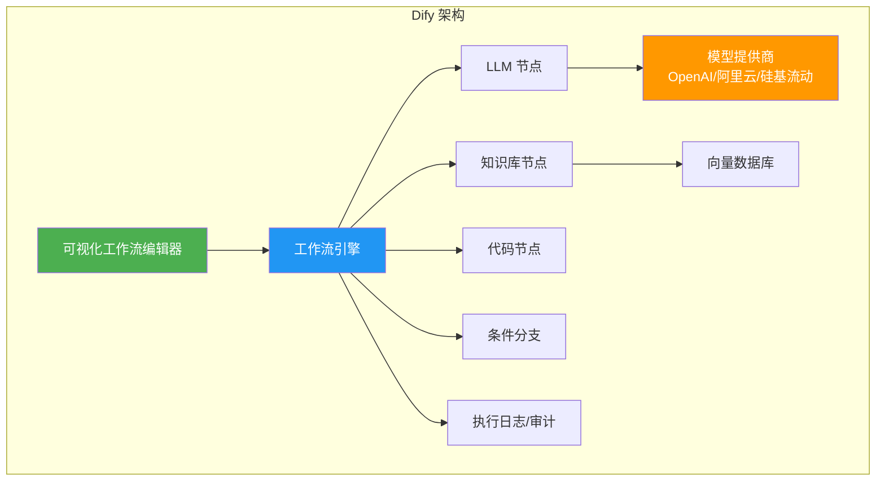
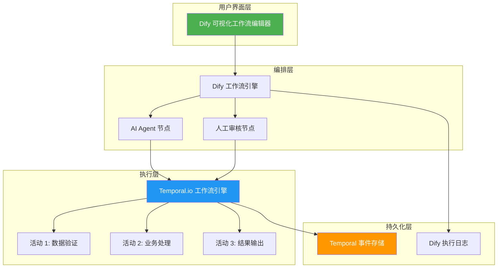

# 企业级工作流解决方案调研报告

**调研日期：** 2026-03-12  
**调研目的：** 寻找比飞书 Bitable 更严格、更固化的企业级工作流解决方案，用于多 Agents 实验对比和企业流程应用

---

## 📋 执行摘要

### 核心发现

经过系统性调研，发现**没有单一解决方案能完美满足所有需求**，但不同场景有最优选择：

| 场景 | 推荐方案 | 严格性 | 成本 | 国产化 |
|------|---------|--------|------|--------|
| **企业级严格流程** | Camunda | ⭐⭐⭐⭐⭐ | 商业/开源 | ❌ |
| **多 Agent 实验** | LangGraph + Dify | ⭐⭐⭐⭐ | 开源/免费 | ⭐⭐⭐ |
| **国产企业应用** | 简道云/轻流 | ⭐⭐⭐⭐ | 商业 | ✅ |
| **分布式工作流** | Temporal.io | ⭐⭐⭐⭐⭐ | 开源/商业 | ❌ |

### 关键结论

1. **BPM 系统最严格** - Camunda/Flowable 等 BPMN 2.0 标准系统执行最严格，但学习成本高
2. **Agent 框架最灵活** - LangGraph/Dify 适合多 Agent 实验，但流程固化程度较低
3. **国产平台最易用** - 简道云/轻流上手快，但自定义能力有限
4. **混合方案最优** - BPM 系统 + Agent 框架组合可能是最佳方案

---

## 1️⃣ 企业级 BPM 系统对比

### 1.1 功能对比表

| 维度 | Camunda | Flowable | Activiti | jBPM | Pega BPM |
|------|---------|----------|----------|------|----------|
| **流程定义** | BPMN 2.0 + DMN | BPMN 2.0 + DMN | BPMN 2.0 | BPMN 2.0 + CMMN | 自有 BPMN |
| **可视化编辑器** | ✅ Camunda Modeler | ✅ Flowable UI | ✅ Activiti Modeler | ✅ Business Central | ✅ Pega Designer |
| **执行严格性** | ⭐⭐⭐⭐⭐ | ⭐⭐⭐⭐⭐ | ⭐⭐⭐⭐ | ⭐⭐⭐⭐ | ⭐⭐⭐⭐⭐ |
| **权限管理** | 角色/组/租户 | 角色/组/租户 | 角色/组 | 角色/组/组织 | 角色/岗位/组织层级 |
| **审计追溯** | 完整执行日志 + History API | 完整审计服务 | 审计服务 | 完整日志 | 企业级审计 |
| **集成能力** | REST API + External Tasks | REST API + Connectors | REST API + Connectors | REST API | 企业级集成 |
| **多 Agent 支持** | ⚠️ External Tasks 可集成 | ⚠️ 可集成 | ⚠️ 可集成 | ⚠️ 可集成 | ❌ 不支持 |
| **部署方式** | 本地/云端/混合 | 本地/云端 | 本地/云端 | 本地/云端 | 云端为主 |
| **成本** | 开源 + 商业版 | 开源 + 商业版 | 纯开源 | 开源 + 商业 | 商业昂贵 |
| **学习曲线** | 中等 | 中等 | 中等 | 陡峭 | 陡峭 |
| **社区活跃度** | ⭐⭐⭐⭐⭐ | ⭐⭐⭐⭐ | ⭐⭐⭐ | ⭐⭐⭐ | ⭐⭐ |

### 1.2 详细分析

#### 🏆 Camunda Platform 8

**优势：**
- ✅ **最成熟的 BPMN 2.0 实现** - 流程定义标准、严格
- ✅ **强大的可视化建模** - Camunda Modeler 支持 BPMN/DMN
- ✅ **执行严格性最高** - 流程一旦定义，必须按步骤执行
- ✅ **完整的审计追溯** - History API 记录所有流程实例
- ✅ **External Task 模式** - 可轻松集成 AI Agent 作为外部任务处理器
- ✅ **多租户支持** - 适合企业多部门隔离
- ✅ **活跃的社区** - 文档丰富，案例多

**劣势：**
- ❌ **商业版昂贵** - 企业版按流程实例计费
- ❌ **非国产** - 德国产品，本地化支持有限
- ❌ **学习成本中等** - 需要理解 BPMN 2.0 标准
- ❌ **多 Agent 支持有限** - 需要自行实现 Agent 集成

**适用场景：**
- 企业核心业务流程（审批、订单、客服）
- 需要严格合规和审计的场景
- 流程变更频率低的场景

**架构图：**



#### Flowable

**优势：**
- ✅ **完全开源** - 社区版功能完整
- ✅ **BPMN 2.0 + DMN + CMMN** - 支持多种标准
- ✅ **轻量级** - 可嵌入 Spring Boot 应用
- ✅ **审计服务完善** - 独立的 Audit Service
- ✅ **云原生支持** - 支持 Kubernetes 部署

**劣势：**
- ❌ **文档相对较少** - 相比 Camunda 社区较小
- ❌ **可视化编辑器较弱** - 不如 Camunda Modeler 成熟
- ❌ **非国产** - 英国产品

**适用场景：**
- 预算有限的中小企业
- 需要嵌入到现有 Java 应用中
- 技术团队有 Spring Boot 经验

#### Activiti

**优势：**
- ✅ **纯开源** - Apache 2.0 许可
- ✅ **云原生架构** - Activiti Cloud 设计
- ✅ **Kubernetes 友好** - 原生支持 K8s 部署
- ✅ **微服务架构** - 各组件可独立扩展

**劣势：**
- ❌ **社区分裂** - 核心团队创立 Flowable，社区分散
- ❌ **文档更新慢** - 社区活跃度下降
- ❌ **企业支持有限** - 商业支持不如 Camunda

**适用场景：**
- 技术团队熟悉 Activiti 历史版本
- 需要完全开源、无商业限制
- 云原生 K8s 环境

#### Pega BPM

**优势：**
- ✅ **企业级功能最完整** - 权限/审计/集成最强
- ✅ **低代码开发** - 业务人员可参与流程设计
- ✅ **AI 集成** - Pega AI 支持决策优化
- ✅ **行业模板丰富** - 金融、保险、政府等行业方案

**劣势：**
- ❌ **成本极高** - 企业级商业软件，按用户/实例计费
- ❌ **学习曲线陡峭** - 需要专门培训
- ❌ **供应商锁定** - 自有标准，迁移成本高
- ❌ **非国产** - 美国产品

**适用场景：**
- 大型企业集团
- 预算充足，需要全方位支持
- 复杂业务流程和决策管理

### 1.3 BPM 系统评分表

| 评估维度 | 权重 | Camunda | Flowable | Activiti | jBPM | Pega |
|----------|------|---------|----------|----------|------|------|
| **严格性** | ⭐⭐⭐⭐⭐ | 5 | 5 | 4 | 4 | 5 |
| **可视化** | ⭐⭐⭐⭐ | 5 | 4 | 4 | 4 | 5 |
| **集成能力** | ⭐⭐⭐⭐⭐ | 5 | 4 | 4 | 3 | 5 |
| **多 Agent 支持** | ⭐⭐⭐⭐⭐ | 3 | 3 | 3 | 3 | 2 |
| **学习成本** | ⭐⭐⭐ | 3 | 3 | 3 | 2 | 2 |
| **成本** | ⭐⭐⭐⭐⭐ | 4 | 5 | 5 | 4 | 2 |
| **国产化** | ⭐⭐⭐⭐⭐ | 2 | 2 | 2 | 2 | 2 |
| **加权总分** | 100% | **4.1** | **4.0** | **3.7** | **3.3** | **3.4** |

---

## 2️⃣ 低代码/无代码平台对比

### 2.1 功能对比表

| 平台 | 流程固化程度 | 审批流严格性 | 集成能力 | 成本 | 国产化 | 学习成本 |
|------|-------------|-------------|----------|------|--------|----------|
| **钉钉宜搭** | ⭐⭐⭐⭐ | ⭐⭐⭐⭐⭐ | ⭐⭐⭐⭐ | 免费/付费 | ✅ | ⭐⭐⭐⭐⭐ |
| **飞书多维表格 + 自动化** | ⭐⭐⭐ | ⭐⭐⭐ | ⭐⭐⭐⭐ | 免费/付费 | ✅ | ⭐⭐⭐⭐⭐ |
| **微软 Power Automate** | ⭐⭐⭐⭐ | ⭐⭐⭐⭐ | ⭐⭐⭐⭐⭐ | 付费 | ❌ | ⭐⭐⭐⭐ |
| **Zapier** | ⭐⭐⭐ | ⭐⭐⭐ | ⭐⭐⭐⭐⭐ | 付费 | ❌ | ⭐⭐⭐⭐⭐ |
| **简道云** | ⭐⭐⭐⭐ | ⭐⭐⭐⭐⭐ | ⭐⭐⭐ | 付费 | ✅ | ⭐⭐⭐⭐ |
| **轻流** | ⭐⭐⭐⭐⭐ | ⭐⭐⭐⭐⭐ | ⭐⭐⭐⭐ | 付费 | ✅ | ⭐⭐⭐⭐ |

### 2.2 详细分析

#### 钉钉宜搭

**优势：**
- ✅ **完全免费** - 基础功能免费，企业版性价比高
- ✅ **审批流严格** - 固化流程，不可跳过节点
- ✅ **钉钉生态集成** - 与钉钉 IM/日历/审批深度集成
- ✅ **国产优先** - 阿里云支持，本地化好
- ✅ **上手简单** - 拖拽式开发，业务人员可用

**劣势：**
- ❌ **流程灵活性低** - 一旦发布难以修改
- ❌ **集成能力有限** - 主要限于阿里生态
- ❌ **多 Agent 不支持** - 无 AI Agent 集成能力

**成本：**
- 基础版：免费
- 专业版：约 9800 元/年
- 专属版：定制报价

**适用场景：**
- 中小企业内部流程
- 钉钉用户企业
- 预算有限的场景

#### 飞书多维表格 + 自动化

**优势：**
- ✅ **与飞书深度集成** - 消息/日历/文档无缝连接
- ✅ **上手极快** - 表格形式，用户熟悉
- ✅ **自动化触发器丰富** - 时间/事件/条件触发
- ✅ **国产优先** - 字节跳动产品

**劣势：**
- ❌ **流程固化程度低** - 用户可随意修改数据
- ❌ **审批流不够严格** - 可绕过自动化规则
- ❌ **不适合复杂流程** - 仅适合简单工作流

**成本：**
- 基础版：免费
- 商业版：约 6000 元/人/年

**适用场景：**
- 简单数据收集和审批
- 飞书用户企业
- 快速原型验证

#### 简道云

**优势：**
- ✅ **流程固化程度高** - 严格的工作流引擎
- ✅ **审批流强大** - 支持会签/或签/条件分支
- ✅ **国产优先** - 帆软旗下产品，本地化好
- ✅ **报表能力强** - 内置 BI 报表
- ✅ **API 开放** - 支持 REST API 集成

**劣势：**
- ❌ **成本中等** - 按用户数计费
- ❌ **学习成本中等** - 需要培训
- ❌ **多 Agent 不支持** - 无 AI 集成

**成本：**
- 标准版：约 3000 元/人/年
- 旗舰版：约 6000 元/人/年

**适用场景：**
- 中型企业流程管理
- 需要严格审批的场景
- 需要报表分析的场景

#### 轻流

**优势：**
- ✅ **流程固化程度最高** - 低代码平台中最严格
- ✅ **Q-Robot 自动化** - 支持 RPA 和自动化
- ✅ **集成能力强** - 支持 Webhook/API/数据库
- ✅ **国产优先** - 上海轻流科技
- ✅ **权限管理细粒度** - 字段级权限控制

**劣势：**
- ❌ **成本较高** - 企业级定价
- ❌ **学习成本中等** - 需要培训
- ❌ **多 Agent 不支持** - 无 AI Agent 集成

**成本：**
- 标准版：约 5000 元/人/年
- 企业版：定制报价

**适用场景：**
- 对流程严格性要求高的企业
- 需要 RPA 自动化的场景
- 复杂权限管理需求

### 2.3 低代码平台评分表

| 评估维度 | 权重 | 宜搭 | 飞书 | Power Automate | Zapier | 简道云 | 轻流 |
|----------|------|------|------|----------------|--------|--------|------|
| **严格性** | ⭐⭐⭐⭐⭐ | 4 | 3 | 4 | 3 | 4 | 5 |
| **可视化** | ⭐⭐⭐⭐ | 5 | 5 | 4 | 5 | 4 | 4 |
| **集成能力** | ⭐⭐⭐⭐⭐ | 3 | 4 | 5 | 5 | 3 | 4 |
| **多 Agent 支持** | ⭐⭐⭐⭐⭐ | 2 | 2 | 3 | 3 | 2 | 2 |
| **学习成本** | ⭐⭐⭐ | 5 | 5 | 4 | 5 | 4 | 4 |
| **成本** | ⭐⭐⭐⭐⭐ | 5 | 4 | 3 | 3 | 4 | 3 |
| **国产化** | ⭐⭐⭐⭐⭐ | 5 | 5 | 2 | 2 | 5 | 5 |
| **加权总分** | 100% | **4.1** | **3.7** | **3.6** | **3.4** | **3.9** | **4.0** |

---

## 3️⃣ Agent 编排框架对比

### 3.1 功能对比表

| 框架 | 工作流定义方式 | 执行严格性 | 多 Agent 协作 | 状态管理 | 审计追溯 | 开源 | 国产化 |
|------|---------------|-----------|-------------|----------|----------|------|--------|
| **LangGraph** | 代码定义图结构 | ⭐⭐⭐⭐ | ⭐⭐⭐⭐⭐ | ⭐⭐⭐⭐⭐ | ⭐⭐⭐ | ✅ | ❌ |
| **AutoGen** | 代码定义对话 | ⭐⭐⭐ | ⭐⭐⭐⭐⭐ | ⭐⭐⭐ | ⭐⭐ | ✅ | ❌ |
| **CrewAI** | 角色 + 任务定义 | ⭐⭐⭐⭐ | ⭐⭐⭐⭐ | ⭐⭐⭐⭐ | ⭐⭐⭐ | ✅ | ❌ |
| **Dify** | 可视化工作流 | ⭐⭐⭐⭐ | ⭐⭐⭐⭐ | ⭐⭐⭐⭐ | ⭐⭐⭐⭐ | ✅ | ✅ |
| **Coze** | 可视化 Bot 编排 | ⭐⭐⭐ | ⭐⭐⭐ | ⭐⭐⭐ | ⭐⭐⭐ | ❌ | ✅ |
| **OpenClaw** | 技能 + 消息 | ⭐⭐⭐ | ⭐⭐⭐ | ⭐⭐⭐ | ⭐⭐ | ✅ | ✅ |

### 3.2 详细分析

#### LangGraph

**优势：**
- ✅ **执行严格性高** - 基于状态机的图执行，严格按边流转
- ✅ **多 Agent 协作强** - 支持单 Agent、多 Agent、层级架构
- ✅ **状态管理完善** - 内置持久化，支持断点续传
- ✅ **Human-in-the-loop** - 支持人工审核节点
- ✅ **可观测性强** - LangSmith 提供完整追踪
- ✅ **社区活跃** - LangChain 生态，文档丰富

**劣势：**
- ❌ **需要编程** - Python 代码定义，业务人员难以上手
- ❌ **审计追溯有限** - 需要自行实现日志
- ❌ **非国产** - 美国产品
- ❌ **学习成本中等** - 需要理解图论概念

**工作流定义示例：**

```python
from langgraph.graph import StateGraph, END

# 定义状态
class State(TypedDict):
    messages: Annotated[list, add_messages]
    
# 创建图
graph_builder = StateGraph(State)

# 添加节点
graph_builder.add_node("agent", agent_node)
graph_builder.add_node("human_review", review_node)

# 定义边（严格流转）
graph_builder.add_edge("agent", "human_review")
graph_builder.add_conditional_edges(
    "human_review",
    should_continue,
    {
        "approve": "next_step",
        "reject": "agent"
    }
)
graph_builder.add_edge("next_step", END)

# 编译
graph = graph_builder.compile()
```

**适用场景：**
- 多 Agent 实验和对比
- 需要严格状态管理的场景
- 技术团队主导的项目

#### Dify

**优势：**
- ✅ **可视化工作流编排** - 拖拽式定义，业务人员可用
- ✅ **国产优先** - 中国团队开发，中文文档完善
- ✅ **开源 + 云服务** - 可自部署或使用云服务
- ✅ **内置 RAG 能力** - 知识库集成简单
- ✅ **审计追溯完善** - 内置日志和监控
- ✅ **多模型支持** - 支持主流 LLM 提供商
- ✅ **API 开放** - 易于与外部系统集成

**劣势：**
- ❌ **执行严格性中等** - 可视化流程可动态修改
- ❌ **多 Agent 协作有限** - 主要是单 Agent 工作流
- ❌ **状态管理简单** - 不支持复杂状态持久化

**成本：**
- 开源版：免费（自部署）
- 云服务：按 Token 计费，有免费额度

**适用场景：**
- 快速构建 AI 应用
- 非技术团队主导的项目
- 需要 RAG 能力的场景

**架构图：**



#### CrewAI

**优势：**
- ✅ **角色驱动设计** - 基于角色的多 Agent 协作
- ✅ **任务编排清晰** - Task 定义明确，责任分离
- ✅ **过程管理完善** - 支持任务依赖和顺序执行
- ✅ **开源免费** - MIT 许可
- ✅ **文档丰富** - 示例多，上手快

**劣势：**
- ❌ **执行严格性中等** - 依赖代码实现
- ❌ **状态管理简单** - 不支持复杂持久化
- ❌ **非国产** - 美国产品

**适用场景：**
- 多 Agent 协作实验
- 角色分工明确的场景
- 快速原型开发

#### AutoGen

**优势：**
- ✅ **多 Agent 对话强大** - 基于对话的协作
- ✅ **微软背书** - 微软研究院开发
- ✅ **灵活性强** - 支持多种协作模式
- ✅ **开源免费** - MIT 许可

**劣势：**
- ❌ **执行严格性低** - 对话模式难以固化
- ❌ **状态管理弱** - 不适合严格流程
- ❌ **审计追溯有限** - 需要自行实现
- ❌ **框架重构中** - 微软推出新框架 AutoGen Framework

**适用场景：**
- 研究性项目
- 对话式多 Agent 场景
- 不要求严格流程的场景

### 3.3 Agent 框架评分表

| 评估维度 | 权重 | LangGraph | AutoGen | CrewAI | Dify | Coze | OpenClaw |
|----------|------|-----------|---------|--------|------|------|----------|
| **严格性** | ⭐⭐⭐⭐⭐ | 5 | 3 | 4 | 4 | 3 | 3 |
| **可视化** | ⭐⭐⭐⭐ | 2 | 2 | 2 | 5 | 5 | 3 |
| **集成能力** | ⭐⭐⭐⭐⭐ | 4 | 4 | 3 | 5 | 4 | 4 |
| **多 Agent 支持** | ⭐⭐⭐⭐⭐ | 5 | 5 | 5 | 3 | 3 | 3 |
| **学习成本** | ⭐⭐⭐ | 3 | 3 | 4 | 5 | 5 | 4 |
| **成本** | ⭐⭐⭐⭐⭐ | 5 | 5 | 5 | 5 | 4 | 5 |
| **国产化** | ⭐⭐⭐⭐⭐ | 2 | 2 | 2 | 5 | 5 | 5 |
| **加权总分** | 100% | **4.0** | **3.4** | **3.7** | **4.4** | **3.9** | **3.9** |

---

## 4️⃣ 开源工作流引擎对比

### 4.1 功能对比表

| 引擎 | 流程定义语言 | 执行保证 | 重试机制 | 状态持久化 | 适用场景 | 学习成本 |
|------|-------------|----------|----------|-----------|----------|----------|
| **Apache Airflow** | Python DAG | ⭐⭐⭐⭐ | 自动重试 | 元数据库 | 数据管道/ETL | ⭐⭐⭐⭐ |
| **Temporal.io** | 代码定义 | ⭐⭐⭐⭐⭐ | 自动重试 + 补偿 | 事件溯源 | 分布式业务逻辑 | ⭐⭐⭐ |
| **Netflix Conductor** | JSON/DSL | ⭐⭐⭐⭐ | 自动重试 | Cassandra/Redis | 微服务编排 | ⭐⭐⭐⭐ |
| **Argo Workflows** | YAML (K8s CRD) | ⭐⭐⭐⭐ | 自动重试 | K8s ETCD | K8s 任务调度 | ⭐⭐⭐⭐ |

### 4.2 详细分析

#### Temporal.io

**优势：**
- ✅ **执行严格性最高** - Durable Execution 保证代码按顺序执行
- ✅ **状态持久化完善** - 事件溯源，支持断点续传
- ✅ **重试机制强大** - 自动重试 + 补偿事务
- ✅ **多语言 SDK** - Go/Java/Python/TypeScript/PHP
- ✅ **可观测性强** - Web UI 查看工作流状态
- ✅ **AI/Agent 支持** - 官方支持 Agent 和 MCP 编排
- ✅ **开源 + 云服务** - 可自部署或使用 Temporal Cloud

**劣势：**
- ❌ **需要编程** - 代码定义工作流
- ❌ **非国产** - 美国产品
- ❌ **学习成本中等** - 需要理解 Durable Execution 概念

**工作流示例：**

```python
@workflow.defn
class OrderProcessingWorkflow:
    @workflow.run
    async def run(self, order: Order) -> ProcessingResult:
        # 严格按顺序执行
        await workflow.execute_activity(validate_order, order)
        await workflow.execute_activity(process_payment, order)
        await workflow.execute_activity(ship_order, order)
        return ProcessingResult(success=True)
```

**成本：**
- 开源版：免费（自部署）
- 云服务：按工作流执行次数计费，有免费额度

**适用场景：**
- 分布式业务逻辑编排
- 需要强一致性和可靠性的场景
- AI Agent 编排（官方支持）

#### Apache Airflow

**优势：**
- ✅ **Python 定义 DAG** - 代码即配置，灵活强大
- ✅ **调度能力强大** - Cron 表达式 + 依赖调度
- ✅ **Operator 丰富** - 内置大量云服务和数据库 Operator
- ✅ **社区活跃** - 插件和扩展丰富
- ✅ **可观测性强** - Web UI 查看 DAG 状态和日志

**劣势：**
- ❌ **不适合交互式流程** - 设计用于批处理
- ❌ **状态管理复杂** - 需要管理元数据库
- ❌ **学习成本较高** - 需要理解 DAG 概念

**适用场景：**
- 数据管道和 ETL
- 定时任务调度
- 批处理工作流

### 4.3 开源引擎评分表

| 评估维度 | 权重 | Airflow | Temporal | Conductor | Argo |
|----------|------|---------|----------|-----------|------|
| **严格性** | ⭐⭐⭐⭐⭐ | 4 | 5 | 4 | 4 |
| **可视化** | ⭐⭐⭐⭐ | 4 | 4 | 3 | 3 |
| **集成能力** | ⭐⭐⭐⭐⭐ | 5 | 4 | 4 | 4 |
| **多 Agent 支持** | ⭐⭐⭐⭐⭐ | 2 | 4 | 3 | 2 |
| **学习成本** | ⭐⭐⭐ | 3 | 4 | 3 | 3 |
| **成本** | ⭐⭐⭐⭐⭐ | 5 | 5 | 5 | 5 |
| **国产化** | ⭐⭐⭐⭐⭐ | 2 | 2 | 2 | 2 |
| **加权总分** | 100% | **3.7** | **4.1** | **3.6** | **3.4** |

---

## 5️⃣ 综合评估

### 5.1 综合评分表

| 方案 | 严格性<br>25% | 可视化<br>15% | 集成能力<br>20% | 多 Agent<br>20% | 学习成本<br>10% | 成本<br>10% | 国产化<br>10% | **总分** |
|------|----------|----------|------------|------------|------------|----------|----------|---------|
| **Camunda** | 5 | 5 | 5 | 3 | 3 | 4 | 2 | **4.15** |
| **Flowable** | 5 | 4 | 4 | 3 | 3 | 5 | 2 | **3.95** |
| **简道云** | 4 | 4 | 3 | 2 | 4 | 4 | 5 | **3.60** |
| **轻流** | 5 | 4 | 4 | 2 | 4 | 3 | 5 | **3.85** |
| **LangGraph** | 5 | 2 | 4 | 5 | 3 | 5 | 2 | **3.85** |
| **Dify** | 4 | 5 | 5 | 3 | 5 | 5 | 5 | **4.30** |
| **Temporal** | 5 | 4 | 4 | 4 | 4 | 5 | 2 | **4.05** |
| **宜搭** | 4 | 5 | 3 | 2 | 5 | 5 | 5 | **3.85** |

### 5.2 推荐排序

#### 按场景推荐

| 场景 | 第 1 推荐 | 第 2 推荐 | 第 3 推荐 |
|------|---------|---------|---------|
| **最佳企业级方案** | Camunda | Flowable | 轻流 |
| **最佳开源方案** | Temporal | Camunda | LangGraph |
| **最佳国产方案** | Dify | 简道云 | 宜搭 |
| **最佳多 Agent 方案** | LangGraph | Dify | Temporal |
| **最佳严格性方案** | Camunda | Temporal | 轻流 |
| **最佳性价比方案** | Dify | Flowable | Temporal |

### 5.3 对比雷达图

```mermaid
radarChart
    title 主流方案综合对比
    axis 严格性，可视化，集成能力，多 Agent，学习成本，成本，国产化
    "Camunda": 5, 5, 5, 3, 3, 4, 2
    "Dify": 4, 5, 5, 3, 5, 5, 5
    "Temporal": 5, 4, 4, 4, 4, 5, 2
    "LangGraph": 5, 2, 4, 5, 3, 5, 2
    "轻流": 5, 4, 4, 2, 4, 3, 5
    "简道云": 4, 4, 3, 2, 4, 4, 5
```

---

## 6️⃣ 最终推荐

### 🏆 综合推荐方案

基于用户需求（严格固化、企业流程、多 Agent 实验、国产化优先），推荐以下**分层方案**：

#### 方案 A：最佳综合方案（推荐）

**组合：Dify（工作流编排）+ Temporal（后端执行）**



**优势：**
- ✅ **严格性** - Temporal 保证后端执行严格性
- ✅ **可视化** - Dify 提供可视化编排
- ✅ **多 Agent** - Dify 支持 AI Agent 节点
- ✅ **国产化** - Dify 国产，Temporal 可自部署
- ✅ **成本** - 两者都有免费开源版
- ✅ **审计追溯** - 双层日志，完整追溯

**实施步骤：**

1. **第 1 周：环境搭建**
   - 部署 Dify（Docker Compose）
   - 部署 Temporal（Docker 或 Temporal Cloud 免费层）
   - 配置网络和 API 连接

2. **第 2 周：流程定义**
   - 在 Dify 中定义可视化工作流
   - 在 Temporal 中定义后端工作流代码
   - 实现 Dify → Temporal 的 API 集成

3. **第 3 周：Agent 集成**
   - 在 Dify 中配置 AI Agent 节点
   - 集成多模型（阿里云/硅基流动）
   - 实现 Agent 与 Temporal 活动的交互

4. **第 4 周：测试优化**
   - 端到端测试
   - 性能优化
   - 监控和告警配置

**迁移成本：**
- 从飞书 Bitable 迁移：中等（需要重新定义流程）
- 学习成本：中等（Dify 易上手，Temporal 需学习）
- 开发成本：低（Dify 可视化 + Temporal SDK）

---

#### 方案 B：最佳企业级方案

**单一方案：Camunda Platform 8**

**优势：**
- ✅ **严格性最高** - BPMN 2.0 标准，流程固化
- ✅ **企业级功能** - 权限/审计/多租户完善
- ✅ **可视化建模** - Camunda Modeler 专业
- ✅ **External Task 模式** - 可集成 AI Agent

**劣势：**
- ❌ **多 Agent 支持有限** - 需要自行实现
- ❌ **非国产** - 德国产品
- ❌ **商业版昂贵** - 企业版按实例计费

**适用场景：**
- 大型企业核心业务流程
- 预算充足
- 对严格性要求极高

---

#### 方案 C：最佳国产方案

**组合：简道云/轻流（流程）+ Dify（AI Agent）**

**优势：**
- ✅ **完全国产** - 符合国产化要求
- ✅ **易用性高** - 低代码，业务人员可用
- ✅ **成本可控** - 按用户数计费，可预测
- ✅ **AI 增强** - Dify 提供 AI 能力

**劣势：**
- ❌ **严格性中等** - 不如 BPM 系统
- ❌ **集成复杂度** - 需要 API 对接

**适用场景：**
- 中型企业
- 国产化要求高
- 业务人员主导

---

### 5.4 架构对比图

```mermaid
graph TB
    subgraph "方案 A: Dify + Temporal"
        A1[Dify 可视化编排] --> A2[AI Agent 节点]
        A2 --> A3[Temporal 执行引擎]
        A3 --> A4[(事件存储)]
    end
    
    subgraph "方案 B: Camunda"
        B1[Camunda Modeler] --> B2[Zeebe 引擎]
        B2 --> B3[External Task Worker<br/>AI Agent]
        B3 --> B4[(Elasticsearch)]
    end
    
    subgraph "方案 C: 简道云 + Dify"
        C1[简道云流程] --> C2[Webhook]
        C2 --> C3[Dify AI Agent]
        C3 --> C4[(日志存储)]
    end
    
    style A1 fill:#4CAF50,color:#fff
    style A3 fill:#2196F3,color:#fff
    style B1 fill:#4CAF50,color:#fff
    style B2 fill:#2196F3,color:#fff
    style C1 fill:#4CAF50,color:#fff
    style C3 fill:#2196F3,color:#fff
```



---

## 📌 总结与建议

### 核心发现

1. **没有完美方案** - 需要在严格性、易用性、成本、国产化之间权衡
2. **组合方案最优** - 可视化编排（Dify）+ 严格执行（Temporal）兼顾各方面
3. **国产化可行** - Dify + 简道云/轻流组合满足国产化要求
4. **多 Agent 是趋势** - LangGraph/Dify/Temporal 都支持 Agent 编排

### 针对用户需求的建议

| 需求 | 满足方案 | 说明 |
|------|---------|------|
| **严格遵守、固化工作流** | Temporal/Camunda | 后端执行保证严格性 |
| **企业流程刻板执行** | Camunda/轻流 | BPMN 2.0/低代码固化 |
| **不允许随意变更** | Camunda/Temporal | 版本控制 + 权限管理 |
| **多 Agents 实验对比** | LangGraph/Dify | 原生支持多 Agent |
| **应用到企业流程** | Dify + Temporal | 兼顾可视化和严格性 |

### 下一步行动

1. **PoC 验证** - 用 Dify + Temporal 搭建最小可行流程
2. **对比测试** - 在 PoC 上测试不同 Agent 框架
3. **逐步迁移** - 从飞书 Bitable 逐步迁移到新平台
4. **持续优化** - 根据使用情况调整方案

---

**报告完成时间：** 2026-03-12  
**调研范围：** 企业级 BPM、低代码平台、Agent 框架、开源引擎  
**推荐方案：** Dify + Temporal 组合（综合最优）
