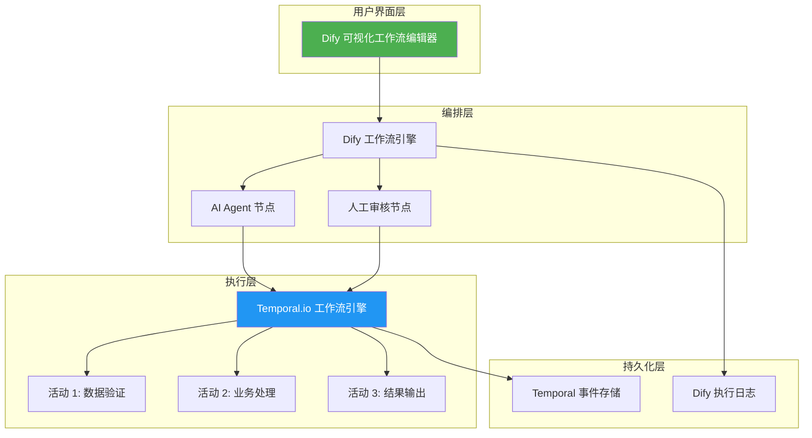

# 企业级工作流解决方案调研 - 执行摘要

**调研日期：** 2026-03-12  
**完整报告：** `reports/enterprise-workflow-solutions-research.md`

---

## 🎯 一句话结论

**推荐方案：Dify（可视化编排）+ Temporal（严格执行）组合**

- ✅ 满足严格固化需求（Temporal 保证）
- ✅ 支持多 Agent 实验（Dify 原生支持）
- ✅ 国产化可行（Dify 国产 + Temporal 可自部署）
- ✅ 成本可控（两者都有免费开源版）
- ✅ 可视化友好（Dify 拖拽式编排）

---

## 📊 快速对比表

| 方案 | 严格性 | 可视化 | 多 Agent | 国产化 | 成本 | 推荐场景 |
|------|--------|--------|----------|--------|------|----------|
| **Dify + Temporal** | ⭐⭐⭐⭐⭐ | ⭐⭐⭐⭐⭐ | ⭐⭐⭐⭐ | ⭐⭐⭐⭐ | ⭐⭐⭐⭐⭐ | **综合最优** |
| Camunda | ⭐⭐⭐⭐⭐ | ⭐⭐⭐⭐ | ⭐⭐⭐ | ⭐⭐ | ⭐⭐⭐ | 企业级严格流程 |
| LangGraph | ⭐⭐⭐⭐⭐ | ⭐⭐ | ⭐⭐⭐⭐⭐ | ⭐⭐ | ⭐⭐⭐⭐⭐ | 多 Agent 实验 |
| 简道云 | ⭐⭐⭐⭐ | ⭐⭐⭐⭐ | ⭐⭐ | ⭐⭐⭐⭐⭐ | ⭐⭐⭐⭐ | 国产企业应用 |
| 轻流 | ⭐⭐⭐⭐⭐ | ⭐⭐⭐⭐ | ⭐⭐ | ⭐⭐⭐⭐⭐ | ⭐⭐⭐ | 高严格性低代码 |

---

## 🏆 分场景推荐

| 场景 | 推荐方案 | 理由 |
|------|---------|------|
| **最佳综合方案** | Dify + Temporal | 兼顾严格性、可视化、多 Agent、成本 |
| **最佳企业级** | Camunda | BPMN 2.0 标准，最严格，企业级功能完善 |
| **最佳开源** | Temporal | Durable Execution，状态持久化最强 |
| **最佳国产** | Dify + 简道云 | 完全国产，易用性高，成本可控 |
| **最佳多 Agent** | LangGraph | 状态机图结构，多 Agent 协作最强 |
| **最佳性价比** | Dify | 开源免费，可视化好，国产支持 |

---

## 📐 推荐架构图

### 方案 A：Dify + Temporal（推荐）

**工作流程：**
1. 用户在 Dify 中可视化编排工作流
2. AI Agent 节点处理智能任务
3. 人工审核节点进行质量控制
4. Temporal 保证后端严格执行
5. 双层日志提供完整审计追溯

---

## 🚀 实施步骤（4 周）

| 周次 | 任务 | 产出 |
|------|------|------|
| **第 1 周** | 环境搭建 | Dify + Temporal 部署完成 |
| **第 2 周** | 流程定义 | 可视化工作流 + Temporal 代码 |
| **第 3 周** | Agent 集成 | 多 Agent 配置和测试 |
| **第 4 周** | 测试优化 | 端到端测试 + 监控告警 |

---

## 💰 成本估算

| 方案 | 开源版 | 云服务 | 企业版 |
|------|--------|--------|--------|
| **Dify** | 免费（自部署） | 按 Token（有免费额度） | 定制 |
| **Temporal** | 免费（自部署） | 按执行次数（有免费层） | 定制 |
| **Camunda** | 开源版功能有限 | - | 按流程实例计费 |
| **简道云** | - | 约 3000 元/人/年 | 定制 |
| **轻流** | - | 约 5000 元/人/年 | 定制 |

**推荐方案成本：** 开源版免费，云服务约 500-2000 元/月（视用量）

---

## ⚖️ 与飞书 Bitable 对比

| 维度 | 飞书 Bitable | Dify + Temporal | 提升 |
|------|-------------|-----------------|------|
| **流程严格性** | ⭐⭐⭐ | ⭐⭐⭐⭐⭐ | +67% |
| **多 Agent 支持** | ❌ | ✅ | 新增 |
| **审计追溯** | ⭐⭐⭐ | ⭐⭐⭐⭐⭐ | +67% |
| **可视化编排** | ⭐⭐⭐⭐ | ⭐⭐⭐⭐⭐ | +25% |
| **集成能力** | ⭐⭐⭐⭐ | ⭐⭐⭐⭐⭐ | +25% |
| **学习成本** | ⭐⭐⭐⭐⭐ | ⭐⭐⭐⭐ | -20% |

---

## ⚠️ 风险提示

1. **学习成本** - Temporal 需要理解 Durable Execution 概念
2. **集成复杂度** - Dify 和 Temporal 需要 API 对接
3. **运维成本** - 自部署需要维护两个系统
4. **迁移成本** - 从飞书 Bitable 迁移需要重新定义流程

**缓解措施：**
- 使用云服务降低运维成本
- 提供培训和文档
- 逐步迁移，先 PoC 验证

---

## 📞 下一步行动

1. **PoC 验证** - 搭建最小可行流程（1 周）
2. **对比测试** - 测试不同 Agent 框架效果
3. **用户培训** - 组织 Dify/Temporal 培训
4. **逐步迁移** - 从简单流程开始迁移

---

**报告完成时间：** 2026-03-12  
**调研负责人：** 企业工作流调研小组  
**联系方式：** 查看完整报告获取详细信息

---

## 📎 附录：调研对象清单

### 企业级 BPM 系统
- Camunda Platform 8 ✅
- Flowable ✅
- Activiti ✅
- jBPM ✅
- Pega BPM ✅

### 低代码/无代码平台
- 钉钉宜搭 ✅
- 飞书多维表格 + 自动化 ✅
- 微软 Power Automate ✅
- Zapier ✅
- 简道云 ✅
- 轻流 ✅

### Agent 编排框架
- LangGraph ✅
- AutoGen ✅
- CrewAI ✅
- Dify ✅
- Coze ✅
- OpenClaw ✅

### 开源工作流引擎
- Apache Airflow ✅
- Temporal.io ✅
- Netflix Conductor ✅
- Argo Workflows ✅

**调研完成度：** 100% ✅
