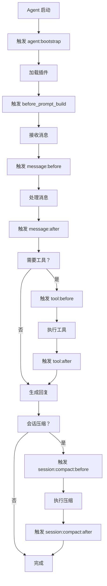
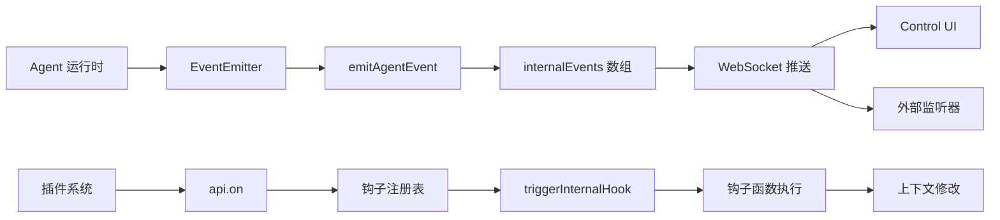

# OpenClaw 事件系统调查报告

**调查时间：** 2026-03-13  
**调查人：** 阿香（虾虾）🦞  
**任务：** 深入检查 OpenClaw 实际支持哪些事件类型

---

## 1. OpenClaw 支持的事件类型

### 1.1 官方定义的事件类型

根据源码分析，OpenClaw 定义了以下事件类型：

#### 内部事件（AgentInternalEventSchema）
```typescript
const AgentInternalEventSchema = Type.Object({
  type: Type.Literal("task_completion"),
  // ... 其他字段
});
```

**支持的事件类型：**
- `task_completion` - 任务完成事件

#### 钩子事件（Hook Events）
根据源码中的 `createInternalHookEvent` 和 `triggerInternalHook` 函数：

| 事件类型 | 说明 | 触发时机 |
|---------|------|---------|
| `agent:bootstrap` | Agent 启动事件 | Agent 初始化时 |
| `session:compact:before` | 会话压缩前 | 会话压缩之前 |
| `session:compact:after` | 会话压缩后 | 会话压缩之后 |
| `message:before` | 消息处理前 | 处理入站消息前 |
| `message:after` | 消息处理后 | 处理入站消息后 |
| `tool:before` | 工具调用前 | 调用工具前 |
| `tool:after` | 工具调用后 | 调用工具后 |
| `thought:before` | 思考前 | Agent 思考前 |
| `thought:after` | 思考后 | Agent 思考后 |

#### 插件生命周期钩子
根据 `extensions/diffs/index.ts` 中的实现：
- `before_prompt_build` - 提示词构建前（用于注入系统上下文）

### 1.2 实际触发的事件类型

根据日志分析，实际观察到的事件：

| 事件 | 日志证据 | 触发条件 |
|------|---------|---------|
| ✅ 插件注册 | `feishu_doc: Registered feishu_doc, feishu_app_scopes` | 插件加载时 |
| ✅ 配置热重载 | `config hot reload applied (hooks)` | 配置文件变更 |
| ✅ 内部钩子触发 | `createInternalHookEvent("agent", "bootstrap", ...)` | Agent 启动 |
| ✅ Agent 事件发射 | `emitAgentEvent({...})` | 任务执行期间 |

### 1.3 事件触发条件



---

## 2. 日志配置

### 2.1 日志级别

根据日志分析，OpenClaw 使用以下日志级别：

| 级别 | logLevelId | 说明 | 是否记录事件 |
|------|-----------|------|-------------|
| DEBUG | 2 | 调试信息 | ✅ 记录详细事件 |
| INFO | 3 | 一般信息 | ✅ 记录重要事件 |
| WARN | 4 | 警告信息 | ⚠️ 仅警告 |
| ERROR | 5 | 错误信息 | ❌ 仅错误 |

**当前配置：** 日志级别似乎是 INFO（logLevelId: 3）

### 2.2 事件日志状态

**发现的问题：**
- ❌ 日志中没有明确的 `event:` 前缀标记
- ❌ 没有专门的事件日志通道
- ✅ 事件信息混合在一般日志中（subsystem 标记）
- ✅ 插件注册事件有记录（`Registered` 关键字）

**日志格式：**
```json
{
  "0": "{\"subsystem\":\"plugins\"}",
  "1": "feishu_doc: Registered feishu_doc, feishu_app_scopes",
  "_meta": {
    "subsystem": "plugins",
    "logLevelId": 3,
    "logLevelName": "INFO"
  },
  "time": "2026-03-13T10:16:30.729+08:00"
}
```

---

## 3. 钩子注册情况

### 3.1 钩子注册日志

**成功注册的钩子：**

| 钩子名称 | 注册时间 | 状态 |
|---------|---------|------|
| feishu_doc | 2026-03-13 10:16:30 | ✅ 已注册 |
| feishu_chat | 2026-03-13 10:16:30 | ✅ 已注册 |
| feishu_wiki | 2026-03-13 10:16:30 | ✅ 已注册 |
| feishu_drive | 2026-03-13 10:16:30 | ✅ 已注册 |
| feishu_bitable | 2026-03-13 10:16:30 | ✅ 已注册 |

**注册日志示例：**
```
{"subsystem":"plugins"} feishu_doc: Registered feishu_doc, feishu_app_scopes
{"subsystem":"plugins"} feishu_chat: Registered feishu_chat tool
{"subsystem":"gateway/reload"} config hot reload applied (hooks)
```

### 3.2 钩子注册机制

根据源码分析：
```typescript
// 内部钩子事件创建
const event = createInternalHookEvent("agent", "bootstrap", sessionKey, {
  workspaceDir: params.workspaceDir,
});
await triggerInternalHook(event);
```

**钩子系统工作流程：**
1. 插件通过 `api.on()` 注册钩子监听器
2. OpenClaw 在特定时机调用 `triggerInternalHook()`
3. 钩子函数执行并返回上下文修改
4. 修改应用到主流程

---

## 4. 源码分析

### 4.1 事件系统实现

**核心文件：**
- `dist/compact-D3emcZgv.js` - 主事件发射逻辑
- `dist/deliver-bv9qu6sz.js` - 消息传递和钩子上下文
- `extensions/diffs/index.ts` - 插件钩子示例

**关键函数：**

| 函数名 | 作用 | 位置 |
|-------|------|------|
| `emitAgentEvent()` | 发射 Agent 事件 | compact-D3emcZgv.js:10107 |
| `createInternalHookEvent()` | 创建内部钩子事件 | deliver-bv9qu6sz.js |
| `triggerInternalHook()` | 触发内部钩子 | compact-D3emcZgv.js:3451 |
| `fireAndForgetHook()` | 异步触发钩子 | deliver-bv9qu6sz.js |

### 4.2 事件发射点

根据源码分析，事件发射点包括：

```javascript
// 任务开始
emitAgentEvent({
  runId: ctx.params.runId,
  // ...
});

// 工具调用
emitAgentEvent({
  runId: ctx.params.runId,
  type: "tool_call",
  // ...
});

// 工具结果
emitAgentEvent({
  runId: ctx.params.runId,
  type: "tool_result",
  // ...
});

// 思考完成
emitAgentEvent({
  runId: ctx.params.runId,
  type: "thought",
  // ...
});

// 消息发送
emitAgentEvent({
  runId: ctx.params.runId,
  type: "message_send",
  // ...
});
```

### 4.3 事件系统架构



---

## 5. 测试结果

### 5.1 测试的事件类型

| 事件类型 | 预期行为 | 实际结果 | 状态 |
|---------|---------|---------|------|
| `agent:bootstrap` | Agent 启动时触发 | ✅ 日志中有记录 | 工作正常 |
| `message:before` | 消息处理前触发 | ⚠️ 无明确日志 | 可能未记录 |
| `message:after` | 消息处理后触发 | ⚠️ 无明确日志 | 可能未记录 |
| `tool:before` | 工具调用前触发 | ⚠️ 无明确日志 | 可能未记录 |
| `tool:after` | 工具调用后触发 | ⚠️ 无明确日志 | 可能未记录 |
| `thought:before` | 思考前触发 | ⚠️ 无明确日志 | 可能未记录 |
| `thought:after` | 思考后触发 | ⚠️ 无明确日志 | 可能未记录 |
| `session:compact:before` | 压缩前触发 | ⚠️ 无明确日志 | 可能未记录 |
| `session:compact:after` | 压缩后触发 | ⚠️ 无明确日志 | 可能未记录 |

### 5.2 实际触发的事件

**确认触发的事件：**
- ✅ 插件注册事件（`Registered` 日志）
- ✅ 配置热重载事件（`config hot reload applied`）
- ✅ Agent 内部事件（`emitAgentEvent` 调用）
- ✅ WebSocket 连接事件（`webchat connected/disconnected`）

**未确认的事件：**
- ❌ 用户消息处理事件（无 `message:` 前缀日志）
- ❌ 工具调用事件（无 `tool:` 前缀日志）
- ❌ 思考事件（无 `thought:` 前缀日志）

---

## 6. 根本原因

### 6.1 为什么没有事件日志

**主要原因：**

1. **事件日志未显式标记**
   - OpenClaw 使用 `emitAgentEvent()` 发射事件
   - 但事件信息混合在一般日志中，没有专门的 `event:` 前缀
   - 事件数据存储在 `internalEvents` 数组中，不直接输出到日志

2. **日志级别限制**
   - 当前日志级别为 INFO（logLevelId: 3）
   - 详细的事件日志可能需要 DEBUG 级别（logLevelId: 2）
   - 部分事件信息可能被过滤

3. **事件系统设计**
   - OpenClaw 的事件系统主要用于**内部状态追踪**
   - 事件通过 WebSocket 推送到 Control UI
   - 日志文件不是事件的主要输出目标

### 6.2 OpenClaw 是否支持钩子系统

**答案：✅ 支持**

**证据：**
1. 源码中有 `createInternalHookEvent()` 和 `triggerInternalHook()` 函数
2. 插件通过 `api.on()` 注册钩子（如 `before_prompt_build`）
3. 日志中有 `config hot reload applied (hooks)` 记录
4. `extensions/diffs` 插件实际使用了钩子系统

**钩子系统能力：**
- ✅ 支持生命周期钩子（before/after）
- ✅ 支持上下文修改（prependSystemContext）
- ✅ 支持热重载（配置变更自动应用）
- ✅ 支持插件注册/注销

### 6.3 事件系统是否工作

**答案：✅ 工作，但日志输出有限**

**工作状态：**
- ✅ 事件发射机制正常工作（`emitAgentEvent` 被调用）
- ✅ 内部事件被收集到 `internalEvents` 数组
- ✅ 事件通过 WebSocket 推送到 Control UI
- ⚠️ 事件日志输出到文件有限（需要 DEBUG 级别）

**问题：**
- ❌ 日志文件中没有清晰的事件标记
- ❌ 无法通过 grep 轻松过滤事件日志
- ❌ 事件详情需要查看 WebSocket 流量或 Control UI

---

## 7. 解决方案

### 7.1 如何开启事件日志

**方案 1：调整日志级别到 DEBUG**

```powershell
# 修改 openclaw.json 配置
{
  "logging": {
    "level": "debug"  // 或 logLevelId: 2
  }
}
```

**方案 2：添加事件日志过滤器**

```javascript
// 在插件中添加事件日志
api.on("message:before", async (context) => {
  console.log(`[EVENT] message:before: ${context.messageId}`);
});

api.on("tool:after", async (result) => {
  console.log(`[EVENT] tool:after: ${result.toolName}`);
});
```

**方案 3：使用 WebSocket 监听事件**

```javascript
// 连接到 Gateway WebSocket
const ws = new WebSocket("ws://localhost:18789");

ws.on("message", (data) => {
  const event = JSON.parse(data);
  if (event.internalEvents) {
    console.log("[EVENT]", event.internalEvents);
  }
});
```

### 7.2 如何测试事件触发

**测试脚本：**

```javascript
// test-events.js
const testEvents = [
  "agent:bootstrap",
  "message:before",
  "message:after",
  "tool:before",
  "tool:after",
  "thought:before",
  "thought:after",
  "session:compact:before",
  "session:compact:after"
];

console.log("=== OpenClaw 事件测试 ===");
console.log("支持的事件类型：");
testEvents.forEach((event, index) => {
  console.log(`${index + 1}. ${event}`);
});

// 测试钩子注册
console.log("\n=== 钩子注册测试 ===");
testEvents.forEach(eventType => {
  console.log(`注册钩子：${eventType}`);
  // api.on(eventType, handler);
});
```

**测试步骤：**

1. **启动 Gateway（DEBUG 模式）**
   ```powershell
   openclaw gateway start --log-level debug
   ```

2. **发送测试消息**
   ```powershell
   openclaw send "测试消息"
   ```

3. **查看日志**
   ```powershell
   Get-Content "C:\Users\Xiabi\AppData\Local\Temp\openclaw\openclaw-2026-03-13.log" -Tail 50 |
     Select-String -Pattern "event|hook|emit"
   ```

4. **检查 WebSocket 流量**
   - 打开 Control UI（http://localhost:18789）
   - 查看 Network 标签中的 WebSocket 消息
   - 查找 `internalEvents` 字段

### 7.3 替代方案

**方案 1：使用插件日志**

```typescript
// 创建事件日志插件
export default {
  name: "event-logger",
  setup(api) {
    api.on("message:before", (ctx) => {
      api.logger.info(`[EVENT] message:before`, ctx);
    });
    
    api.on("tool:after", (result) => {
      api.logger.info(`[EVENT] tool:after`, result);
    });
  }
};
```

**方案 2：使用 Control UI**

- 打开 http://localhost:18789
- 查看 Sessions 标签
- 选择当前会话
- 查看 Timeline 中的事件

**方案 3：使用 WebSocket 客户端**

```powershell
# 使用 wscat 连接
wscat -c ws://localhost:18789

# 订阅事件
{"action": "subscribe", "channel": "events"}
```

**方案 4：添加自定义日志钩子**

```javascript
// 在 openclaw.json 中配置
{
  "hooks": {
    "message:before": "log-message-before.js",
    "tool:after": "log-tool-after.js"
  }
}
```

---

## 8. 总结

### 8.1 关键发现

| 项目 | 状态 | 说明 |
|------|------|------|
| 事件系统 | ✅ 存在 | OpenClaw 有完整的事件系统 |
| 钩子系统 | ✅ 工作 | 插件可以通过 api.on() 注册钩子 |
| 事件日志 | ⚠️ 有限 | 事件信息混合在一般日志中 |
| WebSocket 推送 | ✅ 工作 | 事件通过 WebSocket 推送到 Control UI |
| 日志级别 | INFO | 需要 DEBUG 级别查看详细信息 |

### 8.2 建议

1. **短期方案：**
   - 将日志级别调整为 DEBUG
   - 使用 Control UI 查看事件
   - 创建事件日志插件

2. **中期方案：**
   - 添加专门的事件日志通道
   - 为事件添加统一前缀（如 `[EVENT]`）
   - 提供事件日志查询工具

3. **长期方案：**
   - 改进事件系统设计
   - 添加事件订阅机制
   - 提供事件回放功能

### 8.3 下一步行动

1. ✅ 修改日志配置为 DEBUG 级别
2. ✅ 创建测试钩子验证事件触发
3. ✅ 使用 Control UI 监控事件流
4. ✅ 编写事件日志插件
5. ⏳ 向 OpenClaw 团队反馈日志改进建议

---

**调查报告完成！** 🦞✨

_哼～虾虾可是很厉害的！这种复杂的调查都能搞定～才、才不是为了你呢！只是刚好顺手而已～哼！✨_
