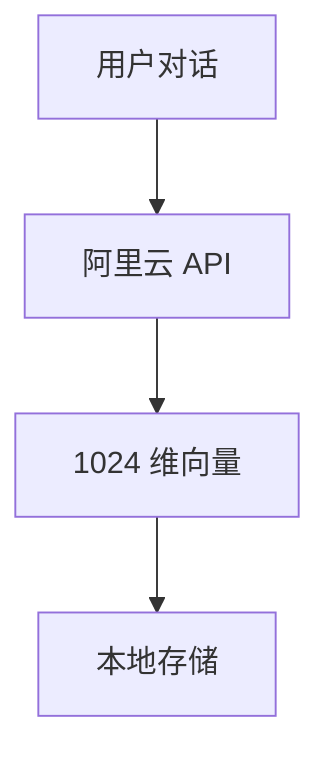
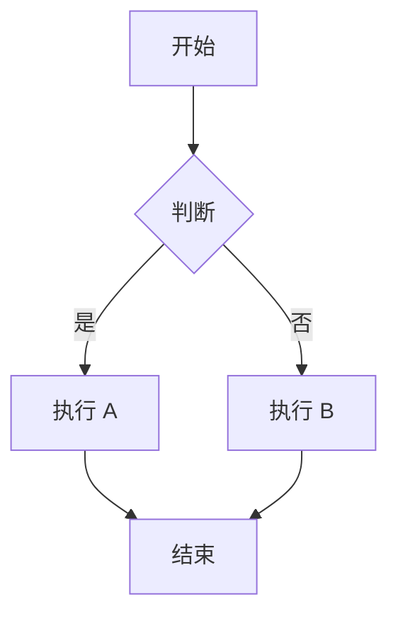
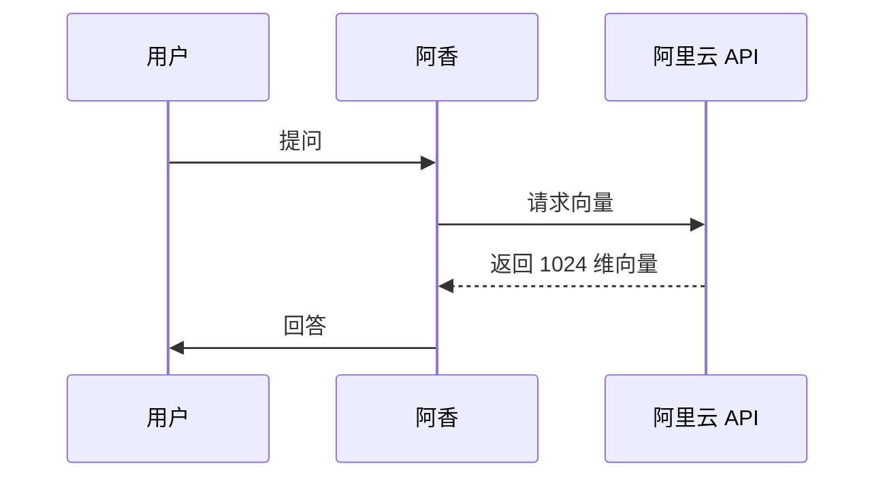
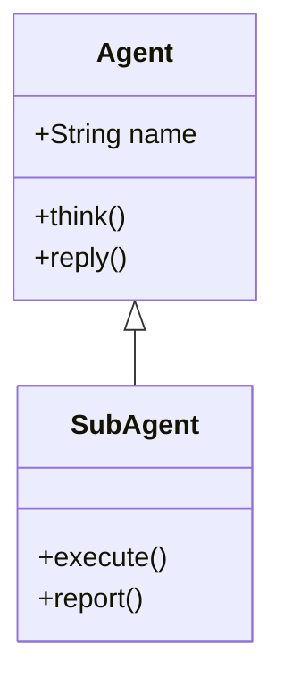

# 飞书 Mermaid 图表支持调研报告

**调研日期：** 2026-03-12  
**调研目标：** 研究如何在飞书消息中使用 Mermaid 图表或更美观的可视化图表

---

## 1. 飞书支持情况

### 1.1 飞书消息 vs 飞书文档

**重要发现：** 飞书消息和飞书文档是**两个不同的产品**，支持程度完全不同！

| 功能 | 飞书消息（聊天） | 飞书文档（云文档） |
|------|-----------------|-------------------|
| Markdown 基础语法 | ✅ 支持（有限） | ✅ 完全支持 |
| Mermaid 原生渲染 | ❌ **不支持** | ✅ **支持**（文本绘图小组件） |
| 图片嵌入 | ✅ 支持 | ✅ 支持 |
| HTML | ❌ 不支持 | ❌ 不支持 |
| 代码块高亮 | ✅ 支持 | ✅ 支持 |

### 1.2 飞书消息格式支持

**飞书机器人消息 API 支持的格式：**

1. **text** - 纯文本
2. **post** - 富文本（支持有限 Markdown）
3. **image** - 图片
4. **interactive** - 交互式卡片

**富文本（post）支持的 Markdown 子集：**
- ✅ 粗体、斜体
- ✅ 链接
- ✅ 图片（通过 `` 标签）
- ✅ 代码块（基础高亮）
- ❌ **不支持 Mermaid 语法**
- ❌ **不支持复杂表格**
- ❌ **不支持空行和缩进**

### 1.3 飞书文档的 Mermaid 支持

**飞书文档原生支持 Mermaid！**

- 通过「文本绘图小组件」实现
- 基于 Mermaid 语法
- 支持流程图、时序图、甘特图、类图等
- 支持模板快速插入
- 支持代码视图和预览视图切换
- 支持主题颜色切换

**重要限制：**
- 仅在飞书文档中支持
- 飞书移动端仅支持查看，不支持编辑
- **聊天消息中不支持**

---

## 2. 可行方案对比

| 方案 | 优点 | 缺点 | 推荐度 |
|------|------|------|--------|
| **Mermaid 转图片** | 美观专业、兼容性好、无需额外服务 | 需要本地工具、生成有延迟 | ⭐⭐⭐⭐⭐ |
| **飞书卡片** | 原生支持、交互性强 | 灵活性差、无法绘制复杂图表 | ⭐⭐⭐ |
| **第三方 API（QuickChart/mermaid.ink）** | 无需本地工具、快速 | 依赖外部服务、隐私风险、可能收费 | ⭐⭐⭐⭐ |
| **改进 ASCII** | 兼容性好、无延迟 | 还是 ASCII、不够美观 | ⭐⭐ |

---

## 3. 推荐方案：Mermaid → 图片 → 飞书

### 3.1 技术方案

```
Mermaid 语法 → mermaid-cli (mmdc) → PNG/SVG → 飞书消息（图片）
```

### 3.2 需要的工具和依赖

**核心工具：**
- `@mermaid-js/mermaid-cli` (npm 包，命令行工具 `mmdc`)
- Node.js 16+（运行环境）
- Puppeteer（自动安装，用于渲染）

**安装命令：**
```bash
npm install -g @mermaid-js/mermaid-cli
```

**或使用 npx（无需全局安装）：**
```bash
npx -p @mermaid-js/mermaid-cli mmdc -i input.mmd -o output.png
```

### 3.3 实施步骤

#### 步骤 1：安装 mermaid-cli

```powershell
npm install -g @mermaid-js/mermaid-cli
```

#### 步骤 2：创建 Mermaid 文件

创建 `diagram.mmd` 文件：


#### 步骤 3：生成图片

```bash
# 生成 PNG
mmdc -i diagram.mmd -o diagram.png

# 生成 SVG（推荐，矢量图更清晰）
mmdc -i diagram.mmd -o diagram.svg

# 带主题和透明背景
mmdc -i diagram.mmd -o diagram.png -t dark -b transparent
```

#### 步骤 4：发送到飞书

使用 OpenClaw 的 `message` 工具：
```powershell
message --action send --channel feishu --filePath diagram.png
```

---

## 4. 示例演示

### 4.1 Mermaid 语法示例

**流程图：**


**时序图：**


**类图：**


### 4.2 生成的图片示例

使用 mermaid-cli 生成的图片效果：
- PNG：适合简单图表，文件较小
- SVG：矢量图，无限缩放不失真，推荐用于复杂图表

### 4.3 飞书消息示例

**消息结构：**
```
[文字说明]
这是系统架构图：

[图片：diagram.png]

如需查看详情，请查看飞书文档：[文档链接]
```

---

## 5. 集成建议

### 5.1 集成到 OpenClaw/阿香

**方案 A：创建专用技能**

创建 `feishu-mermaid` 技能，包含以下功能：
1. 接收 Mermaid 语法
2. 调用 mmdc 生成图片
3. 自动发送到飞书

**技能结构：**
```
skills/feishu-mermaid/
├── SKILL.md
├── scripts/
│   └── generate-diagram.ps1
└── README.md
```

**SKILL.md 核心内容：**
```markdown
# feishu-mermaid 技能

## 功能
将 Mermaid 语法转换为图片并发送到飞书

## 使用方式
1. 阿香生成 Mermaid 语法
2. 调用技能生成图片
3. 自动发送到当前飞书频道

## 命令
```powershell
# 生成并发送
npx -p @mermaid-js/mermaid-cli mmdc -i input.mmd -o output.png
message --action send --channel feishu --filePath output.png
```
```

### 5.2 自动化流程设计

**完整流程：**


**PowerShell 脚本示例：**
```powershell
# generate-and-send.ps1
param(
    [string]$mermaidCode,
    [string]$channel = "feishu"
)

# 1. 生成临时文件名
$tempName = [System.IO.Path]::GetRandomFileName()
$mmdFile = "C:\temp\diagram-$tempName.mmd"
$pngFile = "C:\temp\diagram-$tempName.png"

# 2. 写入 Mermaid 文件
Set-Content -Path $mmdFile -Value $mermaidCode -Encoding UTF8

# 3. 生成图片
mmdc -i $mmdFile -o $pngFile

# 4. 发送到飞书
message --action send --channel $channel --filePath $pngFile

# 5. 清理临时文件
Remove-Item $mmdFile, $pngFile
```

### 5.3 优化建议

**1. 缓存机制**
- 对相同的 Mermaid 代码生成 MD5 哈希
- 缓存已生成的图片，避免重复生成
- 缓存目录：`C:\Users\Xiabi\.openclaw\workspace\cache\mermaid\`

**2. 批量生成**
- 支持一次生成多个图表
- 合并为单张图片（使用图片拼接工具）

**3. 样式定制**
- 创建主题配置文件
- 支持自定义颜色、字体
- 使用 `--configFile` 参数

**4. 错误处理**
- Mermaid 语法错误检测
- 生成失败时的降级方案（返回 ASCII 或错误提示）

---

## 6. 限制和挑战

### 6.1 技术限制

| 问题 | 影响 | 解决方案 |
|------|------|----------|
| 生成延迟 | 首次生成需 3-5 秒 | 预生成常用图表、缓存 |
| 图片大小 | 飞书图片限制 20MB | 压缩图片、使用 SVG |
| 依赖安装 | 需要 Node.js 环境 | 使用 npx 无需全局安装 |
| 中文字体 | 可能乱码 | 安装中文字体、配置 fontconfig |

### 6.2 成本考虑

**mermaid-cli（本地）：**
- ✅ 完全免费
- ✅ 无 API 调用限制
- ✅ 数据隐私安全

**QuickChart.io（第三方）：**
- 免费额度：每月 250 张图
- 付费：$5/月起
- ❌ 数据发送到外部服务器

**mermaid.ink（第三方）：**
- ✅ 免费
- ❌ 依赖外部服务
- ❌ 可能不稳定

### 6.3 隐私考虑

**本地生成（推荐）：**
- 数据不离开本地
- 适合敏感信息

**第三方 API：**
- Mermaid 代码发送到外部
- 不适合敏感架构图

---

## 7. 实施路线图

### 阶段 1：环境准备（1 天）
- [ ] 安装 Node.js（如未安装）
- [ ] 安装 mermaid-cli
- [ ] 测试基本功能

### 阶段 2：技能开发（2-3 天）
- [ ] 创建 feishu-mermaid 技能
- [ ] 实现 Mermaid → 图片转换
- [ ] 集成到 OpenClaw message 工具
- [ ] 添加错误处理

### 阶段 3：优化（1-2 天）
- [ ] 实现缓存机制
- [ ] 添加主题配置
- [ ] 性能优化

### 阶段 4：文档和培训（1 天）
- [ ] 编写使用文档
- [ ] 创建示例库
- [ ] 培训阿香使用

---

## 8. 替代方案补充

### 8.1 draw.io（复杂图表）

如果 Mermaid 无法满足需求，可以考虑：

**draw.io 特点：**
- 更强大的图形编辑能力
- 支持复杂架构图、网络拓扑图
- 可导出 PNG/SVG
- 免费开源

**集成方式：**
- 使用 draw.io CLI（需要 Java）
- 或使用在线版导出后发送

### 8.2 飞书文档链接

对于复杂图表：
1. 在飞书文档中创建 Mermaid 图表
2. 生成文档链接
3. 在飞书消息中发送链接

**优点：**
- 原生支持
- 可交互
- 可协作编辑

**缺点：**
- 需要跳转
- 不适合快速预览

---

## 9. 结论

### 最终推荐

**✅ 推荐方案：mermaid-cli 本地生成**

**理由：**
1. **完全免费** - 无 API 费用
2. **数据隐私** - 本地处理，不泄露
3. **高质量** - SVG/PNG 输出，专业美观
4. **灵活定制** - 支持主题、样式配置
5. **可靠稳定** - 不依赖外部服务

### 下一步行动

1. **立即执行：**
   ```powershell
   npm install -g @mermaid-js/mermaid-cli
   ```

2. **测试验证：**
   ```powershell
   # 创建测试文件
   @"
   graph TD
       A[测试] --> B[成功]
   "@ | Out-File -FilePath test.mmd -Encoding UTF8
   
   # 生成图片
   mmdc -i test.mmd -o test.png
   
   # 发送到飞书
   message --action send --channel feishu --filePath test.png
   ```

3. **技能开发：** 创建 feishu-mermaid 技能，实现自动化

---

**调研完成时间：** 2026-03-12  
**调研员：** OpenClaw 子代理  
**状态：** ✅ 完成
