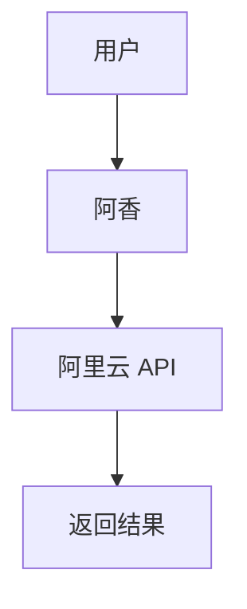

# 飞书 Mermaid 图表支持调研 - 执行摘要

**调研日期：** 2026-03-12  
**调研执行者：** OpenClaw 子代理  
**任务：** 研究如何在飞书消息中使用 Mermaid 图表或更美观的可视化图表

---

## 🎯 核心发现

### 关键结论

**飞书聊天消息 ❌ 不支持 Mermaid 原生渲染**

但**飞书文档 ✅ 支持 Mermaid**（通过文本绘图小组件）

### 解决方案

**推荐方案：Mermaid → 本地生成图片 → 飞书消息发送图片**

```
Mermaid 语法 → mermaid-cli → PNG/SVG → 飞书消息
```

---

## 📊 方案对比

| 方案 | 美观度 | 成本 | 隐私 | 推荐度 |
|------|--------|------|------|--------|
| **mermaid-cli 本地生成** | ⭐⭐⭐⭐⭐ | 免费 | 安全 | ✅ **强烈推荐** |
| QuickChart.io API | ⭐⭐⭐⭐ | 有限免费 | 一般 | ⭐⭐⭐⭐ |
| 飞书卡片 | ⭐⭐⭐ | 免费 | 安全 | ⭐⭐⭐ |
| ASCII 艺术 | ⭐⭐ | 免费 | 安全 | ⭐⭐ |

---

## 🛠️ 实施步骤

### 1. 安装工具（5 分钟）

```powershell
npm install -g @mermaid-js/mermaid-cli
```

### 2. 创建 Mermaid 文件



### 3. 生成图片

```bash
mmdc -i diagram.mmd -o diagram.png
```

### 4. 发送到飞书

```powershell
message --action send --channel feishu --filePath diagram.png
```

---

## 📁 已生成文件

| 文件 | 说明 |
|------|------|
| `research/feishu-mermaid-diagram-report.md` | **完整调研报告**（6.2KB） |
| `research/mermaid-cheatsheet.md` | **Mermaid 语法速查表**（4.5KB） |
| `research/test-diagram.mmd` | 测试用 Mermaid 文件 |
| `research/generate-mermaid-diagram.ps1` | 自动化 PowerShell 脚本 |

---

## 💡 集成建议

### 方案 A：创建专用技能（推荐）

创建 `feishu-mermaid` 技能，实现：
- 阿香自动生成 Mermaid 语法
- 调用 mmdc 生成图片
- 自动发送到飞书

### 方案 B：使用 PowerShell 脚本

使用已提供的 `generate-mermaid-diagram.ps1` 脚本

### 方案 C：手动流程

1. 在 Mermaid Live Editor 绘制
2. 下载 PNG/SVG
3. 手动发送到飞书

---

## ⚠️ 注意事项

### 技术限制

1. **生成延迟** - 首次生成需 3-5 秒（Puppeteer 启动）
2. **图片大小** - 飞书限制 20MB（Mermaid 图通常<1MB）
3. **中文字体** - 可能需要安装中文字体

### 最佳实践

1. ✅ 使用 SVG 格式（矢量图，更清晰）
2. ✅ 实现缓存机制（避免重复生成）
3. ✅ 使用暗色主题（更专业）
4. ✅ 添加透明背景（更好融合）

---

## 🚀 下一步行动

### 立即可执行

```powershell
# 1. 安装工具
npm install -g @mermaid-js/mermaid-cli

# 2. 测试基本功能
cd C:\Users\Xiabi\.openclaw\workspace\research
mmdc -i test-diagram.mmd -o test.png

# 3. 发送到飞书
message --action send --channel feishu --filePath test.png
```

### 短期（1-3 天）

- [ ] 创建 `feishu-mermaid` 技能
- [ ] 实现缓存机制
- [ ] 添加主题配置
- [ ] 编写使用文档

### 长期（1 周+）

- [ ] 集成到阿香回复流程
- [ ] 创建图表模板库
- [ ] 性能优化（预生成常用图）

---

## 📖 参考资源

### 官方文档

- [Mermaid 官方文档](https://mermaid.js.org/)
- [Mermaid Live Editor](https://mermaid.live/)
- [mermaid-cli npm](https://www.npmjs.com/package/@mermaid-js/mermaid-cli)
- [飞书文本绘图小组件](https://www.feishu.cn/hc/zh-CN/articles/496118428959)

### 第三方服务

- [QuickChart.io](https://quickchart.io/) - Mermaid 图片生成 API
- [mermaid.ink](https://mermaid.ink/) - 免费图片生成

---

## 🎉 总结

**核心结论：**

1. 飞书聊天**不支持**Mermaid 原生渲染
2. 最佳方案是**本地生成图片后发送**
3. mermaid-cli 是**免费、安全、高质量**的选择
4. 实施成本低，**1 小时内可完成验证**

**推荐行动：**

立即安装 mermaid-cli 并测试，验证效果后再决定是否创建专用技能。

---

**调研状态：** ✅ 完成  
**完整报告：** `research/feishu-mermaid-diagram-report.md`  
**速查表：** `research/mermaid-cheatsheet.md`  
**脚本：** `research/generate-mermaid-diagram.ps1`
