# Mermaid 语法速查表

## 流程图 (Flowchart)

### 基本语法

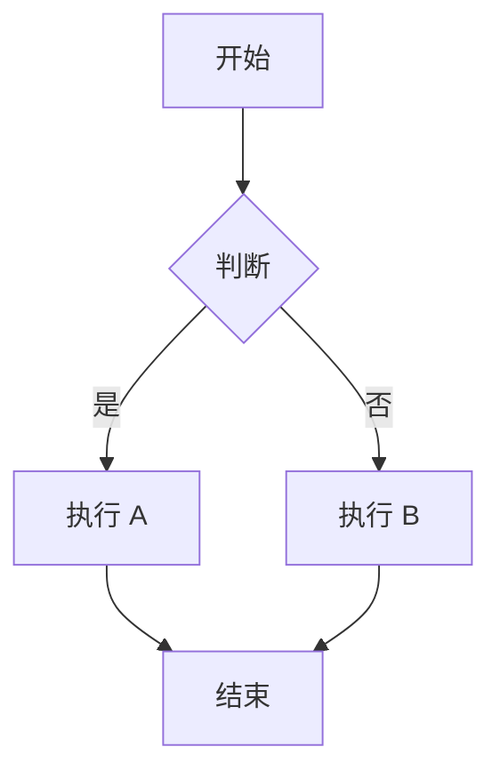

### 节点形状

| 语法 | 形状 | 示例 |
|------|------|------|
| `A[文本]` | 矩形 | `A[开始]` |
| `A(文本)` | 圆角矩形 | `A(处理)` |
| `A(文本)` | 圆形 | `A((结束))` |
| `A>文本]` | 不对称形状 | `A>处理]` |
| `A{文本}` | 菱形（判断） | `A{是否完成？}` |
| `A[[文本]]` | 圆柱体（数据库） | `A[(数据库)]` |
| `A[(文本)]` | 圆柱体 | `A[(数据库)]` |

### 连接方向

- `TD` / `TB` - 从上到下
- `LR` - 从左到右
- `BT` - 从下到上
- `RL` - 从右到左

### 连接样式

```mermaid
graph LR
    A -- 实线 --> B
    A -. 虚线 .-> B
    A ==> 粗线 => B
    A --- 无箭头 --- B
```

---

## 时序图 (Sequence Diagram)

### 基本语法

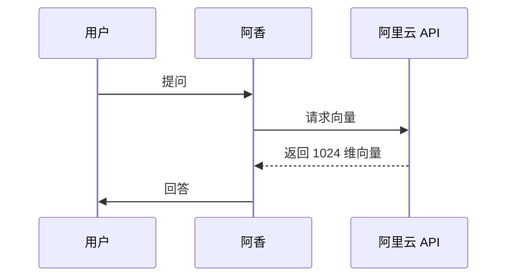

### 箭头类型

| 语法 | 含义 |
|------|------|
| `->` | 实线箭头（同步） |
| `-->` | 虚线箭头（返回） |
| `-x` | 实线叉头（丢失） |
| `-->>` | 虚线箭头（返回） |
| `->>` | 实线箭头（异步） |

### 备注

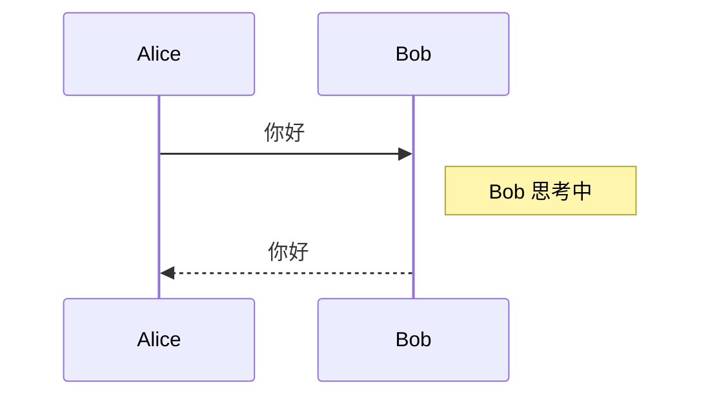

---

## 类图 (Class Diagram)

### 基本语法

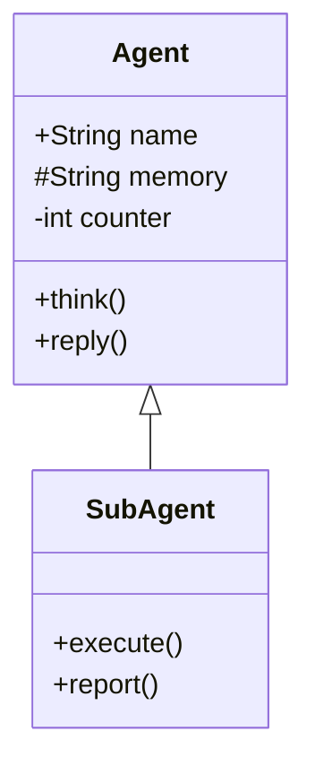

### 关系符号

| 符号 | 含义 |
|------|------|
| `<|--` | 继承 |
| `*--` | 组合 |
| `o--` | 聚合 |
| `-->` | 关联 |
| `--` | 连接 |
| `..|>` | 实现 |
| `..` | 依赖 |

### 成员可见性

- `+` 公开 (public)
- `#` 保护 (protected)
- `-` 私有 (private)

---

## 状态图 (State Diagram)

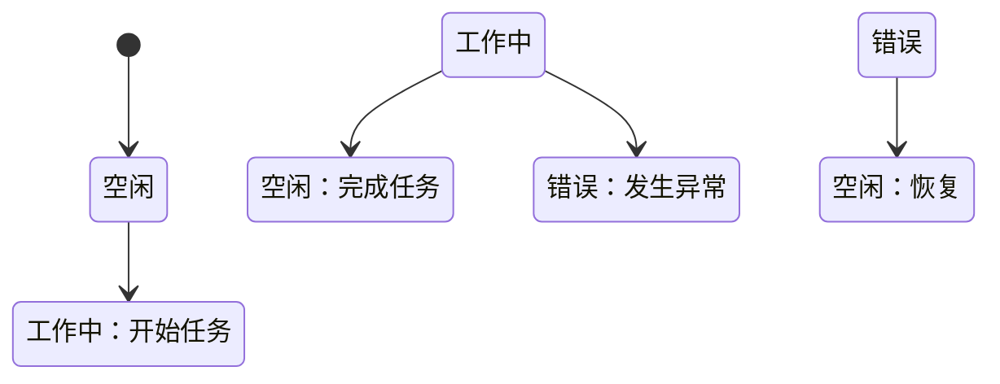

---

## 甘特图 (Gantt Chart)

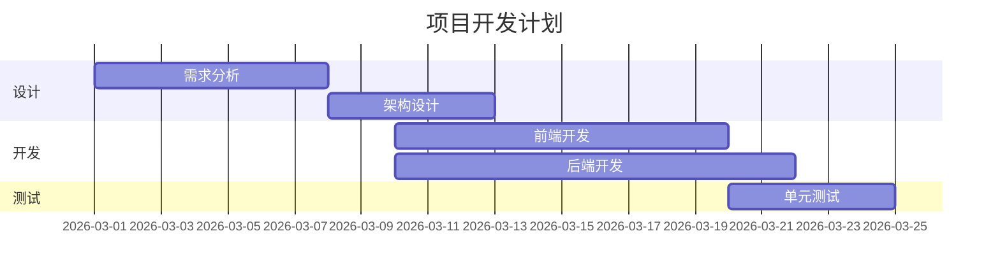

---

## 饼图 (Pie Chart)

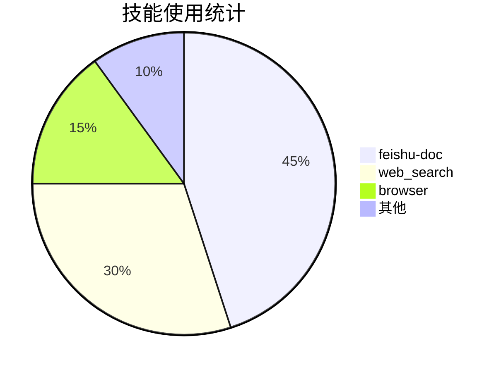

---

## 用户旅程图 (User Journey)

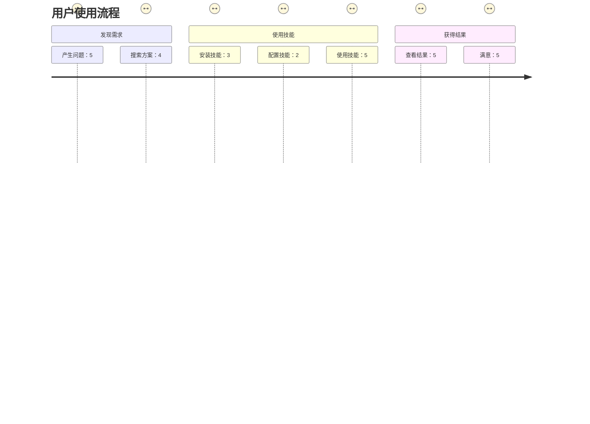

---

## 思维导图 (Mindmap)

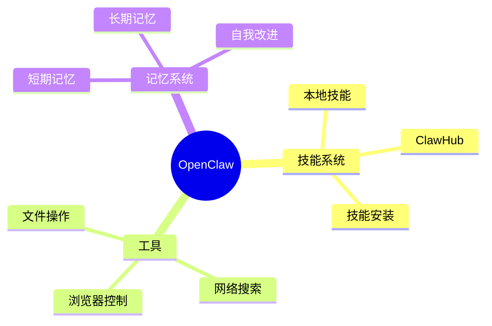

---

## 象限图 (Quadrant Chart)

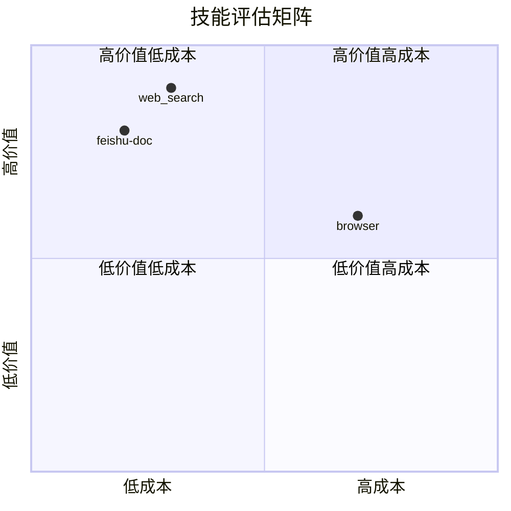

---

## 实用技巧

### 1. 使用子图

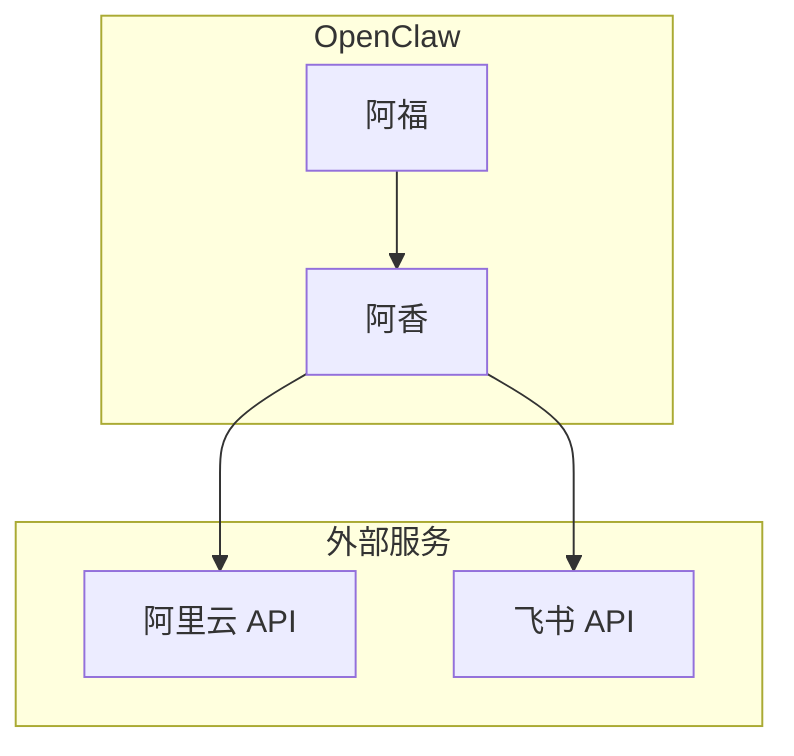

### 2. 设置样式

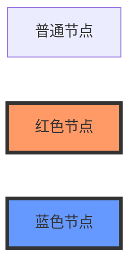

### 3. 使用图标

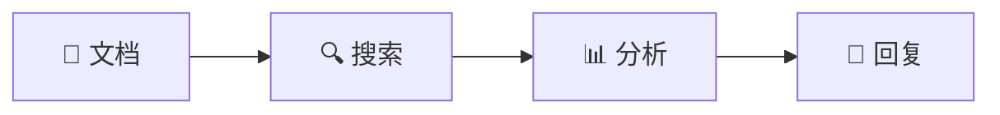

### 4. 链接到其他节点

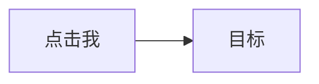

---

## 常用配置

### 主题

```javascript
%%{init: {'theme': 'dark'}}%%
graph LR
    A[暗色主题]
```

可用主题：`default`, `dark`, `forest`, `neutral`, `base`

### 方向


### 完整配置示例

```javascript
%%{
  init: {
    'theme': 'dark',
    'flowchart': {
      'curve': 'basis',
      'nodeSpacing': 50,
      'rankSpacing': 50
    }
  }
}%%
graph TD
    A[配置示例] --> B[美观的图表]
```

---

## 快速参考

### 最常用节点

```
A[矩形] - 普通步骤
B{菱形} - 判断/决策
C[(圆柱)] - 数据库
D((圆形)) - 开始/结束
```

### 最常用连接

```
--> 实线箭头（主要流程）
-.-> 虚线箭头（可选/异步）
--- 无箭头连线（关联）
```

### 最佳实践

1. **保持简洁** - 每张图不超过 15 个节点
2. **使用注释** - 复杂连接添加文字说明
3. **统一风格** - 同类节点使用相同形状
4. **测试渲染** - 先在 Mermaid Live Editor 测试

---

## 在线工具

- **Mermaid Live Editor**: https://mermaid.live/
- **Mermaid 官方文档**: https://mermaid.js.org/
- **QuickChart**: https://quickchart.io/ (API 服务)
- **mermaid.ink**: https://mermaid.ink/ (图片生成)

---

**最后更新：** 2026-03-12
