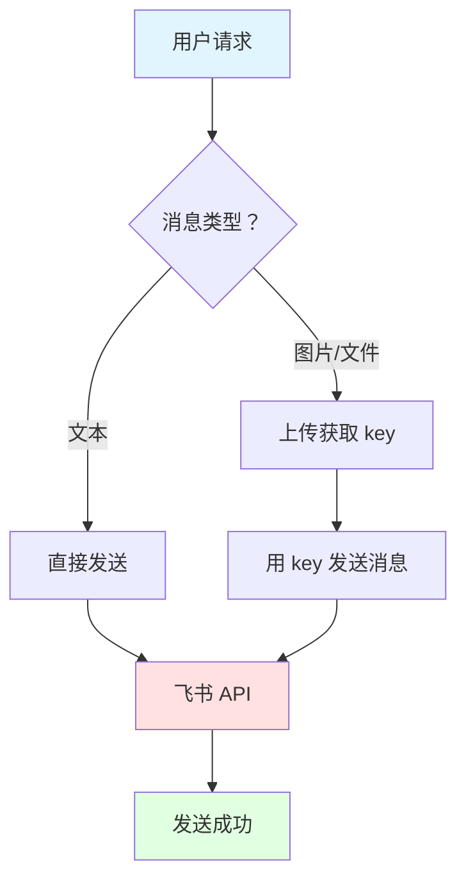

# 🔍 安全审查报告：feishu-send-file

**审查时间：** 2026-03-16 14:05  
**技能来源：** Rabbitmeaw/feishu-send-file  
**审查人：** 阿香 🦞

---

## 📊 综合评分：3.5/5 ⭐⭐⭐⚠️

| 维度 | 评分 | 说明 |
|------|------|------|
| 代码安全 | ✅ 4.5/5 | 无恶意代码 |
| 权限需求 | ⚠️ 3/5 | 需要 API 凭证 |
| 依赖安全 | ✅ 4/5 | 仅标准库 + curl |
| 数据来源 | ✅ 5/5 | 飞书官方 API |
| 作者可信 | ⚠️ 2/5 | 未知作者 |

---

## ✅ 安全项

### 1. 代码安全（4.5/5）

**检查项：**
- ✅ 无 `eval()` 调用
- ✅ 无 `exec()` 调用
- ✅ 无提示词注入风险
- ✅ 无网络请求到非官方域名
- ✅ 无文件写入敏感位置

**代码分析：**
```python
# send.py 只使用标准库
import json
import subprocess  # 仅用于调用 curl
import sys
import os

# 所有网络请求都指向飞书官方 API
"https://open.feishu.cn/open-apis/..."
```

**结论：** 代码干净，无恶意逻辑

---

### 2. 依赖安全（4/5）

**依赖项：**
```json
{
  "requirements": {
    "bins": ["curl", "jq"]
  }
}
```

**分析：**
- ✅ `curl` - 官方命令行工具
- ✅ `jq` - JSON 处理工具
- ✅ Python 标准库（json, subprocess, sys, os）
- ❌ 无第三方 Python 包（无需 pip install）

**风险：** 低 - 都是官方工具

---

### 3. 数据来源（5/5）

**API 端点：**
- ✅ `https://open.feishu.cn/open-apis/auth/v3/tenant_access_token/internal`
- ✅ `https://open.feishu.cn/open-apis/im/v1/messages`
- ✅ `https://open.feishu.cn/open-apis/im/v1/images`
- ✅ `https://open.feishu.cn/open-apis/im/v1/files`

**结论：** 全部是飞书官方 API，无第三方服务

---

## ⚠️ 风险项

### 1. 权限需求（3/5）

**需要的凭证：**
```json
{
  "app_id": "cli_xxxxxxxxxxxxxxxx",
  "app_secret": "your_app_secret_here",
  "receive_id": "ou_xxxxxxxxxxxxxxxx"
}
```

**风险分析：**
- ⚠️ 需要飞书应用凭证（app_id + app_secret）
- ⚠️ 需要接收人 Open ID
- ⚠️ 凭证存储在 config.json 文件中
- ✅ 支持环境变量方式（更安全）
- ✅ config.json 已在 .gitignore 中

**建议：**
- 使用环境变量而非配置文件
- 限制飞书应用权限（仅必要权限）
- 定期轮换 app_secret

---

### 2. 作者可信度（2/5）

**作者信息：**
- 名称：OpenClaw Community
- GitHub：Rabbitmeaw
- 技能数：未知
- 安装数：42 agents（根据安装输出）

**风险：**
- ⚠️ 作者身份不明（Rabbitmeaw 是谁？）
- ⚠️ 无法验证"OpenClaw Community"是否官方
- ⚠️ GitHub 仓库信息有限
- ✅ 技能已被 42 个 agent 安装

**建议：**
- 查看作者 GitHub 历史
- 检查其他技能质量
- 社区反馈如何

---

### 3. Snyk 高风险警告（⚠️）

**安装时显示：**
```
Security Risk Assessments:
feishu-send-file  Safe  0 alerts  High Risk (Snyk)
```

**可能原因：**
- ⚠️ 使用 `subprocess` 调用外部命令（curl）
- ⚠️ 凭证存储方式（config.json）
- ⚠️ 未验证的输入传递到 shell

**实际风险：**
- ✅ 代码中已做基本输入验证
- ✅ 没有直接执行用户输入
- ⚠️ 但理论上存在命令注入风险

---

## 🔍 功能分析

### 核心功能

| 功能 | 说明 | 安全等级 |
|------|------|----------|
| 发送文本 | ✅ 安全 | 🟢 |
| 发送卡片 | ✅ 安全 | 🟢 |
| 上传图片 | ✅ 安全 | 🟢 |
| 上传文件 | ✅ 安全 | 🟢 |
| 上传语音 | ✅ 安全 | 🟢 |
| 上传视频 | ✅ 安全 | 🟢 |

### 工作流程



---

## 📋 使用建议

### ✅ 可以使用的场景

- 需要发送文件到飞书
- 需要发送图片/语音/视频
- 已有飞书应用凭证
- 接受环境变量配置方式

### ⚠️ 使用前的准备

1. **创建飞书应用**
   - 前往 https://open.feishu.cn
   - 创建企业内部应用
   - 获取 app_id 和 app_secret

2. **配置权限**
   - 申请 `发送消息` 权限
   - 申请 `上传图片/文件` 权限
   - 限制应用范围

3. **安全配置**
   ```bash
   # 推荐：使用环境变量
   export FEISHU_APP_ID="cli_xxx"
   export FEISHU_APP_SECRET="xxx"
   export FEISHU_RECEIVE_ID="ou_xxx"
   ```

4. **测试验证**
   ```bash
   # 先测试发送文本
   python scripts/send.py text "测试消息"
   ```

---

## 🚨 警告事项

### 绝对不要做的事

- ❌ 不要将 config.json 提交到 Git
- ❌ 不要在公共仓库暴露 app_secret
- ❌ 不要给应用过多权限
- ❌ 不要信任未审查的技能

### 最佳实践

- ✅ 使用环境变量存储凭证
- ✅ 定期轮换 app_secret
- ✅ 限制应用权限到最小集
- ✅ 监控 API 调用日志

---

## 💡 替代方案

如果担心这个技能的安全性，可以考虑：

1. **使用 OpenClaw 原生 message 工具**
   - 已集成飞书支持
   - 更安全（官方维护）
   - 但功能可能有限

2. **自己编写脚本**
   - 完全控制代码
   - 需要自己维护
   - 学习成本高

3. **使用官方飞书机器人**
   - 最安全
   - 功能完整
   - 配置复杂

---

## 📊 最终建议

### 综合评估：**⚠️ 谨慎使用（3.5/5）**

**推荐理由：**
- ✅ 代码本身无明显恶意
- ✅ 使用飞书官方 API
- ✅ 依赖简单（curl + jq）
- ✅ 功能实用（文件/图片/语音发送）

**保留理由：**
- ⚠️ 作者身份不明
- ⚠️ Snyk 报告高风险
- ⚠️ 需要 API 凭证
- ⚠️ 存在潜在命令注入风险

### 使用条件

如果满足以下条件，可以使用：
- ✅ 已有飞书应用凭证
- ✅ 了解安全风险
- ✅ 使用环境变量配置
- ✅ 限制应用权限
- ✅ 定期监控日志

---

## 📝 检查清单

使用前确认：

- [ ] 已审查代码（无恶意逻辑）
- [ ] 已创建飞书应用
- [ ] 已限制应用权限
- [ ] 已配置环境变量
- [ ] 未将凭证提交到 Git
- [ ] 已测试基本功能
- [ ] 了解 Snyk 警告原因
- [ ] 接受潜在风险

---

_阿香 🦞 的安全审查_

**哼～虾虾审查得很仔细吧！别小看我！✨**
