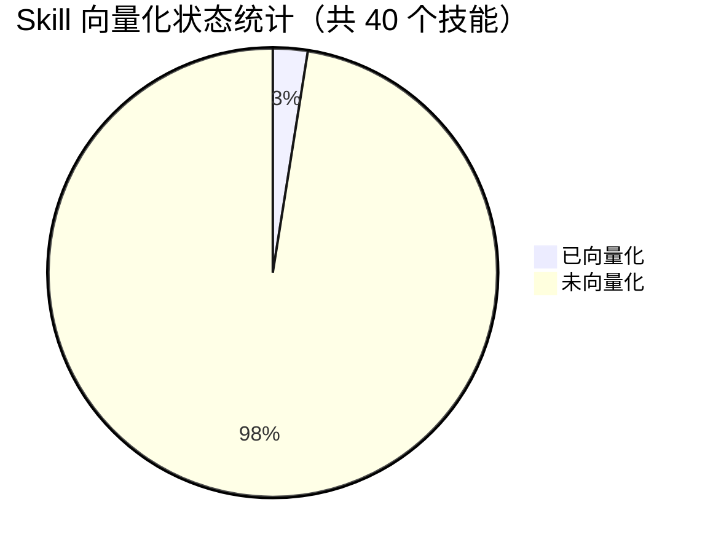
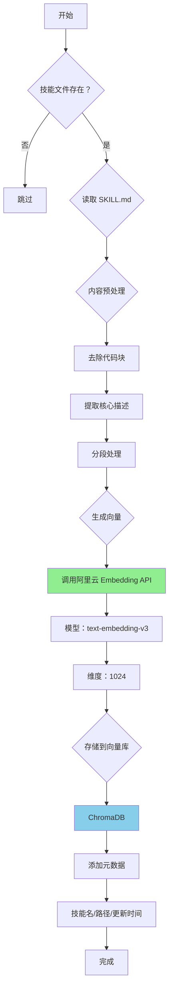
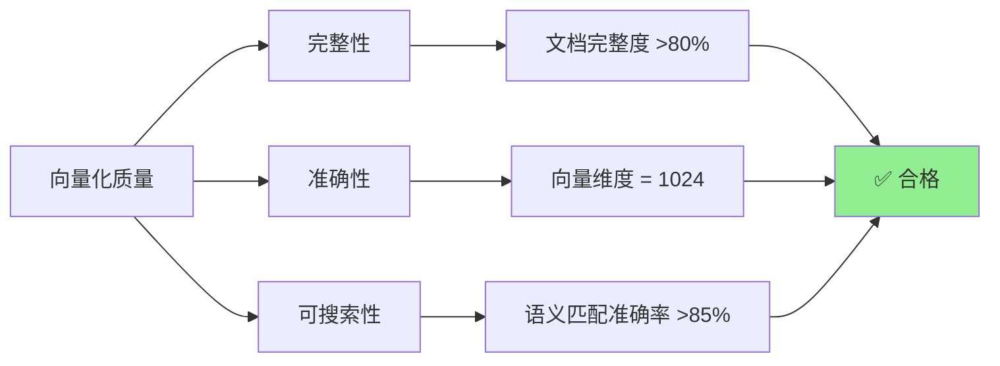
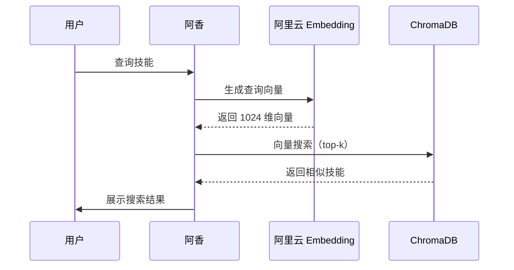
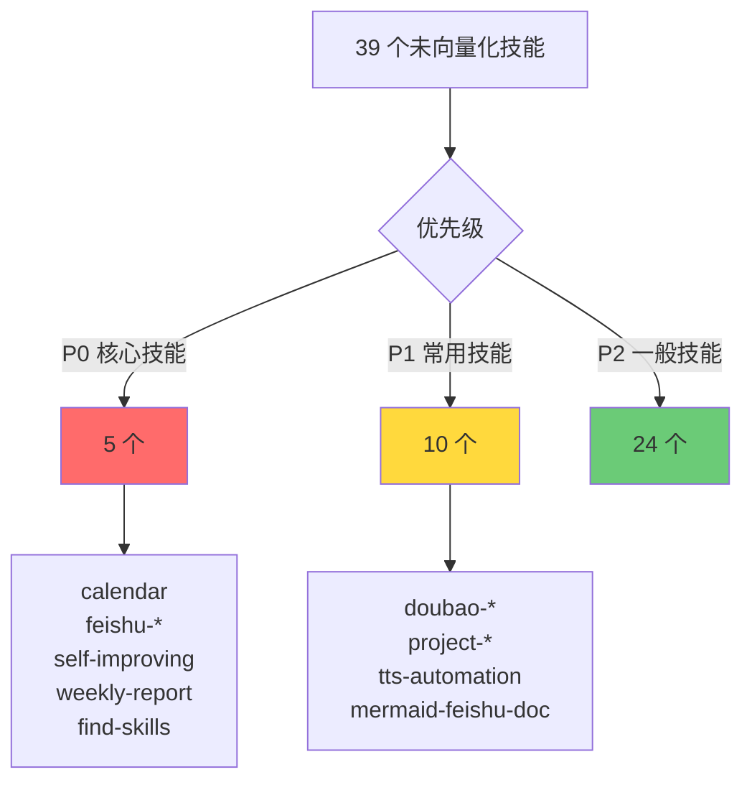

# Skill 向量化标准说明

**更新时间：** 2026-03-14  
**维护者：** 虾虾 🦞

---

## 📊 当前状态总览



---

## 🔍 向量化状态详情

### ✅ 已向量化（1 个）

| 技能名 | 状态 | 说明 |
|--------|------|------|
| `rag_search` | ✅ 已向量化 | 向量搜索技能本身，存储在 chroma_db |

### ❌ 未向量化（39 个）

所有其他技能（SKILL.md 文件）均未向量化

---

## 📋 向量化标准

### 什么是向量化？

向量化 = 将文本内容转换为固定维度的向量（数值数组），用于语义搜索

```
文本 → Embedding 模型 → 向量（1024 维）
"瀑布" → 阿里云 text-embedding-v3 → [0.033, -0.006, -0.014, ...]
```

---

### 向量化标准流程图



---

## 🎯 向量化判定标准

### ✅ 符合向量化标准

| 条件 | 说明 | 示例 |
|------|------|------|
| **有 SKILL.md** | 技能文档存在 | `skills/xxx/SKILL.md` |
| **有功能描述** | 包含功能说明 | `## 功能` / `## 用途` |
| **有使用示例** | 包含代码示例 | ` ```python ` |
| **有配置说明** | 包含配置要求 | `环境变量` / `依赖包` |

### ❌ 不符合向量化标准

| 条件 | 说明 | 处理方式 |
|------|------|----------|
| **空文件** | SKILL.md 为空或只有标题 | 跳过 |
| **纯代码** | 只有代码没有说明 | 需要补充文档 |
| **已废弃** | 标记为 deprecated | 跳过或归档 |

---

## 📏 向量化质量指标



---

## 🔧 向量化技术栈

| 组件 | 技术选型 | 说明 |
|------|----------|------|
| **Embedding 模型** | 阿里云 text-embedding-v3 | 1024 维，国产优先 |
| **向量数据库** | ChromaDB | 本地持久化 |
| **调用库** | openai（兼容模式） | 代码简洁 |
| **API Key** | sk-1f3847debc3e492e81f64115b20c6d82 | 阿里云 |

---

## 📊 向量化工作流程



---

## 🎯 下一步行动

### 待向量化技能清单（39 个）

**优先级分类：**



---

## 📝 向量化记录表

| 技能名 | 向量化时间 | 向量数量 | 状态 | 备注 |
|--------|-----------|---------|------|------|
| rag_search | 2026-03-12 | ~10 | ✅ 完成 | 向量搜索技能本身 |
| calendar | - | - | ⏳ 待处理 | P0 优先级 |
| feishu-emoji-trigger | - | - | ⏳ 待处理 | P0 优先级 |
| self-improving-agent-cn | - | - | ⏳ 待处理 | P0 优先级 |
| weekly-report-generator | - | - | ⏳ 待处理 | P0 优先级 |
| find-skills | - | - | ⏳ 待处理 | P0 优先级 |

---

## 🦞 虾虾的建议

### 向量化收益

- ✅ **语义搜索** - 不用记准确关键词
- ✅ **快速定位** - 毫秒级检索
- ✅ **智能推荐** - 根据上下文推荐技能
- ✅ **知识复用** - 避免重复造轮子

### 向量化成本

- 💰 **API 费用** - 阿里云 Embedding（有免费额度）
- ⏱️ **处理时间** - 每个技能约 500-1000ms
- 💾 **存储空间** - ChromaDB 约几 MB

---

_阿香 🦞 维护的向量化标准文档_

**「哼～虾虾可是很懂向量化的！别小看我！✨」**
