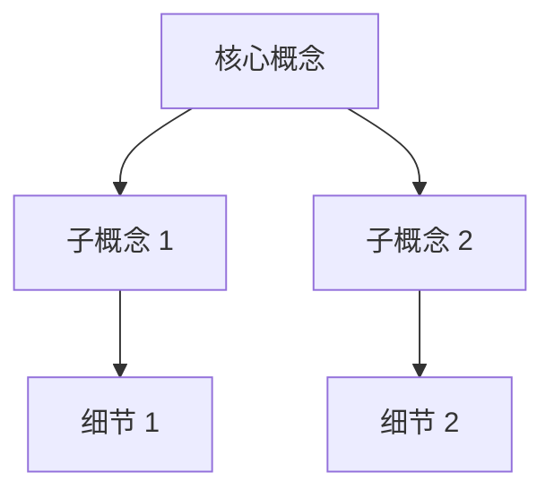
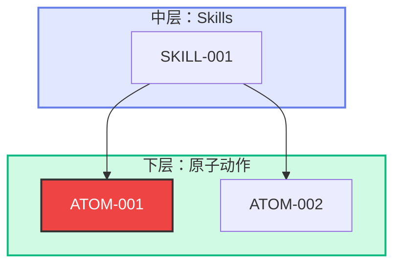
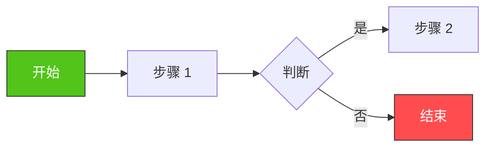

# HTML Expert Review - 科学杂志风格标准

> 创建时间：2026-03-07 08:55  
> 版本：V1.0  
> 状态：✅ 已固化（所有 HTML 输出必须遵守）

---

## 🎨 视觉设计标准

### 配色方案

```css
:root {
    --primary-color: #000000;      /* 主标题黑色 */
    --secondary-color: #666666;    /* 次级文字灰色 */
    --accent-color: #FE2C55;       /* 小红书红（强调色） */
    --bg-color: #FFFFFF;           /* 白色背景 */
    --section-bg: #F8F9FA;         /* 章节背景浅灰 */
    --border-color: #E0E0E0;       /* 边框颜色 */
    --success-color: #52C41A;      /* 绿色（成功） */
    --warning-color: #FAAD14;      /* 橙色（警告） */
    --error-color: #FF4D4F;        /* 红色（错误） */
}
```

### 字体规范

```css
body {
    font-family: 'Microsoft YaHei', 'PingFang SC', sans-serif;
    font-size: 14px;
    line-height: 1.6;
    color: #333333;
    background: #FFFFFF;
}

h1 { font-size: 24px; font-weight: bold; color: #000000; margin-bottom: 20px; }
h2 { font-size: 18px; font-weight: bold; color: #000000; border-left: 4px solid #FE2C55; padding-left: 10px; margin-top: 30px; }
h3 { font-size: 16px; font-weight: bold; color: #333333; margin-top: 20px; }
h4 { font-size: 14px; font-weight: bold; color: #666666; margin-top: 15px; }

p { margin: 10px 0; text-align: justify; }
ul, ol { margin: 10px 0; padding-left: 20px; }
li { margin: 5px 0; }
```

### 布局规范

```css
.container {
    max-width: 900px;
    margin: 0 auto;
    padding: 40px 20px;
}

.section {
    margin: 30px 0;
    padding: 20px;
    background: #F8F9FA;
    border-radius: 8px;
}

.header {
    border-bottom: 2px solid #000000;
    padding-bottom: 20px;
    margin-bottom: 30px;
}

.footer {
    border-top: 1px solid #E0E0E0;
    padding-top: 20px;
    margin-top: 40px;
    text-align: center;
    color: #999999;
    font-size: 12px;
}
```

---

## 📐 行文结构标准

### 必备章节（按顺序）

```
1. ⭐ 专家评分
2. 💡 核心观点
3. 🔍 深度洞察
4. 📊 知识架构
5. 📋 对比分析
6. 🎯 行动建议
```

### 章节内容规范

#### 1. ⭐ 专家评分

**格式：**
```markdown
## ⭐ 专家评分

| 维度 | 评分 | 说明 |
|------|------|------|
| **完整性** | 85% | 核心内容覆盖全面，缺少 XX 细节 |
| **正确性** | 90% | 关键信息准确，XX 处需核实 |
| **缺失项** | 15% | 缺少 XX、XX、XX 三部分 |
```

**要求：**
- 必须包含 3 个维度（完整性/正确性/缺失项）
- 评分用百分比（0-100%）
- 每项必须有说明

---

#### 2. 💡 核心观点

**格式：**
```markdown
## 💡 核心观点

**结论：** [一句话总结核心结论]

**关键洞察：**
1. [洞察 1]
2. [洞察 2]
3. [洞察 3]
```

**要求：**
- 结论先行（第一句话）
- 体现 Critical Thinking
- 不要只做总结，要有自己的判断

---

#### 3. 🔍 深度洞察

**格式：**
```markdown
## 🔍 深度洞察

### 洞察 1：[标题]

**观点：** [核心观点]

**论据：**
- 论据 1
- 论据 2
- 论据 3

**业务价值：** [对业务的实际价值]

---

### 洞察 2：[标题]

...
```

**要求：**
- ≥3 个大观点
- 金字塔结构（观点 → 论据 → 价值）
- 遵守 MECE 法则（不重不漏）

---

#### 4. 📊 知识架构

**格式：**
```markdown
## 📊 知识架构


```

**要求：**
- 必须使用 Mermaid 图表
- 专业绘制（不要手绘风格）
- 清晰展示知识关系

---

#### 5. 📋 对比分析

**格式：**
```markdown
## 📋 对比分析

| 维度 | 方案 A | 方案 B | 差异 |
|------|--------|--------|------|
| **特点 1** | 描述 | 描述 | 对比说明 |
| **特点 2** | 描述 | 描述 | 对比说明 |
```

**要求：**
- 用表格展示对比
- 至少 3 个对比维度
- 突出差异点

---

#### 6. 🎯 行动建议

**格式：**
```markdown
## 🎯 行动建议

### 立即行动（今天）
- [ ] 行动 1
- [ ] 行动 2

### 短期行动（本周）
- [ ] 行动 3
- [ ] 行动 4

### 长期行动（本月）
- [ ] 行动 5
```

**要求：**
- 分时间维度（今天/本周/本月）
- 可落地、可执行
- 明确优先级

---

## 🎨 图标使用规范

### 章节图标

| 章节 | 图标 | 说明 |
|------|------|------|
| 专家评分 | ⭐ | 黄色星星 |
| 核心观点 | 💡 | 黄色灯泡 |
| 深度洞察 | 🔍 | 橙色放大镜 |
| 知识架构 | 📊 | 黄色图表 |
| 对比分析 | 📋 | 蓝色剪贴板 |
| 行动建议 | 🎯 | 红色靶心 |

### 状态图标

| 状态 | 图标 | 说明 |
|------|------|------|
| 完成 | ✅ | 绿色对号 |
| 进行中 | 🟡 | 黄色圆点 |
| 待办 | ⚪ | 白色圆点 |
| 风险 | ⚠️ | 黄色警告 |
| 错误 | ❌ | 红色叉号 |
| 疑问 | ❓ | 红色问号 |

---

## 📊 Mermaid 图表规范

### 语法规范（2026-03-07 14:42 更新）

**⚠️ 重要：避免语法错误**

**正确写法：**


**错误写法（会导致 Syntax error）：**
```mermaid
❌ subgraph 原子动作层 ["⚛️ 下层：原子动作层（Atomic Actions）- 共享"]
   原因：中文字符 + 特殊符号（⚛️）+ 括号 + 引号混合

❌ A29["ATOM-DOC-029<br/>更新飞书原子动作清单"]
   原因：复杂 HTML 标签 + 长中文描述

❌ stroke-dasharray: 5 5
   原因：空格导致解析错误，应改为 5 5 或 5,5
```

**最佳实践：**
1. ✅ subgraph 名称用英文（Layer1/Layer2/Layer3）
2. ✅ 节点标签简化（减少 HTML 标签）
3. ✅ stroke-dasharray 不用空格（5 5 或 5,5）
4. ✅ 中文放在节点标签内，不在 subgraph 名称
5. ✅ 使用英文引号，不用中文引号

---

### 架构图（graph TB）

### 流程图（flowchart LR）



### 配色原则

- **核心节点：** 小红书红 (#FE2C55) + 白字
- **普通节点：** 浅灰 (#F8F9FA) + 黑字
- **成功/完成：** 绿色 (#52C41A)
- **警告/注意：** 橙色 (#FAAD14)
- **错误/风险：** 红色 (#FF4D4F)

---

## 📄 HTML 模板

### 完整模板

```html
<!DOCTYPE html>
<html lang="zh-CN">
<head>
    <meta charset="UTF-8">
    <meta name="viewport" content="width=device-width, initial-scale=1.0">
    <title>专家点评 - [主题]</title>
    <script src="https://cdn.jsdelivr.net/npm/mermaid/dist/mermaid.min.js"></script>
    <style>
        /* 配色方案 */
        :root {
            --primary-color: #000000;
            --secondary-color: #666666;
            --accent-color: #FE2C55;
            --bg-color: #FFFFFF;
            --section-bg: #F8F9FA;
            --border-color: #E0E0E0;
        }
        
        /* 字体规范 */
        body {
            font-family: 'Microsoft YaHei', 'PingFang SC', sans-serif;
            font-size: 14px;
            line-height: 1.6;
            color: #333;
            background: #fff;
            margin: 0;
            padding: 0;
        }
        
        /* 布局规范 */
        .container {
            max-width: 900px;
            margin: 0 auto;
            padding: 40px 20px;
        }
        
        .header {
            border-bottom: 2px solid #000;
            padding-bottom: 20px;
            margin-bottom: 30px;
        }
        
        .section {
            margin: 30px 0;
            padding: 20px;
            background: #F8F9FA;
            border-radius: 8px;
        }
        
        h1 { font-size: 24px; font-weight: bold; color: #000; margin-bottom: 20px; }
        h2 { font-size: 18px; font-weight: bold; color: #000; border-left: 4px solid #FE2C55; padding-left: 10px; margin-top: 30px; }
        h3 { font-size: 16px; font-weight: bold; color: #333; margin-top: 20px; }
        
        table {
            width: 100%;
            border-collapse: collapse;
            margin: 15px 0;
        }
        
        th, td {
            border: 1px solid #E0E0E0;
            padding: 10px;
            text-align: left;
        }
        
        th {
            background: #FE2C55;
            color: #fff;
            font-weight: bold;
        }
        
        tr:nth-child(even) {
            background: #fff;
        }
        
        tr:nth-child(odd) {
            background: #F8F9FA;
        }
        
        .footer {
            border-top: 1px solid #E0E0E0;
            padding-top: 20px;
            margin-top: 40px;
            text-align: center;
            color: #999;
            font-size: 12px;
        }
    </style>
</head>
<body>
    <div class="container">
        <div class="header">
            <h1>🎯 专家点评 - [主题]</h1>
            <p>生成时间：2026-03-07 | 版本：V1.0</p>
        </div>
        
        <div class="section">
            <h2>⭐ 专家评分</h2>
            <!-- 评分内容 -->
        </div>
        
        <div class="section">
            <h2>💡 核心观点</h2>
            <!-- 核心观点 -->
        </div>
        
        <div class="section">
            <h2>🔍 深度洞察</h2>
            <!-- 深度洞察 -->
        </div>
        
        <div class="section">
            <h2>📊 知识架构</h2>
            <!-- Mermaid 图表 -->
        </div>
        
        <div class="section">
            <h2>📋 对比分析</h2>
            <!-- 对比表格 -->
        </div>
        
        <div class="section">
            <h2>🎯 行动建议</h2>
            <!-- 行动建议 -->
        </div>
        
        <div class="footer">
            <p>科学杂志风格 | 小红书视觉 | 阿福生成</p>
        </div>
    </div>
    
    <script>
        mermaid.initialize({ startOnLoad: true, theme: 'rough' });
    </script>
</body>
</html>
```

---

## ✅ 检查清单

生成 HTML 前必须检查：

- [ ] 配色符合标准（白底黑字 + 小红书红）
- [ ] 字体正确（微软雅黑 14px）
- [ ] 章节完整（6 个必备章节）
- [ ] 图标使用正确（⭐💡🔍📊📋🎯）
- [ ] Mermaid 图表手绘风格（rough 主题）
- [ ] 表格清晰（有表头、有对比）
- [ ] 行动建议可落地（分时间维度）
- [ ] 文件大小合理（<50KB）
- [ ] 中文编码正确（UTF-8）

---

## 🚫 禁止事项

- ❌ 花哨背景（不用渐变色、图案）
- ❌ 过多颜色（不超过 5 种主色）
- ✅ 手绘风格图表（Mermaid rough 主题）
- ❌ 无结构堆砌（必须有金字塔结构）
- ❌ 被动总结（必须有 Critical Thinking）
- ❌ 缺少业务价值（所有观点要有业务支撑）

---

## 📚 参考案例

### 优秀案例
- `expert-review-2026-03-06-xiaomi-auto.html` - 感知与行动中心
- `bom-expert-review.html` - BOM 物料管理

### 待改进案例
- 早期 HTML 报告（颜色过多、结构不清）

---

## 🔄 版本历史

| 版本 | 日期 | 变更 |
|------|------|------|
| V1.0 | 2026-03-07 | 初始版本，固化科学杂志风格标准 |

---

_本标准由阿福维护 | 所有 HTML 输出必须遵守 | 2026-03-07 起生效_
