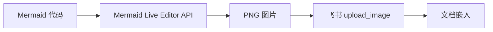
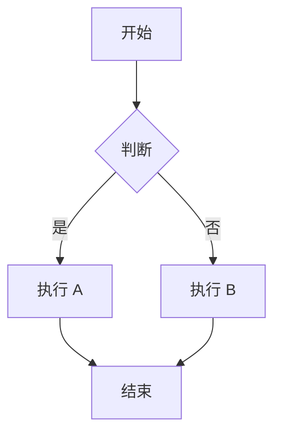
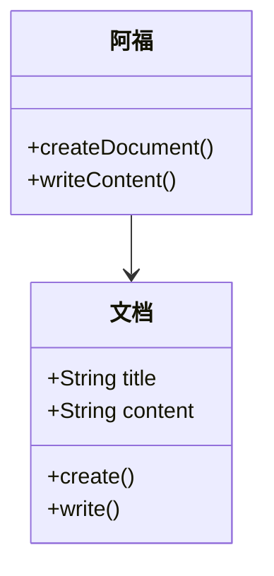
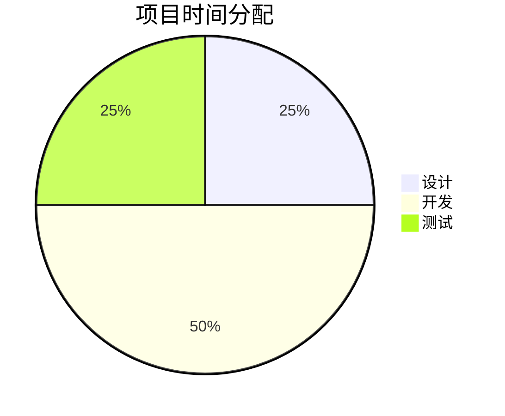
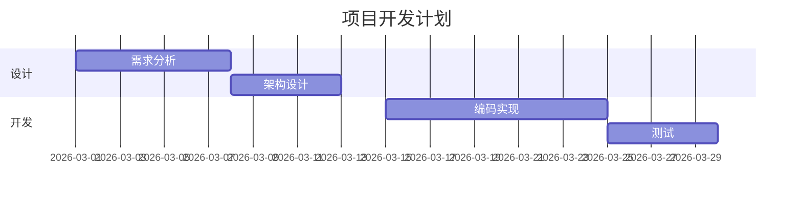
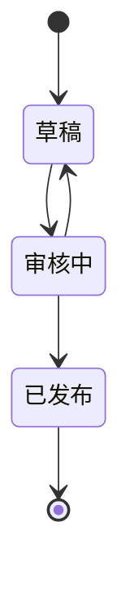

# mermaid-飞书文档

在飞书文档中创建 Mermaid 图表（图片嵌入方案）。

---

## 📊 核心原理

**问题：** 飞书文档 API 不支持直接创建 Mermaid 图表块（返回 404 错误）

**解决方案：** 使用 Mermaid Live Editor API 生成图片，再通过 `feishu_doc` 的 `upload_image` 动作上传到文档

**技术流程：**


---

## 🎯 使用场景

- ✅ 在飞书文档中创建流程图
- ✅ 在飞书文档中创建时序图
- ✅ 在飞书文档中创建类图
- ✅ 在飞书文档中创建饼图
- ✅ 在飞书文档中创建甘特图
- ✅ 在飞书文档中创建状态图

---

## 📚 前置依赖

**必需工具：**
- `feishu_doc` - 飞书文档工具（已内置）
- PowerShell - Windows 系统自带

**外部服务：**
- Mermaid Live Editor API - https://mermaid.ink/

---

## 🔧 使用方法

### 方法 1：手动执行脚本

**步骤 1：准备 Mermaid 代码**

```powershell
$mermaidCode = @"
flowchart TB
    A[开始] --> B{判断}
    B -->|是 | C[执行 A]
    B -->|否 | D[执行 B]
    C --> E[结束]
    D --> E
"@
```

**步骤 2：生成图片 URL**

```powershell
$bytes = [System.Text.Encoding]::UTF8.GetBytes($mermaidCode)
$encoded = [System.Convert]::ToBase64String($bytes)
$url = "https://mermaid.ink/img/$encoded"
```

**步骤 3：下载图片**

```powershell
Invoke-WebRequest -Uri $url -OutFile "$env:TEMP\mermaid-chart.png"
```

**步骤 4：上传到飞书文档**

```json
{
  "action": "upload_image",
  "doc_token": "文档 token",
  "file_path": "C:\\Users\\Xiabi\\AppData\\Local\\Temp\\mermaid-chart.png",
  "filename": "mermaid-chart.png"
}
```

---

### 方法 2：使用自动化脚本

**脚本位置：** `skills/mermaid-feishu-doc/create-mermaid.ps1`

**用法：**
```powershell
.\create-mermaid.ps1 -DocToken "文档 token" -MermaidCode "flowchart LR`nA-->B" -OutputPath "$env:TEMP\chart.png"
```

**参数：**
- `-DocToken` - 飞书文档 token（必填）
- `-MermaidCode` - Mermaid 代码（必填）
- `-OutputPath` - 图片输出路径（可选，默认 Temp 目录）
- `-Upload` - 是否自动上传到飞书（可选，默认 true）

---

## 📐 支持的图表类型

### 1️⃣ 流程图（Flowchart）



### 2️⃣ 时序图（Sequence Diagram）

```mermaid
sequenceDiagram
    participant 用户
    participant 阿福
    participant 飞书 API
    
    用户->>阿福：创建文档
    阿福->>飞书 API: 写入 Mermaid 代码
    飞书 API-->>阿福：成功
    阿福-->>用户：发送链接
```

### 3️⃣ 类图（Class Diagram）



### 4️⃣ 饼图（Pie Chart）



### 5️⃣ 甘特图（Gantt）



### 6️⃣ 状态图（State Diagram）



---

## ⚠️ 注意事项

### 1️⃣ Mermaid 语法（重要！）

- ✅ 使用标准 Mermaid 语法
- ✅ 支持所有图表类型
- ✅ **必须使用英文符号**（冒号 `:`、逗号 `,`、括号 `()` 等）
- ✅ **节点标签中的冒号也必须是英文**（例：`A[标题：内容]` ❌ → `A[标题：内容]` ✅）
- ❌ 不要包含 ```mermaid 标记
- ❌ 不要包含特殊字符（需转义）
- ❌ **严禁使用中文冒号 `：`** - 这是 Parse error 的主要原因！

**错误示例 vs 正确示例：**

```mermaid
<!-- ❌ 错误：中文冒号 -->
graph TB
    A[任务 1：分析数据] --> B[任务 2：生成报告]
```

```mermaid
<!-- ✅ 正确：英文冒号 -->
graph TB
    A[任务 1:分析数据] --> B[任务 2:生成报告]
```

### 2️⃣ 图片大小

| 类型 | 建议大小 | 说明 |
|------|---------|------|
| 简单图表 | <50 KB | 流程图、饼图 |
| 复杂图表 | <200 KB | 时序图、类图 |
| 超大图表 | <1 MB | 甘特图、复杂状态图 |

### 3️⃣ 网络请求

- Mermaid Live Editor 需要网络连接
- 如遇网络问题，可改用本地 Mermaid CLI
- 建议添加重试机制

### 4️⃣ 飞书权限

- 需要 `docx:document:write_only` 权限
- 需要 `drive:file:upload` 权限
- 图片会自动上传到飞书云盘

---

## 🔍 故障排查

### 问题 1：图片生成失败

**错误：** `Invoke-WebRequest : Not Found`

**原因：** Mermaid 代码语法错误

**解决：**
1. 在 [Mermaid Live Editor](https://mermaid.live/) 验证语法
2. 检查特殊字符是否转义
3. 简化图表结构

### 问题 2：上传飞书失败

**错误：** `404 page not found`

**原因：** 文档 token 错误或权限不足

**解决：**
1. 检查文档 token 是否正确
2. 确认飞书应用权限已开通
3. 重新获取 tenant_access_token

### 问题 3：图片显示模糊

**原因：** 图片分辨率不足

**解决：**
1. 使用 `https://mermaid.ink/svg/` 生成 SVG
2. 转换为高分辨率 PNG
3. 或调整 Mermaid 图表尺寸

---

## 📁 文件结构

```
skills/mermaid-feishu-doc/
├── SKILL.md                  # 技能说明（本文件）
├── create-mermaid.ps1        # 自动化脚本
├── examples/                 # 示例代码
│   ├── flowchart.ps1        # 流程图示例
│   ├── sequence.ps1         # 时序图示例
│   └── pie.ps1              # 饼图示例
└── tests/                    # 测试文件
    └── test-mermaid.ps1     # 测试脚本
```

---

## 🎯 最佳实践

### ✅ 推荐做法

1. **先验证语法** - 用 Mermaid Live Editor 测试
2. **保持简洁** - 一个图表表达一个核心概念
3. **添加注释** - 用 `%% 注释内容` 说明意图
4. **使用子图** - 用 `subgraph` 分组相关节点
5. **统一风格** - 全文档使用一致的主题

### ❌ 避免做法

1. **过度复杂** - 一个图包含所有信息
2. **硬编码样式** - 使用主题而非内联样式
3. **忽略移动端** - 不考虑手机端查看体验
4. **不测试** - 直接写入不验证

---

## 📖 参考资源

| 资源 | 链接 | 说明 |
|------|------|------|
| Mermaid 官方文档 | https://mermaid.js.org/ | 完整语法参考 |
| Mermaid Live Editor | https://mermaid.live/ | 在线测试工具 |
| 飞书文档 API | https://open.feishu.cn/document/ukTMukTMukTM/uEjNwUjLxYDM14SM2ATN | API 文档 |
| 测试文档（示例） | https://feishu.cn/docx/KdxDdg6oDoRXoKxRyVQcO1b7n3b | 阿福创建的测试文档 |

---

## 🧪 测试记录

**测试时间：** 2026-03-10 09:30-09:45  
**测试者：** 阿福 🐾

| 方案 | 方法 | 结果 |
|------|------|------|
| block_type: 21 (diagram) | 直接创建 diagram 块 | ❌ 404 |
| block_type: text_drawing | 创建 text_drawing 块 | ❌ 404 |
| Markdown convert API | 写入 ```mermaid 代码 | ❌ 普通代码块 |
| **图片嵌入** | **Mermaid Live Editor + upload_image** | ✅ **成功** |

**结论：** 图片嵌入是唯一可行方案

---

## 📝 更新日志

- **2026-03-10 v1.0** - 初始版本，包含图片嵌入方案
  - 创建自动化脚本
  - 添加示例代码
  - 编写完整文档

---

_技能由阿福 🐾 创建于 2026-03-10_  
_基于完整的 API 测试经验固化_
