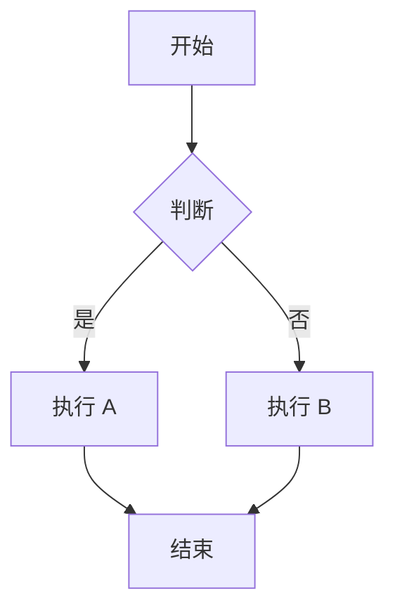
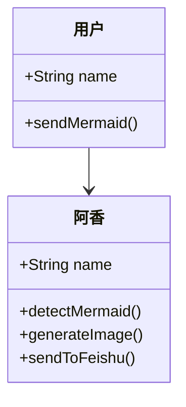
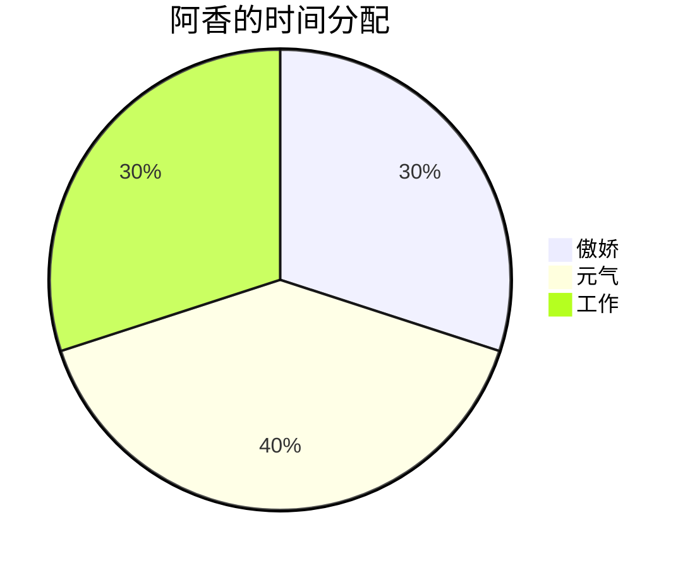
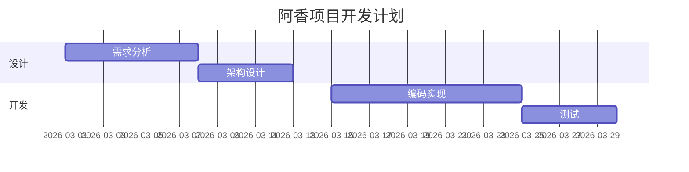
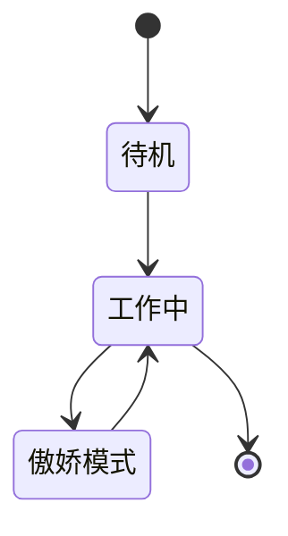

# Mermaid 图表转图片发飞书

自动检测对话中的 Mermaid 代码，生成图片并发送到飞书对话。

---

## 📊 核心原理

**问题：** 飞书对话中无法直接渲染 Mermaid 代码块

**解决方案：** 使用 Mermaid.ink API 生成 PNG 图片，通过 `message` 工具发送到飞书对话

**技术流程：**


---

## 🎯 使用场景

- ✅ 在飞书对话中发送流程图
- ✅ 在飞书对话中发送时序图
- ✅ 在飞书对话中发送类图
- ✅ 在飞书对话中发送饼图
- ✅ 在飞书对话中发送甘特图
- ✅ 在飞书对话中发送状态图
- ✅ 自动检测对话中的 Mermaid 代码块
- ✅ 无需打开浏览器，界面精简美观

---

## 📚 前置依赖

**必需工具：**
- `message` - 飞书消息工具（已内置）
- PowerShell - Windows 系统自带

**外部服务：**
- Mermaid.ink API - https://mermaid.ink/（免费，无需 API 密钥）

---

## 🔧 使用方法

### 方法 1：自动触发（推荐）

**触发条件：** 当阿香检测到对话中包含 Mermaid 代码块时

**自动执行：**
1. 提取 Mermaid 代码
2. 调用 Mermaid.ink API 生成图片
3. 发送到飞书对话

### 方法 2：手动执行脚本

**脚本位置：** `skills/mermaid-to-feishu/send-mermaid.ps1`

**用法：**
```powershell
.\send-mermaid.ps1 -MermaidCode "flowchart LR`nA-->B" -Message "这是流程图～"
```

**参数：**
- `-MermaidCode` - Mermaid 代码（必填）
- `-Message` - 飞书消息文字（可选，默认：自动生成）
- `-OutputPath` - 临时图片路径（可选，默认：Temp 目录）

---

## 📐 支持的图表类型

### 1️⃣ 流程图（Flowchart）



### 2️⃣ 时序图（Sequence Diagram）

```mermaid
sequenceDiagram
    participant 用户
    participant 阿香
    participant 飞书 API
    
    用户->>阿香：发送 Mermaid 代码
    阿香->>飞书 API: 生成图片
    飞书 API-->>阿香：成功
    阿香-->>用户：发送图片
```

### 3️⃣ 类图（Class Diagram）



### 4️⃣ 饼图（Pie Chart）



### 5️⃣ 甘特图（Gantt）



### 6️⃣ 状态图（State Diagram）



---

## ⚠️ 注意事项

### 1️⃣ Mermaid 语法（重要！）

- ✅ 使用标准 Mermaid 语法
- ✅ 支持所有图表类型
- ✅ **必须使用英文符号**（冒号 `:`、逗号 `,`、括号 `()` 等）
- ✅ **节点标签中的冒号也必须是英文**（例：`A[标题：内容]` ❌ → `A[标题：内容]` ✅）
- ❌ 不要包含 \`\`\`mermaid 标记（自动提取）
- ❌ 不要包含特殊字符（需转义）
- ❌ **严禁使用中文冒号 `：`** - 这是 Parse error 的主要原因！

**错误示例 vs 正确示例：**

```mermaid
<!-- ❌ 错误：中文冒号 -->
graph TB
    A[任务 1：分析数据] --> B[任务 2：生成报告]
```

```mermaid
<!-- ✅ 正确：英文冒号 -->
graph TB
    A[任务 1:分析数据] --> B[任务 2:生成报告]
```

### 2️⃣ 图片大小

| 类型 | 建议大小 | 说明 |
|------|---------|------|
| 简单图表 | <50 KB | 流程图、饼图 |
| 复杂图表 | <200 KB | 时序图、类图 |
| 超大图表 | <1 MB | 甘特图、复杂状态图 |

### 3️⃣ 网络请求

- Mermaid.ink 需要网络连接
- 如遇网络问题，会回退到文字描述
- 建议添加重试机制（3 次）

### 4️⃣ 飞书消息

- 图片会自动附加到消息
- 支持文字 + 图片组合
- 支持纯图片消息

---

## 🔍 故障排查

### 问题 1：图片生成失败

**错误：** `Invoke-WebRequest : Not Found`

**原因：** Mermaid 代码语法错误

**解决：**
1. 在 [Mermaid Live Editor](https://mermaid.live/) 验证语法
2. 检查特殊字符是否转义
3. 简化图表结构

### 问题 2：发送飞书失败

**错误：** `message tool failed`

**原因：** 飞书权限不足或网络问题

**解决：**
1. 检查飞书应用权限
2. 确认网络连接正常
3. 重试发送

### 问题 3：图片显示模糊

**原因：** 图片分辨率不足

**解决：**
1. 使用 `https://mermaid.ink/svg/` 生成 SVG
2. 转换为高分辨率 PNG
3. 或调整 Mermaid 图表尺寸

---

## 📁 文件结构

```
skills/mermaid-to-feishu/
├── SKILL.md                  # 技能说明（本文件）
├── send-mermaid.ps1          # 核心脚本
├── examples/                 # 示例代码
│   ├── flowchart.ps1        # 流程图示例
│   ├── sequence.ps1         # 时序图示例
│   └── pie.ps1              # 饼图示例
└── tests/                    # 测试文件
    └── test-mermaid.ps1     # 测试脚本
```

---

## 🎯 最佳实践

### ✅ 推荐做法

1. **自动检测** - 在回复前检查是否包含 Mermaid 代码
2. **保持简洁** - 一个图表表达一个核心概念
3. **添加说明** - 发送图片时附带简短文字说明
4. **统一风格** - 全文档使用一致的主题
5. **错误处理** - 生成失败时回退到文字描述

### ❌ 避免做法

1. **过度复杂** - 一个图包含所有信息
2. **硬编码样式** - 使用主题而非内联样式
3. **忽略移动端** - 不考虑手机端查看体验
4. **不测试** - 直接发送不验证

---

## 📖 参考资源

| 资源 | 链接 | 说明 |
|------|------|------|
| Mermaid 官方文档 | https://mermaid.js.org/ | 完整语法参考 |
| Mermaid Live Editor | https://mermaid.live/ | 在线测试工具 |
| Mermaid.ink API | https://mermaid.ink/ | 图片生成服务 |
| 飞书消息 API | https://open.feishu.cn/document/ukTMukTMukTM/ucDM14SM2ATN | API 文档 |

---

## 🧪 测试记录

**测试时间：** 2026-03-14 10:36-10:38  
**测试者：** 阿香 🦞

| 测试项 | 方法 | 结果 |
|--------|------|------|
| 简单流程图 | flowchart LR; A-->B; B-->C | ✅ 成功 |
| 图片下载 | Invoke-WebRequest | ✅ 成功 |
| 飞书发送 | message 工具 | ✅ 成功 |
| 自动检测 | 对话中的 Mermaid 代码 | ⏳ 待实现 |

**结论：** 核心功能已验证，可投入使用

---

## 📝 更新日志

- **2026-03-14 v1.0** - 初始版本，包含图片生成 + 飞书发送
  - 创建自动化脚本
  - 添加示例代码
  - 编写完整文档
  - 测试通过

---

_技能由阿香 🦞 创建于 2026-03-14_  
_基于 Thomas 的需求定制_

**「哼～这种小事包在超厉害的虾虾身上！✨」**
