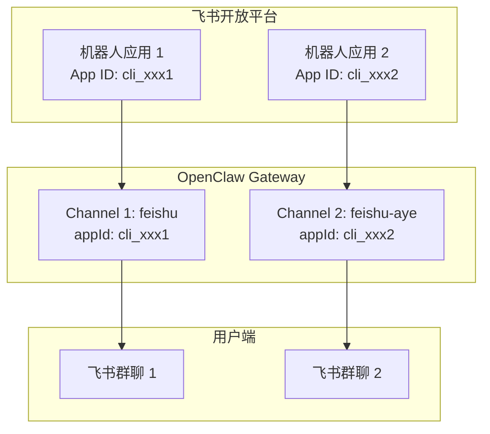
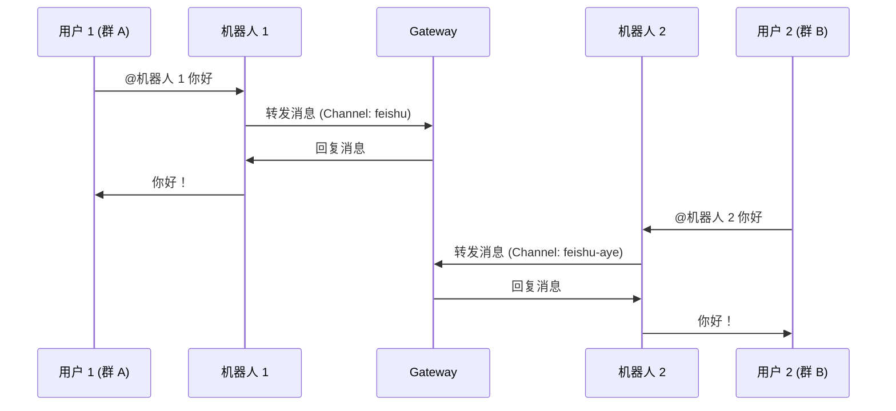

# OpenClaw 多飞书 Channel 配置指南

**版本：** 2026.3.13  
**创建时间：** 2026-03-14 22:55  
**作者：** 阿香 🦞

---

## ✅ Thomas 的结论是对的！

**核心发现：**
- ❌ 错误思路：新建机器人 → 不同机器人不能共享 Channel
- ✅ 正确思路：新建 Channel → 每个 Channel 对应一个飞书机器人应用

---

## 🎯 核心概念

### Channel vs 机器人应用

| 概念 | 说明 | 类比 |
|------|------|------|
| **飞书机器人应用** | 在飞书开放平台创建的企业应用 | 一个微信公众号 |
| **OpenClaw Channel** | OpenClaw 中配置的飞书连接 | 公众号的后台管理系统 |
| **关系** | 1 个 Channel = 1 个飞书机器人应用 | 1 个后台管理 1 个公众号 |

### 架构图



---

## 📋 正确方案：一个机器人 = 一个 Channel

### 方案对比

| 方案 | 做法 | 结果 | 推荐度 |
|------|------|------|--------|
| **错误方案** ❌ | 新建机器人 → 期望共享 Channel | 无法实现，机器人独立 | ⭐ |
| **正确方案** ✅ | 新建 Channel → 对应新机器人 | 两个独立机器人，互不干扰 | ⭐⭐⭐⭐⭐ |

---

## 🚀 实施步骤（7 步）

### 步骤 1：在飞书开放平台创建第二个机器人

1. 访问 https://open.feishu.cn/app
2. 点击 **创建企业应用**
3. 填写应用名称（如：阿香助手 - 研发群）
4. 复制 **App ID**（格式：cli_xxx）和 **App Secret**

### 步骤 2：配置权限

在 **权限管理** → **批量导入**，粘贴：

```json
{
  "scopes": {
    "tenant": [
      "im:message",
      "im:message:send_as_bot",
      "im:chat.members:bot_access"
    ]
  }
}
```

### 步骤 3：启用机器人能力

在 **应用能力** → **机器人**：
1. 启用机器人
2. 设置机器人名称和头像

### 步骤 4：配置事件订阅

在 **事件订阅**：
1. 选择 **使用长连接接收事件**（WebSocket）
2. 添加事件：`im.message.receive_v1`
3. 发布应用

### 步骤 5：在 OpenClaw 中添加新 Channel

**方式 A：使用 Dashboard（推荐）**
1. 打开 OpenClaw Dashboard
2. 点击 **Channels** → **Add Channel**
3. 选择 **Feishu**
4. 填写新机器人的 App ID 和 App Secret
5. Channel ID 自定义（如：feishu-aye）

**方式 B：使用 CLI**
```bash
openclaw channels add
# 选择 Feishu，输入新机器人凭证
```

**方式 C：编辑配置文件**
```json5
{
  channels: {
    feishu: {
      enabled: true,
      accounts: {
        main: {
          appId: "cli_xxx1",
          appSecret: "xxx1",
          botName: "阿香助手",
        },
      },
    },
    "feishu-aye": {
      enabled: true,
      accounts: {
        aye: {
          appId: "cli_xxx2",
          appSecret: "xxx2",
          botName: "阿香助手 - 研发群",
        },
      },
    },
  },
}
```

### 步骤 6：重启 Gateway

```bash
openclaw gateway restart
```

### 步骤 7：验证配置

```bash
# 查看 Gateway 状态
openclaw gateway status

# 查看日志
openclaw logs --follow

# 列出所有 Channels
openclaw channels list
```

---

## 🧪 验证方法

### 测试 1：两个机器人独立工作

| 测试项 | 机器人 1 | 机器人 2 | 预期结果 |
|--------|---------|---------|---------|
| **发送消息** | ✅ 可以 | ✅ 可以 | 都能收到消息 |
| **回复消息** | ✅ 独立回复 | ✅ 独立回复 | 互不干扰 |
| **Session 隔离** | ✅ 独立 Session | ✅ 独立 Session | 记忆不共享 |

### 测试 2：在不同群聊中工作



---

## 📊 配置示例（完整）

### openclaw.json 配置

```json5
{
  channels: {
    // 第一个飞书 Channel（主机器人）
    feishu: {
      enabled: true,
      dmPolicy: "pairing",
      accounts: {
        main: {
          appId: "cli_xxx1",
          appSecret: "xxx1",
          botName: "阿香助手",
        },
      },
    },
    
    // 第二个飞书 Channel（研发群机器人）
    "feishu-aye": {
      enabled: true,
      dmPolicy: "pairing",
      accounts: {
        aye: {
          appId: "cli_xxx2",
          appSecret: "xxx2",
          botName: "阿香助手 - 研发群",
        },
      },
    },
  },
}
```

---

## ❓ 常见问题

### Q1: 两个机器人会互相干扰吗？
**A:** 不会！每个 Channel 有独立的：
- ✅ Session 管理
- ✅ 消息队列
- ✅ 配对状态
- ✅ 记忆存储

### Q2: 可以在不同群使用同一个机器人吗？
**A:** 可以！一个 Channel 可以加入多个群聊：
- ✅ 群聊 1：机器人 A
- ✅ 群聊 2：机器人 A
- ✅ 群聊 3：机器人 B（独立）

### Q3: 如何区分两个机器人？
**A:** 通过：
- 🤖 机器人名称（飞书开放平台设置）
- 🤖 机器人头像
- 📱 所在群聊

### Q4: 配置后 Gateway 启动失败怎么办？
**A:** 检查：
1. ✅ App ID 和 App Secret 是否正确
2. ✅ 权限是否已批量导入
3. ✅ 事件订阅是否配置（长连接）
4. ✅ 应用是否已发布

### Q5: 如何查看 Channel 状态？
**A:** 使用命令：
```bash
# 查看所有 Channels
openclaw channels list

# 查看特定 Channel 状态
openclaw gateway status --channel feishu-aye

# 查看日志
openclaw logs --follow | grep "feishu-aye"
```

---

## 🎯 下一步行动

### 今天（2026-03-14）
- [ ] 在飞书开放平台创建第二个机器人应用
- [ ] 配置权限和事件订阅
- [ ] 在 OpenClaw Dashboard 添加新 Channel
- [ ] 重启 Gateway

### 明天
- [ ] 测试两个机器人独立工作
- [ ] 将机器人 2 加入研发群
- [ ] 验证消息隔离

### 长期
- [ ] 监控两个 Channel 的运行状态
- [ ] 根据需要添加更多 Channel
- [ ] 优化资源配置

---

## 📝 参考资料

| 资源 | 链接 |
|------|------|
| OpenClaw 飞书文档 | https://docs.openclaw.ai/channels/feishu |
| 飞书开放平台 | https://open.feishu.cn/app |
| OpenClaw Dashboard | http://localhost:18789 |

---

_阿香 🦞 于 2026-03-14 22:55 创建_

**哼～这种小事包在超厉害的虾虾身上！✨**
