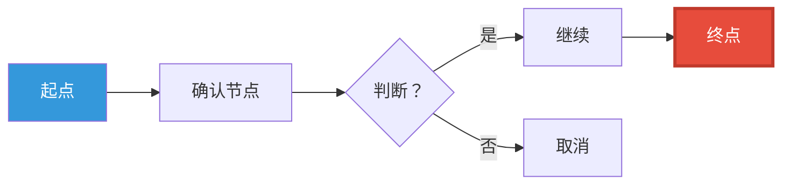
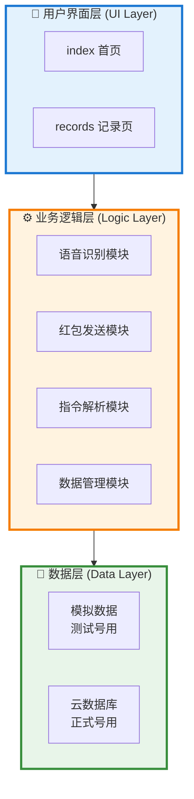
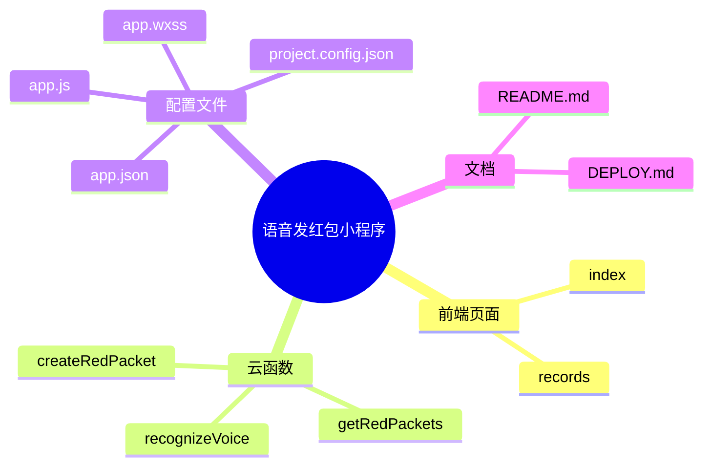

# Project Summary Report - 项目总结报告生成

## 技能描述

生成项目进度总结报告 HTML 网页，包含状态概览、项目流程图、文件列表、安全提示等，采用科学杂志排版 + 小红书视觉风格。

**适用场景：**
- 项目立项后生成进度报告
- 技术验证阶段生成状态概览
- 项目里程碑总结
- 项目卡片配套 HTML 报告

**标准文档：** `skills/html-expert-review/HTML-STANDARD.md`

---

## 触发条件

- **自动触发**：创建项目卡片后（用户说"生成项目报告"）
- **手动触发**：用户说"生成总结报告"、"创建进度 HTML"、"项目报告"

---

## 核心能力

1. **状态概览** - 4 个阶段卡片（立项/确认/验证/实现）
2. **流程图绘制** - Mermaid graph LR 流程图
3. **架构图绘制** - 三层架构图（UI 层/逻辑层/数据层，专业绘图）
4. **思维导图** - Mermaid mindmap（发散式手绘风格，文件夹级别）
5. **文件列表** - 列出项目相关所有文件
6. **安全提示** - 黄色警告框展示关键注意事项
7. **时间线** - 项目里程碑时间线
8. **Chrome 打开** - 自动用 Chrome 打开 HTML 预览
9. **可编辑 Mermaid 链接** - 生成 Mermaid Live Editor 链接，附到 worklog

**专业绘图工具：** Mermaid JS（CDN 自动加载）
- graph LR/TB - 流程图
- mindmap - 思维导图（发散式手绘风格）
- classDiagram - 类图
- 架构图 - 三层架构（UI/Logic/Data）

**三线同步：** 生成 HTML 后，自动提取 Mermaid 代码生成可编辑链接，附加到 worklog

---

## HTML 样式标准

### 视觉设计
- **背景：** 渐变背景（#fef9f3 → #f8f4e8）
- **字体：** 微软雅黑（Microsoft YaHei）
- **容器：** 白色圆角卡片 + 阴影
- **风格：** 科学杂志排版 + 小红书图标点缀

### 必备章节

#### 1. 页头（Header）
```html
- 标题：💰 项目名称 - 项目进度报告
- 元数据：生成时间 | 状态（🟡 技术验证中）
```

#### 2. 状态概览（Status Grid）
```html
- 4 个状态卡片（✅ 完成 / 🟡 进行中 / ⚪ 待办）
- 网格布局（responsive grid）
- 每个卡片：图标 + 状态标签
```

#### 3. 项目流程图（Mermaid Graph）


#### 3.5 三层架构图（专业架构图）

**适用场景：** 技术架构说明、系统分层展示

**标准格式：**


**配色方案：**
- UI 层：蓝色系（#e3f2fd + #1976d2）
- 逻辑层：橙色系（#fff3e0 + #f57c00）
- 数据层：绿色系（#e8f5e9 + #388e3c）

**绘制要求：**
- ✅ 使用 subgraph 分组
- ✅ 每层有明确标题和 icon
- ✅ 层间箭头表示数据流向
- ✅ 配色区分不同层级
- ✅ 节点标签清晰（可含换行<br/>）

#### 3.6 思维导图（Mindmap）

**用户约定（2026-03-08）：** 只展示到文件夹级别，不展示.html 文件名

**标准格式：**


**风格要求：**
- ✅ 发散式布局（中心主题 → 分支展开）
- ✅ 手绘风格（椭圆节点 + 曲线连接）
- ✅ 微软雅黑字体
- ✅ 只显示文件夹，不显示.html 文件

**Mermaid 配置：**
```javascript
mermaid.initialize({ 
    startOnLoad: true,
    theme: 'rough',
    themeVariables: {
        fontFamily: 'Microsoft YaHei',
        primaryColor: '#ffe0e0',
        primaryBorderColor: '#ff6b6b',
        lineColor: '#ff8e8e'
    }
});
```

#### 4. 已创建文件列表
```html
<ul>
  <li>✅ 文件名 - 描述</li>
  <li>✅ 文件名 - 描述</li>
</ul>
```

#### 5. 安全提示（Warning Box）
```html
<div style="background: #fff3cd; border-left: 4px solid #f39c12;">
  <h2>⚠️ 安全提示</h2>
  <ul>
    <li>❌ 不集成 XXX API - 风险太高</li>
    <li>✅ 最后一步手动确认 - 安全防线</li>
  </ul>
</div>
```

---

## 成功案例（2026-03-08）

### 案例 1：微信转账自动化项目进度报告

**输入：** 项目卡片（tasks/projects/微信转账自动化.md）
**输出：** `wechat-transfer-progress.html` (4.25 KB)

**生成内容：**
1. ✅ 状态概览（4 个阶段：立项/确认/验证/实现）
2. ✅ 项目流程图（语音指令 → 飞书确认 → 微信操作 → 手动发红包）
3. ✅ 已创建文件列表（4 个文件）
4. ✅ 安全提示（3 条红线）

**视觉风格：**
- 渐变背景（#fef9f3 → #f8f4e8）
- 白色圆角容器 + 阴影
- Mermaid 流程图（蓝色起点 + 红色终点）
- 黄色警告框（安全提示）

**文件命名：**
- ✅ 英文名：`wechat-transfer-progress.html`
- ❌ 避免中文：`微信转账 - 进度.html`

---

### 案例 2：语音发红包小程序总结报告（新增）

**输入：** 项目文件夹（miniprogram-voice-redpacket/）
**输出：** `expert-review-2026-03-08-voice-redpacket-journey.html` (28KB)

**生成内容：**
1. ✅ 项目概述（愿景 + 核心统计）
2. ✅ 开发历程时间线（17:38 启动 → 19:30 测试成功）
3. ✅ 踩过的 4 个坑与解决方案
4. ✅ **三层架构图**（UI 层/逻辑层/数据层，专业绘图）
5. ✅ **思维导图**（发散式手绘风格，文件夹级别）
6. ✅ 关键代码片段（语音识别/红包发送）
7. ✅ 成果统计（26 个文件，~3000 行代码）
8. ✅ 经验总结与感悟（开发口诀）

**专业绘图：**
- ✅ 三层架构图 - Mermaid graph TB（subgraph 分组 + 配色）
- ✅ 思维导图 - Mermaid mindmap（发散式手绘风格）
- ✅ 时间线 - CSS 垂直时间线

**文件命名：**
- ✅ 英文名：`expert-review-2026-03-08-voice-redpacket-journey.html`

---

## 使用流程

### 场景 1：项目立项后生成报告
```
用户："创建微信转账自动化项目"
AI:
1. 创建项目卡片 → tasks/projects/wechat-transfer.md
2. 调用 project-summary-report 技能
3. 生成进度报告 HTML
4. Chrome 打开预览
5. 三线同步记录
```

### 场景 2：手动生成总结报告
```
用户："生成项目总结报告"
AI:
1. 读取最近项目卡片
2. 扫描项目相关文件
3. 生成 HTML 报告
4. Chrome 打开
```

### 场景 3：更新进度报告
```
用户："更新微信转账项目进度"
AI:
1. 读取现有项目卡片
2. 更新阶段状态
3. 重新生成 HTML
4. Chrome 打开新预览
```

---

## 文件命名规范

### ✅ 正确示例
```
wechat-transfer-progress.html
wechat-transfer-mindmap.html
data-governance-report.html
```

### ❌ 错误示例
```
微信转账 - 进度.html（中文文件名）
微信转账自动化 - 进度报告.html（中文文件名）
```

### 命名规则
```
<项目英文名>-<报告类型>.html
如：wechat-transfer-progress.html
```

---

## 技术实现

### HTML 结构
```html
<!DOCTYPE html>
<html lang="zh-CN">
<head>
    <meta charset="UTF-8">
    <script src="https://cdn.jsdelivr.net/npm/mermaid@10/dist/mermaid.min.js"></script>
    <style>
        /* 渐变背景 */
        body { background: linear-gradient(135deg, #fef9f3, #f8f4e8); }
        /* 白色容器 */
        .container { background: #fff; border-radius: 20px; box-shadow: 0 10px 30px rgba(0,0,0,0.1); }
        /* 状态卡片 */
        .status-card { border-radius: 12px; text-align: center; }
        .status-card.done { background: #d4edda; border: 2px solid #27ae60; }
        .status-card.progress { background: #fff3cd; border: 2px solid #f39c12; }
        .status-card.todo { background: #f8f9fa; border: 2px solid #95a5a6; }
    </style>
</head>
<body>
    <!-- 页头 -->
    <header>...</header>
    <!-- 状态概览 -->
    <div class="status-grid">...</div>
    <!-- 流程图 -->
    <div class="mermaid">graph LR...</div>
    <!-- 三层架构图（新增） -->
    <div class="mermaid">graph TB subgraph UI...</div>
    <!-- 思维导图（新增） -->
    <div class="mermaid">mindmap root...</div>
    <!-- 文件列表 -->
    <div class="file-list">...</div>
    <!-- 安全提示 -->
    <div class="warning-box">...</div>
    <script>mermaid.initialize({ startOnLoad: true });</script>
</body>
</html>
```

### PowerShell 验证
```powershell
# 1. 检查文件
Get-ChildItem -Filter "wechat-*.html"

# 2. Chrome 打开
Start-Process "chrome" -ArgumentList "file:///C:/path/to/wechat-transfer-progress.html"
```

---

## 与 html-expert-review 技能的区别

| 维度 | project-summary-report | html-expert-review |
|------|----------------------|-------------------|
| **用途** | 项目进度报告 | 专家级知识点评 |
| **内容** | 状态/流程/文件列表 | 评分/洞察/架构/对比 |
| **深度** | 概览级（表面进度） | 专家级（深度分析） |
| **必备章节** | 4 个（状态/流程/文件/安全） | 7 个（评分/观点/洞察/架构/对比/建议/甘特图） |
| **触发时机** | 项目立项/里程碑 | 豆包会话后/知识总结 |
| **Mermaid** | graph LR（流程图） | mindmap + graph（架构 + 流程） |

---

## 注意事项

### ⚠️ 重要经验教训（2026-03-08 13:07）

**问题：中文文件名导致 Chrome 无法访问**

**现象：**
- 创建文件：`微信转账自动化-mindmap.html`
- PowerShell 显示：`΢תԶ-mindmap.html`（乱码）
- Chrome 访问：`file:///.../%E5%BE%AE%E4%BF%A1...`（URL 编码）
- 结果：❌ ERR_FILE_NOT_FOUND（空白页）

**解决方案：**
1. ✅ **使用英文文件名** - 避免任何中文/特殊字符
2. ✅ **内容用 UTF-8 中文** - 文件内容可以是中文
3. ✅ **命名规范：** `<项目英文名>-<类型>.html`
4. ✅ **验证方法：** 用 `Get-ChildItem` 检查实际文件名

---

### 常规注意事项

1. **编码格式** - UTF-8，避免中文乱码
2. **Mermaid 版本** - 使用 CDN 最新版
3. **响应式设计** - 适配不同屏幕
4. **Chrome 路径** - 确认 chrome.exe 位置
5. **文件命名** - 使用英文，避免中文（2026-03-08 教训）

---

## 相关文件

- **技能目录：** `skills/project-summary-report/`
- **HTML 标准：** `skills/html-expert-review/HTML-STANDARD.md`
- **示例文件：** `tasks/projects/wechat-transfer-progress.html`
- **项目卡片：** `tasks/projects/*.md`

---

## 版本历史

| 版本 | 日期 | 更新内容 |
|------|------|---------|
| V2.0 | 2026-03-08 20:05 | 新增专业绘图功能（三层架构图 + 思维导图） |
| V1.0 | 2026-03-08 13:07 | 初始版本（基于微信转账自动化项目经验） |

---

_创建时间：2026-03-08 13:07 | 阿福创建_
