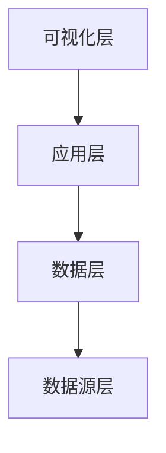

# 标准化项目立项技能

> **版本：** V1.0  
> **创建时间：** 2026-03-09 16:15  
> **作者：** 阿福  
> **适用场景：** 新项目立项、项目章程创建、干系人管理

---

## 🎯 技能描述

**标准化项目立项技能** - 一键生成完整的项目立项文档包

**核心价值：**
- ✅ 标准化立项流程（8 步法）
- ✅ 自动生成项目文档（章程/干系人/进度）
- ✅ 三线同步（MD+ 飞书+worklog）
- ✅ 最佳实践固化（参考 5+ 成功项目）

---

## 📋 使用场景

### 适用场景
- ✅ 新项目立项
- ✅ 项目章程创建
- ✅ 干系人登记册
- ✅ 进度追踪文档
- ✅ 飞书立项通知

### 不适用场景
- ❌ 项目执行过程管理
- ❌ 项目结项验收
- ❌ 项目风险管理（单独技能）

---

## 🚀 快速开始

### 命令格式
```bash
# 基础用法
npx skills standard-project-initiation "<项目名称>" "<一句话描述>"

# 完整用法
npx skills standard-project-initiation \
  --name "<项目名称>" \
  --desc "<一句话描述>" \
  --background "<项目背景>" \
  --goals "<项目目标>" \
  --milestones "<里程碑>" \
  --team "<团队成员>"
```

### 示例
```bash
# 示例 1：质量端到端打通项目
npx skills standard-project-initiation \
  "质量端到端打通" \
  "建立从市场反馈到根因追溯的全流程质量管理体系"

# 示例 2：龙虾究极进化项目
npx skills standard-project-initiation \
  "龙虾究极进化" \
  "OpenClaw 能力升级 + 玩家经验值系统完善"
```

---

## 📦 交付物清单

### 必选交付物
| 文件 | 说明 | 大小 |
|------|------|------|
| **项目章程.md** | 项目目标/范围/里程碑 | ~5KB |
| **干系人.md** | 团队成员/沟通计划 | ~4KB |
| **进度追踪.md** | 任务清单/进度跟踪 | ~4KB |

### 可选交付物
| 文件 | 说明 | 触发条件 |
|------|------|---------|
| **飞书立项文档** | 飞书追加通知 | --feishu 参数 |
| **worklog 记录** | 工作日志记录 | 默认执行 |
| **HTML 报告** | 专家点评报告 | --html 参数 |

---

## 🔧 8 步立项流程

### Step 1：项目信息收集（5 分钟）

**输入：**
- 项目名称
- 一句话描述
- 项目背景（可选）
- 项目目标（可选）

**输出：**
- 项目基本信息卡片

**模板：**
```markdown
# 项目基本信息

**项目名称：** [填写]
**项目代号：** [填写]
**一句话描述：** [填写]
**项目背景：** [填写]
**发起人：** [填写]
**创建时间：** YYYY-MM-DD HH:mm
```

---

### Step 2：目标定义（10 分钟）

**输入：**
- 业务目标（1-3 个）
- 技术指标（3-5 个）

**输出：**
- 项目目标章节
- 成功标准定义

**模板：**
```markdown
## 项目目标

### 业务目标
1. [目标 1] - [量化指标]
2. [目标 2] - [量化指标]
3. [目标 3] - [量化指标]

### 技术指标
- ✅ [指标 1] - [目标值]
- ✅ [指标 2] - [目标值]
- ✅ [指标 3] - [目标值]

### 成功标准
| 指标 | 目标值 | 当前值 | 状态 |
|------|--------|--------|------|
| [指标 1] | [目标] | [当前] | ⚪ |
```

---

### Step 3：里程碑规划（10 分钟）

**输入：**
- 项目周期
- 关键节点
- 交付物清单

**输出：**
- 里程碑表格
- 阶段划分

**模板：**
```markdown
## 项目里程碑

| 阶段 | 时间 | 里程碑 | 状态 |
|------|------|--------|------|
| 阶段 1 | YYYY-MM-DD | [里程碑 1] | ⚪ |
| 阶段 2 | YYYY-MM-DD | [里程碑 2] | ⚪ |
| 阶段 3 | YYYY-MM-DD | [里程碑 3] | ⚪ |
```

**最佳实践：**
- 阶段数：5-8 个为宜
- 周期：每个阶段 3-7 天
- 状态：⚪ 待开始 🟡 进行中 ✅ 已完成

---

### Step 4：团队组建（5 分钟）

**输入：**
- 核心成员（3-5 人）
- 干系人（5-10 人）

**输出：**
- 团队表格
- 干系人矩阵

**模板：**
```markdown
## 项目团队

### 核心成员
| 角色 | 人员 | 职责 |
|------|------|------|
| 项目负责人 | [姓名] | [职责] |
| 技术负责人 | [姓名] | [职责] |
| 产品经理 | [姓名] | [职责] |

### 干系人
| 角色 | 人员/部门 | 关注点 |
|------|----------|--------|
| 发起人 | [姓名] | [关注点] |
| 最终用户 | [部门] | [关注点] |
```

---

### Step 5：技术架构设计（10 分钟）

**输入：**
- 系统组件
- 数据源
- 集成关系

**输出：**
- 架构图（Mermaid）
- 系统清单

**模板：**
```markdown
## 技术架构

### 系统架构图


### 核心系统
| 系统 | 领域 | 数据内容 | 集成状态 |
|------|------|---------|---------|
| [系统 1] | [领域] | [数据] | ⚪ |
```

---

### Step 6：风险识别（5 分钟）

**输入：**
- 已知风险
- 潜在问题

**输出：**
- 风险矩阵
- 缓解措施

**模板：**
```markdown
## 风险与问题

### 已知风险
| 风险 | 影响 | 概率 | 缓解措施 |
|------|------|------|---------|
| [风险 1] | [高/中/低] | [高/中/低] | [措施] |

### 待解决问题
1. [问题 1] - [负责人] - [时间]
2. [问题 2] - [负责人] - [时间]
```

---

### Step 7：文档生成（5 分钟）

**输入：**
- 前 6 步收集的信息

**输出：**
- 项目章程.md
- 干系人.md
- 进度追踪.md

**文件结构：**
```
projects/项目名称/
├── 项目章程.md      # ~5KB
├── 干系人.md        # ~4KB
├── 进度追踪.md      # ~4KB
└── 会议纪要/        # （可选）
    └── 2026-03-09-立项会.md
```

---

### Step 8：三线同步（5 分钟）

**输入：**
- 生成的文档

**输出：**
- 飞书文档追加
- worklog 记录
- 知识库索引更新

**同步流程：**
```
1. 飞书文档追加（20-30 blocks）
   ↓
2. worklog 记录（Add-Content）
   ↓
3. 知识库索引更新（自动）
```

**检查清单：**
- [ ] 飞书文档链接已附带
- [ ] worklog 已记录
- [ ] 知识库索引已更新

---

## 📊 文档模板

### 项目章程模板

```markdown
# 🎯 [项目名称] - 项目章程

> **项目编号：** PROJECT-[缩写]-001  
> **创建时间：** YYYY-MM-DD HH:mm  
> **状态：** 🟡 立项阶段  
> **最后更新：** YYYY-MM-DD HH:mm

---

## 📋 项目概述

### 项目名称
**[项目名称]**（[英文名]）

### 项目代号
**[代号]** = [解释]

### 一句话描述
[一句话描述项目价值]

### 项目背景
**痛点：**
- 🔴 [痛点 1]
- 🔴 [痛点 2]

**业务价值：**
- ✅ [价值 1]
- ✅ [价值 2]

---

## 🎯 项目目标

### 核心目标

#### 业务目标
1. **[目标 1]** - [量化指标]
2. **[目标 2]** - [量化指标]
3. **[目标 3]** - [量化指标]

#### 技术指标
1. **[指标 1]** - [目标值]
2. **[指标 2]** - [目标值]
3. **[指标 3]** - [目标值]

### 成功标准

**业务指标：**
- ✅ [指标 1] ≥ [目标值]
- ✅ [指标 2] < [目标值]

**技术指标：**
- ✅ [指标 3] ≥ [目标值]
- ✅ [指标 4] < [目标值]

---

## 📅 项目里程碑

| 阶段 | 时间 | 里程碑 | 状态 |
|------|------|--------|------|
| **阶段 1** | YYYY-MM-DD | [里程碑 1] | ⚪ |
| **阶段 2** | YYYY-MM-DD | [里程碑 2] | ⚪ |
| **阶段 3** | YYYY-MM-DD | [里程碑 3] | ⚪ |

---

## 👥 项目团队

### 核心成员
| 角色 | 人员 | 职责 |
|------|------|------|
| **项目负责人** | [姓名] | [职责] |
| **技术负责人** | [姓名] | [职责] |
| **产品经理** | [姓名] | [职责] |

### 干系人
| 角色 | 人员/部门 | 关注点 |
|------|----------|--------|
| **发起人** | [姓名] | [关注点] |
| **最终用户** | [部门] | [关注点] |

---

## 📦 交付物清单

### 阶段 1：[阶段名称]（⚪ 待开始）
- [ ] [交付物 1]
- [ ] [交付物 2]
- [ ] [交付物 3]

### 阶段 2：[阶段名称]（⚪ 待开始）
- [ ] [交付物 1]
- [ ] [交付物 2]

---

## 🔧 技术架构

### 系统架构图


### 核心系统
| 系统 | 领域 | 数据内容 | 集成状态 |
|------|------|---------|---------|
| **[系统 1]** | [领域] | [数据] | ⚪ |

---

## ⚠️ 风险与问题

### 已知风险
| 风险 | 影响 | 概率 | 缓解措施 |
|------|------|------|---------|
| [风险 1] | 高 | 中 | [措施] |

### 待解决问题
1. **[问题 1]** - [负责人] - [时间]
2. **[问题 2]** - [负责人] - [时间]

---

## 📊 项目指标

### 技术指标
| 指标 | 目标值 | 当前值 | 状态 |
|------|--------|--------|------|
| [指标 1] | [目标] | [当前] | ⚪ |

### 业务指标
| 指标 | 目标值 | 当前值 | 状态 |
|------|--------|--------|------|
| [指标 2] | [目标] | [当前] | ⚪ |

---

## 🔗 关联文档

- **飞书文档** - [文档名称]（[链接]）
- **worklog 记录** - worklog.txt（已更新）

---

_[项目名称] | YYYY-MM-DD 立项_
```

---

## ✅ 检查清单

### 立项前检查
- [ ] 项目名称已确认
- [ ] 一句话描述已准备
- [ ] 项目背景已梳理
- [ ] 项目目标已定义
- [ ] 核心成员已确认

### 立项中检查
- [ ] 8 步流程已执行
- [ ] 3 个文档已生成
- [ ] 文档格式已检查
- [ ] 里程碑已规划
- [ ] 风险已识别

### 立项后检查
- [ ] 飞书文档已追加
- [ ] worklog 已记录
- [ ] 知识库索引已更新
- [ ] 团队已通知
- [ ] 干系人已确认

---

## 📚 最佳实践

### 命名规范
- **项目名称：** 中文为主，英文为辅
- **项目代号：** 2-4 字，易记易传播
- **项目编号：** PROJECT-[领域缩写]-[序号]

### 文档规范
- **文件大小：** 每个文档 3-6KB 为宜
- **章节数量：** 8-12 个章节
- **表格数量：** 5-10 个表格
- **里程碑数：** 5-8 个阶段

### 沟通规范
- **核心成员：** 3-5 人（宜少不宜多）
- **干系人：** 5-10 人（覆盖关键角色）
- **汇报频率：** 每周 1 次（里程碑加报）

---

## 🔗 参考项目

### 成功案例
1. **龙虾究极进化** - OpenClaw 能力升级（2026-03-09）
2. **供应商数据直连系统** - 小米供应链数据直连（2026-03-09）
3. **豆包会话自动化系统** - 豆包会话读取 + 专家点评（2026-03-05）
4. **地理知识库项目** - KML 地标导入 + 可视化（2026-03-05）
5. **健康管理项目** - 3 个月减重 15kg（2026-03-09）

### 参考文档
- 项目章程模板：`projects/质量端到端打通/项目章程.md`
- 干系人模板：`projects/质量端到端打通/干系人.md`
- 进度追踪模板：`projects/质量端到端打通/进度追踪.md`

---

## ⚠️ 注意事项

### 常见错误
- ❌ 目标不量化（无法验收）
- ❌ 里程碑过多（>10 个）
- ❌ 团队过大（>10 人）
- ❌ 风险未识别（被动应对）

### 避坑指南
- ✅ 目标 SMART 原则（具体/可衡量/可实现/相关/时限）
- ✅ 里程碑 5-8 个为宜
- ✅ 核心成员 3-5 人
- ✅ 风险提前识别 + 缓解措施

---

_标准化项目立项技能 | V1.0 | 2026-03-09_
