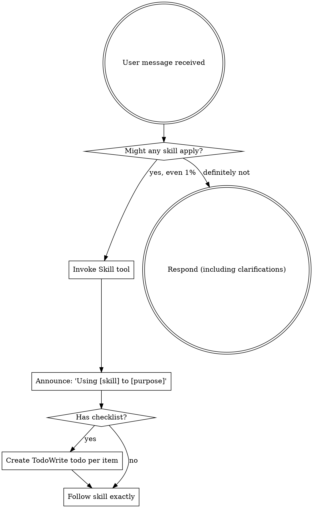

<EXTREMELY-IMPORTANT>
If you think there is even a 1% chance a skill might apply to what you are doing, you ABSOLUTELY MUST invoke the skill.

IF A SKILL APPLIES TO YOUR TASK, YOU DO NOT HAVE A CHOICE. YOU MUST USE IT.

This is not negotiable. This is not optional. You cannot rationalize your way out of this.
</EXTREMELY-IMPORTANT>

## How to Access Skills

**In Claude Code:** Use the `Skill` tool. When you invoke a skill, its content is loaded and presented to you—follow it directly. Never use the Read tool on skill files.

**In other environments:** Check your platform's documentation for how skills are loaded.

# Using Skills

## The Rule

**Invoke relevant or requested skills BEFORE any response or action.** Even a 1% chance a skill might apply means that you should invoke the skill to check. If an invoked skill turns out to be wrong for the situation, you don't need to use it.



## Red Flags

These thoughts mean STOP—you're rationalizing:

| Thought | Reality |
|---------|---------|
| "This is just a simple question" | Questions are tasks. Check for skills. |
| "I need more context first" | Skill check comes BEFORE clarifying questions. |
| "Let me explore the codebase first" | Skills tell you HOW to explore. Check first. |
| "I can check git/files quickly" | Files lack conversation context. Check for skills. |
| "Let me gather information first" | Skills tell you HOW to gather information. |
| "This doesn't need a formal skill" | If a skill exists, use it. |
| "I remember this skill" | Skills evolve. Read current version. |
| "This doesn't count as a task" | Action = task. Check for skills. |
| "The skill is overkill" | Simple things become complex. Use it. |
| "I'll just do this one thing first" | Check BEFORE doing anything. |
| "This feels productive" | Undisciplined action wastes time. Skills prevent this. |
| "I know what that means" | Knowing the concept ≠ using the skill. Invoke it. |

## Skill Priority

When multiple skills could apply, use this order:

1. **Process skills first** (brainstorming, debugging) - these determine HOW to approach the task
2. **Implementation skills second** (frontend-design, mcp-builder) - these guide execution

"Let's build X" → brainstorming first, then implementation skills.
"Fix this bug" → debugging first, then domain-specific skills.

## Skill Types

**Rigid** (TDD, debugging): Follow exactly. Don't adapt away discipline.

**Flexible** (patterns): Adapt principles to context.

The skill itself tells you which.

## User Instructions

Instructions say WHAT, not HOW. "Add X" or "Fix Y" doesn't mean skip workflows.

---

## 🆕 技能搜索失败时的自主思考流程（2026-03-09 新增）

**场景：** 当 find-skills 或技能库中没有符合用户偏好的技能时

**触发条件：**
- ✅ find-skills 返回结果不符合用户偏好（国产优先/低成本/小步快跑）
- ✅ 技能库中没有对应技能
- ✅ 需要自主思考解决方案

**自主思考流程：**

```
1. 读取用户偏好
   ↓
   - AGENTS.md（用户设置）
   - MEMORY.md（历史偏好）
   - best_practices.jsonl（最佳实践）
   ↓
2. 分析问题本质
   ↓
   - 第一性原理推导
   - 业务价值导向
   - MECE 法则（不重不漏）
   ↓
3. 生成解决方案
   ↓
   - 结合用户偏好评估
   - 定量对比（成本/时间/效果）
   - 推荐最优方案
   ↓
4. 生成 HTML 专家点评报告
   ↓
   - 调用 html-expert-review 技能
   - 生成完整分析报告
   - Chrome 打开预览（电脑端）
   ↓
5. HTML 转 PDF + 发送飞书
   ↓
   - 调用 triple-line-sync 脚本
   - PDF 发送到飞书（手机端）
   - 三线同步记录
   ↓
6. 固化到 Agent 知识库
   ↓
   - 更新 SKILL.md
   - 记录到 MEMORY.md
   - 添加到 best_practices.jsonl
```

**输出要求：**

| 输出 | 格式 | 位置 |
|------|------|------|
| **HTML 报告** | expert-review-日期 - 主题.html | workspace/ |
| **PDF 文件** | expert-review-日期 - 主题.pdf | workspace/ |
| **飞书消息** | PDF+ 文字总结 | 飞书端 |
| **worklog** | 记录执行过程 | worklog.txt |
| **memory** | 固化经验 | MEMORY.md |
| **技能更新** | 更新 SKILL.md | skills/*/ |

**三线同步执行：**

```bash
# 使用 triple-line-sync 脚本
node scripts/triple-line-sync.js expert-review.html "主题" "洞察 1/洞察 2/洞察 3"
```

**示例场景：**

**用户：** "帮我找个生图技能，要国产的、便宜的"

**流程：**
1. find-skills 搜索 → 返回结果不符合国产优先
2. 阿福自主思考 → 读取用户偏好（国产优先/低成本）
3. 分析问题 → 通义万相 vs Generate Image
4. 定量对比 → 成本/安装/使用难度
5. 推荐方案 → 通义万相（阿里云，国产优先）
6. 生成 HTML → expert-review-2026-03-09-anime-skill-recommendation.html
7. Chrome 打开 → 电脑端预览
8. 转 PDF → 发送飞书 → 手机端查看
9. 三线同步 → worklog + atomic-actions + 飞书通知
10. 固化知识 → 更新 SKILL.md + MEMORY.md

**关键原则：**

- ✅ **find-skills 只是工具** - 不提供最终决策
- ✅ **阿福自主思考** - 按用户偏好评估推荐
- ✅ **HTML 专家点评** - 完整分析过程固化
- ✅ **三线同步** - 电脑端 + 飞书端 + 记录同步
- ✅ **知识固化** - 每次思考都变成永久知识

---

## 📊 自主思考 vs 技能搜索

| 维度 | 技能搜索 | 自主思考 |
|------|---------|---------|
| **工具** | find-skills | 阿福大脑 |
| **排序** | 安装数/相关性 | 用户偏好 |
| **输出** | 技能列表 | HTML 专家报告 |
| **固化** | 技能文件 | HTML+PDF+ 三线同步 |
| **决策** | 用户决定 | 阿福推荐 + 用户决定 |

**最佳实践：**
1. 先用 find-skills 搜索（通用工具）
2. 如不符合偏好 → 阿福自主思考
3. 生成 HTML 专家点评报告
4. 三线同步固化知识

---

_最后更新：2026-03-09 09:35 - 添加自主思考流程（技能搜索失败时的处理）_
