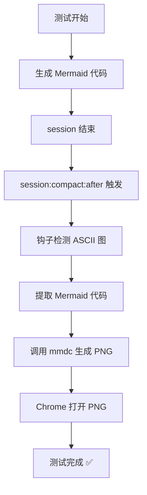

# Mermaid 钩子测试

## 测试流程图

## 测试说明

本测试用于验证 session 结束时的钩子是否能：
1. 自动检测 Markdown 文件中的 Mermaid 代码块
2. 调用 mmdc（Mermaid CLI）生成 PNG 图片
3. 自动用 Chrome 打开生成的 PNG 文件

## 预期结果

- ✅ 临时文件夹生成（包含 mermaid-cli 输出）
- ✅ PNG 文件生成
- ✅ Chrome 自动打开 PNG
- ✅ 日志中显示钩子触发记录

---
*测试时间：2026-03-13 18:45*
