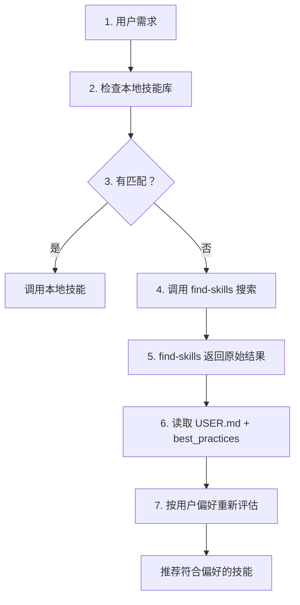

# 技能推荐工作流（固化版）

**创建时间：** 2026-03-09 07:58
**状态：** ✅ 已固化
**用户偏好：** 国产优先、低成本、小步快跑、性价比高

---

## 📊 7 步推荐流程



---

## 🔍 详细步骤说明

### 步骤 1：用户需求

**输入：** 用户询问技能（例如「有画图技能吗？」）

**关键：** 理解用户真实需求（画图 = 流程图/架构图 vs 艺术插图）

---

### 步骤 2：检查本地技能库

**工具：** using-superpowers 框架

**操作：**
```powershell
Get-ChildItem -Path "C:\Users\Xiabi\.openclaw\workspace\skills" -Recurse -Filter "*keyword*"
```

**决策：**
- ✅ 有匹配 → 调用本地技能
- ❌ 无匹配 → 进入步骤 3

---

### 步骤 3：调用 find-skills 搜索

**工具：** find-skills 技能

**操作：**
```bash
npx skills find "<关键词>"
```

**示例：**
```bash
npx skills find "diagram mermaid"
```

---

### 步骤 4：find-skills 返回原始结果

**排序规则：** 安装数 + 相关性（原生逻辑）

**返回格式：**
```
skill-name-1 (XK installs)
skill-name-2 (YK installs)
skill-name-3 (Z installs)
```

**关键：** find-skills 不做个性化排序，保持通用

---

### 步骤 5：读取用户偏好

**读取位置：**
1. `USER.md` - 永久记录用户偏好
2. `memory/self-improving/best_practices.jsonl` - 自我改进记忆

**用户偏好（四原则）：**

| 原则 | 权重 | 说明 |
|------|------|------|
| 国产优先 | ⭐⭐⭐⭐⭐ | 优先国产技能/API（硅基流动、阿里云等） |
| 低成本 | ⭐⭐⭐⭐⭐ | 优先免费/低价方案（有免费额度最佳） |
| 小步快跑 | ⭐⭐⭐⭐⭐ | 快速验证，试错成本低 |
| 性价比高 | ⭐⭐⭐⭐⭐ | 够用就好，不追求顶级功能 |

---

### 步骤 6：按用户偏好重新评估

**评估模板：**

```markdown
### [技能名]

**四原则评估：**
- 国产优先：[是/否] - [说明]
- 低成本：[费用] - [说明]
- 小步快跑：[学习成本] - [说明]
- 性价比高：[性价比] - [说明]

**总分：** X/20
```

**评分规则：**
- 符合原则：5 分
- 部分符合：3 分
- 不符合：1 分

---

### 步骤 7：推荐符合偏好的技能

**推荐格式：**

```markdown
## 🏆 推荐：[技能名]

**符合用户原则：**
- ✅ 国产优先 - [说明]
- ✅ 低成本 - [费用]
- ✅ 小步快跑 - [学习成本]
- ✅ 性价比高 - [性价比说明]

**安装命令：**
```bash
npx skills add [skill-slug] -g -y
```
```

---

## 🎯 关键原则

### find-skills 角色

**职责：**
- ✅ 只负责搜索（通用工具）
- ✅ 按安装数 + 相关性排序（原生逻辑）
- ❌ 不硬编码用户偏好（保持通用）
- ❌ 不修改技能文件

**原因：**
- find-skills 是通用技能，服务于所有用户
- 用户偏好应该由阿福（个性化助手）应用
- 分离关注点：搜索 vs 推荐

---

### 阿福角色

**职责：**
- ✅ 读取用户偏好（USER.md + best_practices）
- ✅ 按偏好重新评估和排序
- ✅ 推荐符合偏好的技能
- ✅ 解释推荐原因
- ✅ 记录新偏好到 USER.md

**原因：**
- 阿福是用户的个性化助手
- 阿福了解用户的历史偏好
- 阿福能提供个性化推荐

---

### 用户偏好管理

**存储位置：**

| 位置 | 文件 | 用途 | 更新方式 |
|------|------|------|---------|
| **USER.md** | `workspace/USER.md` | 永久记录用户偏好 | 阿福更新 |
| **best_practices** | `memory/self-improving/best_practices.jsonl` | 自我改进记忆 | 阿福记录 |
| **每日记忆** | `memory/YYYY-MM-DD.md` | 当天决策和学习 | 阿福记录 |

**不存储位置：**
- ❌ find-skills 技能文件（通用工具）
- ❌ AGENTS.md（通用规范，非特定用户偏好）

---

## 📋 评估示例

### 示例：画图技能推荐

**用户需求：** 画图技能（流程图、架构图）

**find-skills 返回：**
1. mermaid-diagrams (3.4K installs) - 国外
2. mermaid-diagram-specialist (379 installs) - 国外
3. mermaid-generator (11 installs) - 中国

**阿福评估：**

| 技能 | 国产 | 低成本 | 小步快跑 | 性价比 | 总分 |
|------|------|--------|---------|-------|------|
| mermaid-generator | 5⭐ | 5⭐ | 5⭐ | 5⭐ | **20/20** |
| mermaid-diagrams | 1⭐ | 5⭐ | 5⭐ | 5⭐ | 17/20 |
| mermaid-diagram-specialist | 1⭐ | 5⭐ | 4⭐ | 4⭐ | 15/20 |

**推荐：** mermaid-generator（中国用户，20/20 分）

---

## 🔄 工作流优化

### 持续改进

**每次推荐后：**
1. 记录用户反馈到 best_practices.jsonl
2. 如有新偏好，更新 USER.md
3. 记录到每日记忆（memory/YYYY-MM-DD.md）

**定期回顾：**
- 每周回顾 USER.md，更新偏好
- 每月回顾 best_practices，优化流程

---

## 📄 相关文件

**工作流文档：**
- `workflow-skill-recommendation.md`（本文档）
- `USER.md`（用户偏好）
- `AGENTS.md`（技能推荐流程规范）
- `memory/self-improving/best_practices.jsonl`（自我改进记忆）

**技能文件：**
- `skills/find-skills/SKILL.md`（搜索工具，不修改）
- `skills/using-superpowers/SKILL.md`（本地技能检查）

---

## ✅ 固化状态

**已更新文件：**
- ✅ USER.md - 添加技能推荐工作流章节
- ✅ AGENTS.md - 添加技能推荐流程规范章节
- ✅ best_practices.jsonl - 记录工作流
- ✅ workflow-skill-recommendation.md - 详细工作流文档

**状态：** 工作流已固化，下次推荐自动遵循！

---

_文档创建时间：2026-03-09 07:58_
