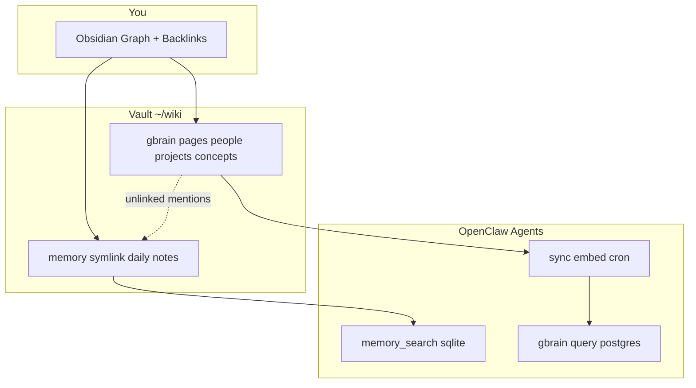

# GBrain Obsidian Vault — Give Your AI Memory a Face

> **One Obsidian vault. Three brains in sync.** OpenClaw daily notes + gbrain knowledge graph + vector search — finally visible as a **clickable graph**, not buried in SQLite and Postgres.

[](LICENSE)
[](https://clawhub.ai/skills/gbrain-obsidian-vault)
[](https://openclaw.ai)
[](https://obsidian.md)
[](https://cursor.com)
[](https://github.com/spikesubingrui-design/gbrain-obsidian-vault)

**中文** · [Why this exists](#why-star-this) · [60-second setup](#60-second-setup) · [Architecture](#architecture) · [Install](#installation)

---

## Why star this?

| Pain | This skill |
|------|------------|
| Agent "remembers" but you can't **see** the graph | Obsidian graph view on the same markdown |
| gbrain lives in **Postgres**; Obsidian only reads **files** | `gbrain export` materializes 400+ pages → wikilink resolution **28% → 84%** |
| OpenClaw `memory/` diaries separate from entity pages | Symlink `memory/` into vault; **Unlinked mentions** bridge both |
| Scared sync will **duplicate** daily notes into gbrain | Documented + scripted: `memory` in `.gitignore`; gbrain sync is **git-diff only** |
| Paid "second brain" SaaS | **Your** markdown on disk. MIT. No lock-in. |



---

## 60-second setup

```bash
# 1) Install skill
clawhub install gbrain-obsidian-vault
# or
git clone https://github.com/spikesubingrui-design/gbrain-obsidian-vault.git \
  ~/.openclaw/workspace/skills/gbrain-obsidian-vault

# 2) Wire vault (symlink memory + Obsidian config)
bash ~/.openclaw/workspace/skills/gbrain-obsidian-vault/scripts/setup-vault.sh

# 3) Materialize DB-only pages (if your graph feels empty)
gbrain export --dir ~/wiki

# 4) Open Obsidian → Open folder as vault → ~/wiki
```

**Triggers for your agent:** `obsidian脑库` · `第二大脑可视化` · `gbrain obsidian` · `memory图谱` · `连点成面`

---

## Architecture

Three layers, **one source of truth on disk**:

| Layer | What | Where |
|-------|------|--------|
| **Diary** | Raw agent + human daily logs | `~/.openclaw/workspace/memory/*.md` → symlinked as `~/wiki/memory/` |
| **Graph** | Entities, projects, synthesis | `~/wiki/{people,projects,concepts,...}/` + gbrain Postgres |
| **Recall** | Semantic search across sessions | `~/.openclaw/memory/*.sqlite` (unchanged; Obsidian doesn't touch this) |

**Edit loop:** You tweak a note in Obsidian → file on disk → existing gbrain cron `sync` + `embed` → Postgres + vectors update. No new pipeline to maintain.

See [`references/architecture.md`](references/architecture.md) for safety proofs (`isSyncable`, git-diff sync).

---

## Installation

### ClawHub (recommended)

```bash
clawhub login
clawhub install gbrain-obsidian-vault
```

### OpenClaw manual

```bash
git clone https://github.com/spikesubingrui-design/gbrain-obsidian-vault.git \
  ~/.openclaw/workspace/skills/gbrain-obsidian-vault
```

Add to `AGENTS.md` skillpack table:

```markdown
| "obsidian脑库" / "第二大脑可视化" / "gbrain obsidian" / "memory图谱" | `skills/gbrain-obsidian-vault/SKILL.md` |
```

### Cursor

```bash
git clone https://github.com/spikesubingrui-design/gbrain-obsidian-vault.git \
  ~/.cursor/skills/gbrain-obsidian-vault
```

Then: **「按 gbrain-obsidian-vault，帮我把 wiki 接到 Obsidian」**

---

## Prerequisites

| Tool | Role |
|------|------|
| [Obsidian](https://obsidian.md) | Desktop vault UI |
| [gbrain](https://github.com/spikesubingrui-design/gbrain) | Knowledge graph + `export` / `sync` |
| [OpenClaw](https://openclaw.ai) | Agent runtime + `memory_search` |
| Git repo at `~/wiki` | gbrain markdown root |

Optional: `brain-graph-viz.mjs` HTML export — complements Obsidian's native graph.

---

## What you get in Obsidian

- **Graph view** — clusters: people, companies, projects, synthesis themes
- **Backlinks** — who links to `projects/openclaw`
- **Unlinked mentions** — gbrain pages citing `memory/2026-04-29` without explicit `[[wikilink]]`
- **Search** — full-text across 400+ entity pages + daily notes

Example vault layout: [`examples/vault-layout.md`](examples/vault-layout.md)

---

## Repository layout

```
gbrain-obsidian-vault/
├── SKILL.md                    # Agent playbook
├── README.md
├── LICENSE
├── scripts/
│   └── setup-vault.sh          # Idempotent vault wiring
├── references/
│   └── architecture.md         # Safety + data flow deep dive
├── examples/
│   └── vault-layout.md
└── docs/
    └── LAUNCH.md               # Social / ClawHub publish copy
```

---

## Optional enhancements (not in v1.0)

- **Dataview** MOC homepage — dynamic index by `type` / `tags`
- **`[[memory/2026-04-29]]`** explicit links — needs gbrain namespace for `memory/` slugs
- **Obsidian Git** plugin — if you want mobile sync (we default to desktop-only)

---

## Ethics & data ownership

- All content stays **local markdown** under your `~/wiki` and OpenClaw workspace.
- This skill does not upload your vault; ClawHub ships **instructions + setup script only**.

---

## Related

- [OpenClaw](https://openclaw.ai) — agent + memory_search
- [human-distill](https://github.com/spikesubingrui-design/human-distill) — distill creators *into* this graph
- [memory-setup-openclaw](https://clawhub.ai/skills/memory-setup) — fix embedding / recall first

---

## Contributing

PRs welcome: better `setup-vault.sh` portability (Linux paths), Dataview MOC template, alias-fix script for Title-Case wikilinks.

1. Fork → branch → PR  
2. Keep `SKILL.md` actionable; long theory in `references/`

---

## License

[MIT](LICENSE)

---

<p align="center">
  If your AI finally has a brain you can <em>see</em>,<br/>
  <a href="https://github.com/spikesubingrui-design/gbrain-obsidian-vault"><strong>⭐ Star the repo</strong></a> — it helps builders find local-first second brains.
</p>
