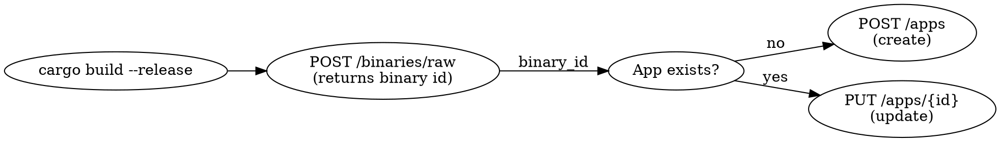

# FastEdge

Build and deploy WebAssembly HTTP applications to the Gcore FastEdge edge computing platform using the Rust SDK.

## Prerequisites

- `rustup` + `cargo` with the `wasm32-wasip1` target
- `GCORE_API_KEY` — Gcore API token from https://accounts.gcore.com/account-settings/api-tokens
- `python3` (only for the `scripts/build_rust.py` helper; the raw `curl`/`cargo` flow needs nothing extra)

```bash
rustup target add wasm32-wasip1
export GCORE_API_KEY="your_api_token"   # keep out of shared shells and logs; rotate after use
```

## Workflow

Deploying is three steps: **build** the Wasm → **upload** the binary (get a `binary_id`) → **create/update** the app referencing that binary.



## 1. Scaffold a project

Copy `assets/rust-template/` for a ready starter, or create the three files manually:

`.cargo/config.toml`
```toml
[build]
target = "wasm32-wasip1"
```

`Cargo.toml`
```toml
[package]
name = "myapp"
version = "0.1.0"
edition = "2021"

[lib]
crate-type = ["cdylib"]

[dependencies]
fastedge = "0.2"

[profile.release]
opt-level = "z"   # optimize for size — smaller Wasm = faster cold start
lto = true
strip = true
```

`src/lib.rs`
```rust
use fastedge::{
    body::Body,
    http::{Request, Response, StatusCode, Error},
};

#[fastedge::http]
fn main(_req: Request<Body>) -> Result<Response<Body>, Error> {
    Response::builder()
        .status(StatusCode::OK)
        .header("content-type", "text/plain")
        .body(Body::from("Hello from FastEdge!"))
}
```

## 2. Build

```bash
cargo build --release
# Output: target/wasm32-wasip1/release/myapp.wasm
```

Cargo replaces `-` with `_` in the artifact name (`my-app` → `my_app.wasm`).

### Build fails with `can't find crate for core`/`std` (multiple Rust installs)

If `cargo build` errors with `error[E0463]: can't find crate for 'core'` (or `std`) and hints "the `wasm32-wasip1` target may not be installed" — **even though `rustup target add wasm32-wasip1` reports it's already installed** — your `cargo`/`rustc` on PATH is not rustup's. This is common on **macOS with Homebrew**: `brew install rust` puts `/opt/homebrew/bin/{cargo,rustc}` ahead of rustup's shims, and Homebrew's Rust does not carry the rustup-managed wasm target.

Diagnose:
```bash
which -a rustc cargo     # is /opt/homebrew/bin (or other) before ~/.cargo/bin?
rustc --version          # Homebrew builds print "(Homebrew)"
rustup which rustc       # the toolchain that actually HAS the target
```

Fix — force both tools to come from rustup (portable, no hardcoded target triple):
```bash
RUSTC="$(rustup which rustc)" "$(rustup which cargo)" build --release
```

> `rustup run stable cargo build` is **not** enough if your shell profile re-prepends Homebrew's bin to PATH afterward — `rustc` still resolves to Homebrew. Setting `RUSTC` explicitly bypasses PATH. The `build_rust.py` helper already resolves cargo/rustc via `rustup which` automatically (override with `CARGO`/`RUSTC` env vars), so it builds correctly even when a foreign cargo is first on PATH.

Permanent fix: ensure rustup's shims (`~/.cargo/bin`) precede `/opt/homebrew/bin` in your PATH, or `brew uninstall rust` and use rustup exclusively.

## 3. Deploy

### Option A — helper script (recommended)

`scripts/build_rust.py` does build, upload, and deploy. Requires the `requests` package (`uv pip install requests` or `pip install requests`) and `GCORE_API_KEY`.

```bash
# One-shot: build + upload + create app
python3 scripts/build_rust.py release --app-name my-app-name

# One-shot: build + upload + update an existing app
python3 scripts/build_rust.py release --app-name my-app-name --app-id 456

# Individual steps
python3 scripts/build_rust.py build                                    # compile only
python3 scripts/build_rust.py upload                                   # build + upload, prints binary id
python3 scripts/build_rust.py deploy --binary-id 123 --app-name foo    # create from an existing binary
python3 scripts/build_rust.py deploy --binary-id 124 --app-id 456 --app-name foo  # update
```

### Option B — raw API

Upload the binary (save the `id` from the response):
```bash
curl -X POST 'https://api.gcore.com/fastedge/v1/binaries/raw' \
  -H 'accept: application/json' \
  -H "Authorization: APIKey $GCORE_API_KEY" \
  -H 'Content-Type: application/octet-stream' \
  --data-binary '@./target/wasm32-wasip1/release/myapp.wasm'
```

Create the app:
```bash
curl -X POST 'https://api.gcore.com/fastedge/v1/apps' \
  -H 'accept: application/json' \
  -H 'client_id: 0' \
  -H "Authorization: APIKey $GCORE_API_KEY" \
  -H 'Content-Type: application/json' \
  -d '{"name": "my-app-name", "binary": BINARY_ID, "status": 1}'
```

App URL: `https://my-app-name-XXXX.fastedge.app`

Update an existing app (re-deploy a new binary):
```bash
curl -X PUT 'https://api.gcore.com/fastedge/v1/apps/APP_ID' \
  -H 'accept: application/json' \
  -H "Authorization: APIKey $GCORE_API_KEY" \
  -H 'Content-Type: application/json' \
  -d '{"binary": NEW_BINARY_ID, "status": 1, "name": "app-name"}'
```

> Before any upload/create/update, confirm the artifact, target app name, `binary_id`, and `app_id` — these commands publish to a live edge endpoint.

## 4. Configuration: env vars, secrets & KV storage

> For the complete, current API surface (every endpoint and field), fetch
> **https://gcore.com/docs/fastedge/llms.txt** and follow the links for the
> specific feature — the snippets below cover the common paths only.

Apps read configuration three ways, all set in the app body (`POST /apps` or
`PUT /apps/{id}`). **A `PUT` replaces the whole config** — re-send `env`,
`secrets`, and `stores` on every update or the omitted maps are wiped.

### Environment variables (non-sensitive)

App config: `"env": {"MY_VAR": "value"}`. Read in Wasm with `std::env::var("MY_VAR")`.

### Secrets (tokens, API keys — encrypted at rest)

Two steps: create the secret, then bind it to the app under the key your code reads.

```bash
# 1) Create — note the "id" in the response.
curl -X POST 'https://api.gcore.com/fastedge/v1/secrets' \
  -H "Authorization: APIKey $GCORE_API_KEY" -H 'Content-Type: application/json' \
  -d '{
    "name": "my-bot-token",
    "comment": "Telegram bot token",
    "secret_slots": [ { "slot": 1700000000, "value": "s3cr3t-value" } ]
  }'
```

`slot` is the unix timestamp from which the value becomes effective. Use a
**past** time (e.g. `date -d '1 hour ago' +%s`) — a future slot means the secret
is not active yet and reads return `None`. Rotate by adding a newer slot.

Bind it in the app body (the map key is what the Wasm looks up):
```jsonc
"secrets": { "MY_BOT_TOKEN": { "id": SECRET_ID } }
```

Read in Wasm:
```rust
// In fastedge 0.2.0, secret::get returns Result<Option<String>> — bind the value
// directly. (docs.rs shows Vec<u8>; newer crate versions may differ — trust what
// the compiler reports rather than calling String::from_utf8 unconditionally.)
if let Ok(Some(token)) = fastedge::secret::get("MY_BOT_TOKEN") {
    // token: String
}
```

### KV / edge storage (persistent key-value)

```bash
# Create a store — returns an "id". Optionally back it with your own Redis via
# "byod": {"url": "redis://host:6379/0", "prefix": "app:prod:"}.
curl -X POST 'https://api.gcore.com/fastedge/v1/kv' \
  -H "Authorization: APIKey $GCORE_API_KEY" -H 'Content-Type: application/json' \
  -d '{"name": "my-store", "comment": "lead cache"}'
```

Bind it to the app:
```jsonc
"stores": { "my-store": { "id": STORE_ID } }
```

Read in Wasm via the `key_value` module:
```rust
use fastedge::key_value::Store;
let store = Store::open("my-store")?;          // Result<Store, Error>
if let Some(bytes) = store.get("some-key")? {  // get -> Result<Option<Vec<u8>>>
    let value = String::from_utf8_lossy(&bytes);
}
```

Related storage APIs in the SDK: `fastedge::cache` (`get(key)` /
`set(key, content, ttl_ms)`) for ephemeral per-region caching, and
`fastedge::dictionary` for fast read-only config lookups.

## Patterns

### HTML response
```rust
Response::builder()
    .status(StatusCode::OK)
    .header("content-type", "text/html; charset=utf-8")
    .body(Body::from(html_string))
```

Embedding a whole HTML page as a Rust string literal? Use a raw string with **double** hashes — `r##" ... "##` — not `r#" ... "#`. A single-hash raw string is terminated by the sequence `"#`, which appears in any `href="#anchor"` fragment link. Double hashes only close on `"##`, which HTML practically never contains.

### Read request headers
```rust
let ip = req.headers()
    .get("x-real-ip")
    .and_then(|v| v.to_str().ok())
    .unwrap_or("unknown");
```

Headers FastEdge provides:

| Header | Meaning |
|--------|---------|
| `x-real-ip` | Client IP address |
| `x-forwarded-for` | Proxied client IP chain |
| `geoip-country-code` | Country code |
| `geoip-city` | City name |
| `host` | Request host |

## Common mistakes

| Symptom | Fix |
|---------|-----|
| `can't find crate for core`/`std`, target "may not be installed" — but it *is* | Wrong `cargo`/`rustc` on PATH (e.g. Homebrew shadowing rustup). See [Build fails…](#build-fails-with-cant-find-crate-for-corestd-multiple-rust-installs) above |
| `cargo build` produces no `.wasm` (and target genuinely missing) | `rustup target add wasm32-wasip1`, and ensure `.cargo/config.toml` sets the target |
| No `.wasm` at expected path | Cargo turned `-` into `_`; check `target/wasm32-wasip1/release/*.wasm` |
| `401`/auth errors on API calls | `GCORE_API_KEY` unset or wrong; header must be `Authorization: APIKey $GCORE_API_KEY` |
| Linker errors building Wasm | `crate-type = ["cdylib"]` missing from `[lib]` |
| Raw-string HTML page won't compile | `href="#id"` closes an `r#"..."#` string. Use `r##"..."##` (or more `#`) when the HTML contains `"#` |
| `secret::get(...)` value won't compile / type mismatch | In fastedge 0.2.0 it returns `Option<String>`, not `Option<Vec<u8>>` — bind the value directly, don't `String::from_utf8`. Match on what the compiler reports for your version |
| Secret reads return `None` at runtime | The secret's `slot` is a future timestamp; use a past unix time so it's effective now |
| `env`/`secrets`/`stores` disappear after an app update | `PUT /apps/{id}` replaces the entire config; re-send all of them (plus `name`, `binary`, `status`) every time |

## Resources

- Starter template: `assets/rust-template/`
- Build/deploy helper: `scripts/build_rust.py`
- **Full API reference for LLMs: https://gcore.com/docs/fastedge/llms.txt** — fetch this and follow the per-feature links before guessing endpoints/fields
- Gcore FastEdge docs: https://gcore.com/docs/fastedge
- Edge storage (KV) API: https://gcore.com/docs/api-reference/fastedge/edge-storage/create-a-new-edge-store
- API tokens: https://accounts.gcore.com/account-settings/api-tokens
