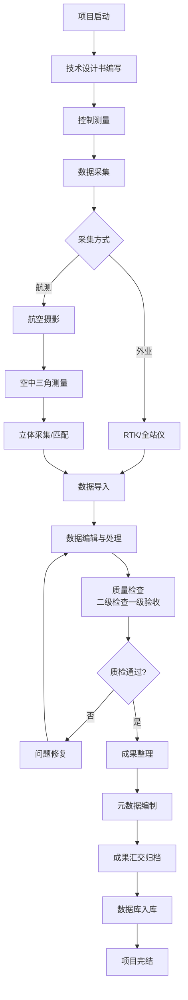
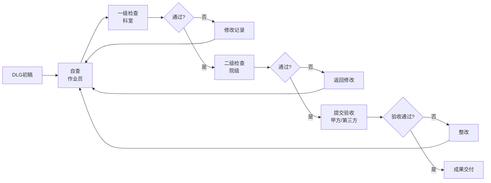
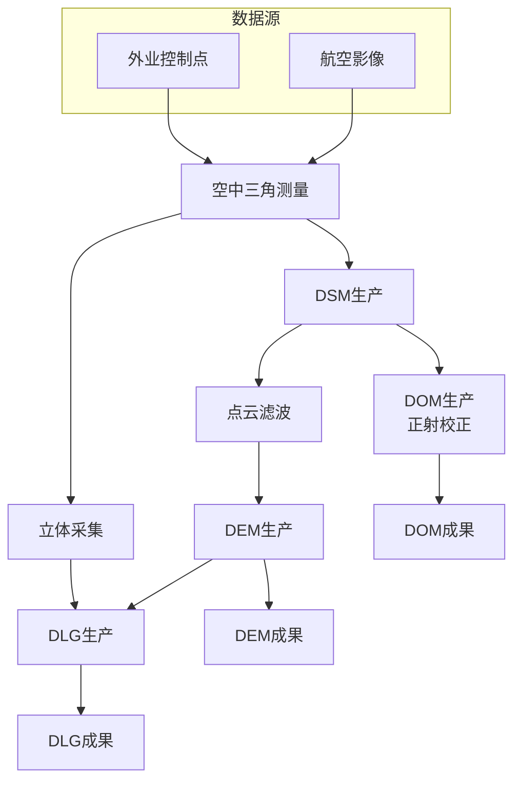
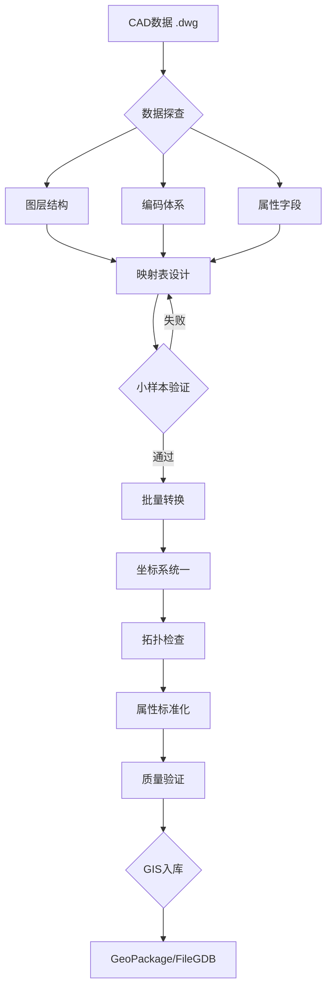
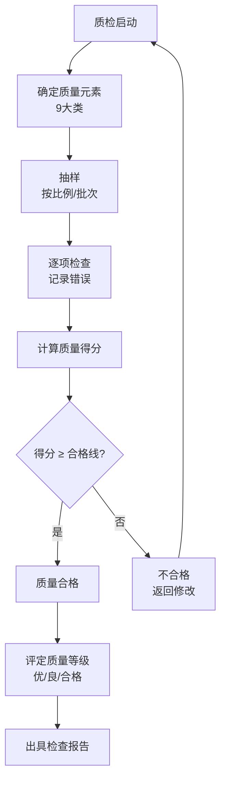
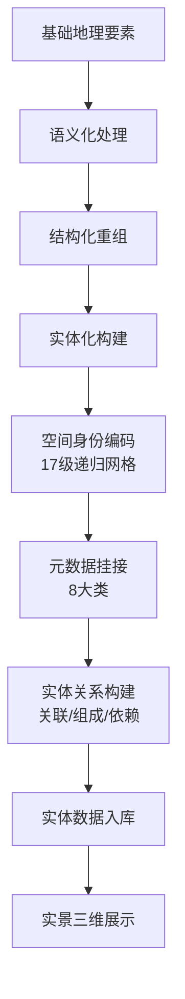
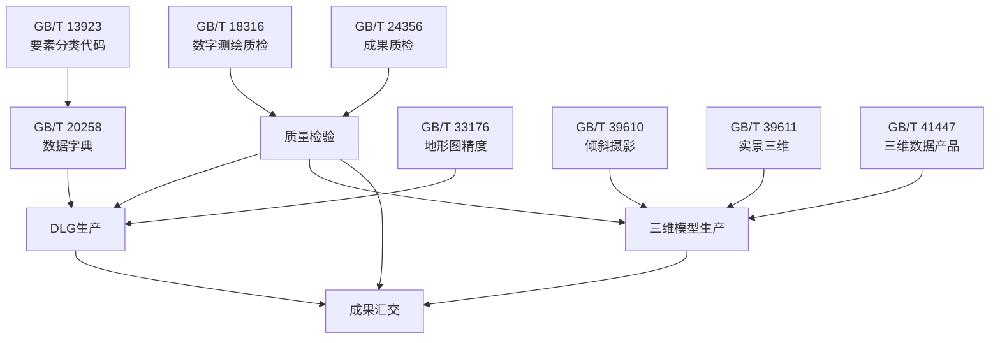

# 测绘建库行业标准流程图集 | 关联：05_国家测绘标准体系.md 06_数据生产流程规范.md 07_质量检查与验收标准.md | 来源：行业标准归纳

> 将测绘建库关键流程转化为 Mermaid 流程图，便于直接理解标准执行逻辑。

---

## 一、测绘建库全生命周期流程

---

## 二、DLG 生产质检流程

---

## 三、4D产品生产依赖关系

---

## 四、CAD→GIS 标准转换流程

---

## 五、质量评定计分流程

---

## 六、新型基础测绘实体生产流程

---

## 七、标准引用关系网络

---

> 关联阅读：`05_国家测绘标准体系.md`（标准编号） | `06_数据生产流程规范.md`（流程详解） | `07_质量检查与验收标准.md`（质检细则）

<!-- wm:坤图_GIS:V1.0 -->
