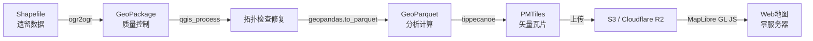

# 格式选择决策树与反模式 | 关联：←→ 03_数据模型与格式.md, ←→ 29_避坑库.md, ←→ 41_现代GIS数据处理管道.md | 来源：open-gis-main 12 anti-patterns + QGIS-Claude-Skill-Package 19 anti-patterns

> **群组六：现代GIS技术栈 | 文件编号：43**
> 最后更新：2026-06-04 | 适用场景：格式选型、反模式识别、2026年技术栈决策

---

## 一、格式选择决策树

### 1.1 矢量数据存储决策树

```
我有矢量数据需要存储
│
├─ 数据量 < 100MB，需要人可读 / API 返回？
│   └─ 是 → GeoJSON（简单、通用）
│   └─ 否 → 继续判断
│
├─ 需要在桌面软件（QGIS/ArcGIS Pro）中编辑？
│   └─ 是 → GeoPackage（单文件、支持拓扑规则、UTF-8）
│   └─ 否 → 继续判断
│
├─ 需要大规模分析（GB~TB级）？
│   ├─ 列式存储 + 云原生需求？
│   │   └─ 是 → GeoParquet（DuckDB Spatial / GeoPandas 原生支持）
│   │   └─ 否 → PostGIS（并发写入/事务/空间索引）
│
├─ 需要高性能随机访问（Web端按需读取）？
│   └─ 是 → FlatGeobuf（索引 + 二进制，查询速度远超GeoJSON）
│   └─ 否 → 继续判断
│
├─ 需要流式传输 / 管道处理？
│   └─ 是 → GeoJSONSeq（逐行解析，内存恒定）
│   └─ 否 → 默认选择 GeoPackage
```

**快速参考表：**

| 场景 | 推荐格式 | 次选 | 理由 |
|------|---------|------|------|
| 小型矢量交换 | GeoJSON | GeoPackage | 人可读，所有GIS库原生支持 |
| 桌面编辑与归档 | **GeoPackage** | GDB | 单文件、无大小限制、UTF-8 |
| 大规模分析（列存） | **GeoParquet** | FlatGeobuf | 压缩率高，DuckDB/GIS直接查询 |
| Web端按需加载 | **FlatGeobuf** | PMTiles(矢量) | 空间索引，HTTP Range请求 |
| 流式ETL管道 | **GeoJSONSeq** | — | 逐行处理，O(1)内存 |
| 多用户并发编辑 | **PostGIS** | SpatiaLite | 事务、行锁、空间索引 |

---

### 1.2 栅格数据存储决策树

```
我有栅格数据需要存储
│
├─ 需要云原生 / HTTP 按需读取？
│   ├─ 是 → COG（Cloud Optimized GeoTIFF）
│   │        内部组织 + HTTP Range Request = 只读需要的瓦片
│   └─ 否 → 继续判断
│
├─ 多波段 + 时间序列（气象/遥感时序）？
│   ├─ 是 → Zarr（分块存储 + 并行读写）
│   │     或 NetCDF（科学计算标准，xarray原生）
│   └─ 否 → 继续判断
│
├─ 需要作为底图瓦片服务发布？
│   ├─ 是 → MBTiles 或 PMTiles（栅格）
│   │     PMTiles 更优（单文件 + S3/CDN友好）
│   └─ 否 → 继续判断
│
├─ 点云数据？
│   └─ 是 → COPC（Cloud Optimized Point Cloud）
│
└─ 通用存储 → COG（默认推荐）或 GeoTIFF（传统场景）
```

**快速参考表：**

| 场景 | 推荐格式 | 次选 | 理由 |
|------|---------|------|------|
| 影像归档与共享 | **COG** | GeoTIFF | 云原生、按需读取、内部组织优化 |
| 时序多维数组分析 | **Zarr** | NetCDF | 分块并行，xarray/dask原生 |
| 科学计算交换 | **NetCDF** | Zarr | CF约定广泛支持 |
| 底图瓦片服务 | **PMTiles(raster)** | MBTiles | 单文件、S3直接托管 |
| 点云归档与分析 | **COPC** | LAS | 云原生点云，八叉树索引 |
| 传统桌面处理 | GeoTIFF | ERDAS IMG | 兼容性最广 |

---

### 1.3 Web地图服务决策树

```
我需要发布Web地图服务
│
├─ 矢量数据？
│   ├─ 数据量大（百万+要素）？
│   │   └─ 是 → PMTiles(矢量) + MapLibre
│   │           或 FlatGeobuf + 后端API
│   │   └─ 否 → GeoJSON 直接嵌入 / MVT动态切片
│
├─ 栅格/影像底图？
│   ├─ 需要云端托管（零服务器）？
│   │   └─ 是 → PMTiles(栅格) 托管到 S3/Cloudflare R2
│   │   └─ 否 → MBTiles + TileServer GL / Martin
│
├─ 需要动态样式切换？
│   └─ 是 → MVT（Mapbox Vector Tiles）+ MapLibre Style
│          动态渲染在客户端完成
│
└─ 需要WMS/WMTS标准兼容？
    └─ 是 → GeoServer / QGIS Server（遗留系统对接用）
```

---

### 1.4 数据交换决策树

```
我需要在软件之间交换数据
│
├─ QGIS ↔ ArcGIS Pro 互操作？
│   └─ **GeoPackage**（双方原生支持，无损往返）
│
├─ Python/R ↔ GIS桌面软件？
│   ├─ 分析结果输出 → GeoPackage 或 GeoParquet
│   └─ 中间格式 → GeoJSON（调试）/ GeoParquet（生产）
│
├─ FME / ETL 管道中间格式？
│   └─ GeoPackage（写一次读多次）或 GeoJSONSeq（流式）
│
├─ 提交给测绘成果库？
│   └─ 按项目规范执行（通常 VCT / MDB / GDB）
│      如无特殊要求 → 推荐争取使用 **GeoPackage**
│
└─ 给非技术人员交付？
    └─ GeoPackage（QGIS免费打开）或 KMZ（Google Earth）
```

---

### 1.5 数据归档决策树

```
我需要长期归档数据
│
├─ 矢量归档（5-10年以上）？
│   └─ **GeoPackage**（OGC标准、单文件、自描述元数据）
│      避免：Shapefile（多文件易丢失）、GeoJSON（体积大、无空间索引）
│
├─ 栅格归档？
│   └─ **COG**（内部自描述、未来验证成本低）
│      辅助：附上原始传感器数据 + 处理参数清单
│
├─ 项目完整归档（多源异构）？
│   └─ **GeoPackage（矢量）+ COG（栅格）+ 元数据PDF**
│      统一放入版本控制的目录结构
│
└─ 法规合规归档（测绘成果）？
    └─ 按国家/行业标准（CH/T 规范），格式由验收方指定
       技术建议：争取以 GeoPackage 作为电子载体
```

---

## 二、Shapefile 淘汰时间线

### 2.1 Shapefile 必须被淘汰的原因

Shapefile（.shp）诞生于 **1998年**，是 Esri 为 ArcView 3.x 设计的格式。近30年后，其设计缺陷已成为现代GIS工作流的核心瓶颈：

| # | 缺陷 | 具体影响 | 严重程度 |
|---|------|---------|----------|
| 1 | **2GB 文件大小限制**（.shp 使用32位偏移量） | 大城市路网、全国级行政区划无法单文件存储；需手动分割 | 🔴 致命 |
| 2 | **10字符字段名限制**（dBASE III规范） | `land_use_type` 被截断为 `land_use_t`，属性语义丢失 | 🔴 致命 |
| 3 | **NULL vs 空字符串混淆** | dBASE 不区分 NULL 和空串，统计分析产生错误结果 | 🟠 严重 |
| 4 | **UTF-8 支持不标准**（依赖 .cpg 文件，非原始规范） | 中文属性乱码频发；不同软件对 .cpg 解析不一致 | 🔴 致命 |
| 5 | **多文件依赖**（至少 .shp/.shx/.dbf 三个文件，实际常需 .prj/.cpg/.sbn/.sbx） | 传输/归档时遗漏文件导致数据损坏；版本管理困难 | 🟠 严重 |
| 6 | **不支持拓扑** | 无法存储要素间共享边/节点关系；需外部维护一致性 | 🟡 中等 |
| 7 | **元数据标准缺失** | 无内建机制存储坐标系以外的描述信息 | 🟡 中等 |
| 8 | **仅支持简单要素类型**（Point/Line/Polygon/Multi*） | 不支持 Curve、Surface、TIN 等 ISO 19107 类型 | 🟡 中等 |
| 9 | **字段类型有限** | 仅支持 Number/Date/Text/Boolean；无整型/浮点精度控制 | 🟠 严重 |
| 10 | **无空间索引内置**（.sbn/.sbx 为Esri专有） | 大数据量渲染和查询性能差 | 🟠 严重 |

### 2.2 现代替代方案对照表

| 原Shapefile使用场景 | **推荐替代方案** | 关键优势 |
|---------------------|---------------|---------|
| 软件间数据交换 | **GeoPackage** (.gpkg) | OGC标准、单文件、无字段名长度限制、UTF-8原生、支持空间索引和完整性约束 |
| 大规模数据分析 | **GeoParquet** (.parquet) | 列式压缩（10:1~20:1）、Schema演化、云对象存储原生、DuckDB Spatial直查 |
| Web地图服务 | **PMTiles** / **FlatGeobuf** | 单文件、HTTP Range按需读取、无需服务器端渲染、CDN友好 |
| API接口载荷 | **GeoJSON** (.json) | RESTful生态原生、所有Web框架支持、前端直接渲染 |
| 流式ETL管道 | **GeoJSONSeq** (.geojsonseq / .jsonseq) | 逐行JSON、O(1)内存、`|`管道友好的Unix哲学 |
| 桌面编辑（ArcGIS生态） | **File Geodatabase** (.gdb) | ArcGIS Pro首选、支持拓扑/域/子类型、性能优异 |
| 桌面编辑（开源生态） | **GeoPackage** (.gpkg) | QGIS/SuperMap/FME全平台支持、SQLite引擎可靠性 |

### 2.3 淘汰行动建议

| 时间窗口 | 行动 | 目标 |
|---------|------|------|
| **立即** | 新建项目禁止输出 Shapefile | 从源头切断增量 |
| **3个月内** | 将现有Shapefile批量转换为 GeoPackage | `ogr2ogr -f GPKG output.gpkg input.shp` |
| **6个月内** | 移除脚本中的 Shapefile 读/写路径 | 全面替换为 GeoPackage / GeoParquet |
| **12个月内** | 归档历史Shapefile为只读副本，不再作为活跃数据源 | 完成淘汰 |

> **转换命令速查：**
> ```bash
> # Shapefile → GeoPackage（保留全部）
> ogr2ogr -f GPKG output.gpkg input.shp
>
> # Shapefile → GeoParquet（推荐用于分析）
> ogr2ogr -f Parquet -lco COMPRESSION=SNAPPY output.parquet input.shp
>
> # 目录下所有Shapefile批量转GeoPackage
> for f in *.shp; do
>   base="${f%.shp}"
>   ogr2ogr -f GPKG "${base}.gpkg" "${base}.shp"
> done
> ```

---

## 三、格式对比矩阵

### 3.1 全格式横向对比

| 格式 | 类型 | 大小限制 | 云原生 | 拓扑支持 | UTF-8 | 内建元数据 | 最佳场景 | 应避免场景 |
|------|------|---------|--------|---------|-------|-----------|---------|-----------|
| **Shapefile** | 矢量 | 2GB | ✗ | ✗ | ⚠️(.cpg) | ✗ | 遗留系统兼容 | 所有新项目 |
| **GeoJSON** | 矢量 | 受JS限制 | ✗ | ✗ | ✓ | ✓ | API/Web小数据 | GB级数据传输/存储 |
| **GeoPackage** (.gpkg) | 矢量 | ~100TB (SQLite) | △ | ✓ | ✓ | ✓ | 桌面交换/归档/编辑 | 高并发写入（用PostGIS） |
| **GeoParquet** (.parquet) | 矢量 | ~PB | ✓ | ✗ | ✓ | ✓ | 大规模分析/数据湖 | 实时编辑/事务 |
| **FlatGeobuf** (.fgb) | 矢量 | ~4GB | ✓ | ✗ | ✓ | ✗ | Web按需读取矢量 | 复杂属性编辑 |
| **File GDB** (.gdb) | 矢量 | ~256TB (目录) | ✗ | ✓ | ✓ | ✓ | ArcGIS Pro深度应用 | 跨平台/非Esri生态 |
| **PostGIS** | 矢量数据库 | 取决于PG | △ | ✓ | ✓ | ✓ | 多用户/事务/服务 | 嵌入式/离线场景 |
| **SpatiaLite** | 矢量 | ~100TB (SQLite) | ✗ | ✓ | ✓ | ✓ | 轻量本地空间DB | 高并发/写入密集 |
| **COG** | 栅格 | ~4GB/文件 | ✓ | N/A | ✓(GTiff) | ✓ | 云端影像服务 | 非Web环境传统流程 |
| **GeoTIFF** (.tif) | 栅格 | ~4GB/文件 | ✗ | N/A | ✓ | ✓ | 通用栅格存储 | Web按需访问（应转为COG） |
| **NetCDF** (.nc/.nc4) | 栅格/多维 | ~PB | △ | N/A | ✓ | ✓(CF) | 气象海洋科学数据 | Web端直接浏览 |
| **Zarr** (.zarr) | 栅格/多维 | ~PB | ✓ | N/A | ✓ | ✓ | 分布式时序分析 | 简单单机使用（过重） |
| **MBTiles** | 栅格/矢量 | ~100TB (SQLite) | △ | N/A | ✓ | ✓ | 离线底图包 | 新Web项目（用PMTiles） |
| **PMTiles** | 栅格/矢量/矢量瓦片 | ~PB | ✓ | N/A | ✓ | ✗ | 零服务器Web地图 | 需要复杂服务端逻辑 |
| **COPC** | 点云 | ~PB | ✓ | N/A | ✓ | ✓ | 点云归档与分析 | 需要频繁编辑 |

**图例说明：**

- `✓` 支持 | `✗` 不支持 | `⚠️` 部分/非标准 | `△` 需额外组件

### 3.2 按关键能力排序

#### 最适合云原生的格式（TOP 5）

| 排名 | 格式 | 核心云特性 | 典型用法 |
|------|------|-----------|---------|
| 1 | **PMTiles** | 单文件 + HTTP Range Request，可直接托管于 S3/R2/GCS | 零服务器地图发布 |
| 2 | **COG** | Internal Overviews + HTTP Range，只读所需分辨率/区域 | 云端 imagery 服务 |
| 3 | **GeoParquet** | 列式 + Row Group，S3 Select 可过滤后下载 | 数据湖空间分析 |
| 4 | **COPC** | 八叉树空间索引 + 离散化连续变化，按需请求点云块 | 浏览器端点云可视化 |
| 5 | **Zarr** | Chunk Store 抽象，兼容 S3/Azure/GCS/HDFS | 分布式气候模拟 |

#### 最适合分析的格式（TOP 5）

| 排名 | 格式 | 分析工具链 | 典型操作 |
|------|------|-----------|---------|
| 1 | **PostGIS + SQL** | SQL空间函数 | 窗口聚合、空间连接、事务批处理 |
| 2 | **GeoParquet** | DuckDB Spatial / Polars | 列式扫描、谓词下推、零拷贝读取 |
| 3 | **GeoPackage** | QGIS / GDAL/OGR | 桌面QA/QC、拓扑检查、属性编辑 |
| 4 | **COG** | rioxarray / GDAL VSI | 虚拟镶嵌、波段运算、重采样 |
| 5 | **NetCDF/Zarr** | xarray + dask | 维度约简、时空切片、分布式计算 |

---

## 四、12个致命反模式（open-gis-main）

> 以下每个反模式均遵循 **WRONG 代码 → CORRECT 代码 → WHY 原理** 的三段式结构。

### 反模式 #1：新项目仍输出 Shapefile

```python
# ❌ WRONG: 2026年还在创建新的Shapefile输出
gdf.to_file("output.shp", driver="ESRI Shapefile")

# ✓ CORRECT: 新项目统一使用 GeoPackage
gdf.to_file("output.gpkg", driver="GPKG")

# ✓ CORRECT: 大规模分析输出 GeoParquet
gdf.to_parquet("output.parquet", index=False)
```

**WHY：** Shapefile的2GB限制、10字符字段名截断、多文件管理负担在2026年已不可接受。GeoPackage是OGC官方推荐的Shapefile替代品（OGC 12-128r14），获得QGIS/ArcGIS Pro/FME/GDAL全栈原生支持。GeoParquet则在大数据分析场景下提供10-20倍压缩比和列式查询加速。

---

### 反模式 #2：对 EPSG:4326 数据直接调用 .distance() / .buffer()

```python
# ❌ WRONG: 在经纬度坐标上直接做几何运算
gdf = gpd.read_file("data.gpkg")
gdf["buffer_km"] = gdf.geometry.buffer(5000)    # 5000什么？度？米？结果错误！
gdf["dist"] = gdf.geometry.distance(point)         # 返回的是度数，不是米！

# ✓ CORRECT: 先投影到合适UTM区再做度量运算
gdf_proj = gdf.set_crs(epsg=4326).to_crs(gdf.estimate_utm_crs())
gdf_proj["buffer_m"] = gdf_proj.geometry.buffer(5000)   # 5000米
gdf_proj["dist_m"] = gdf_proj.geometry.distance(point_proj)

# 或者使用 geodesic 方法（不需要投影）
from shapely import distance
gdf["dist_m"] = gdf.geometry.apply(
    lambda geom: distance(geom, point).m  # 返回米
)
```

**WHY：** EPSG:4326（WGS84 经纬度）的单位是**度**，而非米。在不同纬度上，1°经度的地面距离差异巨大（赤道≈111km × cos(lat)）。`.buffer()` 在4326上会产生椭圆缓冲区而非圆形。必须投影到等距/等面积坐标系（如UTM），或使用测地线方法。

---

### 反模式 #3：使用 Web Mercator (EPSG:3857) 计算面积和距离

```python
# ❌ WRONG: 用墨卡托投影算面积——高纬度地区严重失真
gdf_web = gdf.to_crs(epsg=3857)
area_km2 = gdf_web.geometry.area / 1e6   # 北极圈附近误差 > 200%！

# ✓ CORRECT: 面积计算使用等面积投影
gdf_area = gdf.to_crs(esri=54034)          # World_Equal_Area_Cylindrical
# 或中国区域常用：
gdf_area = gdf.to_crs(epsg=4547)            # CGCS2000 _3_Degree_GK_Zone_38 (Albers)
area_km2 = gdf_area.geometry.area / 1e6

# ✓ CORRECT: 距离计算使用 UTM 或测地线方法
gdf_dist = gdf.to_crs(gdf.estimate_utm_crs())
distance_m = gdf_dist.geometry.distance(other_geom)
```

**WHY：** EPSG:3857（Web Mercator）是专为Web地图显示设计的保形投影，它在赤道附近保持形状但在两极方向**面积膨胀至无穷大**。格林兰岛看起来和非洲一样大就是典型的墨卡托变形。任何涉及面积比较、密度计算的地理分析都必须使用等面积投影。

**各纬度 EPSG:3857 面积失真系数参考：**

| 纬度 | 面积放大倍率 | 示例区域 |
|------|------------|---------|
| 0°（赤道） | 1.00× | 新加坡、肯尼亚 |
| 15° | 1.07× | 越南、危地马拉 |
| 23.5°（北回归线） | 1.19× | 广东、印度北部 |
| 30° | 1.33× | 上海、开罗 |
| 39.9°（北京） | 1.69× | 北京 |
| 45° | 2.01× | 米兰、蒙特利尔 |
| 60° | 4.00× | 斯德哥尔摩、奥斯陆 |
| 70° | 8.55× | 摩尔曼斯克 |
| 80° | 33.36× | 北极海岸 |

---

### 反模式 #4：Python 循环中逐要素做空间连接

```python
# ❌ WRONG: O(n²) 嵌套循环——10万条数据需要数小时
import geopandas as gdf
results = []
for _, row in points.iterrows():
    for _, poly in polygons.iterrows():
        if row.geometry.within(poly.geometry):
            results.append({"point_id": row.id, "poly_id": poly.id})

# ✓ CORRECT: 使用空间索引 + 批量连接
joined = gpd.sjoin(points, polygons, how="left", predicate="within")

# ✓ CORRECT: 超大数据集使用 DuckDB Spatial
import duckdb
result = duckdb.query("""
    SELECT p.*, poly.id AS polygon_id
    FROM pnts_read() p
    JOIN polys_read() poly
    ON ST_Within(p.geom, poly.geom)
""").df()
```

**WHY：** 嵌套循环的时间复杂度为 O(n×m)，两个10万要素的数据集需要 100亿次几何测试。`gpd.sjoin` 内部使用 R-tree 空间索引将复杂度降至 O(n log m)。DuckDB Spatial 进一步利用列式引擎和并行化，可在秒级完成千万级空间连接。

**性能对比（10万点 × 10万面）：**

| 方法 | 耗时 | 内存 |
|------|------|------|
| Python 双层 for 循环 | **~72小时**（估算） | O(1) 但极慢 |
| `.apply()` + 循环 | ~4小时 | 高 |
| `gpd.sjoin()`（带RTree） | **~15秒** | 中等 |
| **DuckDB Spatial** | **~3秒** | 低（列式） |

---

### 反模式 #5：当存在云原生访问方式时仍下载整个数据集

```python
# ❌ WRONG: 下载整个 50GB GeoTIFF 再裁剪
import requests
url = "https://example.com/large_dem.tif"
response = requests.get(url)              # 下载50GB...
with open("dem.tif", "wb") as f:
    f.write(response.content)
with rasterio.open("dem.tif") as src:
    window = from_bounds(*roi_bounds, src.transform)
    data = src.read(window=window)

# ✓ CORRECT: 使用 HTTP Range Request 只读取需要的部分
import rasterio
from rasterio.windows import from_bounds

# 如果是 COG：
with rasterio.open("/vsicurl/https://example.com/large_dem_cog.tif") as src:
    window = from_bounds(*roi_bounds, src.transform)
    data = src.read(window=window)         # 只下载涉及到的内部瓦片

# ✓ CORRECT: 使用 GDAL VSI 的 S3 直连
# /vsis3/bucket/key.cog.tif —— 无需先下载
```

**WHY：** COG（Cloud Optimized GeoTIFF）的核心价值在于其内部的组织结构（Internal Organization）允许客户端仅通过HTTP Range Requests请求所需的瓦片和概览级别。一个50GB的COG可能只需要几MB的网络传输即可提取任意小区域的完整分辨率数据。GDAL的 `/vsicurl/`、`/vsis3/`、`/vsigs/` 虚拟文件系统让这一过程对代码透明。

---

### 反模式 #6：行星规模数据的全量本地处理 vs 云原生搜索

```python
# ❌ WRONG: 下载全球 OSM PBF (70GB+) 到本地再过滤
import osmium
import geopandas as gpd

# 下载整个地球... 解析整个地球... 过滤出北京市...
handler = osmium.SimpleHandler("planet-latest.osm.pbf")
# ... 数小时处理 ...

# ✓ CORRECT: 使用 OSM API / Protomaps / PMTiles 按需获取
import requests

# 方案A: Overpass API 按范围查询
overpass_url = "https://overpass-api.de/api/interpreter"
query = """
    [out:json][timeout:60];
    (node["amenity"="school"](39.4,115.9,41.1,117.5););
    out body;
"""
resp = requests.post(overpass_url, data={"data": query})
schools = gpd.GeoDataFrame.from_features(resp.json()["elements"])

# 方案B: Protomaps Tiles 按需加载（推荐）
# 直接从 PMTiles URL 加载目标区域的矢量瓦片
```

**WHY：** "先下载再过滤"的模式在小数据时代尚可接受，但在全球尺度数据面前是完全不可行的。OSM全球数据超过100GB且持续增长。正确的范式是**将计算推向数据**或使用预构建的空间索引（如PMTiles/Protomaps），只拉取目标区域的数据。这也大幅减少了带宽消耗和处理时间。

---

### 反模式 #7：新建Web地图项目仍使用 MBTiles

```bash
# ❌ WRONG: 新Web项目用 MBTiles（基于SQLite，不适合HTTP服务）
tippecanoe -o buildings.mbtiles -zg buildings.geojson
# 然后还需要一个TileServer来提供HTTP访问...

# ✓ CORRECT: 使用 PMTiles —— 单文件 + CDN直托管
tippecanoe -o buildings.pmtiles -zg buildings.geojson
# 直接上传到 S3 / Cloudflare R2 / GitHub Pages 即可
```

**WHY：** MBTiles 基于 SQLite，而 SQLite 是面向字节寻址的文件数据库，无法高效地通过 HTTP Range Requests 进行随机访问。PMTiles 重新设计了瓦片的物理布局，使其完全适配 HTTP GET with Range Header，这意味着你可以把地图数据文件放到任何静态文件托管服务（S3、R2、GitHub Pages、Vercel）上，**无需任何后端服务器**就能提供完整的地图服务。这是真正的"零架构"WebGIS方案。

**MBTiles vs PMTiles 对比：**

| 特性 | MBTiles | PMTiles |
|------|---------|---------|
| 存储引擎 | SQLite | 自定义二进制格式 |
| HTTP 友好 | ✗（需TileServer中间件） | ✓（Range Request原生） |
| CDN 托管 | ✗ | ✓（S3/R2/GCS/CF Pages） |
| 目录结构 | 内建B-tree索引 | 内置根目录 + 子目录 |
| 文件数量 | 单文件 | 单文件 |
| 矢量/栅格均支持 | ✓ | ✓ |
| JavaScript SDK | tileserver-gl | protomaps-js / maplibre-gl-pmtiles |
| 推荐场景 | 离线移动端 / QGIS内部使用 | **所有新Web项目** |

---

### 反模式 #8：普通 GeoTIFF 替代 COG

```python
# ❌ WRONG: 输出普通 GeoTIFF —— 无法远程按需读取
with rasterio.open(
    "input.tif",
) as src:
    profile = src.profile.copy()
    profile.update(driver="GTiff", compress="lzw")
    with rasterio.open("output.tif", "w", **profile) as dst:
        dst.write(src.read())

# ✓ CORRECT: 输出 Cloud Optimized GeoTIFF
from rasterio.crs import CRS
import rasterio
from rio_cogeo.cogeo import cog_translate

cog_translate(
    "input.tif",
    "output_cog.tif",
    {
        "driver": "GTiff",
        "compress": "DEFLATE",       # DEFLATE/LZW/WebP
        "predictor": 2,               # 浮点数据用3
        "tiled": True,
        "blockxsize": 512,
        "blockysize": 512,
    },
    indexes=[1],
    nodata=src.nodata,
    dtype=src.dtypes[0],
    web_optimized=True,               # 关键：内部组织优化
)
```

**WHY：** 普通GeoTIFF的数据按行存储（strip layout），要读取图像右下角的一个像素可能需要读取整个文件的大部分内容。COG通过以下三个核心特征实现了高效的远程访问：

1. **Tiled Organization**：数据分为512×512像素的瓦片
2. **Internal Overviews（内部概览）**：低分辨率副本嵌入同一文件
3. **Tile & Overview Offset Index**：每个瓦片/概览的文件偏移量记录在头部

这使得GDAL可以通过一次 HTTP Range Request 定位并仅读取所需的瓦片。

**验证文件是否为有效COG：**
```bash
# 使用 cogvalidator 验证
pip install cogvalidator
cogvalidate output_cog.tif

# 或使用 GDAL
gdalinfo -json output_cog.tif | grep "COG"
```

---

### 反模式 #9：静默混合不同 CRS（坐标系）

```python
# ❌ WRONG: 不检查CRS就直接合并不同来源的图层
buildings = gpd.read_file("buildings.gpkg")        # EPSG:4326
roads = gpd.read_file("roads.shp")                  # EPSG:3857
pois = gpd.read_file("pois.geojson")                # 未定义CRS!

combined = pd.concat([buildings, roads, pois])      # 静默混合——结果完全错误

# ✓ CORRICT: 显式检查并统一CRS
def safe_load(path):
    gdf = gpd.read_file(path)
    if gdf.crs is None:
        raise ValueError(f"{path} 缺少CRS定义！请先用 .set_crs() 指定")
    print(f"{path}: CRS = {gdf.crs}")
    return gdf

buildings = safe_load("buildings.gpkg").to_crs(epsg=4326)
roads = safe_load("roads.shp").to_crs(epsg=4326)
pois = safe_load("pois.geojson").to_crs(epsg=4326)

combined = pd.concat([buildings, roads, pois])
```

**WHY：** 不同CRS的数据在数值层面只是不同的数字组合。EPSG:4326下的坐标 (116.4, 39.9) 代表北京天安门，而在EPSG:3857下同样的数字代表西非外海某处。Geopandas/Pandas不会自动检测CRS不一致，它们会默默地把数字拼接在一起。这种错误特别危险因为**不会报错但结果完全不可用**。

**防御性编程最佳实践：**
```python
# 封装安全的图层加载器
class SafeGeoLoader:
    """强制CRS安全的空间数据加载器"""
    TARGET_CRS = "EPSG:4326"

    @classmethod
    def load(cls, path, target_crs=None):
        target_crs = target_crs or cls.TARGET_CRS
        gdf = gpd.read_file(path)
        assert gdf.crs is not None, f"[CRS ERROR] {path} 无CRS定义"
        if gdf.crs != target_crs:
            print(f"[REPROJECT] {path}: {gdf.crs} → {target_crs}")
            gdf = gdf.to_crs(target_crs)
        return gdf
```

---

### 反模式 #10：手写路由/地理编码算法

```python
# ❌ WRONG: 自己实现 Dijkstra / A* 做路径规划
import heapq

def dijkstra(graph, start, end):
    """手写最短路径... 500行代码... bug多多..."""
    pass

# ❌ WRONG: 自己做逆地理编码
def reverse_geocode(lat, lon):
    """自己维护地名数据库 + 四叉树查找..."""
    pass

# ✓ CORRECT: 使用成熟的专业服务/库

# 路径规划：
import osrm  # OSRM 开源路由引擎
route = osrm.route(
    [(116.4, 39.9), (121.47, 31.23)],  # 北京→上海
    overview="full",
    geometries="geojson"
)

# 或使用 networkx + osmnx（离线路由）
import osmnx as ox
G = ox.graph_from_place("Beijing, China", network_type="drive")
route = ox.shortest_path(G, orig_node, dest_node, weight="length")

# 地理编码：
from geopy.geocoders import Nominatim
geolocator = Nominatim(user_agent="my_app")
location = geolocator.reverse("39.9042, 116.4074")  # 天安门逆编码
```

**WHY：** 路径规划和地理编码看似简单，但其工程复杂度极高：
- 路由需要处理单向道、转弯限制、实时交通、层级道路优先级、限制区域...
- 地理编码需要处理同名歧义、行政区划变更、地址标准化、多语言...
- 成熟的OSRM/Valhalla/GraphHopper经过多年实战检验，处理了无数边界情况

**除非你的研究目的本身就是算法本身，否则永远不要在生产环境中手写这些功能。**

---

### 反模式 #11：管道中固定 pin "latest" 标签

```dockerfile
# ❌ WRONG: Dockerfile中固定latest——构建不可复现
FROM python:3.11-latest
RUN pip install geopandas latest
RUN apt-get install gdal-bin latest

# ❌ WRONG: pip 安装不加版本号
pip install geopandas rasterio shapely

# ✓ CORRECT: 锁定精确版本
FROM python:3.11-slim-bookworm@sha256:abc123...

# requirements.txt 固定版本：
geopandas==0.14.3
rasterio==1.3.9
shapely==2.0.3
fiona==1.9.5
pyproj==3.6.1
```

**WHY：** GIS软件栈的传递依赖极其复杂（GDAL → PROJ → TIFF → SQLite → ...）。`latest` 标签意味着每次构建都可能得到不同的行为。更危险的是，上游的破坏性变更可能在任何时候通过 `pip install --update` 进入你的环境。

**推荐做法：**
```bash
# 导出当前环境的完整锁定文件
pip freeze > requirements-lock.txt

# Docker 构建时使用缓存层（CI/CD友好）
COPY requirements-lock.txt .
RUN pip install --no-cache-dir -r requirements-lock.txt

# 对于 conda 环境
conda env export > environment.lock.yml
conda env create -f environment.lock.yml
```

---

### 反模式 #12：EPSG:4326 与 OGC:CRS84 的混淆

```python
# ❌ WRONG: 假设 EPSG:4326 和 CRS84 相同
# 它们使用相同的椭球体，但坐标轴顺序相反！
gdf_4326 = gdf.set_crs(epsg=4326)       # (lat, lon) —— 轴顺序：纬度, 经度
gdf_crs84 = gdf.set_crs("OGC:CRS84")     # (lon, lat) —— 轴顺序：经度, 纬度

# 同样的坐标值 (116.4, 39.9) 在两种CRS中含义不同！
# EPSG:4326: lat=116.4°, lon=39.9° → 无效位置（纬度不能>90）
# OGC:CRS84: lon=116.4°, lat=39.9° → 北京 ✓

# ✓ CORRECT: 明确区分并正确设置
# WGS84 经典定义（GIS软件内部使用）：纬度在前
gdf_internal = gdf.set_crs(epsg=4326)    # axis order: Lat, Lon

# WGS84 经典定义（GeoJSON/WMS使用）：经度在前（符合制图习惯）
gdf_geojson = gdf.set_crs("OGC:CRS84")   # axis order: Lon, Lat

# 互相转换（仅改变轴解释，不改变数值）：
from pyproj import CRS
crs_4326 = CRS.from_epsg(4326)
crs_crs84 = CRS.from_wkt(crs_4326.to_wkt().replace(
    'NORTH', 'EAST'
))  # 简化示意，实际请用 pyproj 的 axis swap
```

**WHY：** 这是GIS中最隐蔽的BUG来源之一。EPSG:4326 定义了标准的 WGS84 坐标参照系，按照ISO 19111惯例，地理坐标系的轴顺序为**北向（纬度）、东向（经度）**。而OGC:CRS84是为了兼容GeoJSON规范（RFC 7946）创建的别名，其轴顺序为**经度、纬度**（符合人们"经纬度"的书写习惯）。两者的 datum 和椭球体完全相同，但如果你把EPSG:4326的坐标当作 (lon, lat) 来解释，在中国境内会产生数百公里的系统性偏差。

**诊断技巧：**
```python
# 检查坐标是否在合理范围内（快速诊断轴顺序问题）
def validate_coordinate_range(gdf, crs):
    """检查坐标值是否在预期范围内"""
    bounds = gdf.total_bounds  # [minx, miny, maxx, maxy]
    if crs == "EPSG:4326":
        # 4326: 第一轴是lat(-90,90), 第二轴是lon(-180,180)
        if bounds[0] < -90 or bounds[2] > 90:
            raise warning("第一轴超出±90范围，可能是轴顺序混淆！")
        if bounds[1] < -180 or bounds[3] > 180:
            raise warning("第二轴超出±180范围！")
    return True
```

---

## 五、QGIS/PyQGIS 专项反模式

> 来源：QGIS-Claude-Skill-Package anti-pattern 文件集精炼

### 5.1 坐标系错误（CRS Errors）

#### ERR-001：错误的 EPSG 编码

**现象：** 图层加载后位置完全偏离预期（偏移数百到数千公里）

**坐标范围诊断表：**

| 观测到的坐标范围 | 可能的错误CRS | 正确CRS | 偏移距离 |
|-----------------|-------------|---------|---------|
| X: ±(150-200), Y: ±(80-90) | EPSG:4326 当作投影用 | 对应区域UTM/地方坐标系 | 数百km |
| X: ±(16-20 million), Y: ±(16-20 million) | EPSG:3857 当作经纬度解读 | EPSG:4326 | — |
| X: 300000-400000, Y: 0-6000000 | GCJ02/WGS84 混淆 | CGCS2000 | 50-700m（取决于位置） |
| X: 0-40000+, Y: 0-40000+ | 地方坐标系未定义 | 项目给定的地方系 | 不确定 |
| 坐标含异常大值 (>10^8) | 投影单位误为英尺/码 | 对应公制CRS | 量级错误 |

**PyQGS 正确做法：**
```python
from qgis.core import QgsProject, QgsCoordinateReferenceSystem

layer = iface.activeLayer()
crs = layer.crs()

# 验证EPSG码
if not crs.isValid():
    iface.messageBar().pushWarning(
        "CRS错误", f"图层 {layer.name()} 的坐标系无效！"
    )

# 检查是否为地理坐标系
if crs.isGeographic():
    iface.messageBar().pushInfo(
        "提示", f"图层使用地理坐标系: {crs.authid()} —— 注意度量单位为度"
    )
```

---

#### ERR-002：经纬度顺序混淆（Lat/Lon vs Lon/Lat）

**现象：** 要素出现在以本初子午线或赤道为镜面的对称位置（如非洲大陆的点出现在太平洋）

**常见触发场景：**

| 场景 | 期望顺序 | 实际传入 | 后果 |
|------|---------|---------|------|
| GeoJSON → QGIS | [lon, lat] | [lat, lon] | 海陆倒置 |
| WKT POINT | POINT(lon lat) | POINT(lat lon) | 位置互换 |
| CSV导入 (X,Y) | X=lon, Y=lat | X=lat, Y=lon | 跨象限 |
| 自定义Python脚本 | 取决于CRS定义 | 混淆 | 不确定偏移 |

**正确代码：**
```python
# PyQGIS: 明确指定坐标顺序
from qgis.core import QgsPointXY, QgsGeometry

# WGS84 经纬度 —— QGIS内部通常期望 (x=lon, y=lat)
pt_correct = QgsPointXY(116.4074, 39.9042)  # 北京天安门 (lon, lat)
geom_correct = QgsGeometry.fromPointXY(pt_correct)

# 从 GeoJSON 创建时注意顺序（GeoJSON规范：[longitude, latitude]]
import json
geojson_point = {"type": "Point", "coordinates": [116.4074, 39.9042]}
geom_from_geojson = QgsGeometry.fromJson(json.dumps(geojson_point))
```

---

#### ERR-003：缺失基准面转换（Datum Transform）—— 100-200m 偏移

**现象：** 两个理论上应该重合的图层之间存在 **100-200米的系统性偏移**，方向一致

**根本原因：** Beijing 54 / Xian 80 → WGS84 的基准面转换需要 **七参数**（Molodensky或Bursa-Wolf），如果缺少或不正确，就会产生这个典型偏移量。

**中国区域最常见的基准面对：**

| 源坐标系 | 目标坐标系 | 典型偏移（无转换参数时） | 解决方案 |
|---------|-----------|---------------------|---------|
| Beijing 1954 | WGS84 | 100-200m（区域相关） | 使用地方测绘部门提供的七参数 |
| Xian 1980 | WGS84 | 100-200m（区域 related） | 同上 |
| CGCS2000 | WGS84 | < 1m（几乎相同） | 通常可直接视为等同 |
| GCJ-02 | WGS84 | 50-700m（非线性加密偏移） | 需专用纠偏库 |

**PyQGIS 正确做法：**
```python
from qgis.core import (
    QgsCoordinateTransformContext,
    QgsCoordinateReferenceSystem,
    QgsProject,
)

src_crs = QgsCoordinateReferenceSystem("EPSG:4214")  # Beijing 1954
dst_crs = QgsCoordinateReferenceSystem("EPSG:4326")  # WGS84

transform_context = QgsCoordinateTransformContext()

# ★ 关键：显式设置基准面转换操作
operation = "+proj=pipeline +step +proj=axisswap +order=2,1 \
    +step +proj=unitconvert +xy_in=deg +xy_out=rad \
    +step +proj=hgridshift +grids=CH2010.gsb \
    +step +proj=unitconvert +xy_in=rad +xy_out=deg \
    +step +proj=axisswap +order=2,1"

transform_context.addSourceDestinationDatumTransform(
    src_crs, dst_crs,
    QgsCoordinateOperation(operation),
    QgsCoordinateOperation()  # 默认反向变换
)

transform = QgsCoordinateTransform(
    src_crs, dst_crs, transform_context
)
```

---

#### ERR-004：OTF（即时重投影）使图层"消失"

**现象：** 图层在画布上看不到，但图例面板中有显示，缩放到图层后画布变成空白

**原因：** QGIS 的 OTF（On-The-Fly Reprojection）将图层从其原始CRS重投影到项目CRS。当CRS定义有误或转换范围越界时，OTF会将要素推送到不可见的位置。

**排查步骤：**

```
1. 菜单 → 项目 → 属性 → CRS → 查看项目CRS是否合理
2. 右键图层 → 属性 → 信息 → 查看图层原始CRS和范围
3. 临时关闭 OTF：视图 → 取消"启用'即时'CRS转换"
4. 若关闭OTF后图层出现 → 问题确认在CRS转换链路
5. 检查图层CRS和项目CRS的定义是否都有效
```

**PyQGIS 验证代码：**
```python
project = QgsProject.instance()
layer = iface.activeLayer()

print(f"项目CRS: {project.crs().authid()}")
print(f"图层CRS: {layer.crs().authid()}")
print(f"图层范围(原始CRS): {layer.extent()}")
print(f"OTF启用: {project.crs().isValid()}")

# 临时禁用OTF进行测试
# project.setCrs(QgsCoordinateReferenceSystem())  # 清空=禁用OTF
```

---

#### ERR-006：QgsCoordinateTransform 缺少上下文

**现象：** 坐标转换结果不正确，或在QGIS独立脚本中报错

**❌ WRONG：**
```python
from qgis.core import QgsCoordinateTransform

transform = QgsCoordinateTransform(src_crs, dst_crs)  # 缺少 context!
transform.transform(geom)
```

**✓ CORRECT：**
```python
from qgis.core import QgsCoordinateTransform, QgsCoordinateTransformContext

# 方案A: 使用项目的全局 transform context（QGIS GUI 内）
project_ctx = QgsProject.instance().transformContext()
transform = QgsCoordinateTransform(src_crs, dst_crs, project_ctx)

# 方案B: 自定义 context（独立脚本 / 自定义 datum transform）
custom_ctx = QgsCoordinateTransformContext()
# ... 添加自定义datum transform操作 ...
transform = QgsCoordinateTransform(src_crs, dst_crs, custom_ctx)
transform.transform(geom)
```

**WHY：** 从 QGIS 3.x 起，`QgsCoordinateTransform` **要求**传入 `QgsCoordinateTransformContext`。该context包含了用户配置的 datum transform 操作偏好（在界面中通过"CRS"设置页面配置）。缺少context会导致使用默认（可能不正确的）datum转换操作，或者在某些情况下抛出异常。

---

### 5.2 数据加载错误（Data Loading Errors）

#### E-001：未检查图层有效性（always check `layer.isValid()`）

**❌ WRONG：**
```python
layer = QgsVectorLayer("path/to/data.gpkg", "my_layer", "ogr")
features = [f for f in layer.getFeatures()]  # 可能返回空列表而不报错
```

**✓ CORRECT：**
```python
layer = QgsVectorLayer("path/to/data.gpkg", "my_layer", "ogr")

if not layer.isValid():
    iface.messageBar().pushCritical(
        "加载失败",
        f"无法加载图层: {layer.dataProvider().error().message()"
    )
    # 详细诊断
    print(f"数据源: {layer.source()}")
    print(f"提供者错误: {layer.dataProvider().error()}")
    print(f"要素数量(无效时): {layer.featureCount()}")
else:
    print(f"成功加载: {layer.name()}, {layer.featureCount()} 个要素")
    for feature in layer.getFeatures():
        process(feature)
```

---

#### E-005：GeoPackage 文件锁定冲突

**现象：** `database is locked` 或 `unable to open database file`

**原因：** GeoPackage 基于 SQLite，同一时间只允许单一写入者。常见触发条件：
- QGIS 打开着该 gpkg 文件的同时 Python 脚本尝试写入
- 多个 QGIS 实例同时编辑同一 gpkg
- 上一次操作异常退出留下了 `-journal` 或 `-wal` 文件

**解决方案：**
```python
import os

gpkg_path = "data/output.gpkg"

# 1. 清理残留的锁文件
for suffix in ["-journal", "-wal", "-shm"]:
    lock_file = gpkg_path + suffix
    if os.path.exists(lock_file):
        print(f"发现残留锁文件: {lock_file}, 正在删除...")
        try:
            os.remove(lock_file)
        except PermissionError:
            print(f"无法删除（可能仍被占用），请关闭所有打开此文件的程序")

# 2. 写入前确保独占访问
layer = QgsVectorLayer(f"|layername=my_layer|{gpkg_path}", "layer", "ogr")
if not layer.startEditing():
    iface.messageBar().pushWarning("警告", "图层被锁定，无法开始编辑")
elif not layer.commitChanges():
    iface.messageBar().pushCritical("错误", "提交失败: " + layer.commitErrors())
```

**预防措施：**
- 编辑 GeoPackage 时避免同时在 QGIS 和脚本中打开
- 读取操作可以并发，写入操作序列化
- 脚本中使用 `try/finally` 确保资源释放

---

#### E-006：URI 编码问题（Windows 反斜杠路径）

**现象：** `QgsVectorLayer` 返回 `isValid() == False`，但文件确实存在

**❌ WRONG：**
```python
# Windows 反斜杠被解释为转义字符
layer = QgsVectorLayer("C:\Users\data\test.gpkg|layername=roads", "roads", "ogr")

# 包含中文路径且未编码
layer = QgsVectorLayer("C:/用户/数据/测试.gpkg|layername=roads", "roads", "ogr")
```

**✓ CORRECT：**
```python
from urllib.parse import quote
from qgis.core import QgsVectorLayer

# 方案A: 始终使用正斜杠 + URI 编码
raw_path = "C:${HOME}/data/测试.gpkg"
encoded_path = quote(raw_path)
uri = f"{encoded_path}|layername=roads"
layer = QgsVectorLayer(uri, "roads", "ogr")

# 方案B: 使用 QGIS 的 URI 工具类（推荐）
from qgis.core import QgsDataSourceUri
ds_uri = QgsDataSourceUri()
ds_uri.setDatabase("C:${HOME}/data/测试.gpkg")
ds_uri.setTable("roads")
layer = QgsVectorLayer(ds_uri.uri(False), "roads", "ogr")

# 方案C: GDAL 虚拟文件系统处理特殊字符
layer = QgsVectorLayer(f"/vsipath/{raw_path}|layername=roads", "roads", "ogr")
```

**Windows 路径黄金法则：**
1. 始终使用正斜杠 `/` 或双反斜杠 `\\`
2. 路径中包含中文/空格时使用 `urllib.parse.quote()` 编码
3. GeoPackage URI 中的 `|` 分隔符前后不要有空格
4. 优先使用 `QgsDataSourceUri` 构造器而非字符串拼接

---

### 5.3 处理错误（Processing Errors）

#### 硬编码 algorithm ID

**❌ WRONG：**
```python
import processing
processing.run("qgis:buffer", {...})  # QGIS版本升级后ID可能变化
```

**✓ CORRECT：**
```python
import processing
from qgis.core import QgsProcessingRegistry

# 动态查找 algorithm ID（版本无关）
registry = QgsProcessingRegistry().algorithms()
algo_id = None
for algo in registry:
    if "buffer" in algo.name().lower() and "qgis" in algo.provider().name().lower():
        algo_id = algo.id()
        break

if algo_id:
    processing.run(algo_id, {...})
else:
    print("未找到 buffer 算法")
```

**更好的做法 —— 使用算法的displayName：**
```python
# QGIS 3.22+ 支持通过名称查找
from qgis.core import QgsApplication

algo = QgsApplication.processingRegistry().algorithmById("native:buffer")
# 或者遍历匹配 displayName
```

---

#### 忽略 NULL 几何

**❌ WRONG：**
```python
for feat in layer.getFeatures():
    area = feat.geometry().area()  # NULL geometry → Crash 或异常值
```

**✓ CORRECT：**
```python
for feat in layer.getFeatures():
    geom = feat.geometry()
    if geom.isNull() or not geom.isGeometricValid():
        continue  # 跳过空几何和无效几何

    # 进一步检查几何类型
    if geom.type() == Qgis.GeometryType.Polygon:
        area = geom.area()
    elif geom.type() == Qgis.GeometryType.Line:
        length = geom.length()
```

**常见 NULL 几何来源：**
- 属性表中仅有属性记录但无空间位置的行
- 数字化过程中的未完成要素
- 拓扑错误清理后留下的空壳要素
- 外部数据导入时的坐标解析失败

**批量清洗：**
```python
# 使用 QGIS 原生工具删除空/无效几何
params = {
    "INPUT": layer,
    "REMOVE_NULL": True,
    "INVALID_ACTION": 1,  # 0=忽略, 1=修复, 2=删除
    "OUTPUT": "memory:"
}
result = processing.run("native:fixgeometries", params)
cleaned_layer = result["OUTPUT"]
```

---

#### 从后台线程访问 `iface`

**❌ WRONG：**
```python
from qgis.utils import iface
from PyQt5.QtCore import QThread, pyqtSignal

class Worker(QThread):
    def run(self):
        # 致命错误：从非主线程访问 iface
        canvas = iface.mapCanvas()  # → 段错误 / 不可预测行为
        layer = iface.activeLayer()
```

**✓ CORRECT：**
```python
from PyQt5.QtCore import QObject, pyqtSignal, QThread

class WorkerSignals(QObject):
    finished = pyqtSignal(object)    # 将结果传回主线程
    error = pyqtSignal(str)
    progress = pyqtSignal(int)

class Worker(QThread):
    def __init__(self):
        super().__init__()
        self.signals = WorkerSignals()

    def run(self):
        try:
            # ★ 后台线程只做纯计算，不碰 iface
            result = self.heavy_computation()
            self.signals.finished.emit(result)  # 通过信号发送回主线程
        except Exception as e:
            self.signals.error.emit(str(e))

    def heavy_computation(self):
        # 纯计算逻辑 —— 无GUI操作
        import geopandas as gpd
        gdf = gpd.read_file("large_data.gpkg")
        return gdf.geometry.area.sum()


# 主线程槽函数（安全地操作 iface）
def on_finished(result):
    iface.messageBar().pushSuccess("完成", f"计算结果: {result:.2f}")

worker = Worker()
worker.signals.finished.connect(on_finished)
worker.start()
```

**WHY：** Qt 的GUI组件（包括QGIS的`iface`）只能在主线程（GUI线程）中访问。从后台线程访问会导致：
- 随机崩溃（段错误）
- 竞态条件导致的画面撕裂
- 死锁（主线程等待后台线程，后台线程等待主线程处理事件）

**正确模式：** 使用 Signal/Slot 机制在主线程和工作线程之间通信。工作线程负责计算，通过信号将结果发送给主线程的槽函数，由槽函数安全地操作GUI元素。

---

## 六、2026 年推荐技术栈

### 6.1 权威选型表

| 用途 | 推荐格式 | 推荐工具/库 | 核心理由 |
|------|---------|------------|---------|
| **矢量分析** | **GeoParquet** | **DuckDB Spatial** | 列式压缩+SQL空间扩展，单机处理十亿级要素 |
| **栅格分析** | **COG** | **xarray + rioxarray** | 云原生按需读取 + 维度标注 + dask 并行 |
| **Web 瓦片服务** | **PMTiles** | **MapLibre GL JS + Martin** | 零服务器架构，CDN直托管，矢量/栅格通用 |
| **桌面交换与编辑** | **GeoPackage** | **QGIS / ArcGIS Pro** | OGC标准，跨平台，单文件，全功能 |
| **点云归档与分析** | **COPC** | **PDAL + entwin** | 云原生点云，八叉树索引，浏览器可视化 |
| **时序栅格数据** | **Zarr** | **xarray + dask + intake** | 分块存储，分布式计算，气候/海洋领域标准 |
| **API 载荷** | **GeoJSON** | **FastAPI / Express** | 生态系统原生支持，前后端无缝衔接 |
| **流式 ETL 管道** | **GeoJSONSeq** | **ogr2ogr / GDAL** | Unix管道哲学，O(1)内存，`|`链式处理 |
| **空间数据库** | **PostGIS** | **PostgreSQL 16+** | 事务、并发、空间索引、SQL空间函数全集 |
| **轻量本地空间库** | **GeoPackage / SpatiaLite** | **QGIS / spatialite-gui** | 嵌入式，零配置，SQLite可靠性 |
| **三维场景** | **3D Tiles** | **Cesium ion / QGIS2threejs** | OGC标准，流式LOD，WebGL原生 |
| **地图样式规范** | **MapLibre Style Spec** | **MapLibre GL JS** | 声明式JSON，运行时换肤，开放替代Mapbox |

### 6.2 典型工作流示例

#### 工作流 A：从原始数据到 Web 发布



**命令链：**
```bash
# Step 1: Shapefile → GeoPackage（质量基线）
ogr2ogr -f GPKG -where "geometry IS NOT NULL" cleaned.gpkg raw.shp

# Step 2: 拓扑检查（QGIS Processing）
qgis_process run native:checkvalidity \
    --input_layer=cleaned.gpkg \
    --output_layer=output_validated.gpkg

# Step 3: 分析（Python/DuckDB）
python analyze.py  # → output.parquet (GeoParquet)

# Step 4: GeoParquet → PMTiles
tippecanoe -o output.pmtils -zg output.parquet

# Step 5: 上传
aws s3 cp output.pmtiles s3://my-bucket/tiles/

# Step 6: 前端 HTML（完整可用）
# <script src="https://unpkg.com/maplibre-gl@4/dist/maplibre-gl.js"></script>
# const map = new maplibregl.Map({ style: 'pmtiles://...' })
```

#### 工作流 B：遥感时序分析


---

### 6.3 格式互操作速查命令

```bash
# ========== 矢量格式转换 ==========

# Shapefile → GeoPackage
ogr2ogr -f GPKG output.gpkg input.shp

# GeoPackage → GeoParquet
ogr2ogr -f Parquet -lco COMPRESSION=SNAPPY output.parquet input.gpkg

# GeoPackage → FlatGeobuf
ogr2ogr -f FlatGeobuf output.fgb input.gpkg

# GeoJSON → GeoJSONSeq（添加换行分隔符）
ogr2ogr -f GeoJSONSeq output.geojsonseq input.geojson

# GeoParquet → GeoPackage（带回显）
ogr2ogr -f GPKG output.gpkg input.parquet

# PostGIS 表导出 GeoParquet
ogr2ogr -f Parquet "PG:host=localhost dbname=gis" \
    -sql "SELECT * FROM buildings" buildings.parquet

# ========== 栅格格式转换 ==========

# GeoTIFF → COG
rio cogeo create input.tif output_cog.tif \
    --co COMPRESS=DEFLATE --co PREDICTOR=2 \
    --web-optimized

# COG → 概览验证
rio cogeo validate output_cog.tif

# GeoTIFF → Zarr
rio to-zarr input_multiband.tif output.zarr \
    --chunk-dimensions 256 256

# ========== PMTiles 相关 ==========

# GeoJSON/GeoPackage → PMTiles (矢量)
tippecanoe -o output.pmtiles -zg input.geojson

# 查看PMTiles内容摘要
pmtiles info output.pmtiles

# PMTiles → GeoJSON（提取）
pmtiles extract output.pmtiles output.geojson --bbox=minx,miny,maxx,maxy

# ========== 校验 ==========

# 验证 GeoPackage 结构
ogrinfo -al -so output.gpkg

# 验证 COG 合规性
cogvalidate output_cog.tif

# 验证 GeoParquet schema
python -c "import geopandas; geopandas.read_parquet('output.parquet').info()"
```

---

### 6.4 版本兼容性备忘录

| 工具/库 | 最低推荐版本 | 关键变更 | 备注 |
|---------|------------|---------|------|
| **GDAL** | 3.8+ | COG写入默认web-optimized; PMTiles驱动 | 3.9新增更多云原生驱动 |
| **PROJ** | 9.0+ | gridshift性能大幅提升; 新增中国区域grid | 配合GDAL升级 |
| **GEOS** | 3.12+ | prepared geometry增强; 新增覆盖矩阵操作 | Shapely 2.x底层 |
| **Python: GeoPandas** | 0.14+ | PyGEOS集成完毕; Parquet引擎可选 | 推荐 pyogrio 引擎 |
| **Python: Rasterio** | 1.3+ | COG IO完整支持; VSI性能优化 | 配合rio-cogeo插件 |
| **Python: xarray** | 2023.06+ | Zarr v3协议支持; CF conventions增强 | 气候数据分析标配 |
| **DuckDB** | 0.10+ | spatial扩展成熟; httpfs支持 | 云端Parquet直查 |
| **QGIS** | 3.34 LTR | 顶部注记; 新符号系统; PMTiles原生 | 生产环境必用LTR |
| **tippecanoe** | 2.0+ | PMTiles输出稳定; --no-feature-limit | Mapbox开源 |
| **PDAL** | 3.4+ | COPC读写稳定; streams API增强 | 点云处理标配 |

---

> **文档导航：**
> - 格式基础细节 → **←→ 03_数据模型与格式.md**
> - 更多避坑案例 → **←→ 29_避坑库.md**
> - 数据处理管道与ETL模式 → **←→ 41_现代GIS数据处理管道.md**
> - Python GIS生态工具详情 → **←→ 21_Python_GIS生态.md**


<!-- wm:坤图_GIS:V1.0 -->
