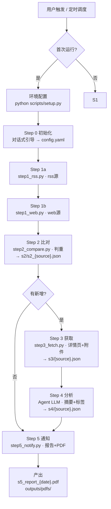

# GxpCode-制药法规跟踪

自动扫描法规源，发现新发布/修订/废止的法规&指南，分析摘要打标签并判断与企业产品的关联程度，生成 PDF 跟踪报告。

## 环境配置

> ⚠️ **首次安装本 skill 时必须运行**（仅需一次，后续直接使用）：

```bash
python scripts/setup.py
```

环境就绪后跳过此步骤，直接进入工作流。

## 工作流概览



---

## 主流水线

| Step | 说明 | 输入 ← 输出 | 详情 |
|------|------|------|------|
| 0 | 初始化 | 对话式引导 → config.yaml | `resources/step0_init_prompt.md` |
| 1 | 检测 | rss 源 → step1_rss.py / web 源 → step1_web.py → s1/s1_{源名}.json | `resources/s1_rss_prompt.md` `resources/s1_web_prompt.md` |
| 2 | 比对 | s1/ + history.json → s2/s2_{源名}.json + s2/.done | `resources/steps/step_2.md` |
| 3 | 获取 | s2/ → 详情页文本+附件 → s3/s3_{源名}.json + s3/.done + {workspace}/gxpcode_pdfs/ | `resources/steps/step_3.md` |
| 4 | 分析 | s3/ + config.yaml → s4/s4_{源名}.json + s4/.done | `resources/steps/step_4.md` |
| 5 | 通知 | s4/ → s5_report_{date}.md + s5_report_{date}.pdf（输出到 {workspace}）+ history.json 更新 | `resources/steps/step_5.md` |

## 分支步骤（按需触发）

| Step | 说明 | 输入 ← 输出 | 详情 |
|------|------|------|------|
| A | 新源分析 | URL → parser 匹配 → sources.yaml | `resources/source_analysis_prompt.md` |
| B | 源管理 | 可视化面板 → sources.yaml（→ Step 1 读取 enabled 字段） | `resources/source_management_prompt.md` |

---

## Step 0 — 启动检查

详情见 `resources/step0_init_prompt.md`。

---

## Step A — 新源分析（分支步骤）

触发条件：用户提供新的法规源 URL。

详情见 `resources/source_analysis_prompt.md`。

---

## Step B — 源管理（可视化面板）

触发条件：用户输入「源管理」「管理法规源」「打开源面板」关键词。

详情见 `resources/source_management_prompt.md`。

---

## 强制约束

1. 容错原则：SOURCE_SKIP 跳过单个源，ITEM_SKIP 跳过单条，仅 FATAL 停止全流水线
2. 每步完成后落地 `.done` 标记文件
3. **下载与输出路径：PDF 附件、报告等所有产出物必须落入当前工作空间**（`step3_fetch.py` 第二参数 `output_dir` 指向工作空间，`step5_notify.py` 同理），严禁写入 C 盘或 skill 自身目录。跟踪数据（history.json）必须保留在 skill 的 `gxpcode_data/` 下做增量持久化。
