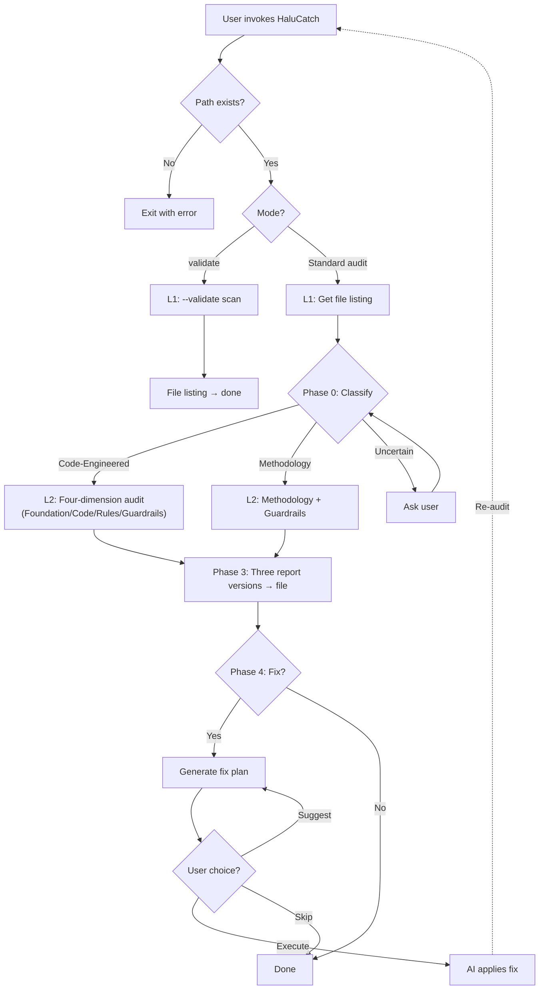

# HaluCatch / 捕幻

<p align="center">
  <a href="README.md">
    
  </a>
  <a href="README.en.md">
    
  </a>
</p>

AI Skill **execution reliability auditor**. Evaluates whether a Skill produces trustworthy, reproducible, and business-sound results when executed by an AI.

> **Halu** = Hallucination | **Catch** = Detect

---

## Motivation

When AI executes a Skill, the most common failure isn't "can't do" — it's **"thinks it did it but got it wrong"**. Three root causes:

1. **Unstable foundation** — hardcoded data paths, unvalidated formats, no skeleton script
2. **Ambiguous rules** — natural-language business logic open to multiple interpretations
3. **Missing guardrails** — AI confidently delivers wrong conclusions with no way to tell

HaluCatch scans a Skill package and rates it across four dimensions: Foundation, Code, Rules, and Guardrails.

---

## Execution Flow



> For the full decision tree, see the [online flowchart](https://codermoray.github.io/HaluCatch/decision-flowchart.html) or the [SKILL.md](SKILL.md) appendix.

---

## Quick Start

Two ways to invoke, same engine under the hood:

### In-Conversation (Recommended)

Just tell the AI the target Skill path. It runs the script, performs the audit, and generates reports:

```
Please audit this Skill with HaluCatch: /path/to/target-skill
```

After completion, three reports land in the `reports/` directory:

```
reports/
├── HaluCatch-report-YYYY-MM-DD.md          ← Technical (engineers)
├── HaluCatch-report-YYYY-MM-DD-plain.md    ← Plain language (business)
└── HaluCatch-report-YYYY-MM-DD-action.md   ← Fix guide (next AI session)
```

| Version | Audience | Content |
|---------|----------|---------|
| Technical | Engineers | Per-item findings + scores + fix suggestions |
| Plain language | Business | Jargon-free paraphrasing |
| Action | Next AI session | Fix instructions + feedback template |

**Example — auditing a Code-Engineered Skill:**

```
Please audit ~/.workbuddy/skills/xlsx with HaluCatch
```
→ Found: string concatenation for paths, write mode without overwrite warning, unprotected division. Rating: Foundation 🟢 Solid, Code 🟠 Risky, Guardrails 🟡 Gaps.

**Example — auditing a Methodology Skill:**

```
Please audit ~/.workbuddy/skills/find-skills with HaluCatch
```
→ Found: well-structured steps, good branching signals (13 checklist items / 7 icons). Rating: Methodology 🟢 Reliable, Guardrails 🟡 Gaps 3/5.

> `find-skills` is a Skill discovery tool from the ecosystem — see [vercel-labs/skills](https://github.com/vercel-labs/skills).

After the audit, the AI asks whether to apply fixes (Execute / Skip / Suggest) — see the [online flowchart](https://codermoray.github.io/HaluCatch/decision-flowchart.html).

---

## File Structure

```
HaluCatch/
├── SKILL.md                  ← Workflow instructions (AI reads)
├── halucatch_core.py         ← Engine script (standardized audit + --validate)
├── README.md                 ← Project overview (zh-CN)
├── README.en.md              ← English version
├── docs/
│   ├── CHANGELOG.md
│   ├── FAQ.md
│   ├── decision-flowchart.html
│   └── decision-flowchart-prompt.md
├── tests/
│   ├── __init__.py
│   └── test_halucatch.py     ← 21 unit tests
├── scripts/
│   ├── release.sh
│   ├── lint-paths.sh
│   └── build-skillhub.sh
└── .gitignore
```

---

## Multi-Language Support

HaluCatch supports Chinese (Simplified/Traditional) and English output, auto-switching based on user language:

```bash
# Auto-detect (default, recommended)
python3 halucatch_core.py --skill-dir /path/to/skill

# Force Chinese output
python3 halucatch_core.py --skill-dir /path/to/skill --lang zh-CN

# Force English output
python3 halucatch_core.py --skill-dir /path/to/skill --lang en
```

**For AI usage**: The AI detects user language from `<response_language>` and automatically passes the `--lang` parameter. No manual configuration needed. See [SKILL.md](SKILL.md) for the AI Execution Guide.

---

## Four-Dimension Audit Framework

| Dimension | What it checks | Method |
|-----------|---------------|--------|
| 🏗️ **Foundation** | Data pipeline stability (.py / paths / validate) | Script scan |
| 🤖 **Code** | Code quality risks (path joins, silent overwrite, missing timeout, div-by-zero) | Script scan |
| 📝 **Rules** | Business logic ambiguity (mappings, boundaries, defaults) | AI judgment |
| 🛡️ **Guardrails** | Interpretation guardrails (prohibitions, frameworks, self-checks) | AI judgment |

> **Language-agnostic design**: Methodology and guardrail checks don't use keyword regex.
> Instead, structural signal density (checklist rows, warning icon count, table count,
> negation-word frequency) evaluates branching coverage and guardrail completeness across
> languages. Both Chinese "如果…则…" and English "REJECT IMMEDIATELY IF" are correctly detected.

> **Tiered guardrails**: Code-Engineered Skills are subdivided into Analysis-type (all 8 guardrail
> items, including data source/timeliness/confidence) and Tool-type (streamlined to 5 items).
> Methodology Skills also use 5 items. This avoids false positives from checking irrelevant
> "data timeliness" criteria on tool-library Skills like xlsx/pptx.

---

## Competitive Landscape

Only four tools exist in the Skill auditing space, each with a different angle:

| | HaluCatch | skill-vetter | SkillGuard | skill-sharpener |
|---|---|---|---|---|
| Focus | **Execution reliability (eng)** | Security audit (red team) | Full lifecycle guard | Copy quality (best practices) |
| What | Data pipeline / code risks / business rules / guardrails | Malicious behavior / permissions / source trust | Pre-install + pre-publish + post-install checks | Trigger quality / structure / conciseness |
| Method | Script baseline + AI semantics | Pure AI per-protocol check | AI + rule engine | Pure AI per-checklist scoring |
| Output | 3 reports + fix plan + loop | SAFE/CAUTION/REJECT verdict | Risk report + auto-fix | Optimization suggestions |
| Language | ✅ CN/EN/JP/spreadsheets | ✅ EN primarily | ✅ CN + EN | 🟡 AI-dependent |
| Fix loop | ✅ Action report + feedback template | ❌ | ✅ Auto-fix included | ❌ |
| skills.sh | — | **19.6K** | ❌ Not listed | ❌ Not listed |
| Ratings | — | ★3.690 (clawhub) | v4.2.0 (skillhub) | ★3.607 (clawhub) |

**What makes HaluCatch unique**:
1. **Only tool with a skeleton script** — `halucatch_core.py` provides reproducible baseline checks, independent of AI subjectivity
2. **Only tool with a fix loop** — three report versions + Phase 4 fix decisions + feedback templates, forming a complete "find → fix → verify" pipeline
3. **Only language-agnostic tool** — structural signals (checklists, icons, tables, negation density) replace language-specific keyword matching
4. **Only tiered guardrails** — automatically adjusts check scope by Skill type (analysis / tool / methodology), preventing false alarms
5. **Blue ocean** — among skills.sh top 287, skill-vetter is the only Skill auditing tool listed (19.6K). The execution reliability niche has no competition.

---

## Development

```bash
git clone https://github.com/CoderMoray/HaluCatch.git
cd HaluCatch
# Edit SKILL.md or halucatch_core.py
git commit -m "your change"
git push
```

### Engine Debugging

`halucatch_core.py` is the low-level engine — call it directly for debugging:

```bash
python3 halucatch_core.py --skill-dir /path/to/skill               # Full audit (auto-detect language)
python3 halucatch_core.py --skill-dir /path/to/skill --validate    # Scan only
python3 halucatch_core.py --skill-dir /path/to/skill --lang en      # Force English output
```

> For daily use, invoke via AI Skill — no need to run the script manually.

---

## Testing

```bash
pytest tests/ -v    # 21 tests, all passing
```

Battle-tested on 10 Skills of different types:

| Skill | Type | Guardrails |
|-------|------|------------|
| find-skills / agent-browser / edgeone-deploy | Methodology | 🟡 Gaps 3/5 |
| xlsx / pptx | Tool | 🟡 Gaps 3/5 |
| skill-sharpener (ClawHub) | Analysis | 🟡 Gaps 5/8 |
| neodata-financial-search | Analysis | 🟢 Solid 7/8 |
| data-validation | Embedded Python | 🟡 Gaps 5/8 |
| HaluCatch (self-audit) | Code-Engineered | 🟡 Gaps 5/8 |

---

## FAQ

**Q: Does HaluCatch need internet access?**
A: No. Fully offline — it only scans local SKILL.md and .py files.

**Q: My Skill has no .py file. Can I still use HaluCatch?**
A: Yes. HaluCatch automatically classifies it as "Methodology" and skips Foundation/Code checks, evaluating only Methodology and Guardrails.

**Q: The report says "Guardrails Weak" — how do I fix it?**
A: Check the `-action.md` report in the same directory — it contains specific fix instructions and a feedback.md template.

**Q: Why do Tool-type Skills score lower on Guardrails than Analysis-type?**
A: Guardrail checks are tiered — Tool-type Skills only check 5 core items (skipping irrelevant data source/timeliness checks). Different denominators mean scores can't be compared directly.

**Q: Can HaluCatch auto-fix the issues it finds?**
A: No. HaluCatch is a diagnostic tool, not an auto-fix tool. The action report provides fix guidance, but fixes must be applied manually (by you or an AI).

**Q: Can I audit multiple Skills at once?**
A: Not supported in the current version. Run them one at a time — batch mode is on the roadmap.

**Q: "It froze on network issues" — is that HaluCatch?**
A: No. HaluCatch is fully local and makes no network requests. If execution hangs, it's likely an AI session timeout or a very large target directory causing slow scanning.

**Q: How do I get started quickly?**
A: 3 steps — 1. Run an audit and check the plain-language report for issues; 2. Open the action report and fix items one by one; 3. Re-audit to verify improvements.

**Q: What if I hit a file encoding error?**
A: HaluCatch reads files as UTF-8. Non-UTF-8 encodings (like GBK) are preserved with escape markers — data is never silently dropped.

**Q: How does the "Phase 4 fix loop" work?**
A: After the audit, choose "Execute fix" to send the plan to AI for implementation, then re-audit. Or choose "I have a better idea" to describe your approach and regenerate the plan.

---

## License

MIT
