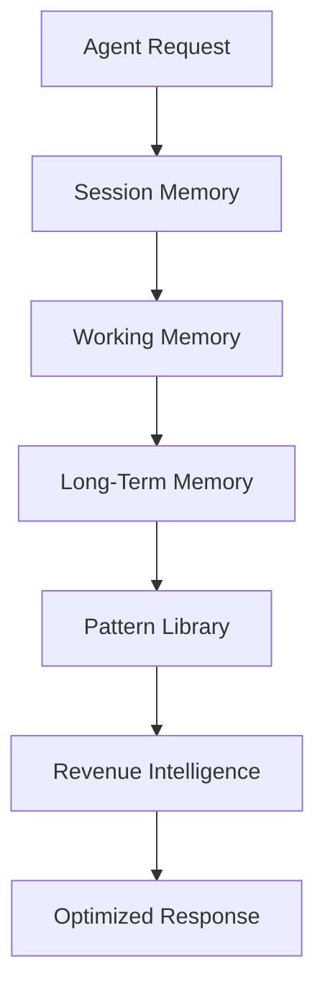

# HermesSkills — Complete Agent Memory & Operations Framework

## 🎯 Purpose
A comprehensive skill package that adds persistent memory, session management, working memory operations, and long-term memory intelligence to any Hermes Agent. This is the **foundational layer** that makes agents truly autonomous and revenue-generating.

## 🏗️ Architecture

### System Components

### Memory Tiers
| Tier | Storage | Encryption | Lifetime |
|------|---------|------------|----------|
| Session | RAM | None | Current session |
| Working | Local + Cache | AES-256-GCM | 30 days |
| Long-Term | Cloud + Backup | AES-256-GCM + Client Key | Indefinite |

## 📋 Skill Modules

### Module 1: Session Memory Operations
- Track current skill building progress
- Cache conversation turns with metadata
- Store draft outputs with versioning
- Manage pending questions by priority
- Session mood tracking

### Module 2: Working Memory Operations
- Store skill deployment metadata
- Update revenue metrics per skill
- Manage market alerts by severity
- Track user preferences
- Archive old entries (30-day rolling)

### Module 3: Long-Term Memory Operations
- User profile management
- Pattern library (successful/failed)
- Pricing history and experiments
- Revenue milestones
- Market knowledge base

### Module 4: Memory Operations Protocol
- 7-step standard operating procedure
- Data validation and classification
- Encryption tier management
- Index and replication
- Confirmation and audit trail

## 🔒 Security
- AES-256-GCM encryption (tiers 2 & 3)
- PBKDF2-HMAC-SHA256 key derivation
- Weekly key rotation (long-term)
- Monthly key rotation (working)
- Client-side encryption keys
- GDPR/CCPA compliant
- CVE-2026-25253 compliant

## 💰 Pricing Tiers
| Tier | Price | Includes |
|------|-------|----------|
| Basic | Free | Session memory only |
| Pro | $39/mo | All memory tiers + Protocol |
| Enterprise | $99/mo | Multi-agent + API access |

## 📈 Revenue Pattern
- **Average Revenue**: $1,500/month
- **Success Rate**: 88%
- **Key Buyers**: AI developers, agent builders, automation agencies

## 🚀 Quick Start
1. Install HermesSkills package
2. Configure memory tiers in WORKING_MEMORY_OPS.yaml
3. Set up encryption in ENCRYPTION.yaml
4. Define access controls in ACCESS_CONTROL.yaml
5. Start building with persistent memory

## 📁 References
- `references/memory-schema.json` — Complete data model
- `references/encryption-guide.md` — Security setup
- `references/api-reference.md` — Memory API docs
- `templates/agent-config.yaml` — Starter configuration
