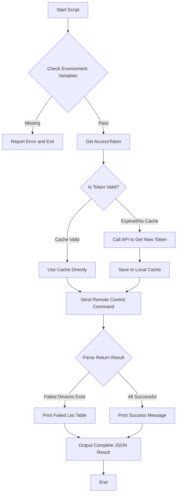

# HCTOpen ACS Control

HCT is short for Hik-Connect for Teams, meaning Hik-Connect Team mode.

HCTOpen is short for Hik-Connect for Teams OpenAPI.

---

## ⚠️ Security Warning (Read Before Use)

**Before executing door access control, please ensure the following security checks are completed:**

| # | Check Item                 | Status      | Description                                                                                                    |
|---|----------------------------|-------------|----------------------------------------------------------------------------------------------------------------|
| 1 | **Credential Permission**  | ⚠️ Required | Please use credentials with **minimum control permission**, avoid using super admin credentials                |
| 2 | **Operation Confirmation** | ⚠️ Note     | Remote door open operation has physical security risk, please ensure site safety is confirmed before operation |
| 3 | **Token Cache**            | ✅ Encrypted | Token cached in system temp directory, only current user can read (600 permission)                             |
| 4 | **API Domain**             | ✅ Auto      | API domain is automatically obtained from token response (no longer requires manual configuration)             |

---

## Quick Start

###  Run Control Script

Skill supports flexible command line parameters:

```bash
# Scenario 1: Execute door open operation for specified door access (actionType=1)
python scripts/acs_control.py --action-type 2 --element-list "2aabf37ad9804f66acc4ad4fb7bd4694"

# Scenario 2: Execute door close operation for specified door access (actionType=2)
python scripts/acs_control.py --action-type 2 --element-list "door_resource_id_1,door_resource_id_2"

# Scenario 3: Execute normally open operation for specified door access (actionType=3)
python scripts/acs_control.py --action-type 3 --element-list "door_resource_id_1" 

# Scenario 4: Execute normally closed operation for specified door access (actionType=4)
python scripts/acs_control.py --action-type 4 --element-list "door_resource_id_1"
```

---

## API Parameter Details 

### 1. Remote Control Request Parameters

**Endpoint**: `POST /api/hccgw/acs/v1/remote/control`

| Parameter Name | Type    | Description         | Required | Default | Notes                                                         |
|----------------|---------|---------------------|----------|---------|---------------------------------------------------------------|
| `actionType`   | Integer | Operation type      | **Yes**  | -       | 1-open door, 2-close door, 3-normally open, 4-normally closed |
| `elementlist`  | Array   | Resource point list | No       | []      | Door logical resource ID list                                 |
| `direction`    | Integer | Traffic direction   | No       | 0       | 0-entry, 1-exit. Mainly for gates with direction distinction. |

### 2. API Return Data Description

API returns list of devices that failed execution. If `operationResult` is empty, it means all requested devices operated successfully.

| Field Name    | Type   | Description              | Notes                                  |
|---------------|--------|--------------------------|----------------------------------------|
| `elementId`   | String | Door logical resource ID | Identifies which door operation failed |
| `elementName` | String | Door name                | Human-readable device name             |
| `areaId`      | String | Area ID                  | Device area identifier                 |
| `areaName`    | String | Area name                | Device area name                       |
| `errorCode`   | String | Error code               | Specific reason code for failure       |

---

## Environment Variables

| Variable Name                         | Required | Description                             |
|---------------------------------------|----------|-----------------------------------------|
| `HIK_CONNECT_TEAM_OPENAPI_APP_KEY`    | Yes      | Hik-Connect Team OpenAPI AppKey         |
| `HIK_CONNECT_TEAM_OPENAPI_SECRET_KEY` | Yes      | Your Hik-Connect Team OpenAPI SecretKey |
| `HIK_CONNECT_TEAM_TOKEN_CACHE`        | No       | 1=Enable cache (default), 0=Disable     |

---

## API Endpoints

| Function            | Endpoint                                |
|---------------------|-----------------------------------------|
| Get Token           | `POST /api/hccgw/platform/v1/token/get` |
| Door Access Control | `POST /api/hccgw/acs/v1/remote/control` |

**Domain**: Automatically obtained from token response (`areaDomain` field)

---

## Workflow



---

## Output Examples

### Partial Operation Failed Example:
```text
[2026-04-22 11:31:34] Executing door access control: Type=1, Count=1
[2026-04-22 11:31:34] Executing door access control: Type=1, Count=1
[WARNING] Some devices operation failed:
======================================================================
Failed Device List
======================================================================
No.  Door Resource ID                  Door Name  Area  Error Code
------------------------------------------------------------------
1    2aabf37ad9804f66acc4ad4fb7bd4694                   VMS000003 
======================================================================

[JSON Output]
{
  "success": false,
  "operationResult": [
    {
      "elementId": "2aabf37ad9804f66acc4ad4fb7bd4694",
      "elementName": "",
      "areaId": "",
      "areaName": "",
      "errorCode": "VMS000003"
    }
  ],
  "error": "Some operations failed"
}
======================================================================
Done
======================================================================
```

### All Operations Successful Example:
```text
[2026-04-22 11:36:15] Executing door access control: Type=2, Count=1
[2026-04-22 11:36:15] Executing door access control: Type=2, Count=1
[SUCCESS] All door access operations executed successfully

[JSON Output]
{
  "success": true,
  "operationResult": []
}
======================================================================
Done
======================================================================
```

---

## File Structure

```
├── scripts/
│   └── acs_control.py      # Door access control core execution script
└── SKILL.md                # Skill usage documentation
```

---

## FAQ

- **Q: Why does it show "Credentials required"?**
  - A: Please ensure `export` command has been correctly executed to set `HIK_CONNECT_TEAM_OPENAPI_APP_KEY` and other environment variables.
- **Q: How long is Token cache valid?**
  - A: Follows HCT API standard, usually 7 days. Script will auto-refresh 5 minutes before expiration.
- **Q: How to operate all door access?**
  - A: Cannot operate all door access, can only operate specific door access.
- **Q: Why did operation fail?**
  - A: Please check device status, permission configuration and network connection. Failed device information will be listed in detail in output.
- **Q: How to get door access logical resource ID?**
  - A: Must first use door access device serial number to call `modules/Hik-Connect_Team_Resource/scripts/list_doors.py <device serial number>`, get door access resource ID from returned list.
- **Q: How to get the correct door resource ID?**
  - A: Use `list_doors.py` API,Example:
    ```bash
    python scripts/list_doors.py L33721705
    # Output: door resource ID is in "Door Access ID" column
    ```
---

## Security Notes

- Use Hik-Connect Team OpenAPI AppKey / Hik-Connect Team OpenAPI SecretKey with minimum permissions
- Token cached in system temp directory, enabled by default
- Automatic 4-second interval between device requests to avoid rate limiting
- All remote operations require permission authentication

---

## Other Notes

- If user didn't provide operation type, should first inform user and ask about default configuration
- Continue executing request after user confirmation
- Door access control operations all have physical security risks, please operate with caution

---

---
**Error Codes**:

| Return Code | Return Message            | Description                                                              |
|-------------|---------------------------|--------------------------------------------------------------------------|
| VMS000003   | Resource operation failed | Resource operation failed: The access control resource ID does not exist |

---