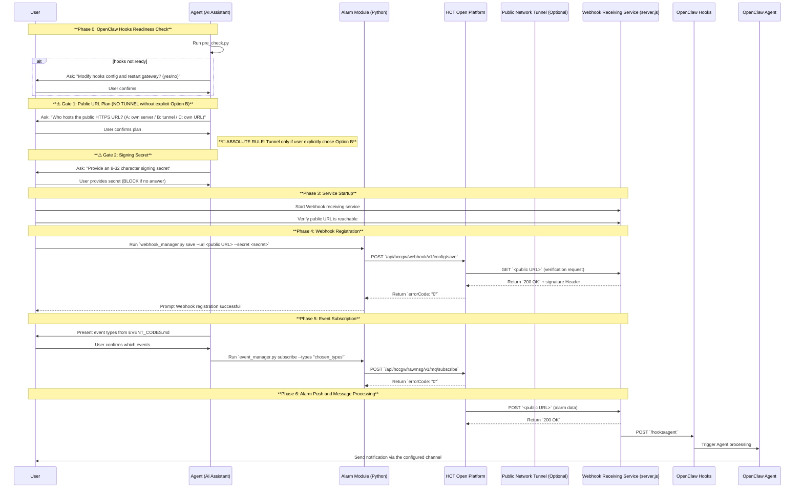

# Hik-Connect_Team_Alarm (HCT Alarm Push Management)

## 1. Module Introduction
`Hik-Connect_Team_Alarm` module is designed to help users implement real-time push of HCT alarm messages through Webhook mechanism. This module integrates a complete closed-loop process of **public network access guidance**, **Webhook receiving service**, **OpenClaw Hooks configuration** and **HCT platform subscription**.

This document details how to configure the HCT Open platform Webhook alarm push process. The core idea is to use public network address to receive alarm data pushed by HCT Open platform, forward it to internal network Webhook receiving service, and finally have OpenClaw agent organize and send message notifications.

The overall architecture flow is as follows: HCT Open Platform → Public Network Tunnel/Self-owned Server → Webhook Service(:3090) → OpenClaw Hooks → Message Notification

> **Core Logic**: HCT Platform pushes messages to public network Webhook address -> Webhook service receives and verifies signature -> Forward to OpenClaw Hooks -> Agent organizes and sends notification.

---

### 1.1 Complete Data Flow and Port Responsibilities

The full alarm push data flow spans multiple components. Understanding which port belongs to which process is critical for troubleshooting:

```
HCT Platform (port 443 HTTPS) 
    ↓ sends POST / GET
[Public Internet]
    ↓
Reverse Proxy / Tunnel (server:443) — receives on public HTTPS address
    ↓ forwards internally
Webhook Receiving Service (server.js, port 3090 by default) — validates signature, extracts alarm data
    ↓ forwards internally
OpenClaw Gateway (port shown as gateway.port in openclaw.json, dynamically detected) — receives via /hooks/agent
    ↓ triggers
OpenClaw Agent → formats message → sends to notification channel (Feishu/Telegram/etc.)
```

**Port Responsibilities Table:**

| Port                         | Process                                         | Role                                                                       | Who Owns It                     |
|------------------------------|-------------------------------------------------|----------------------------------------------------------------------------|---------------------------------|
| 443 (HTTPS)                  | Reverse proxy (Caddy/nginx/etc.) or tunnel tool | Public entry point, receives from HCT platform                             | User's server or tunnel service |
| 3090 (default)               | server.js (webhook receiving service)           | Receives from reverse proxy, validates HMAC signature, extracts alarm data | OpenClaw server                 |
| gateway port (auto-detected) | OpenClaw Gateway                                | Receives via `/hooks/agent`, triggers agent processing                     | OpenClaw server                 |

---

## 2. Core Workflow (Detailed Version)

### 2.1 Flowchart


### 2.2 Stage-by-Stage Operation Guide
---

## ⚠️ 2.2.0 Phase 0: OpenClaw Hooks Readiness Check (ALWAYS RUN FIRST)

> **Important**: Before doing ANYTHING else, you MUST verify that OpenClaw hooks is properly configured. This is a hard prerequisite. If hooks is not set up, the alarm push chain will break silently.

### Step 0-1: Run Pre-Check Script

```bash
cd <skill-directory>/modules/Hik-Connect_Team_Alarm/scripts
python pre_check.py
```

The script checks all 6 items automatically.

### Step 0-2: If Hooks Needs Configuration — Ask User FIRST

If `hooks.enabled` is not `true` or `hooks.token` is missing:

**STOP and ask the user explicitly:**

> "OpenClaw hooks is not configured on this server. To receive alarm pushes, I need to:
> 1. Add a `hooks` section to `~/.openclaw/openclaw.json`
> 2. Restart the OpenClaw Gateway
>
> This will cause a brief interruption to the OpenClaw service (typically a few seconds).
>
> Do you want me to proceed? (yes/no)"

Only proceed if the user confirms. If confirmed:
- Generate a new token: `openssl rand -hex 24`
- Add to `~/.openclaw/openclaw.json`:

```json
{
  "hooks": {
    "enabled": true,
    "token": "<generated token>"
  }
}
```

- Restart gateway: `openclaw gateway restart`
- Verify: `curl http://127.0.0.1:<port>/hooks/agent` returns 200 or 400 (not 404)

> ⚠️ Do NOT add `defaultSessionKey` to hooks config — it causes `Malformed agent session key` errors.

Only proceed to Phase 1 after pre-check passes or after hooks is confirmed ready.

---

## ⚠️ 2.2.1 Phase 1: Public URL Plan — MUST Confirm Before Taking Action

### Step 1-1: Query Current Status

Show the user their existing webhook and subscription state:
```bash
cd <skill-directory>/modules/Hik-Connect_Team_Alarm/scripts
python webhook_manager.py query
python event_manager.py query
```

### Step 1-2: Ask About Public URL Plan (CONFIRMATION GATE — ABSOLUTE BLOCKER)

**Ask the user the following question and WAIT for their answer before proceeding:**

> "To receive alarm pushes from HCT, I need a public HTTPS URL that HCT can call. How do you want to handle this?"
>
> Please choose one of the following options:
>
> **Option A — Use your own server (most stable)**
> You have a public IP (124.222.61.228). If you have a domain name pointing to this IP, I can help you set up a reverse proxy (nginx/Caddy) to route HTTPS traffic to the webhook service.
>
> **Option B — Use a tunnel tool on this server**
> I can set up ngrok, cloudflared, or similar on this server to create a public HTTPS URL. This is free but the tunnel may occasionally disconnect.
>
> **Option C — You have your own public HTTPS URL**
> Provide your own URL and I'll configure the webhook service to use it.
>
> Which option do you prefer? (A / B / C, or describe your situation)"

**🚨 ABSOLUTE RULE — No Tunnel Tool Without Explicit User Request:**
> **UNDER NO CIRCUMSTANCES may the Agent install, configure, or start any tunnel tool (ngrok, cloudflared, cpolar, serveo, localtunnel, bore, etc.) unless the user has explicitly and affirmatively chosen Option B or otherwise explicitly asked for a tunnel tool in their own words.**
>
> This rule is absolute and non-negotiable. Violations include:
> - Installing a tunnel tool before the user has chosen Option B
> - Starting a tunnel without the user's explicit consent
> - Creating a public URL without the user confirming tunnel as their chosen approach
> - Using a tunnel as a "temporary" or "quick test" solution without explicit approval
>
> If the user does not respond to the question, re-ask. If the user is unclear, ask follow-up questions. Do not proceed.

**Decision Rules Based on User Response:**

| User Response | Agent Action |
|:---|:---|
| Option A (has domain) | Ask for domain → help configure reverse proxy → proceed |
| **Option B (tunnel)** | **Only then** install/configure tunnel tool → proceed |
| Option C (own URL) | Ask for the URL → verify it points to this server's 3090 → proceed |
| Says nothing / unclear | Ask follow-up question — do NOT proceed until clarified |
| Has no domain, no tunnel preference | Recommend Option A if public IP exists, otherwise explain limitation |

> ⚠️ **Critical**: Do NOT generate any public URL, do NOT install any tunnel tool, do NOT start any tunnel process until the user has explicitly chosen Option B (or equivalent explicit tunnel request). If the user does not respond, ask again.

---

## ⚠️ 2.2.2 Phase 2: Collect Signing Secret — Must Have Before Service Start

**Ask the user:**

> "Provide an 8-32 character signing secret for webhook verification. This will be used to verify that alarm pushes are genuinely from Hik-Connect. Please provide a secret now (e.g. yourname2026):"

**Rules:**
- **Do NOT generate or invent a default secret** — the user MUST provide this.
- **BLOCK on this step** — do not proceed to Phase 3 until the user provides a secret.
- Record the secret. It will be used in:
  - `webhook_manager.py save --secret <secret>`
  - `HIK_SIGN_SECRET` environment variable for server.js

---

## ⚠️ 2.2.3 Phase 3: Start Webhook Service — Only After Phases 1 & 2 Are Complete

### Step 3-1: Install Dependencies

```bash
cd <skill-directory>/modules/Hik-Connect_Team_Alarm/scripts
npm install
```

### Step 3-2: Get OpenClaw Gateway Port

```bash
PORT=$(cat ~/.openclaw/openclaw.json | grep -oP '"port":\s*\K\d+')
echo "OpenClaw Gateway port: $PORT"
```

### Step 3-3: Start Webhook Receiving Service

**Ask the user for their Feishu open_id (or target user ID) if not already known.**

```bash
cd <skill-directory>/modules/Hik-Connect_Team_Alarm/scripts
HIK_SIGN_SECRET="<user-provided-secret>" \
OPENCLAW_HOOKS_TOKEN="<from openclaw.json hooks.token>" \
OPENCLAW_HOOKS_URL="http://127.0.0.1:<gateway-port>/hooks/agent" \
OPENCLAW_CHANNEL="feishu" \
OPENCLAW_TO="<user's Feishu open_id>" \
PORT="3090" \
node server.js
```

### Step 3-4: Verify Service Is Running

```bash
curl http://localhost:3090/health
```

Expected: `{"status":"ok",...}`

### Step 3-5: Verify Public URL Is Reachable

```bash
curl -sL -o /dev/null -w "%{http_code}" https://<your-public-url>/hikvision/webhook
```

Expected: `200` or `302` (redirect). If `000` or timeout → tunnel/proxy is not working.

Only proceed to Phase 4 if both service health and public URL are confirmed working.

---

## ⚠️ 2.2.4 Phase 4: Register Webhook with HCT Platform

> "Now I'll register the Webhook URL with HCT. Make sure the service is running and the public URL is accessible from the internet."

```bash
cd <skill-directory>/modules/Hik-Connect_Team_Alarm/scripts
python webhook_manager.py save \
  --url "https://<your-public-url>/hikvision/webhook" \
  --secret "<user-provided-secret>"
```

- **Success**: Tell user "Webhook registered successfully! HCT will now push alarms to your URL."
- **Failure**: Tell user the error reason and checklist (service running? URL accessible from internet? secret correct?)

---

## ⚠️ 2.2.5 Phase 5: Event Subscription — Must Have Explicit User Confirmation

> **⚠️ MANDATORY: Only subscribe when user explicitly asks.**
> Never call `event_manager.py subscribe` without explicit user confirmation.

**Ask the user:**
> "Webhook registration successful! Now let's subscribe to alarm events. Which events do you want to subscribe to? You can find the full list in `EVENT_CODES.md`. Options:
> - 'full' — subscribe to all events
> - Or provide specific event codes (e.g. 'Msg110001,Msg110002')
>
> Which would you like?"

**Wait for the user's answer.** Only then run:

```bash
# All events:
python event_manager.py subscribe

# Specific events:
python event_manager.py subscribe --types "Msg110001,Msg110002,..."
```

**After execution:**
- **Success**: Tell the user "Event subscription complete! `{count}` event types subscribed."
- **Failure**: Tell the user "Event subscription failed: `{reason}`"

---


## 6. Signature Verification Mechanism (Security)

HCT platform and Webhook service ensure communication security through HMAC-SHA256 algorithm.

### 3.1 Verification Request (GET)
When you save Webhook configuration on platform, platform will send verification request:
*   **HCT Platform Sends Header**:
    *   `X-Hook-Batch-Id`: Batch ID
    *   `X-Hook-Timestamp`: Timestamp (milliseconds)
*   **Webhook Service Processing**:
    *   Service calculates HMAC-SHA256 signature based on configured `HIK_SIGN_SECRET`, `X-Hook-Timestamp` and `X-Hook-Batch-Id`.
    *   **Signature Algorithm**: `signature = HMAC-SHA256(secret, timestamp.batchId)`, result is `sha256=<hex_string>`.
    *   **Webhook Service Returns**: Carries `X-Hook-Signature: sha256=<calculated_signature>` in Response Header, status code `200 OK`.

### 3.2 Push Request (POST)
When alarm occurs, platform pushes data:
*   **HCT Platform Sends Header**:
    *   `X-Hook-Signature`: Signature calculated by platform
    *   `X-Hook-Timestamp`: Push timestamp
*   **Webhook Service Processing**:
    *   Service uses same `HIK_SIGN_SECRET` and `timestamp.batchId` (obtained from request Body) to calculate signature, and compares with `X-Hook-Signature` in Header.
    *   If signature matches and timestamp is within acceptable range, request is considered legitimate and processed further, otherwise request is rejected.

---

## 7. Script and API Parameter Details

### 4.1 Webhook Management (`webhook_manager.py`)

This script is used to manage HCT platform's Webhook configuration, including query, save and delete.

#### 4.1.1 Running Examples

*   **Query Current Webhook Configuration**:
    ```bash
    python scripts/webhook_manager.py query
    ```

*   **Save/Subscribe Webhook Configuration**:
    ```bash
    python scripts/webhook_manager.py save --url "https://your-public-domain.com/hikvision/webhook" --secret "YourSignSecret123" --retries 5 --delay 2000
    ```

*   **Delete Webhook Configuration**:
    ```bash
    python scripts/webhook_manager.py delete
    ```

#### 4.1.2 Request Parameters

| Parameter   | Type    | Required                    | Default | Description                                                                                             |
|:------------|:--------|:----------------------------|:--------|:--------------------------------------------------------------------------------------------------------|
| `command`   | String  | Yes                         | -       | Operation command, options: `query`, `save`, `delete`                                                   |
| `--url`     | String  | Required for `save` command | -       | Public HTTPS callback address, must start with `https://`, max length 256 characters.                   |
| `--secret`  | String  | Optional for `save` command | -       | Signing secret, used to verify legitimacy of pushed messages. 8-32 alphanumeric combination.            |
| `--retries` | Integer | Optional for `save` command | 3       | Number of retries after message push failure. Range `[-1, 5]`, -1 means unlimited retry within 2 hours. |
| `--delay`   | Integer | Optional for `save` command | 1000    | Retry interval after message push failure, in milliseconds.                                             |

#### 4.1.3 Output Field Description

| Field              | Type    | Description                                                                    |
|:-------------------|:--------|:-------------------------------------------------------------------------------|
| `success`          | Boolean | Whether operation was successful. `true` means success, `false` means failure. |
| `message`          | String  | Operation result or error description information.                             |
| `errorCode`        | String  | Error code, `0` means success, other values are specific error codes.          |
| `data`             | Object  | Webhook configuration details returned on successful `query` command.          |
| `data.callbackUrl` | String  | Webhook callback address.                                                      |
| `data.retryTimes`  | Integer | Webhook retry count.                                                           |
| `data.retryDelay`  | Long    | Webhook retry interval (milliseconds).                                         |

### 4.2 Event Subscription Management (`event_manager.py`)

This script is used to subscribe, unsubscribe, or query HCT platform alarm event subscription status.

#### 4.2.1 Running Examples

*   **Subscribe to Specific Event Types**:
    ```bash
    python scripts/event_manager.py subscribe --types "Msg330001,Msg330002"
    ```

*   **Subscribe to All Event Types**:
    ```bash
    python scripts/event_manager.py subscribe
    ```

*   **Unsubscribe from Specific Event Types**:
    ```bash
    python scripts/event_manager.py unsubscribe --types "Msg330001"
    ```

*   **Unsubscribe from All Event Types**:
    ```bash
    python scripts/event_manager.py unsubscribe
    ```

*   **Query Current Subscription Status**:
    ```bash
    python scripts/event_manager.py query
    ```

#### 4.2.2 Request Parameters

| Parameter | Type   | Required | Default                                  | Description                                                                                                                     |
|:----------|:-------|:---------|:-----------------------------------------|:--------------------------------------------------------------------------------------------------------------------------------|
| `command` | String | Yes      | -                                        | Operation command, options: `subscribe`, `unsubscribe`, `query`                                                                 |
| `--types` | String | Optional | Empty (subscribe/unsubscribe all events) | Comma-separated event type list (e.g. `Msg330001,Msg330002`). For specific event types please refer to EVENT_CODES.md document. |

> **Important Note**: Even without Webhook configuration, you can still execute subscribe/unsubscribe/query operations. But note that without proper Webhook service configuration and registration to HCT platform, you will not receive any alarm message pushes.

#### 4.2.3 Output Field Description

**For `subscribe` and `unsubscribe` commands:**

| Field       | Type    | Description                                                                    |
|:------------|:--------|:-------------------------------------------------------------------------------|
| `success`   | Boolean | Whether operation was successful. `true` means success, `false` means failure. |
| `message`   | String  | Operation result or error description information.                             |
| `errorCode` | String  | Error code, `0` means success, other values are specific error codes.          |

**For `query` command:**

| Field                    | Type    | Description                                                                |
|:-------------------------|:--------|:---------------------------------------------------------------------------|
| `success`                | Boolean | Whether operation was successful.                                          |
| `data.isSubscribe`       | Boolean | Whether subscribed. `true` means subscribed, `false` means not subscribed. |
| `data.subscribeType`     | Integer | Subscription type. `0`: Partial subscription, `1`: Full subscription.      |
| `data.subscribeTypeText` | String  | Text description of subscription type.                                     |
| `data.events`            | Array   | List of event type codes user has subscribed to.                           |

---

## 8. Message Display Format and Agent Processing

### 5.1 Message Structure
Webhook service will format received raw JSON into readable text, and forward through OpenClaw Hooks. Below is formatted message example:

```text
📦 HCT Open Webhook Push (batchId: 1a2b3c4d...)
Alarms: 1
---
🚨 Alarm: Human Detection
Device: Small Cup
Type: alarmCategoryVideo/alarmSubCategoryPersonDetect
Time: 2026-04-16 14:20:00
Level: High
Serial Number: D72821502
```

---

## 5.2 Agent Message Processing Rules

> **⚠️ Critical: Agent Must Forward Messages Exactly As-Received**
> When the Agent receives a webhook message via OpenClaw Hooks, it must **forward the message content exactly as-is** to the notification channel.

**Required Behavior:**
- ✅ **DO**: Forward the received message content verbatim to the user
- ✅ **DO**: Send the message to the configured notification channel (Feishu/Telegram/etc.)
- ❌ **DO NOT**: Summarize, interpret, or rephrase the message
- ❌ **DO NOT**: Translate the message (e.g., from Chinese to English or vice versa)
- ❌ **DO NOT**: Add comments, analysis, or extra explanations
- ❌ **DO NOT**: Reformat or restructure the message content

**Why This Matters:**
The `server.js` service already formats the webhook payload into a human-readable format. The Agent's only job is to deliver this formatted message to the user without any further processing. Adding summaries or translations introduces noise and delays, and may strip important technical details that the user needs.

**If the Agent fails to follow these rules**, it means the instruction was not clear enough — please report this so the skill documentation can be improved.

---

## 9. Troubleshooting

| Symptom                                                 | Most Likely Cause                                     | Fix                                                                                           |
|---------------------------------------------------------|-------------------------------------------------------|-----------------------------------------------------------------------------------------------|
| Webhook registration fails                              | server.js not running or URL not accessible           | `curl http://localhost:3090/health`; verify public URL from outside                           |
| Registration succeeds but no alarms                     | Third-party service (Pipedream/Lambda) used           | ❌ Cannot forward to internal OpenClaw. Use tunnel or same-server setup                        |
| Hooks returns 404                                       | basePath incorrectly included in `OPENCLAW_HOOKS_URL` | Use `http://127.0.0.1:<port>/hooks/agent` — no basePath                                       |
| Hooks returns `[RELAY NETWORK ERROR]`                   | Wrong port, wrong token, or gateway down              | Verify `OPENCLAW_HOOKS_URL` port matches `gateway.port`; token matches `hooks.token`          |
| User gets no notification                               | server.js stopped, or Feishu card permission missing  | Check `curl localhost:3090/health`; enable "card messages" permission in Feishu Open Platform |
| ngrok shows ERR_NGROK_4018                              | Missing authtoken                                     | Run `ngrok config add-authtoken <your-authtoken>`                                             |
| gateway "hooks.token must not match gateway auth.token" | tokens are identical                                  | `openssl rand -hex 24` → update hooks.token in openclaw.json → restart gateway                |

**Quick verification:**
```bash
curl http://localhost:3090/health
curl -s -o /dev/null -w "%{http_code}" https://<your-url>/hikvision/webhook
curl -X POST http://127.0.0.1:<port>/hooks/agent -H "Authorization: Bearer <token>" -d '{"test":"ping"}'
```
---

## 10. File Structure

```
Hik-Connect_Team_Alarm/
├── SKILL.md                    # This document
├── EVENT_CODES.md              # Event type reference
└── scripts/
    ├── pre_check.py            # Phase 0: OpenClaw hooks pre-check (run FIRST)
    ├── server.js               # Webhook receiving service
    ├── webhook_manager.py      # Webhook configuration management
    ├── event_manager.py        # Event subscription management
    └── package.json            # Node.js dependencies
```


---
**Error Codes**:

| Return Code | Return Message               | Description                                                                                     |
|-------------|------------------------------|-------------------------------------------------------------------------------------------------|
| CCF000001   | Webhook configuration failed | Webhook configuration failed. Please check the correctness of the public URL and the signature. |

---