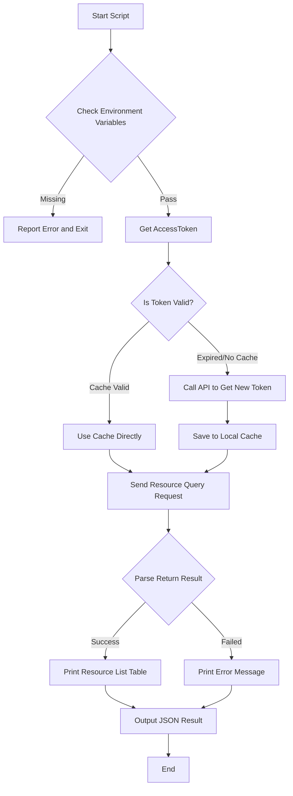

# HCTOpen Resource Manager

HCT is short for Hik-Connect for Teams, meaning Hik-Connect Team mode.
HCTOpen is short for Hik-Connect for Teams OpenAPI.

This Skill supports three core functions: view device list, query device details, and channel details under device.

---

## ⚠️ Security Warning (Read Before Use)

| # | Check Item                | Status      | Description                                                                                        |
|---|---------------------------|-------------|----------------------------------------------------------------------------------------------------|
| 1 | **Credential Permission** | ⚠️ Required | Please use credentials with **resource query permission**, avoid using super admin credentials     |
| 2 | **Token Cache**           | ✅ Encrypted | Token cached in system temp directory, only current user can read (600 permission)                 |
| 3 | **API Domain**            | ✅ Auto      | API domain is automatically obtained from token response (no longer requires manual configuration) |

---

## 🚀 Quick Start

### Run Resource Management Scripts

```bash
# Scenario 1: View device list (default pagination)
python scripts/list_devices.py

# Scenario 1a: Filter by device category (encodingDevice)
python scripts/list_devices.py --device-category encodingDevice

# Scenario 1b: Filter by device category with fuzzy match on name/serial
python scripts/list_devices.py --device-category encodingDevice --match-key D728215

# Scenario 2: Query single device details (by serial number)
python scripts/device_detail.py L33721705

# Scenario 3: View specific device channel list
python scripts/device_channels.py J10137390

# Scenario 4: View door access resource list (specified serial number)
python scripts/list_doors.py L33721705
```

---

## 🛠 Workflow



---

## 📋 API Parameter Details

### 1. Device List Request Parameters

**Endpoint**: `POST /api/hccgw/resource/v1/devices/get`

| Parameter Name    | Type    | Description                           | Required | Default | Notes                                                                                                         |
|-------------------|---------|---------------------------------------|----------|---------|---------------------------------------------------------------------------------------------------------------|
| `page`            | Integer | Page number                           | No       | 1       | Starts from 1                                                                                                 |
| `pageSize`        | Integer | Page size                             | No       | 10      | Max 100                                                                                                       |
| `deviceCategory`  | String  | Device category filter                | No       | -       | encodingDevice, accessControllerDevice, alarmDevice, videoIntercomDevice, mobileDevice, businessDisplayDevice |
| `filter.matchKey` | String  | Fuzzy match for device name or serial | No       | -       | Only effective when deviceCategory is specified                                                               |

#### deviceCategory Options

| deviceCategory Value     | Description                |
|--------------------------|----------------------------|
| `encodingDevice`         | `Encoding Device / Camera` |
| `accessControllerDevice` | `Access Controller Device` |
| `alarmDevice`            | `Alarm Device`             |
| `videoIntercomDevice`    | `Video Intercom Device`    |
| `mobileDevice`           | `Mobile Device`            |
| `businessDisplayDevice`  | `Business Display Device`  |

### Device List Output Field Description

| Field Name               | Type    | Description                                          |
|--------------------------|---------|------------------------------------------------------|
| `success`                | Boolean | Whether request was successful                       |
| `total`                  | Integer | Total number of devices                              |
| `pageIndex`              | Integer | Current page number                                  |
| `pageSize`               | Integer | Page size                                            |
| `devices`                | Array   | Device list, each element is a device object         |
| `devices[].id`           | String  | Device ID                                            |
| `devices[].name`         | String  | Device name                                          |
| `devices[].category`     | String  | Device type                                          |
| `devices[].type`         | String  | Device model                                         |
| `devices[].serialNo`     | String  | Device serial number                                 |
| `devices[].version`      | String  | Firmware version                                     |
| `devices[].onlineStatus` | Integer | Network status: 0 (offline), 1 (online), 2 (unknown) |
| `devices[].addTime`      | String  | Added time                                           |

### Device List Success Example:
```text
[2026-04-09 15:44:01] Getting device list (page 1, 10 items per page)...
======================================================================
HCTOpen Device List (Total: 2, Current page count: 2)
======================================================================
No.  Device ID                              Device Serial Number      Device Name  Model                Version                     Device Type            Added Time                 Status
---------------------------------------------------------------------------------------------------------------------------------------
1   2604f502e63247d393e83c07f58705b9  D72821502  Small Cup   DS-2CV2026G0-IDW  V5.5.110 build 200819  encodingDevice  2026-03-30 01:30:55  Online
2   39a2f72cf2d8404b9067d35cfe2d3501  J10137390  Test Room   DS-2TD2637-10/P   V5.5.64 build 230207   encodingDevice  2026-04-01 05:57:00  Online
======================================================================

[JSON Output]
{
  "success": true,
  "totalCount": 2,
  "pageIndex": 1,
  "pageSize": 10,
  "devices": [
    {
      "id": "2604f502e63247d393e83c07f58705b9",
      "serialNo": "D72821502",
      "name": "Small Cup",
      "type": "DS-2CV2026G0-IDW",
      "version": "V5.5.110 build 200819",
      "onlineStatus": 1,
      "category": "encodingDevice",
      "addTime": "2026-03-30 01:30:55"
    },
    {
      "id": "39a2f72cf2d8404b9067d35cfe2d3501",
      "serialNo": "J10137390",
      "name": "Test Room",
      "type": "DS-2TD2637-10/P",
      "version": "V5.5.64 build 230207",
      "onlineStatus": 1,
      "category": "encodingDevice",
      "addTime": "2026-04-01 05:57:00"
    }
  ]
}
======================================================================
Done
======================================================================
```

### Device List Failed Example:
```text
[2026-04-22 19:05:43] Getting device list (page 1, 10 items per page)...
[WARNING] match-key is only effective when device-category is specified..
{'pageIndex': 1, 'pageSize': 10, 'filter': {'matchKey': 'D728215'}}
[ERROR] Failed to get device list: Device category is request{OPEN000010}

[JSON Output]
{
  "success": false,
  "error": "Device category is request{OPEN000010}",
  "errorCode": "OPEN000010"
}
======================================================================
Done
======================================================================
```


### 2. Device Detail Request Parameters

**Endpoint**: `POST /api/hccgw/resource/v1/devicedetail/get`

| Parameter Name   | Type   | Description          | Required | Default | Notes                    |
|------------------|--------|----------------------|----------|---------|--------------------------|
| `deviceSerialNo` | String | Device serial number | **Yes**  | -       | Device unique identifier |


### Device Detail Output Field Description

| Field Name                                 | Type    | Description                                     |
|--------------------------------------------|---------|-------------------------------------------------|
| `success`                                  | Boolean | Whether request was successful                  |
| `data`                                     | Object  | Device detail data object                       |
| `data.device`                              | Object  | Device detailed information                     |
| `data.device.baseInfo`                     | Object  | Device basic information                        |
| `data.device.baseInfo.id`                  | String  | Device ID                                       |
| `data.device.baseInfo.name`                | String  | Device name                                     |
| `data.device.baseInfo.category`            | String  | Device type                                     |
| `data.device.baseInfo.serialNo`            | String  | Device serial number                            |
| `data.device.baseInfo.version`             | String  | Firmware version                                |
| `data.device.baseInfo.type`                | String  | Device model                                    |
| `data.device.baseInfo.streamEncryptEnable` | String  | Stream encryption enable, 1-enabled, 0-disabled |
| `data.device.onlineStatus`                 | Integer | Device online status: 1-online, 0-offline       |

### Device Detail Success Example:
```text
======================================================================
HCTOpen Device Detail
======================================================================
[Time] 2026-04-07 10:00:00
[INFO] Querying device details: F68147103

Device Name          Device Serial Number      Model              Version                  Status    
----------------  --------------  ----------------  --------------------  --------
F68147103         F68147103       DS-9664NI-I8      V4.40.220 build 210125  Online    

======================================================================
[JSON Output]
{
    "success": true,
    "data": {
        "device": {
            "baseInfo": {
                "id": "5c263e4293c84eae81720e9e481e33ad",
                "name": "F68147103",
                "category": "encodingDevice",
                "serialNo": "F68147103",
                "version": "V4.40.220 build 210125",
                "type": "DS-9664NI-I8",
                "streamEncryptEnable": "1",
            }
            "onlineStatus": 1,
        }
    }
}
======================================================================
Done
======================================================================
```


### 3. Device Channel List Request Parameters

**Endpoint**: `POST /api/hccgw/resource/v1/areas/cameras/get`

| Parameter Name | Type    | Description          | Required | Default | Notes                    |
|----------------|---------|----------------------|----------|---------|--------------------------|
| `deviceSerial` | String  | Device serial number | **Yes**  | -       | Device unique identifier |
| `page`         | Integer | Page number          | No       | 1       | Starts from 1            |
| `pageSize`     | Integer | Page size            | No       | 10      | Max 100                  |

### Device Channel List Output Field Description

| Field Name                | Type    | Description                                           |
|---------------------------|---------|-------------------------------------------------------|
| `success`                 | Boolean | Whether request was successful                        |
| `data`                    | Object  | Device channel list data object                       |
| `data.totalCount`         | Integer | Total channel count                                   |
| `data.pageIndex`          | Integer | Current page number                                   |
| `data.pageSize`           | Integer | Page size                                             |
| `data.camera`             | Array   | Camera channel list, each element is a channel object |
| `data.camera[].id`        | String  | Camera ID                                             |
| `data.camera[].name`      | String  | Camera name                                           |
| `data.camera[].online`    | String  | Online status: "1"-online, "0"-offline                |
| `data.camera[].channelNo` | String  | Channel number                                        |

### Device Channel List Success Example:
```text
[2026-04-09 17:11:21] Querying device channels: J10137390
======================================================================
HCTOpen Device Channel List (Current page count: 2)
======================================================================
No.  Resource ID                              Channel Name   Status  Area        Channel No.
--------------------------------------------------------------
1   6a447d3f9cfe4c8e8394c19f8fbcd3ba  Test Room_1  Offline  OpenClaw  1  
2   84b70e3ced36474fb2b8e6d02b9f8efc  Test Room_2  Offline  OpenClaw  2  
======================================================================

[JSON Output]
{
  "success": true,
  "pageIndex": 1,
  "pageSize": 50,
  "total": 2,
  "channels": [
    {
      "id": "6a447d3f9cfe4c8e8394c19f8fbcd3ba",
      "name": "Test Room_1",
      "online": "1",
      "channelNo": "1"
    },
    {
      "id": "84b70e3ced36474fb2b8e6d02b9f8efc",
      "name": "Test Room_2",
      "online": "1",
      "channelNo": "2"
    }
  ]
}
======================================================================
Done
======================================================================
```


### 4. Door Access Resource List Request Parameters

**Endpoint**: `POST /api/hccgw/resource/v1/areas/doors/get`

| Parameter Name | Type   | Description          | Required | Default | Notes                                             |
|----------------|--------|----------------------|----------|---------|---------------------------------------------------|
| `deviceSerial` | String | Device serial number | Yes      | -       | Filter door access resources for specified device |


### Door Access Resource List Output Field Description

| Field Name           | Type    | Description                            |
|----------------------|---------|----------------------------------------|
| `success`            | Boolean | Whether request was successful         |
| `total`              | Integer | Total door access resources            |
| `doors`              | Array   | Door access list                       |
| `doors[].resourceId` | String  | Door Resource ID                       |
| `doors[].name`       | String  | Door Access name                       |
| `doors[].online`     | String  | Online status: "1"-online, "0"-offline |

### Door Access Resource List Success Example:
```text
[2026-04-10 09:49:51] Getting door access resource list (Device serial number: L33721705)...
======================================================================
HCTOpen Door Access Resource List (Count: 1)
======================================================================
No.  Door Resource ID                              Door Access Name       Status
---------------------------------------------------
1   2aabf37ad9804f66acc4ad4fb7bd4698  L33721705  Online
======================================================================

[JSON Output]
{
  "success": true,
  "total": 1,
  "doors": [
    {
      "resourceId": "2aabf37ad9804f66acc4ad4fb7bd4698",
      "name": "L33721705",
      "online": "1"
    }
  ]
}
======================================================================
Done
======================================================================
```

---


## 📂 File Structure

```text
├── scripts/
│   ├── list_devices.py     # Device list query script
│   ├── device_detail.py    # Device detail query script
│   ├── device_channels.py  # Device channel query script
│   └── list_doors.py       # Device door access resource query script
└── SKILL.md                # Skill usage documentation
```

---

## ❓ FAQ

- **Q: Why can't I find my device?**
  - A: Please ensure Hik-Connect Team OpenAPI AppKey has permission to access the device, and check if serial number is entered correctly.
- **Q: What do status codes 1 and 0 mean?**
  - A: 1 means online, 0 means offline.
- **Q: How to get all devices?**
  - A: Script supports pagination, if there are many devices, please adjust `--page-size` parameter or loop request.

---

---

#### deviceCategory Options

**Error Codes**:

| Return Code | Return Message              | Description                                                               |
|-------------|-----------------------------|---------------------------------------------------------------------------|
| OPEN000010  | Device category is request  | `match-key` is only effective when `device-category` is specified.        |
| OPEN000010  | Device category not support | Please ensure `device-category` is valid and within the supported options |

---

