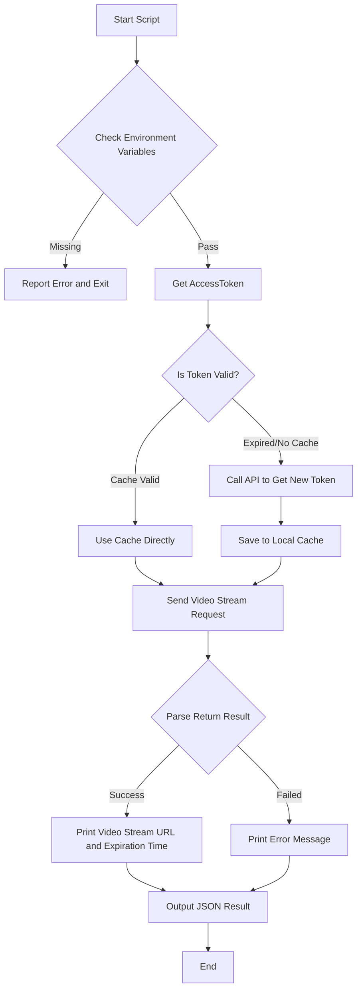

# HCTOpen Video

HCT is short for Hik-Connect for Teams, meaning Hik-Connect Team mode.
HCTOpen is short for Hik-Connect for Teams OpenAPI.

This Skill provides device real-time video stream address acquisition functionality, can be accessed directly through link.

---

## ⚠️ Security Warning (Read Before Use)

| # | Check Item                | Status      | Description                                                                                        |
|---|---------------------------|-------------|----------------------------------------------------------------------------------------------------|
| 1 | **Credential Permission** | ⚠️ Required | Please use credentials with **video stream permission**, avoid using super admin credentials       |
| 2 | **Traffic Consumption**   | ⚠️ Note     | Real-time video stream will consume large bandwidth, please close player in time when not in use   |
| 3 | **Token Cache**           | ✅ Encrypted | Token cached in system temp directory, only current user can read (600 permission)                 |
| 4 | **API Domain**            | ✅ Auto      | API domain is automatically obtained from token response (no longer requires manual configuration) |

---

## 🚀 Quick Start

###  Run Video Stream Script

```bash
# Scenario 1: Get video stream for specified device and channel (default 600s)
python scripts/get_video_url.py --device-serial J10137390 --resource-id 6a447d3f9cfe4c8e8394c19f8fbcd3ba

# Scenario 2: Get video stream for specified duration (60s)
python scripts/get_video_url.py --device-serial D72821502 --resource-id 661543ed4b35465a9767081ae0a8bf45 --video-duration 600
```

> ⚠️ **Important**: The `--resource-id` must be the **camera resource ID** obtained from `device_channels.py`!

---

## 🛠 Workflow



---

## 📋 API Parameter Details

### 1. Device Video Stream Request Parameters

**Endpoint**: `POST /api/hccgw/video/v1/live/address/get`

| Parameter Name | Type    | Description                          | Required | Default | Notes                      |
|----------------|---------|--------------------------------------|----------|---------|----------------------------|
| `deviceSerial` | String  | Device serial number                 | **Yes**  | -       | Device unique identifier   |
| `resourceId`   | String  | Channel/monitoring point resource ID | **Yes**  | -       | Channel unique identifier  |
| `expireTime`   | Integer | Preview duration (seconds)           | No       | 600     | Default 600 seconds        |
| `protocol`     | Integer | Stream protocol                      | No       | 2       | Fixed: 2 (HLS format only) |

### 2. API Return Data Description

| Field Name   | Type    | Description                                     | Notes                                                                                                                                                  |
|--------------|---------|-------------------------------------------------|--------------------------------------------------------------------------------------------------------------------------------------------------------|
| `url`        | String  | Video stream address                            | Directly accessible video stream URL                                                                                                                   |
| `expireTime` | String  | Expiration time in `yyyy-mm-dd hh:mm:ss` format | Local timezone. **IMPORTANT: This value is the authoritative source. Do NOT parse expiration time from URL query parameters (e.g., Expires, expire).** |
| `playable`   | Boolean | Whether the Video Stream URL is playable        | If `false`, check field for reason.                                                                                                                    |

---

## 📝 Output Example

### Video Stream Success Example:
```text
[2026-04-23 18:12:02] Requesting video stream: Device=J10137390, Resource=6a447d3f9cfe4c8e8394c19f8fbcd3ba
[SUCCESS] Video stream successful: https://isgpopen.ezvizlife.com/v3/openlive/J10137390_1_1.m3u8?expire=1776939724&id=967488042038833152&c=c3a53f2806&t=4a33a0fa618fec303534c5bb856693aef55b488353c0f56a6edbc6dba8e54079&ev=100
[INFO] Stream URL expiration time: 2026-04-23 18:22:04

[JSON Output]
{
  "success": true,
  "url": "https://isgpopen.ezvizlife.com/v3/openlive/J10137390_1_1.m3u8?expire=1776939724&id=967488042038833152&c=c3a53f2806&t=4a33a0fa618fec303534c5bb856693aef55b488353c0f56a6edbc6dba8e54079&ev=100",
  "expireTime": "2026-04-23 18:22:04",
  "playable": true,
  "error": null
}
======================================================================
Done
======================================================================
```

### Video Stream Failed Example( video encoding format is H265,Not Supported):
```text
[2026-04-24 13:51:42] Requesting video stream: Device=D72821502, Resource=661543ed4b35465a9767081ae0a8bf45
[SUCCESS] Got stream URL: https://vtmucyn.ezvizlife.com:8883/v3/openlive/D72821502_1_1.m3u8?expire=1777010504&id=967784913892188160&c=caf588fab7&t=837d2555567061dfa6095842439eafaf8536cf660f0f5aa5ee87c3c327916972&ev=100&u=d00f8fbf53ce42c1aaa8731f4ccacd68
[INFO] Stream URL expiration time: 2026-04-24 14:01:44
[ERROR] Stream URL is not playable, the error type is : H265_NOT_SUPPORTED

[JSON Output]
{
  "success": false,
  "url": "https://vtmucyn.ezvizlife.com:8883/v3/openlive/D72821502_1_1.m3u8?expire=1777010504&id=967784913892188160&c=caf588fab7&t=837d2555567061dfa6095842439eafaf8536cf660f0f5aa5ee87c3c327916972&ev=100&u=d00f8fbf53ce42c1aaa8731f4ccacd68",
  "expireTime": "2026-04-24 14:01:44",
  "playable": false
}
======================================================================
Done
======================================================================
```

---

## 📂 File Structure

```text
├── scripts/
│   └── get_video_url.py    # Device video stream core execution script
└── SKILL.md                # Skill usage documentation
```

---


## ❓ FAQ

- **Q: Why is video stream loading slowly?**
  - A: Video stream quality is affected by network bandwidth, please ensure stable network environment.
- **Q: What if "Resource ID error" is shown?**
  - A: Please first get correct channel `resourceId` through resource management module.
- **Q: What is the validity period of video stream address?**
  - A: **Equals your configured stream duration**, which is the value of the `video-duration` parameter. For example, setting `--video-duration 1080` (18 minutes) means the address validity is exactly 18 minutes.
- **Q: What if video stream address is expired?**
  - A: Video stream address has time limit, please re-run script to get after expiration.
- **Q: Can video stream address be opened and played directly?**
  - A: Yes. 
- **Q: Video stream address fails to load?**
  - A: **Must check in this order:**
    1. **Stream encryption**: Run `device_detail.py <serial>` — `Stream Encryption` must be `Disabled`
    2. **Video encoding format**: Check in HCT platform — must be **H264** (H265 may fail in browser)
---


---
**Error Codes**:

| Return Code | Return Message        | Description                                                                                 |
|-------------|-----------------------|---------------------------------------------------------------------------------------------|
| EVZ60019    | Encryption is enabled | Stream encryption not disabled, you MUST disable it in HCT platform before stream will work |

---
