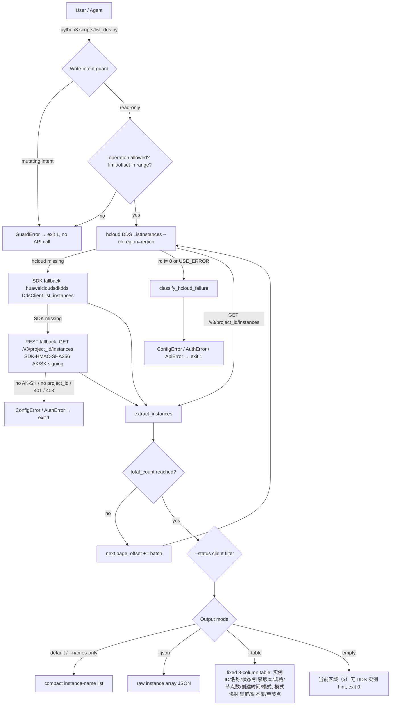

# Data Flow Diagram

```mermaid
flowchart TD
    A[User / Agent] -->|python3 scripts/list_dds.py| B{Write-intent guard}
    B -->|mutating intent| X[GuardError → exit 1, no API call]
    B -->|read-only| C{operation allowed? limit/offset in range?}
    C -->|no| X
    C -->|yes| D[hcloud DDS ListInstances --cli-region=region]

    D -->|hcloud missing| E[SDK fallback: huaweicloudsdkdds DdsClient.list_instances]
    E -->|SDK missing| R[REST fallback: GET /v3/project_id/instances<br/>SDK-HMAC-SHA256 AK/SK signing]
    R -->|no AK-SK / no project_id / 401 / 403| Y[ConfigError / AuthError → exit 1]

    D -->|rc != 0 or USE_ERROR| F[classify_hcloud_failure]
    F --> G[ConfigError / AuthError / ApiError → exit 1]

    D -->|GET /v3/project_id/instances| H[extract_instances]
    E --> H
    R --> H

    H --> I{total_count reached?}
    I -->|no| J[next page: offset += batch]
    J --> D
    I -->|yes| K{--status client filter}
    K --> L{Output mode}
    L -->|default / --names-only| M[compact instance-name list]
    L -->|--json| N[raw instance array JSON]
    L -->|--table| O[fixed 8-column table: 实例ID/名称/状态/引擎版本/规格/节点数/创建时间/模式, 模式映射 集群/副本集/单节点]
    L -->|empty| P[当前区域（x）无 DDS 实例 hint, exit 0]
```
