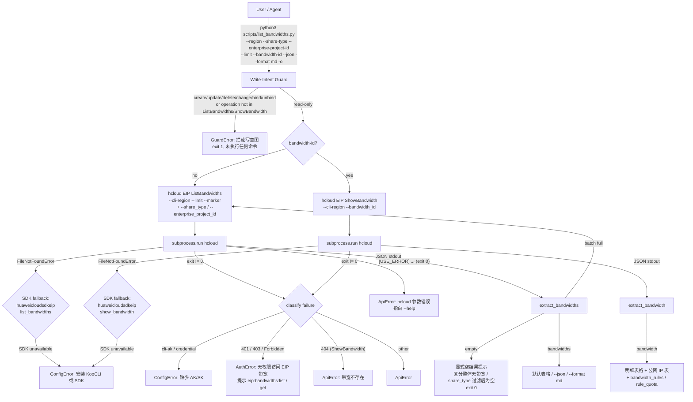

# Data Flow Diagram

```mermaid
flowchart TD
    A[User / Agent] -->|"python3 scripts/list_bandwidths.py<br/>--region --share-type --enterprise-project-id<br/>--limit --bandwidth-id --json --format md -o"| B[Write-Intent Guard]
    B -->|"create/update/delete/change/bind/unbind<br/>or operation not in ListBandwidths/ShowBandwidth"| G[GuardError: 拦截写意图<br/>exit 1, 未执行任何命令]
    B -->|read-only| C{bandwidth-id?}
    C -->|no| C1["hcloud EIP ListBandwidths<br/>--cli-region --limit --marker<br/>+ --share_type / --enterprise_project_id"]
    C -->|yes| C2["hcloud EIP ShowBandwidth<br/>--cli-region --bandwidth_id"]
    C1 --> D1[subprocess.run hcloud]
    C2 --> D2[subprocess.run hcloud]
    D1 -->|FileNotFoundError| F1{SDK fallback:<br/>huaweicloudsdkeip<br/>list_bandwidths}
    D2 -->|FileNotFoundError| F2{SDK fallback:<br/>huaweicloudsdkeip<br/>show_bandwidth}
    F1 -->|SDK unavailable| E1[ConfigError: 安装 KooCLI 或 SDK]
    F2 -->|SDK unavailable| E1
    D1 -->|"exit != 0"| E2{classify failure}
    D2 -->|"exit != 0"| E2
    E2 -->|"cli-ak / credential"| E3[ConfigError: 缺少 AK/SK]
    E2 -->|"401 / 403 / Forbidden"| E4[AuthError: 无权限访问 EIP 带宽<br/>提示 eip:bandwidths:list / get]
    E2 -->|"404 (ShowBandwidth)"| E5[ApiError: 带宽不存在]
    E2 -->|"other"| E6[ApiError]
    D1 -->|"[USE_ERROR] ... (exit 0)"| E7[ApiError: hcloud 参数错误<br/>指向 --help]
    D1 -->|JSON stdout| P1[extract_bandwidths]
    D2 -->|JSON stdout| P2[extract_bandwidth]
    P1 -->|"batch full"| C1
    P1 -->|"empty"| H["显式空结果提示<br/>区分整体无带宽 / share_type 过滤后为空<br/>exit 0"]
    P1 -->|bandwidths| R1["默认表格 / --json / --format md"]
    P2 -->|bandwidth| R2["明细表格 + 公网 IP 表<br/>+ bandwidth_rules / rule_quota"]
```