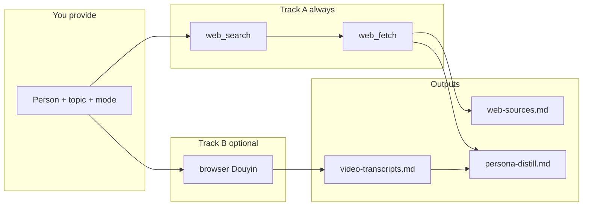

# Human Distill — Distill Any Creator's Worldview in One Agent Run

> Turn scattered posts, Douyin captions, interviews, and course pages into a **structured, evidence-graded persona dossier** — with `[confirmed]` vs `[inferred]` labels so you know what to trust.

[](LICENSE)
[](https://clawhub.ai/skills/human-distill)
[](https://openclaw.ai)
[](https://cursor.com)
[](https://github.com/spikesubingrui-design/human-distill)

**中文** · [什么是 Human Distill](#what-it-does) · [安装](#installation) · [用法](#usage) · [输出示例](#example-output)

---

## What it does

You point an AI agent at a person (KOL, expert, founder, coach). It:

1. **Track A — Web-wide search** — `web_search` + `web_fetch` across Douyin, YouTube, Bilibili, WeChat articles, Zhihu, course pages
2. **Track B — Douyin deep scrape** (optional) — browser scroll + per-video captions + Douyin AI chapter summaries
3. **Merge & distill** — 7-section persona: beliefs, knowledge map, controversies, citations, style, actionable advice
4. **Evidence grading** — every claim tagged `[确认]` / `[推断]` / `[冲突]`

No API keys for Douyin. Browser + search tools only.



---

## Why stars matter here

| Problem | Human Distill |
|--------|----------------|
| Watched 200 short videos, still no system | Keyword-filtered transcript archive |
| Search snippets contradict each other | `[冲突]` section surfaces disagreements |
| Can't tell hype from evidence | `[确认]` vs `[推断]` on every bullet |
| Re-research same creator monthly | Reusable skill + markdown artifacts |

---

## Depth modes

| Mode | When | Tracks |
|------|------|--------|
| **quick** | Fast overview, no full captions | A only |
| **standard** | Default — has Douyin handle | A + B |
| **deep** | "Comprehensive / report" | A + optional [LDR](https://github.com/eplt/local-deep-research-skill) + B |

---

## Installation

### ClawHub（推荐）

```bash
clawhub login          # 首次需 GitHub 登录
clawhub install human-distill
```

发布/更新见 [`docs/LAUNCH.md`](docs/LAUNCH.md)。

### OpenClaw（手动）

```bash
git clone https://github.com/spikesubingrui-design/human-distill.git \
  ~/.openclaw/workspace/skills/human-distill
```

Register triggers in your `AGENTS.md` (or use OpenClaw skill discovery):

```markdown
| "蒸馏" / "人物画像" / "human distill" / "抖音蒸馏" | `skills/human-distill/SKILL.md` |
```

### Cursor

```bash
git clone https://github.com/spikesubingrui-design/human-distill.git \
  ~/.cursor/skills/human-distill
```

Then say: **「按 human-distill skill，蒸馏 [人名]，主题 [营养/投资/…]」**

### Optional: Local Deep Research (deep mode)

```bash
# Install LDR skill separately
git clone https://github.com/eplt/local-deep-research-skill.git \
  ~/.openclaw/workspace/skills/local-deep-research
export LDR_BASE_URL=http://127.0.0.1:5000
```

---

## Usage

Natural language — the agent loads `SKILL.md` automatically when triggers match.

```
蒸馏抖音 Mars12161209，主题营养，排除切磋和带货
```

```
human distill Naval Ravikant, topic wealth, quick mode
```

```
深度蒸馏 [人名]，主题商业，要调研报告级别
```

### Outputs (in your workspace `memory/`)

| File | Content |
|------|---------|
| `[name]-全网素材.md` | Indexed web sources + excerpts |
| `[name]-视频文案合集.md` | Filtered Douyin captions (standard/deep) |
| `[name]-[topic]观点蒸馏.md` | Final 7-section persona dossier |

---

## Example output

Distilled a 580K-follower sports-nutrition creator (nutrition topic, standard mode). Excerpt:

| Theme | Their stance | vs mainstream |
|-------|--------------|---------------|
| Post-workout protein window | **Doesn't matter** — total intake > timing | Must drink within 30 min |
| Carbs while cutting | **No extreme low-carb required** | Keto / low-carb default |
| Diet pattern | **Mediterranean** — whole grains, olive oil, nuts | Fad diets |

Full sample: [`examples/sample-persona-excerpt.md`](examples/sample-persona-excerpt.md)

---

## Repository layout

```
human-distill/
├── SKILL.md                 # Agent instructions (main artifact)
├── README.md
├── LICENSE
├── references/
│   └── search-queries.md    # Topic-specific web_search templates
└── examples/
    └── sample-persona-excerpt.md
```

---

## Requirements

| Tool | Purpose |
|------|---------|
| `web_search` | Discovery across platforms |
| `web_fetch` | Full text from articles (not Douyin video pages) |
| `browser` | Douyin profile scroll + per-video extraction (logged-in session) |
| LDR (optional) | Multi-cycle research in **deep** mode |

**Douyin note:** Anti-bot is aggressive. `web_fetch` cannot replace browser for video captions. See `SKILL.md` for the scroll-container selector that actually works.

---

## Ethics & compliance

- Only **public** content. Respect platform ToS and robots rules.
- Do not scrape private or paid course material you don't have rights to.
- `[推断]` claims must stay labeled — never present inference as fact.

---

## Related projects

- [OpenClaw](https://openclaw.ai) — agent runtime this skill targets
- [local-deep-research-skill](https://github.com/eplt/local-deep-research-skill) — optional deep mode backend
- [TrendRadar](https://github.com/jiajiaoy/TrendRadar) — trending *products* (this skill is trending *people's ideas*)

---

## Contributing

PRs welcome: new `references/search-queries.md` domains, platform-specific scroll tricks, example dossiers (anonymized or public figures only).

1. Fork → branch → PR
2. Keep `SKILL.md` under ~500 lines; put long templates in `references/`

---

## License

[MIT](LICENSE) — use freely, attribution appreciated.

---

<p align="center">
  If this saved you hours of manual note-taking,<br/>
  <a href="https://github.com/spikesubingrui-design/human-distill"><strong>⭐ Star the repo</strong></a> — it helps others find it.
</p>
