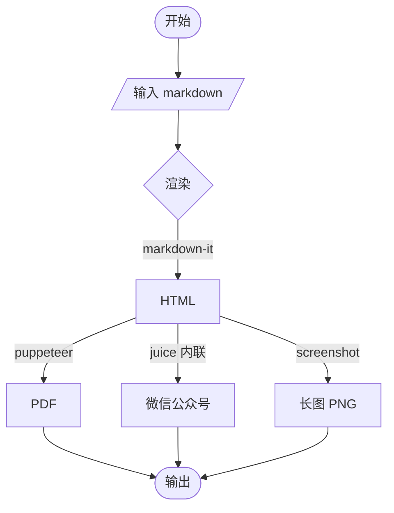
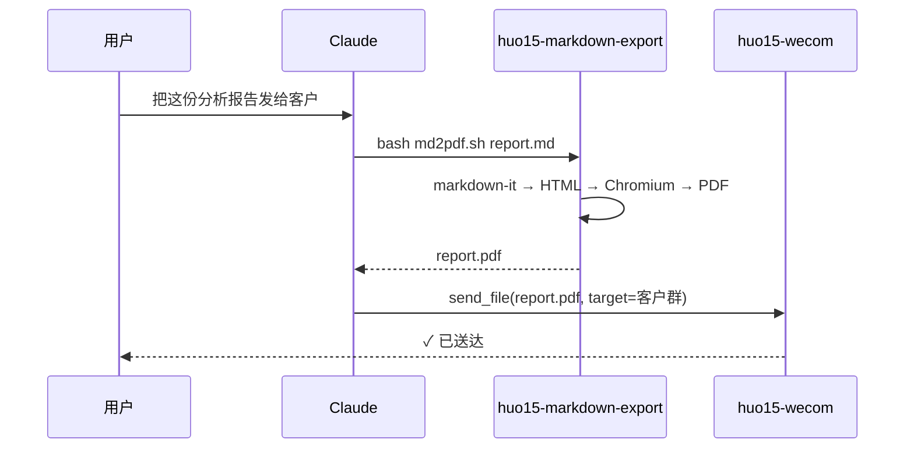
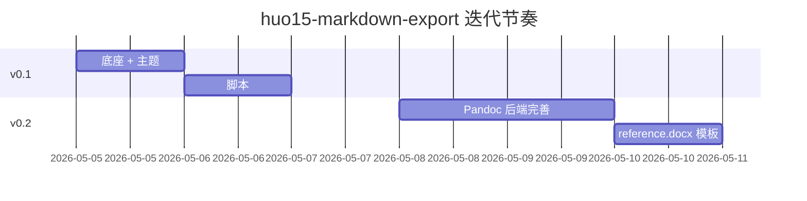
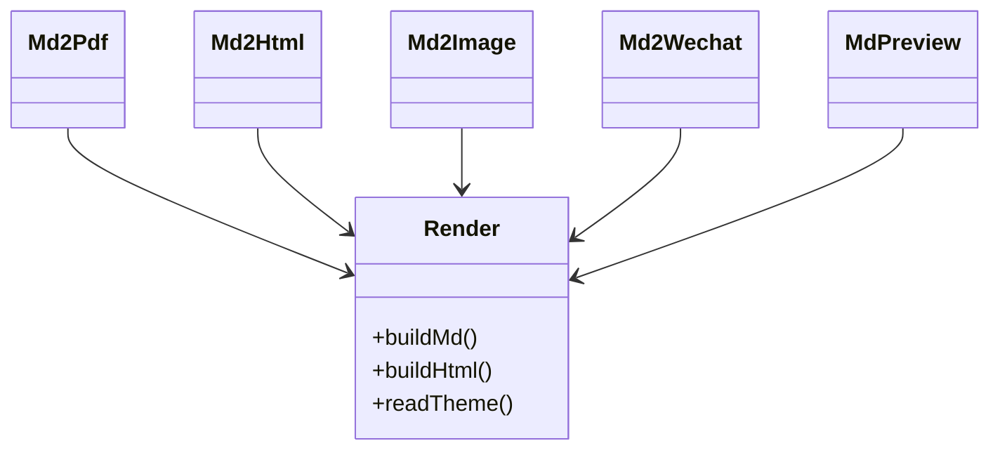

# Mermaid 图表示例

测试 mermaid 各种图表在 PDF / HTML / PNG 长图中的渲染。

## 流程图

```mermaid
flowchart TD
  Start([开始]) --> Input[/输入 markdown/]
  Input --> Render{渲染}
  Render -->|markdown-it| HTML[HTML]
  HTML -->|puppeteer| PDF[PDF]
  HTML -->|juice 内联| WeChat[微信公众号]
  HTML -->|screenshot| PNG[长图 PNG]
  PDF --> End([输出])
  WeChat --> End
  PNG --> End
```

## 时序图

```mermaid
sequenceDiagram
  participant U as 用户
  participant AI as Claude
  participant S as huo15-markdown-export
  participant W as huo15-wecom

  U->>AI: 把这份分析报告发给客户
  AI->>S: bash md2pdf.sh report.md
  S->>S: markdown-it → HTML → Chromium → PDF
  S-->>AI: report.pdf
  AI->>W: send_file(report.pdf, target=客户群)
  W-->>U: ✓ 已送达
```

## 甘特图

```mermaid
gantt
  title huo15-markdown-export 迭代节奏
  dateFormat YYYY-MM-DD
  section v0.1
  底座 + 主题 :a1, 2026-05-05, 1d
  脚本 :a2, after a1, 1d
  section v0.2
  Pandoc 后端完善 :2026-05-08, 2d
  reference.docx 模板 :2026-05-10, 1d
```

## 类图(架构概览)

```mermaid
classDiagram
  class Render {
    +buildMd()
    +buildHtml()
    +readTheme()
  }
  class Md2Pdf
  class Md2Html
  class Md2Image
  class Md2Wechat
  class MdPreview

  Md2Pdf --> Render
  Md2Html --> Render
  Md2Image --> Render
  Md2Wechat --> Render
  MdPreview --> Render
```
