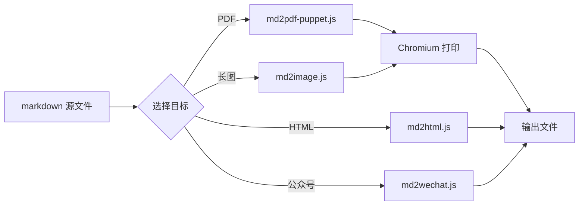

# huo15-markdown-export 渲染样例

> 用这份文档测试所有主题、KaTeX、代码高亮、表格、Mermaid。

## 1. 段落与强调

这是一个普通段落,包含**加粗**、*斜体*、~~删除线~~、==高亮==、`行内代码`、[外链](https://huo15.com)。

中英文混排:Markdown 是一种**轻量级标记语言**,2004 年由 John Gruber 与 Aaron Swartz 共同设计。

H~2~O 与 X^2^ + Y^2^ = Z^2^。

## 2. 列表

无序列表:

- 苹果
- 橙子
  - 红橙
  - 脐橙
- 香蕉

任务列表:

- [x] 写底座
- [x] 写主题
- [ ] 跑通所有脚本

## 3. 表格

| 主题 | 适用场景 | 输出 |
|---|---|---|
| `typora-newsprint` | 个人博客 | HTML/PDF |
| `github` | 开源文档 | HTML/PDF |
| `wechat` | 微信公众号 | inline HTML |
| `xiaohongshu` | 小红书长图 | PNG |
| `huo15-brand` | 公司报告 | PDF(带页眉页脚) |

## 4. 代码块

```javascript
function hello(name) {
  return `Hello, ${name}!`;
}

console.log(hello('huo15'));
```

```python
def fib(n):
    a, b = 0, 1
    for _ in range(n):
        yield a
        a, b = b, a + b

print(list(fib(10)))
```

## 5. 引用

> 「好文案不是写出来的,是留出来的。」 —— Allen 流

> 多层引用:
> > 嵌套层 1
> > > 嵌套层 2

## 6. 数学公式

行内:质能方程 $E = mc^2$。

块级:

$$
\int_{-\infty}^{\infty} e^{-x^2} \, dx = \sqrt{\pi}
$$

$$
\frac{\partial L}{\partial \theta} = \mathbb{E}\left[\nabla_\theta \log \pi_\theta(a|s) \cdot Q^\pi(s, a)\right]
$$

## 7. Mermaid 流程图



## 8. 脚注

这是一个有脚注的句子[^1]。后面再来一个[^typora]。

[^1]: 脚注内容支持 markdown,**包括加粗**和 [链接](https://example.com)。
[^typora]: Typora 是 2015 年由 Abner Lee 开发的所见即所得 markdown 编辑器。

---

更多用法:`templates/README.md` 主题决策树。
