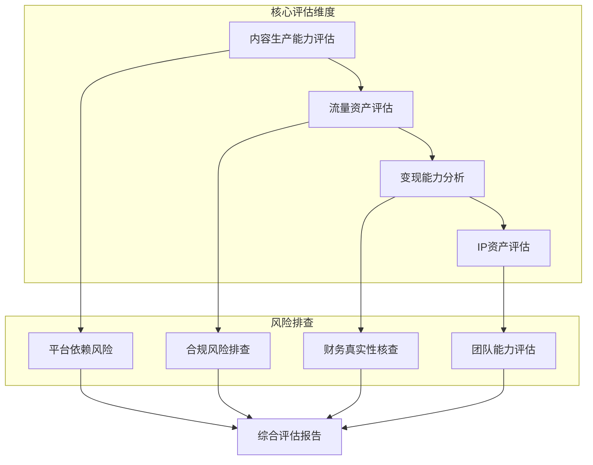
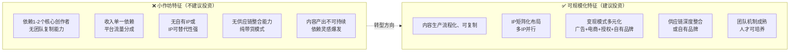
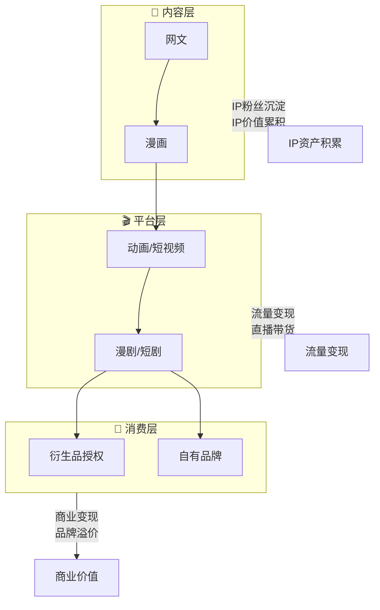
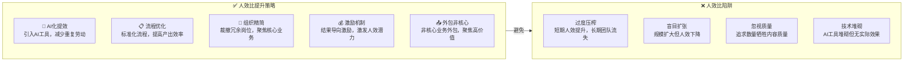

# 文创类企业商业尽调技能

## 一、技能介绍

### 1.1 适用场景
本技能适用于文创类企业投资、并购、孵化前的商业尽职调查，聚焦于识别"虚火"资产、评估真实变现能力、发现合规风险。

### 1.2 目标企业类型
- MCN机构与内容工作室
- 短剧制作公司
- 漫剧/条漫公司
- UGC平台与社区
- 其他文创类企业（网文、直播、虚拟人等）

### 1.3 核心价值
- **识别虚火资产**：区分真实粉丝与刷量数据
- **评估变现能力**：验证收入真实性与可持续性
- **发现合规风险**：版权、内容审核、广告法等
- **量化IP价值**：评估内容资产的真实价值

---

## 二、尽调框架总览



---

## 三、核心评估模块

### 3.1 内容生产能力评估

**评估维度：**

| 维度 | 指标 | 数据来源 | 判断标准 |
|-----|------|---------|---------|
| 产出量 | 日/周/月内容产出量 | 后台数据、第三方工具 | 稳定产出 > 断更风险 |
| 内容质量 | 完播率、互动率、传播系数 | 平台后台、蝉妈妈 | 完播率>40%为优质 |
| 迭代能力 | 热点响应速度、爆款复制能力 | 历史内容分析 | 3天内跟进热点为合格 |
| 创意团队 | 核心创作者背景、流动性 | 访谈、背景调查 | 人员稳定性>80% |

**具体操作：**
1. 调取近3个月后台数据截图，统计发布频率
2. 随机抽取10条视频/图文，分析完播率、点赞/评论/转发比
3. 对比同类账号，评估传播系数（分享数/曝光数）
4. 访谈核心创作者，了解创作流程和激励机制

### 3.2 流量与粉丝资产评估

**评估维度：**

| 维度 | 指标 | 数据来源 | 判断标准 |
|-----|------|---------|---------|
| 粉丝总量 | 各平台粉丝总数 | 平台数据、第三方工具 | 多平台去重统计 |
| 粉丝质量 | 真粉率、活跃度、互动率 | 第三方检测工具 | 活跃粉丝>30% |
| 流量来源 | 自然流量 vs 付费流量占比 | 后台数据 | 自然流量>60% |
| 流量成本 | CPM/CPC变化趋势 | 广告后台 | 成本上升<20%/季度 |
| 私域资产 | 微信群、公众号、会员数量 | 企业提供 | 可验证的私域规模 |

**数据采集工具：**
- 蝉妈妈（抖音/快手数据）
- 新榜（微信公众号、视频号数据）
- 卡思数据（抖音/快手/小红书）
- 飞瓜数据（B站数据）
- 灰豚数据（小红书数据）

### 3.3 变现能力分析

**变现模式分类：**

| 模式 | 特征 | 核查重点 |
|-----|------|---------|
| 广告植入 | 收入稳定但依赖品牌预算 | 客户集中度、合同条款 |
| 带货佣金 | 收入波动大、毛利差异大 | 退货率、实际结算额 |
| 平台分成 | 收入可预期但单价低 | 分成比例、流量扶持 |
| 会员付费 | 收入稳定但规模受限 | 会员转化率、续费率 |
| IP授权 | 一次性收入为主 | 授权期限、授权范围 |
| 课程培训 | 边际成本低、可规模化 | 课程完成率、复购率 |

**关键指标：**

```
变现效率 = 月均收入 / 月均流量 × 10000
ARPU值 = 总收入 / 付费用户数
LTV = ARPU值 × 平均付费周期
客户集中度 = 最大客户收入占比
```

### 3.4 IP资产评估

**评估框架：**

| 维度 | 指标 | 核查方式 |
|-----|------|---------|
| IP数量 | 自有IP注册数量 | 版权登记证书核查 |
| IP质量 | 粉丝量、衍生内容数量 | 平台数据验证 |
| 生命周期 | 内容热度趋势 | 历史数据分析 |
| 授权收入 | 已授权收入、未来潜力 | 合同核查 |
| 法律保护 | 版权登记、商标注册 | 法律文件审查 |

**IP价值评估方法：**
1. 成本法：历史投入成本 × 系数
2. 市场法：同类IP授权价格对比
3. 收益法：预期授权收入折现

### 3.5 平台依赖风险评估

**风险矩阵：**

| 平台 | 风险类型 | 风险等级 | 应对策略 |
|-----|---------|---------|---------|
| 抖音 | 算法变化、政策收紧 | 🔴高 | 多平台布局 |
| 快手 | 用户增长放缓 | 🟠中高 | 内容差异化 |
| 小红书 | 商业化不成熟 | 🟡中 | 探索多元变现 |
| B站 | 变现能力弱 | 🟡中 | 长期培育 |
| 微信公众号 | 打开率下降 | 🟡中 | 私域沉淀 |

**核查要点：**
1. 收入来源平台集中度（单一平台>50%为高风险）
2. 账号封禁/限流历史
3. 平台政策变化响应能力
4. 多平台账号矩阵稳定性

### 3.6 合规风险评估

**详见：`references/合规风险清单.md`**

**四大风险领域：**
1. **版权风险**：内容、音乐、字体、素材侵权
2. **内容审核风险**：敏感话题、违规词汇、未成年人保护
3. **广告法合规**：虚假宣传、极限词、价格欺诈
4. **税务合规**：直播带货税务、个人工作室申报

### 3.7 财务真实性核查

**核查流程：**

```
Step 1: 平台对账单核实
   ↓
Step 2: 品牌方直接确认
   ↓
Step 3: 银行流水交叉验证
   ↓
Step 4: 成本结构合理性分析
   ↓
Step 5: 利润质量评估
```

**关键核查点：**
- 收入确认方式（平台结算 vs 品牌直签）
- 平台账期与实际回款
- 成本结构（人力/流量采购/制作成本）
- 利润真实性（刷单、虚假流量剔除）

### 3.8 团队能力评估

**详见：`references/团队能力评估框架.md`**

**核心评估要素：**
1. 核心创作者绑定程度（竞业协议、股权激励）
2. 运营团队专业度（行业经验、成功案例）
3. 关键人员流失风险（人员流动率、离职率）
4. 团队稳定性（股权结构、团队文化）

---

## 四、数据来源清单

| 数据类型 | 平台/工具 | 获取方式 |
|---------|----------|---------|
| 账号数据 | 蝉妈妈、新榜、卡思数据 | 第三方查询 |
| 平台后台 | 企业提供截图 | 企业授权 |
| 榜单排名 | 各平台创作者榜单 | 公开信息 |
| 行业报告 | 艾瑞、克劳锐、卡思研究院 | 公开报告 |
| 财务数据 | 企业提供、审计报告 | 企业授权 |
| 合同清单 | 企业提供 | 企业授权 |
| 品牌合作 | 品牌方访谈 | 直接确认 |
| 平台对账单 | 平台后台导出 | 企业授权 |

---

## 五、执行流程

| 步骤 | 时间 | 内容 | 产出物 |
|-----|------|------|-------|
| Step 1 | 30分钟 | 公开数据采集 | 账号数据分析表 |
| Step 2 | 1小时 | 企业提供材料审核 | 材料完整性报告 |
| Step 3 | 1小时 | 财务数据交叉验证 | 收入真实性报告 |
| Step 4 | 30分钟 | 合规风险排查 | 合规风险清单 |
| Step 5 | 30分钟 | 团队能力评估 | 团队评估报告 |
| Step 6 | 1小时 | 综合评估与报告撰写 | 商业尽调报告 |

---

## 六、标准输出模板（必须严格遵循）

### 6.1 商业尽调报告章节结构

**重要**：所有商业尽调报告必须严格遵循以下章节结构，不得擅自增减或调整章节顺序。如确有必要补充内容，可在第十四章后添加附录。

```markdown
# [企业名称] 商业尽调报告

## 一、Executive Summary（执行摘要）
### 1.1 案例定位
### 1.2 核心结论
### 1.3 关键数据速览

## 二、综合评分卡
### 2.1 十维度评分总览
### 2.2 评分等级判定
### 2.3 关键指标摘要

## 三、内容生产能力评估（权重10%）
### 3.1 内容产出量
### 3.2 内容质量分析
### 3.3 迭代能力
### 3.4 创意团队背景
### 3.5 本维度评分

## 四、流量与粉丝资产评估（权重10%）
### 4.1 粉丝规模数据
### 4.2 粉丝质量分析
### 4.3 流量来源分析
### 4.4 平台依赖风险评估
### 4.5 本维度评分

## 五、变现能力分析（权重15%）
### 5.1 变现模式结构
### 5.2 核心变现数据
### 5.3 变现效率分析
### 5.4 变现瓶颈分析
### 5.5 本维度评分

## 六、IP资产评估（权重10%）
### 6.1 IP价值评估
### 6.2 IP生命周期评估
### 6.3 IP延伸能力
### 6.4 知识产权保护
### 6.5 本维度评分

## 七、护城河深度评估（权重15%）
### 7.1 六维护城河评估
### 7.2 护城河结构图
### 7.3 小作坊vs可规模化判断
### 7.4 本维度评分

## 八、成熟度等级评估（权重10%）
### 8.1 CL0-9对照评估
### 8.2 成熟度矩阵分析
### 8.3 发展阶段判定
### 8.4 本维度评分

## 九、产品矩阵评估（权重10%）
### 9.1 现有产品矩阵
### 9.2 IP衍生路径分析
### 9.3 矩阵完整度评估
### 9.4 本维度评分

## 十、AI化程度评估（权重10%）
### 10.1 AI化评估矩阵
### 10.2 AI化现状分析
### 10.3 AI化提升建议
### 10.4 本维度评分

## 十一、人效比评估（权重10%）
### 11.1 人效比核心指标
### 11.2 行业对标分析
### 11.3 人效比提升路径
### 11.4 本维度评分

## 十二、风险评估（贯穿各维度）
### 12.1 风险矩阵总览
### 12.2 核心风险分析
### 12.3 风险应对建议
### 12.4 本维度评分

## 十三、投资建议
### 13.1 综合评估结论
### 13.2 投资亮点
### 13.3 投资风险
### 13.4 投资建议
### 13.5 后续尽调建议

## 十四、附录
### 14.1 数据来源
### 14.2 免责声明

## 十五、下一步人工尽调清单
### 15.1 待核实数据项
### 15.2 待访谈问题清单
### 15.3 异常数据核查要点
```

### 6.2 关键指标一览表（必须包含）

| 指标类别 | 具体指标 | 数值 | 行业对比 | 评估结论 |
|---------|---------|------|---------|---------|
| 粉丝资产 | 总粉丝量 | | vs 行业中位数 | |
| 流量成本 | CPM/CPC | | vs 行业均值 | |
| 变现效率 | 收入/流量比 | | vs 同类账号 | |
| IP价值 | 估值金额 | | vs 投入成本 | |
| 护城河 | 综合评级 | | S/A/B/C/D | |
| 成熟度 | CL等级 | | CL1-CL9 | |
| AI化 | AI化程度 | | S/A/B/C/D | |
| 人效比 | 人均营收 | | vs 行业基准 | |

### 6.3 风险预警清单（必须包含）

| 风险类型 | 风险等级 | 具体描述 | 建议措施 |
|---------|---------|---------|---------|
| 平台依赖 | | | |
| 合规风险 | | | |
| 团队风险 | | | |
| 财务风险 | | | |

### 6.4 禁止事项

- ❌ 禁止擅自增减章节
- ❌ 禁止调整章节顺序
- ❌ 禁止修改章节标题
- ❌ 禁止删除必含表格
- ❌ 禁止使用plaintxt/ASCII字符图表（如┌─┐├─┤等）
- ✅ 确有必要时可在第十五章后添加补充附录
- ✅ 必须使用Mermaid图表呈现框架、流程、对比等内容

### 6.5 数据缺失处理原则

实际尽调中，部分数据可能无法获取（如人效比、内部运营数据等），处理方式如下：

- ✅ 数据缺失时标注"暂无信息"，不得虚构或估算
- ✅ 评分处理：缺失项按中间值打分（如10分制打5分，5分制打2.5分）
- ✅ 在评估结论中说明数据缺失对整体判断的影响
- ❌ 禁止因数据缺失而跳过整个评估模块
- ❌ 禁止编造数据填充空项

---

## 七、护城河逻辑分析

**详见：`references/文创护城河分析框架.md`**

### 7.1 护城河评估维度

文创企业的护城河决定了其是否只是"小作坊"，能否获得资本市场认可。

| 护城河类型 | 评估要素 | 权重 | 判断标准 |
|-----------|---------|------|---------|
| **内容护城河** | 原创能力、IP独占性、内容壁垒 | 25% | 原创IP占比>70%为强 |
| **用户护城河** | 粉丝粘性、社区氛围、情感连接 | 20% | 互动率>5%为强 |
| **渠道护城河** | 多平台布局、私域沉淀、渠道控制 | 15% | 单平台依赖<40%为强 |
| **供应链护城河** | 自有品牌、供应链整合、成本优势 | 20% | 自有供应链为强 |
| **技术护城河** | 制作技术、IP运营系统、数据能力 | 10% | 技术壁垒高为强 |
| **人才护城河** | 核心团队绑定、培养体系、激励机制 | 10% | 核心人员流失率<10%为强 |

### 7.2 护城河深度评分

| 等级 | 得分 | 特征描述 | 资本认可度 |
|-----|------|---------|-----------|
| **S级** | 90-100 | 多维护城河叠加，可规模化复制 | 🔥高度认可 |
| **A级** | 80-89 | 核心护城河稳固，有扩展空间 | ✅认可 |
| **B级** | 70-79 | 单一护城河，存在被突破风险 | ⚠️谨慎 |
| **C级** | 60-69 | 护城河薄弱，接近小作坊模式 | ❌不认可 |
| **D级** | <60 | 无护城河，纯流量生意 | ❌不建议投资 |

### 7.3 小作坊vs可规模化企业判断



---

## 八、成熟度对标体系（CL0-9）

**详见：`references/文创成熟度对标体系.md`**

### 8.1 成熟度等级定义

类似技术尽调的TL0-9，文创企业需评估其发展阶段：

| 等级 | 阶段名称 | 特征描述 | 产品形态 | 典型指标 |
|-----|---------|---------|---------|---------|
| **CL0** | 概念期 | 仅有创意/团队，无产出 | 无 | 无产品 |
| **CL1** | 萌芽期 | 单一内容形式，不稳定产出 | 单条内容 | 粉丝<10万 |
| **CL2** | 起步期 | 稳定产出，单一平台 | 系列内容 | 粉丝10-50万 |
| **CL3** | 成长期 | 多平台布局，初步变现 | 多平台账号 | 粉丝50-200万 |
| **CL4** | 扩张期 | IP确立，变现模式验证 | 单一IP矩阵 | 粉丝200-500万 |
| **CL5** | 成熟期 | IP矩阵化，多元变现 | 多IP矩阵 | 粉丝500-2000万 |
| **CL6** | 规模期 | 产业链延伸，自有品牌 | IP+产品 | 粉丝2000万+ |
| **CL7** | 整合期 | 跨界合作，生态布局 | IP+产业合作 | 年收入1亿+ |
| **CL8** | 平台期 | 平台化运营，赋能生态 | 平台+生态 | 年收入5亿+ |
| **CL9** | 生态期 | 行业标准制定者 | 生态闭环 | 行业龙头 |

### 8.2 成熟度评估矩阵

| 评估维度 | CL1-3 | CL4-5 | CL6-7 | CL8-9 |
|---------|-------|-------|-------|-------|
| **内容形态** | 单一内容 | 系列IP | IP矩阵 | 平台生态 |
| **变现模式** | 流量分成 | 广告+带货 | 多元变现 | 产业链收入 |
| **组织能力** | 个人/小团队 | 专业团队 | 公司化运营 | 集团化运营 |
| **护城河** | 无/弱 | 初步形成 | 多维叠加 | 生态壁垒 |
| **资本价值** | 低 | 中 | 高 | 极高 |

### 8.3 成熟度与投资建议

| 当前等级 | 投资建议 | 关注要点 |
|---------|---------|---------|
| CL1-2 | 种子轮/天使轮 | 团队能力、创意能力 |
| CL3-4 | A轮 | 变现验证、IP确立 |
| CL5-6 | B轮 | 规模化能力、护城河 |
| CL7-8 | C轮+ | 产业链整合、生态能力 |
| CL9 | IPO/并购 | 行业地位、可持续性 |

---

## 九、产品矩阵衍生路径分析

**详见：`references/IP衍生路径分析框架.md`**

### 9.1 文创产品衍生路径图



### 9.2 衍生路径成熟度评估

| 衍生阶段 | 特征 | 价值倍增 | 典型案例 |
|---------|------|---------|---------|
| **Stage 1：源头IP** | 网文/漫画/原创脚本 | 基准价值 | 起点、快看 |
| **Stage 2：视觉化** | 动画/漫画视频化 | 2-5倍 | 阿里文学→动画 |
| **Stage 3：短视频化** | 抖音/快手短视频 | 5-10倍 | 我是不白吃 |
| **Stage 4：剧集化** | 短剧/漫剧/长视频 | 10-20倍 | 快手短剧 |
| **Stage 5：衍生授权** | 周边授权/联名 | 20-50倍 | 三体周边 |
| **Stage 6：自有品牌** | 消费品牌/供应链 | 50-100倍 | 三只松鼠 |
| **Stage 7：生态闭环** | IP+产业+平台 | 100倍+ | 迪士尼模式 |

### 9.3 产品矩阵完整度评估

| 矩阵维度 | 评估要点 | 得分标准 |
|---------|---------|---------|
| **内容矩阵** | 是否有多个IP、多形态内容 | 每增加一种形态+20分 |
| **平台矩阵** | 是否多平台布局、私域沉淀 | 每增加一个核心平台+15分 |
| **变现矩阵** | 变现模式是否多元化 | 每增加一种模式+20分 |
| **产业矩阵** | 是否有产业链延伸（品牌、供应链） | 有延伸+25分 |
| **合作矩阵** | 是否有跨界合作、产业合作 | 每增加一个合作+10分 |

### 9.4 典型案例对标

| 企业 | 成熟度 | 内容矩阵 | 变现矩阵 | 衍生路径 |
|-----|-------|---------|---------|---------|
| **迪士尼** | CL9 | 全形态覆盖 | 全产业链 | IP→影视→乐园→衍生品 |
| **我是不白吃** | CL6 | 美食短视频+直播 | 广告+带货+品牌 | 动画→直播→自有品牌 |
| **一禅小和尚** | CL5 | 情感短视频 | 广告+授权 | 动画→周边授权 |
| **典型MCN** | CL3-4 | 多账号矩阵 | 广告+带货 | 无IP沉淀 |

---

## 十、AI化程度评估

**详见：`references/AI化程度评估框架.md`**

### 10.1 AI化评估维度

文创企业的AI化是大方向，决定了降本增效能力和未来竞争力。

| AI化领域 | 评估要点 | 权重 | 判断标准 |
|---------|---------|------|---------|
| **内容生产AI化** | AI辅助创作、AI生成内容、自动化生产 | 40% | AI参与度>50%为强 |
| **运营AI化** | AI数据分析、AI推荐优化、AI客服 | 25% | 有完整AI系统为强 |
| **变现AI化** | AI选品、AI定价、AI营销 | 20% | AI决策占比>30%为强 |
| **组织AI化** | 团队AI工具使用、AI培训体系 | 15% | 团队AI熟练度>70%为强 |

### 10.2 AI化程度评分

| 等级 | 得分 | AI化特征 | 竞争力影响 |
|-----|------|---------|-----------|
| **S级** | 90-100 | 全流程AI化，人机协同 | 🚀降本增效显著，强竞争力 |
| **A级** | 80-89 | 核心环节AI化，效率提升明显 | ✅有竞争力优势 |
| **B级** | 70-79 | 部分环节AI化，初步提效 | ⚠️竞争力一般 |
| **C级** | 60-69 | AI化尝试，效果有限 | ❌竞争力不足 |
| **D级** | <60 | 无AI化，传统人工模式 | ❌将被淘汰风险 |

### 10.3 AI化应用场景

```
内容生产AI化：
├── AI脚本生成（ChatGPT、Claude等）
├── AI图像生成（Midjourney、Stable Diffusion）
├── AI视频生成（Runway、Pika）
├── AI配音（TTS技术）
└── AI剪辑（自动化剪辑工具）

运营AI化：
├── AI数据分析（用户画像、内容分析）
├── AI推荐优化（算法优化）
├── AI客服（智能客服系统）
└── AI舆情监控（自动预警）

变现AI化：
├── AI选品（数据驱动选品）
├── AI定价（动态定价）
├── AI营销（精准投放）
└── AI直播（数字人直播）
```

### 10.4 AI化投入产出评估

| 指标 | 计算方式 | 评估标准 |
|-----|---------|---------|
| AI投入占比 | AI相关投入/总投入 | >10%为积极布局 |
| AI提效比 | AI化后效率提升/AI投入 | >3x为有效投入 |
| 人均产出提升 | (AI后人均产出-AI前)/AI前 | >50%为显著提升 |
| 成本节约率 | (AI前成本-AI后成本)/AI前成本 | >30%为有效降本 |

---

## 十一、人效比评估

**详见：`references/人效比评估框架.md`**

### 11.1 人效比核心指标

人效比是文创企业竞争力的核心体现，直接反映组织效率。

| 指标 | 计算方式 | 行业基准 | 优秀标准 |
|-----|---------|---------|---------|
| **人均年营收** | 年总收入/总人数 | 50-100万 | >200万 |
| **人均粉丝数** | 总粉丝数/总人数 | 10-50万 | >100万 |
| **人均内容产出** | 年内容数/创作人数 | 100-200条 | >300条 |
| **人均GMV** | 年GMV/带货团队人数 | 500-1000万 | >2000万 |
| **人力成本占比** | 人力成本/总收入 | 30-40% | <25% |

### 11.2 人效比行业对标

| 企业类型 | 人均年营收 | 人均粉丝数 | 人均GMV |
|---------|-----------|-----------|---------|
| **头部MCN** | 150-300万 | 50-100万 | 1000-3000万 |
| **中腰部MCN** | 50-100万 | 10-30万 | 300-800万 |
| **IP工作室** | 80-150万 | 30-80万 | 500-1500万 |
| **纯带货机构** | 100-200万 | 5-20万 | 1500-4000万 |
| **综合文创公司** | 200-500万 | 80-200万 | 2000-5000万 |

### 11.3 人效比评分

| 等级 | 得分 | 人均营收 | 人力占比 | 评估结论 |
|-----|------|---------|---------|---------|
| **S级** | 90-100 | >300万 | <20% | 🚀极高效，强竞争力 |
| **A级** | 80-89 | 200-300万 | 20-25% | ✅高效，有竞争力 |
| **B级** | 70-79 | 100-200万 | 25-35% | ⚠️中等，需提升 |
| **C级** | 60-69 | 50-100万 | 35-45% | ❌低效，竞争力不足 |
| **D级** | <60 | <50万 | >45% | ❌极低效，生存困难 |

### 11.4 人效比提升路径



---

## 十二、综合评分卡（升级版）

### 评分维度与权重

| 维度 | 权重 | 评分标准 |
|-----|------|---------|
| 内容生产能力 | 10% | 产出量×30% + 质量×40% + 迭代能力×30% |
| 流量资产质量 | 10% | 粉丝质量×40% + 流量成本×30% + 私域×30% |
| 变现能力 | 15% | 变现效率×40% + ARPU×30% + 模式多元化×30% |
| IP资产价值 | 10% | IP数量×30% + 质量×40% + 法律保护×30% |
| **护城河深度** | **15%** | 内容×25% + 用户×20% + 供应链×20% + 其他×35% |
| **成熟度等级** | **10%** | CL等级对标得分（CL1=10分...CL9=90分） |
| **产品矩阵** | **10%** | 内容×25% + 平台×25% + 变现×25% + 产业×25% |
| **AI化程度** | **10%** | 内容AI×40% + 运营AI×25% + 变现AI×20% + 组织AI×15% |
| **人效比** | **10%** | 人均营收×40% + 人均粉丝×30% + 人力占比×30% |
| 风险控制 | 贯穿各维度 | 扣分制（重大风险直接降级） |

### 评分结果

| 综合评分 | 风险等级 | 投资建议 |
|---------|---------|---------|
| 85-100分 | 🟢低风险 | 优先投资 |
| 70-84分 | 🟡中风险 | 谨慎投资，关注风险点 |
| 55-69分 | 🟠中高风险 | 条件性投资，要求整改 |
| <55分 | 🔴高风险 | 建议不投资 |

### 各维度最低要求

| 维度 | 最低及格线 | 不达标风险 |
|-----|-----------|-----------|
| 护城河深度 | ≥60分（B级） | 小作坊模式，资本不认可 |
| 成熟度等级 | ≥CL4 | 无法规模化 |
| AI化程度 | ≥60分（C级） | 效率低下，将被淘汰 |
| 人效比 | ≥60分（C级） | 组织效率低，盈利困难 |

---

## 十三、使用指南

### 13.1 启动技能

本技能为分析型技能，直接调用以下参考文档执行尽调：

```
references/
├── 内容资产评估框架.md       # 粉丝、流量、IP价值评估详解
├── 变现模式分析框架.md       # 各变现模式分析要点
├── 平台依赖风险评估.md       # 各平台风险评估
├── 合规风险清单.md           # 版权、内容审核、广告法
├── 财务尽调要点.md           # 收入确认、成本结构核查
├── 团队能力评估框架.md       # 核心人员评估
├── 文创护城河分析框架.md     # 护城河深度评估（新增）
├── 文创成熟度对标体系.md     # CL0-9成熟度评估（新增）
├── IP衍生路径分析框架.md     # 产品矩阵评估（新增）
├── AI化程度评估框架.md       # AI化程度评估（新增）
├── 人效比评估框架.md         # 人效比评估（新增）
└── 行业对标案例库.md         # 典型文创企业案例
```

### 13.2 快速执行

1. **信息收集**：根据目标企业类型，收集基础材料
2. **数据分析**：调用各参考文档进行专项分析
3. **交叉验证**：多维度数据交叉验证真实性
4. **报告生成**：按照输出模板撰写尽调报告

### 13.3 注意事项

- 所有数据需多方交叉验证，避免单一来源
- 重点关注护城河深度与AI化程度
- 人效比是竞争力的核心指标，必须对标行业
- 成熟度等级决定投资阶段和估值方法
- 产品矩阵完整度影响未来成长空间

---

## 十五、下一步人工尽调清单

### 15.1 待核实数据项

列出公开渠道无法获取、需要通过访谈或尽调问卷核实的数据：

| 数据项 | 当前状态 | 核实方式 | 优先级 |
|-------|---------|---------|--------|
| 人均年营收 | 暂无信息 | 访谈财务负责人 | 高 |
| 人力成本占比 | 暂无信息 | 索要财务报表 | 高 |
| 核心人员流失率 | 暂无信息 | 访谈HR | 中 |
| AI化投入金额 | 暂无信息 | 访谈技术负责人 | 中 |
| 内部人效指标 | 暂无信息 | 索要运营数据 | 中 |

### 15.2 待访谈问题清单

向企业方提出的关键问题，用于验证公开信息的真实性：

**团队与组织类：**
- 核心创作者的激励机制是什么？有无竞业协议？
- 团队扩张计划如何？未来6个月招聘重点？
- 核心人员流失率及原因？

**财务与运营类：**
- 各变现渠道的实际收入占比？（广告/带货/授权/其他）
- 退货率、复购率、客户集中度等关键指标？
- 人效比是否达到行业基准？提升计划？

**AI化与技术类：**
- AI工具在哪些环节应用？实际提效效果？
- AI化投入占营收比例？未来规划？
- 是否有自研AI工具或系统？

**战略与发展类：**
- 护城河建设重点在哪里？
- 产品矩阵衍生计划？
- 未来12个月核心目标？

### 15.3 异常数据核查要点

列出有悖常识、需要特别核实的数据：

| 异常表现 | 可能问题 | 核实方法 |
|---------|---------|---------|
| 粉丝增长曲线陡峭 | 刷量嫌疑 | 查看互动率、评论质量 |
| 变现效率远超同类 | 数据造假 | 核对合同、流水 |
| 人效比异常高 | 数据口径问题 | 核实人员口径、外包情况 |
| 平台依赖度骤降 | 平台封号或主动退出 | 查各平台账号状态 |
| 成本结构异常 | 利润转移 | 查关联交易 |

### 15.4 人工尽调执行建议

1. **尽调问卷**：提前发送标准化尽调问卷，收集基础数据
2. **现场访谈**：核心人员一对一访谈，交叉验证信息
3. **数据调取**：现场调取平台后台数据，验证真实性
4. **合同核对**：抽查重要合同，验证收入真实性
5. **竞业调研**：访谈离职员工、同行，了解真实口碑